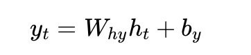

# 序列预测问题

词经过 Embedding 后变成向量：

```
我       → x1
今天     → x2
晚上     → x3
想去     → x4
```

输入RNN:

```
x1          x2          x3          x4

↓           ↓           ↓           ↓

h1  ----->  h2  -----> h3  -----> h4

                                 |
                                 ↓

                              Linear

                                 |
                                 ↓

                         下一词概率
```

# 公式

```
        h(t-1)
          |
          ↓
x(t) → [ RNN ] → h(t)
          |
          ↓
        y(t)
```

- x(t)：当前输入
- x(t)：当前输入
- h(t-1)：上一时刻记忆
- y(t)：基于当前隐状态生成的一个输出

公式：





# 代码


```python
import torch
import torch.nn as nn
import torch.optim as optim


rnn = nn.RNN(input_size=10, hidden_size=20, num_layers=1,batch_first=True)

x = torch.randn(
    3,   # batch size
    5,   # sequence length
    10   # feature size
)

output, hidden = rnn(x)

print("Output shape:", output.shape)
print("Hidden shape:", hidden.shape)
```

# 现实问题解决

温度预测

```python
import torch
import torch.nn as nn
import numpy as np
import matplotlib.pyplot as plt

# ====================== 1. 生成模拟的真实气温数据 ======================
# 模拟一年（365天）的日平均气温：有趋势 + 季节性 + 噪声
np.random.seed(42)
days = np.arange(365)
# 基础温度 + 季节波动（一年一个周期） + 小噪声
temps = 15 + 10 * np.sin(2 * np.pi * days / 365) + np.random.normal(0, 1.5, 365)

# 可视化生成的气温数据
plt.figure(figsize=(10, 4))
plt.plot(days, temps, label="真实气温")
plt.xlabel("天数")
plt.ylabel("气温 (°C)")
plt.title("模拟的真实气温数据")
plt.legend()
plt.show()

# ====================== 2. 构建时间序列数据集 ======================
def create_sequences(data, seq_length):
    """把一维时间序列变成 (输入序列, 目标值) 的形式"""
    xs, ys = [], []
    for i in range(len(data) - seq_length):
        x = data[i:i+seq_length]
        y = data[i+seq_length]
        xs.append(x)
        ys.append(y)
    return np.array(xs), np.array(ys)

seq_length = 14          # 用过去14天的气温预测第15天
X, y = create_sequences(temps, seq_length)

# 划分训练集和测试集（前80%训练，后20%测试）
train_size = int(len(X) * 0.8)
X_train, X_test = X[:train_size], X[train_size:]
y_train, y_test = y[:train_size], y[train_size:]

# 转成 PyTorch Tensor，并增加特征维度（batch, seq_len, features）
X_train = torch.FloatTensor(X_train).unsqueeze(-1)  # (N, 14, 1)
y_train = torch.FloatTensor(y_train).unsqueeze(-1)
X_test  = torch.FloatTensor(X_test).unsqueeze(-1)
y_test  = torch.FloatTensor(y_test).unsqueeze(-1)

print(f"训练集形状: {X_train.shape}, 测试集形状: {X_test.shape}")

# ====================== 3. 定义 RNN 模型 ======================
class TempRNN(nn.Module):
    def __init__(self, input_size=1, hidden_size=64, num_layers=2, output_size=1):
        super().__init__()
        self.rnn = nn.RNN(
            input_size=input_size,
            hidden_size=hidden_size,
            num_layers=num_layers,
            batch_first=True          # 输入格式为 (batch, seq, feature)
        )
        self.fc = nn.Linear(hidden_size, output_size)
    
    def forward(self, x):
        # x: (batch, seq_len, 1)
        out, _ = self.rnn(x)          # out: (batch, seq_len, hidden_size)
        out = out[:, -1, :]           # 只取最后一个时间步的输出
        out = self.fc(out)            # (batch, 1)
        return out

model = TempRNN()
criterion = nn.MSELoss()
optimizer = torch.optim.Adam(model.parameters(), lr=0.001)

# ====================== 4. 训练 ======================
epochs = 10000
train_losses = []

for epoch in range(epochs):
    model.train()
    optimizer.zero_grad()
    
    pred = model(X_train)
    loss = criterion(pred, y_train)
    loss.backward()
    optimizer.step()
    
    train_losses.append(loss.item())
    
    if (epoch + 1) % 30 == 0:
        print(f"Epoch [{epoch+1}/{epochs}], Loss: {loss.item():.4f}")

# ====================== 5. 预测 & 评估 ======================
model.eval()
with torch.no_grad():
    pred_test = model(X_test)

# 计算测试集 MSE
test_loss = criterion(pred_test, y_test).item()
print(f"\n测试集 MSE: {test_loss:.4f}")

# ====================== 6. 可视化结果 ======================
plt.figure(figsize=(12, 5))

# 真实值 vs 预测值
plt.subplot(1, 2, 1)
plt.plot(y_test.numpy(), label="真实气温", linewidth=2)
plt.plot(pred_test.numpy(), label="RNN预测", linestyle="--")
plt.title("测试集：真实气温 vs RNN预测")
plt.xlabel("测试样本")
plt.ylabel("气温 (°C)")
plt.legend()
plt.grid(True)

# 训练损失曲线
plt.subplot(1, 2, 2)
plt.plot(train_losses)
plt.title("训练损失 (MSE)")
plt.xlabel("Epoch")
plt.ylabel("Loss")
plt.grid(True)

plt.tight_layout()
plt.show()
```