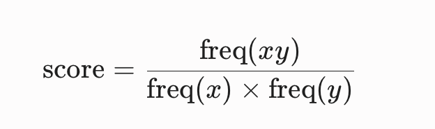

**WordPiece** 是一种与字节对编码（BPE）非常相似的子词分词（Subword Tokenization）算法。它最初由 Google 开发，用于语音识别系统和后来的经典大模型（如 **BERT**、DistilBERT 等）。

虽然它和 BPE 一样都是从基础字符出发、通过迭代合并来构建词表，但在**合并标准**和**分词逻辑**上有着关键的区别。

# 合并标准

- **BPE**：采用“**纯频率优先**”原则。每次总是选择语料库中**绝对出现次数最多**的相邻字符对进行合并。
- **WordPiece**：采用“**概率似然度（Likelihood）**”原则。它不仅看这对符号出现了多少次，还要看这两个符号分开时的频率（这个组合是不是更像一个整体）。
- 其评分公式为：
	
	-  **含义**：只有当 x 和 y 经常同时出现，且它们各自单独出现时的频率相对较低时，这个组合才会被赋予很高的分数。
	-  **优势**：这使得 WordPiece 更倾向于保留那些“组合起来非常有意义、但单独看概率不高”的字根，从而在语言学上通常表现得更加合理。

# 分词时的匹配方式

- **BPE**：依赖训练时记录下来的**一系列有序合并规则（Merge Rules）**。对新文本分词时，必须严格按顺序一步步执行这些合并。

- **WordPiece**：不依赖合并规则，而是直接依赖**最终生成的词表**。它在对新词进行分词时，采用的是**最大匹配法（Longest Match First / Greedy Search）**——从左到右（或从右到左），在词表中寻找能够匹配的最长子词。

# 词边界与前缀标识

- WordPiece 广泛使用特殊的续接前缀（如 ##）来区分一个子词是位于词首还是词中/词尾。
  -  例如单词 "hiking" 可能会被分词为：["hik", "##ing"]，其中的 ## 明确指示 ing 是紧跟在前面词根后面的，而不是一个独立的单词。
