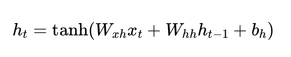

# 序列预测问题

词经过 Embedding 后变成向量：

```
我       → x1
今天     → x2
晚上     → x3
想去     → x4
```

输入RNN:

```
x1          x2          x3          x4

↓           ↓           ↓           ↓

h1  ----->  h2  -----> h3  -----> h4

                                 |
                                 ↓

                              Linear

                                 |
                                 ↓

                         下一词概率
```

# 公式

```
        h(t-1)
          |
          ↓
x(t) → [ RNN ] → h(t)
          |
          ↓
        y(t)
```

- x(t)：当前输入
- x(t)：当前输入
- h(t-1)：上一时刻记忆
- y(t)：基于当前隐状态生成的一个输出

公式：




# 代码


```python
import torch
import torch.nn as nn
import torch.optim as optim


rnn = nn.RNN(input_size=10, hidden_size=20, num_layers=1,batch_first=True)

x = torch.randn(
    3,   # batch size
    5,   # sequence length
    10   # feature size
)

output, hidden = rnn(x)

print("Output shape:", output.shape)
print("Hidden shape:", hidden.shape)
```

# 现实问题解决