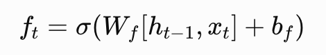
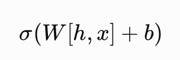

长短期记忆（LSTM）网络是一种特殊的循环神经网络（RNN），由 Sepp Hochreiter 和 Jürgen Schmidhuber 于 1997 年提出，专门用来解决传统 RNN 在处理长序列时的梯度消失/爆炸问题。

LSTM 通过引入一个可以长期保存信息的细胞状态（cell state）（长期记忆），以及一组精心设计的门控机制（gates），让网络能够选择性地记住或遗忘信息，从而在较长的时间跨度上保持有效的梯度流动。

- 遗忘门（Forget Gate）：决定从细胞状态中丢弃哪些信息。
  

- 输入门（Input Gate）: 决定哪些新信息要写入细胞状态，并生成候选值。
  
  候选新记忆：
  
  
- 输出门（Output Gate）: 决定当前时刻输出什么。
  


- 新记忆 = 旧记忆 × 保留比例 + 新知识 × 加入比例
  

- 隐藏状态
  

总结一下：

- LSTM 是一个“记忆管理器”
- 有长期记忆 (C_t)
- 有短期输出（隐藏状态） (h_t)
- 有三个门控制信息流


```
输入 x_t

    |
    v

计算遗忘门

f_t

    |
    v

删除旧记忆


计算输入门

i_t

    |
    v

加入新记忆


得到：

C_t


    |
    v

输出门

o_t


    |
    v

得到：

h_t

```

# 本质



它实际上就是：

```
过去信息
+
现在信息

↓

矩阵重新组合

↓

计算重要程度

↓

得到0~1的开关
```

