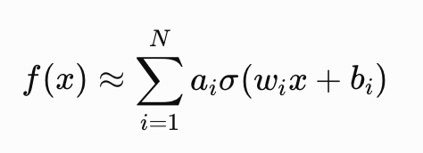
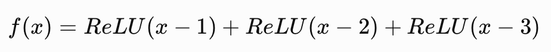

一个包含单隐藏层的前馈神经网络（Feedforward Neural Network），只要拥有足够数量的神经元，且激活函数满足一定条件，就能以任意精度逼近任何复杂的连续函数。

它是深度学习能够模拟复杂世界和处理高难度任务的基石。

- 原理：

  一个复杂函数 = 很多简单函数的叠加。

​	复杂曲线=曲线片段1+曲线片段2+曲线片段3+...

- 对应的数学公式为：

​	

Eg:

