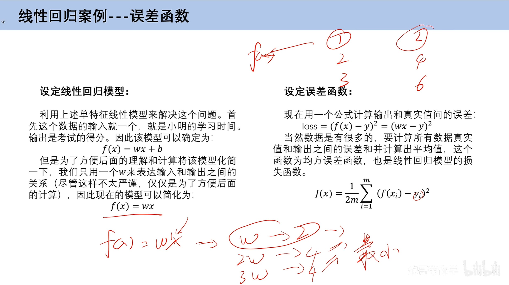

```python
# 定义数据集

# 定义数据特征
x_data = [1,2,3]

# 定义数据标签
y_data = [2,4,6]

# 初始化W参数
w = 1

learning_rate=0.01

def mse(xs,ys):
    s = 0
    for x,y in zip(xs,ys):
        s = (w*x - y)**2
    
    return s/len(xs)

def gradient_descent(xs,ys):
    global w
    s = 0
    for x,y in zip(xs,ys):
        s = 2*(w*x - y)
    s = s/len(xs)
    w = w - learning_rate*s

for i in range(0,10000):
    gradient_descent(x_data,y_data)
    print(w)
```