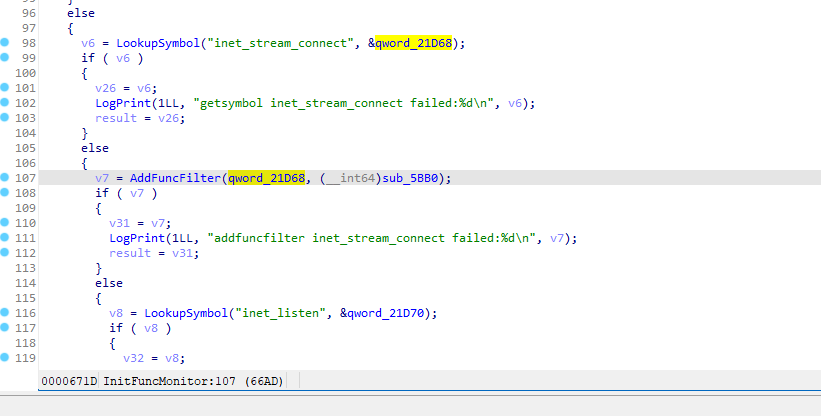
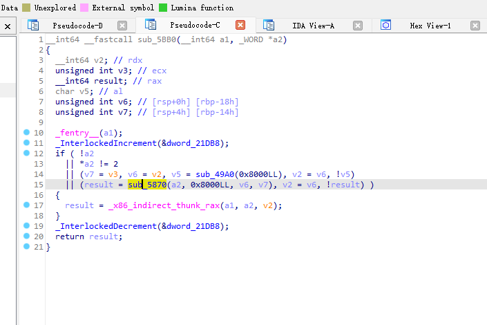
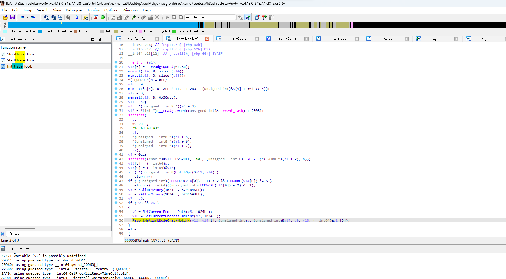

# 文件位置

程序路径位于/usr/local/aegis/

# 客户端自保护

开启客户端自保护后，未通过云安全中心控制台卸载Agent的行为将被云安全中心主动拦截，与此同时云安全中心会对您服务器Agent目录下的进程文件提供默认保护，防止攻击者入侵服务器后卸载云安全中心Agent或您服务器中的其他进程误关闭Agent。

# 文件使用说明

*   aegis/aegis\_client/aegis\_11\_73/AliYunDun，用于与云安全中心服务器建立连接。
*   aegis/aegis\_client/aegis\_11\_73/AliYunDunMonitor，用于主机安全监控与检测。
*   aegis/aegis\_update/AliYunDunUpdate，用于定期检测云安全中心Agent是否需要升级。
*   AliSecGuard目录，执行攻击防护功能（客户端自保护）。
*   AliNet目录，防护网络侧对服务器发起攻击。
*   PythonLoader目录，云安全中心基线检查、漏洞修复功能相关进程。核心进程为AliSecureCheck。
*   globalcfg目录，用于存放云安全中心Agent配置文件。
*   AliWebGuard目录，执行网页篡改防护功能。
*   AliHips目录，执行病毒木马防护功能。

# 卸载

*   如果您是在服务器上手动卸载Agent（即服务器管理员通过应用程序在服务器上卸载Agent等方式），执行卸载操作前，您必须先在云安全中心控制台为该服务器关闭==恶意主机行为防御==和==客户端自保护==开关，才能成功卸载Agent。关闭恶意主机行为防御和客户端自保护开关的具体操作，请参见主动防御和客户端自保护。
*   在云安全中心控制台卸载服务器上的Agent时，请务必确保服务器在云安全中心处于在线状态，否则服务器无法接收到卸载Agent的指令。

# 逆向

客户端自保护内核模块AliSecGuard位于AliSecGuard目录中

AliSecNetFlt64内核模块位于AliNet/kernel目录中

AliSecProcFilterAdv64内核模块位于alihips/kernel/centos

# 关闭阿里云自保护模块

    cat >> /etc/modprobe.d/blacklist.conf <<EOF
    # Blacklists AliSecGuard
    blacklist AliSecGuard
    install AliSecGuard /bin/false
    EOF

# Aliyun 网络行为监控







# Aliyun AliSecProcFilterAdv64.ko hook  point

    may_open
    may_open.isra.
    load_module
    inet_stream_connect
    inet_listen
    arch_ptrace
    prepare_kernel_cred
    vm_mmap_pgoff
    userfaultfd_ioctl
    vfs_statx

# Aliyun bpf

```bpf
4: kprobe  name kprobe_proc_for  tag 872e83143a23a0fd  gpl
	loaded_at 2023-11-08T11:32:01+0800  uid 0
	xlated 1784B  jited 915B  memlock 4096B  map_ids 1,2
	btf_id 7
	pids AliYunDunMonito(1375)
5: kprobe  name kretprobe_sys_e  tag 55e92484a82d61f6  gpl
	loaded_at 2023-11-08T11:32:01+0800  uid 0
	xlated 51488B  jited 28722B  memlock 53248B  map_ids 1,2
	btf_id 7
	pids AliYunDunMonito(1375)
6: kprobe  name kprobe_tcp_conn  tag b52c4440cfec1e06  gpl
	loaded_at 2023-11-08T11:32:01+0800  uid 0
	xlated 2376B  jited 1395B  memlock 4096B  map_ids 1,2
	btf_id 7
	pids AliYunDunMonito(1375)
7: kprobe  name kretprobe_inet_  tag 9601b13e82d3956c  gpl
	loaded_at 2023-11-08T11:32:01+0800  uid 0
	xlated 3096B  jited 1868B  memlock 4096B  map_ids 1,2
	btf_id 7
	pids AliYunDunMonito(1375)
8: kprobe  name kprobe_do_sys_o  tag 8519340a83f90601  gpl
	loaded_at 2023-11-08T11:32:01+0800  uid 0
	xlated 1528B  jited 813B  memlock 4096B  map_ids 1,2
	btf_id 7
	pids AliYunDunMonito(1375)
9: kprobe  name kprobe_do_sys_o  tag 79dd9bed526ac02e  gpl
	loaded_at 2023-11-08T11:32:01+0800  uid 0
	xlated 32B  jited 24B  memlock 4096B  map_ids 1,2
	btf_id 7
	pids AliYunDunMonito(1375)
10: kprobe  name kprobe_sys_rena  tag 404f8d4c29665fce  gpl
	loaded_at 2023-11-08T11:32:01+0800  uid 0
	xlated 2048B  jited 1107B  memlock 4096B  map_ids 1,2
	btf_id 7
	pids AliYunDunMonito(1375)
11: kprobe  name kprobe_sys_rena  tag 9c2709efc4dc20bf  gpl
	loaded_at 2023-11-08T11:32:01+0800  uid 0
	xlated 2176B  jited 1185B  memlock 4096B  map_ids 1,2
	btf_id 7
	pids AliYunDunMonito(1375)
12: kprobe  name kprobe_sys_rena  tag 50a253674207f99f  gpl
	loaded_at 2023-11-08T11:32:01+0800  uid 0
	xlated 2240B  jited 1215B  memlock 4096B  map_ids 1,2
	btf_id 7
	pids AliYunDunMonito(1375)
13: kprobe  name kprobe_unix_str  tag 3541fe3bb7b51302  gpl
	loaded_at 2023-11-08T11:32:01+0800  uid 0
	xlated 1312B  jited 681B  memlock 4096B  map_ids 1,2
	btf_id 7
	pids AliYunDunMonito(1375)

```

# kprobe

```c
[  294.340256] kprobe name :unix_stream_connect
[  294.340258] kprobe name :tcp_connect
[  294.340259] kprobe name :do_sys_open
[  294.340259] kprobe name :proc_fork_connector
[  294.340260] kprobe name :__x64_sys_execve
```

# 资料

Hooking Linux Kernel Functions, Part 2: How to Hook Functions with Ftrace

<https://www.apriorit.com/dev-blog/546-hooking-linux-functions-2>

Kernel Proc Connector and Containers

<https://www.slideshare.net/kerneltlv/kernel-proc-connector-and-containers>

linux process monitoring (exec, fork, exit, set*uid, set*gid)

<https://bewareofgeek.livejournal.com/2945.html>

CentOS 7 内核调试工具

https://qkxu.github.io/2019/06/05/CentOS-7-%E5%86%85%E6%A0%B8%E8%B0%83%E8%AF%95%E5%B7%A5%E5%85%B7.html