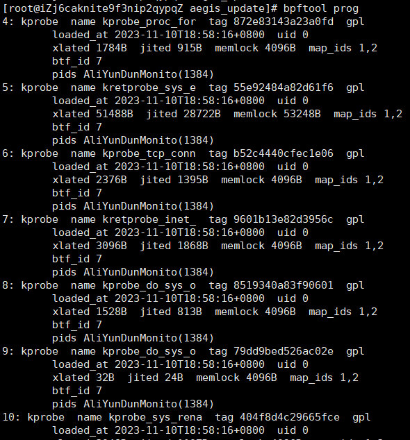
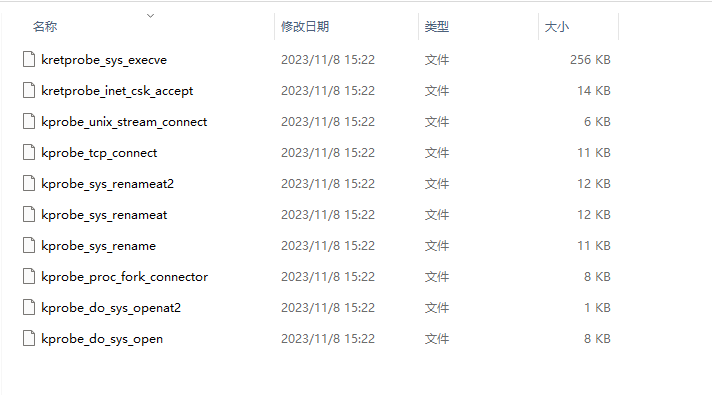
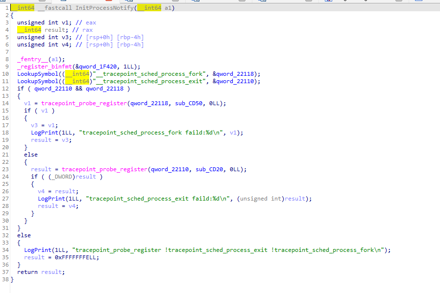
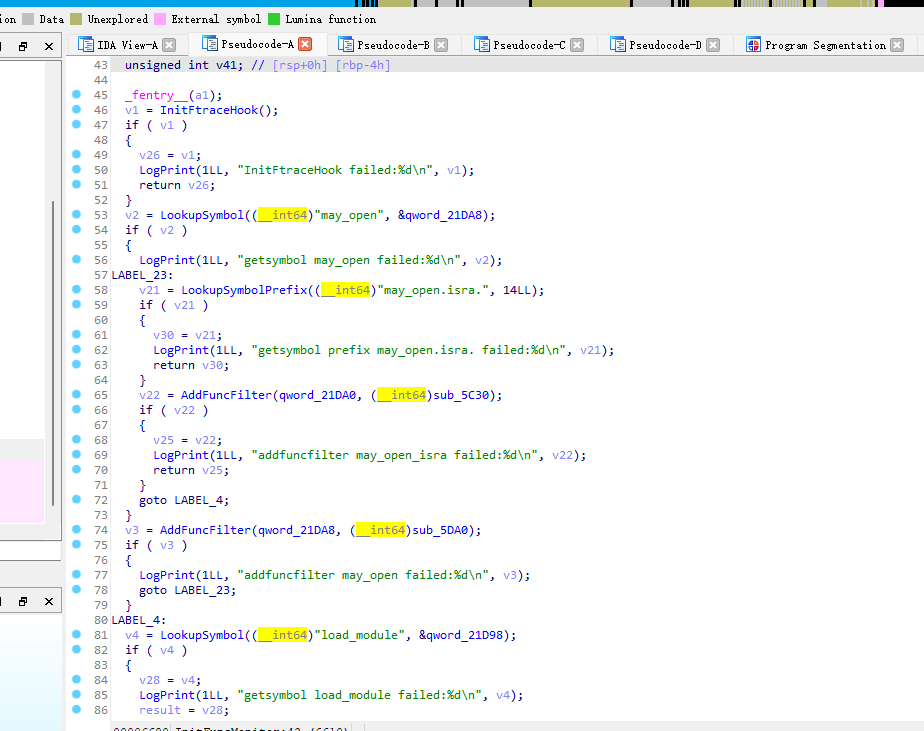
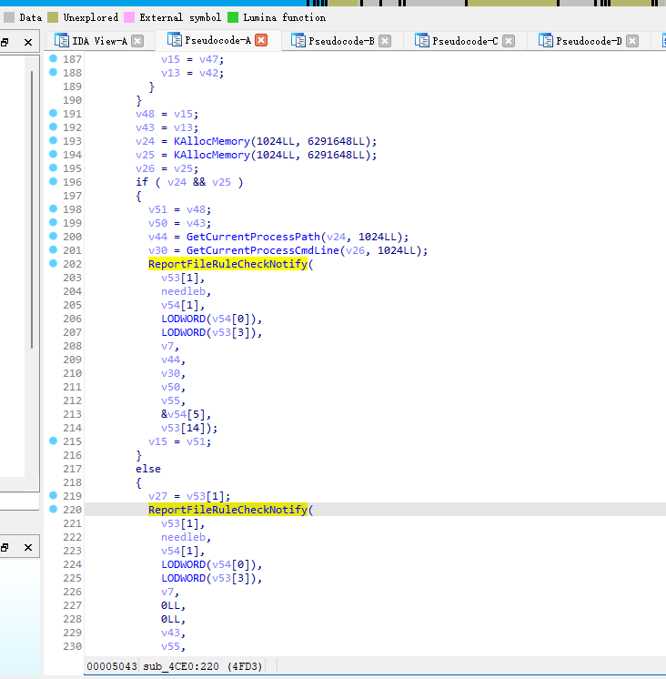
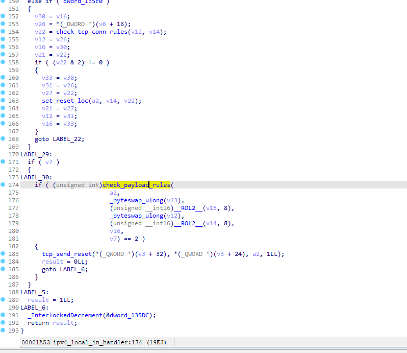

# 程序文件位置

程序路径位于/usr/local/aegis/

# 程序文件说明

*   aegis/aegis_client/aegis_11_73/AliYunDun，用于与云安全中心服务器建立连接。
*   aegis/aegis_client/aegis_11_73/AliYunDunMonitor，用于主机安全监控与检测。
*   aegis/aegis_update/AliYunDunUpdate，用于定期检测云安全中心Agent是否需要升级。
*   AliSecGuard目录，执行攻击防护功能（客户端自保护）。
*   AliNet目录，防护网络侧对服务器发起攻击。
*   PythonLoader目录，云安全中心基线检查、漏洞修复功能相关进程。核心进程为AliSecureCheck。
*   globalcfg目录，用于存放云安全中心Agent配置文件。
*   AliWebGuard目录，执行网页篡改防护功能。
*   AliHips目录，执行病毒木马防护功能。

# 阿里云逆向分析

对于阿里云盾相同的版本，在不同的Linux内核版本中，也是会有差别的

比如 在CentOS 3.10 Linux内核版本中 与 Centos 4.18 内核版本中。对于进程的信息获取 4.18 是通过 bpf 获取，而3.10由于内核版本较低，bpf 的支持度可能不是很够，采用的是暴力扫描（猜测是通过inotifyAPi实现，而不是真的采用暴力扫描）/proc文件，获取进程信息。而且高版本4.18内核中，会进一步通过内核模块收集进程与网络信息，低版本3.18中，并没有相应的内核模块。

# 阿里云自保护

阿里云有一个内核模块，叫AliSecGuard，使他进程禁止调试阿里云盾相关的进程，比如禁止通过gdb 与 strace  命令 附加到 阿里云盾相关的进程上。由于其禁止在用户态对阿里云盾进程相关的调试，所以对抗的话，我选择干脆直接在内核中进行。

# 阿里云中的进程信息获取方法

以下分析为阿里云盾 11_73 版本，内核版本为4.18

### /proc文件

通过读取/proc/文件，获取进程的相关信息，比如打开的文件，打开的网络连接，启动命令，父子进程关系。（绕过此方法比较简单，貌似也有用户态的方法，内核态对抗他比较简单，禁止Ali相关的进程读取/proc文件即可）

### 通过bpf

简介（来自网络）：BPF，及伯克利包过滤器Berkeley Packet Filter，最初构想提出于 1992 年，其目的是为了提供一种过滤包的方法，并且要避免从内核空间到用户空间的无用的数据包复制行为。它最初是由从用户空间注入到内核的一个简单的字节码构成，它在那个位置利用一个校验器进行检查 —— 以避免内核崩溃或者安全问题 —— 并附着到一个套接字上，接着在每个接收到的包上运行。几年后它被移植到 Linux 上，并且应用于一小部分应用程序上（例如，tcpdump）。其简化的语言以及存在于内核中的即时编译器（JIT），使 BPF 成为一个性能卓越的工具。然后，在 2013 年，Alexei Starovoitov 对 BPF 进行彻底地改造，并增加了新的功能，改善了它的性能。这个新版本被命名为 eBPF （意思是 “extended BPF”）.....(略)....==感谢那些新的钩子，eBPF 程序才可以被设计用于各种各样的情形下，其分为两个应用领域。其中一个应用领域是内核跟踪和事件监控。==

ebpf就是通过添加各种钩子，来获取进程启动，网络连接，文件访问等相关信息的。可以通过bpftool 查看到Aliyun添加的各种获取信息的钩子。



也可以通过bpftool dump出阿里云盾这些bpf程序

dump出的文件大概有：



这些bpf程序通过kprobe收集进程启动，网络连接，文件打开等信息，判断进程是否是非法进程。

对抗方法为在内核态中，删除掉对应的kprobe钩子，用户态貌似无解，因为有阿里云盾自保护功能，且无法在用户态搞掉kprobe钩子。

### 阿里云内核模块（低版本内核中没有这些模块）

阿里云收集进程信息的内核模块有AliSecProcFilterAdv64与AliSecNetFlt64内核模块。

其中 AliSecNetFlt64 还会通过netfilter，分析网络包，判断是否是可疑数据包。这两个对抗也只有在内核态中完成，没法在用户态中完成。

##### AliSecProcFilterAdv64 分析







通过tracepoint，hook进程、文件操作、网络相关函数，进而获取相关信息，然后通知用户态的Monitor进行分析，判断是否为可疑进程。

其中hook了关键的内核函数有：

```
    may_open
    may_open.isra.
    load_module
    inet_stream_connect
    inet_listen
    arch_ptrace
    prepare_kernel_cred
    vm_mmap_pgoff
    userfaultfd_ioctl
    vfs_statx
```

##### AliSecNetFlt64

通过netfilter，对进出本机的网络包进行分析。




# 联动效果

Monitor 会通过 bpf 、 内核模块 、proc文件获取进程的相关信息，然后判断是否为非法进程。

其中内核模块中的netfilter比较恶心，你虽然把bpf与AliSecProcFilterAdv64中的hook干掉，而没把netfilter干掉的话，你是没法建立网络连接的，他会直接给你reset掉。猜测是因为他通过 bpf 与 AliSecProcFilterAdv64 获取网络连接建立信息，只有有记录的 ，才让你通过。