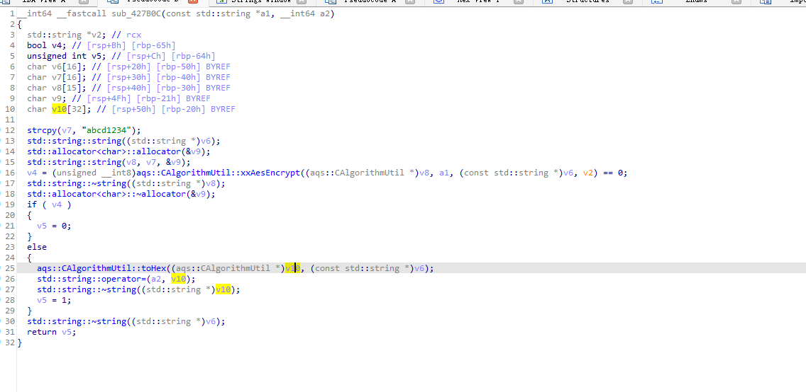

```
{
	"app": "AliYunDun",
	"app_version": "aegis_11_73",
	"ip": "xxxxxxxxxxxxxxxxxxxxxxxxxxxxxxxxxxxxxxxxxxxxxxxxxxxxxxxx",
	"seq": 193,
	"uuid": "xxxxxxxxxxxxxxxxxxxxxxxxxxxxxxxxxxxxxxxxxxxxxxxxxxxxxxxx",
	"version": "1.0",
	"traceId": "",
	"safe_mode": 1,
	"data": "xxxxxxxxxxxxxxxxxxxxxxxxxxxxxxxxxxxxxxxxxxxxxxxxxxxxxxxx",
	"type": "T_MSG_PROC"
}
```

# 关键函数

 sub_428A16
 
 加密函数 sub_427B0C
 
 ```
 v4 = (unsigned __int8)aqs::CAlgorithmUtil::xxAesEncrypt((aqs::CAlgorithmUtil *)v8, a1, (const std::string *)v6, v2) == 0;
 ```
 
 