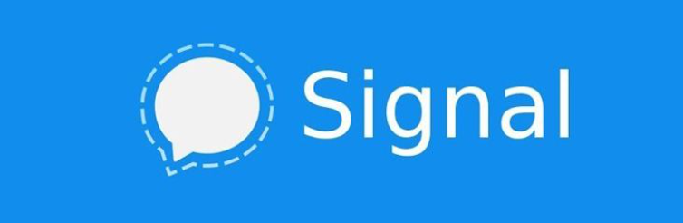
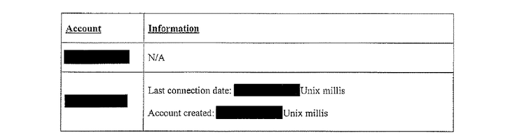
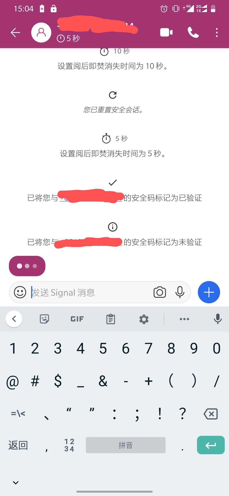
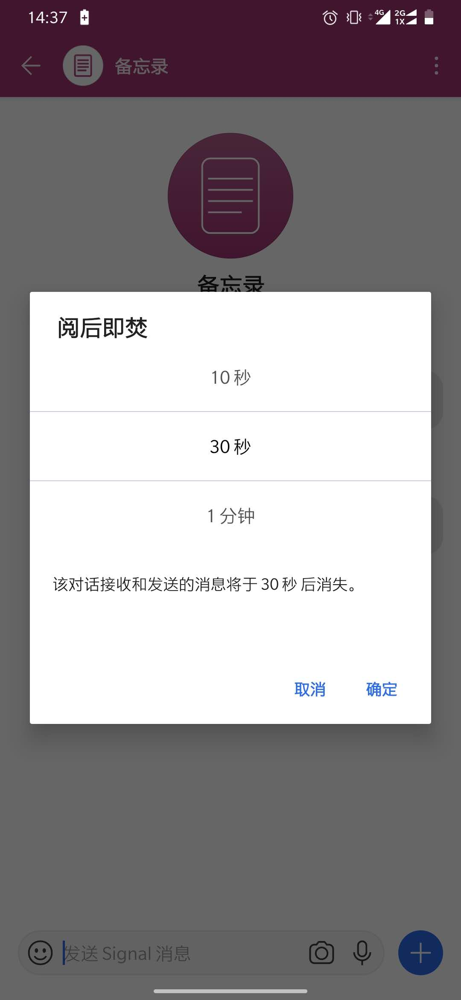
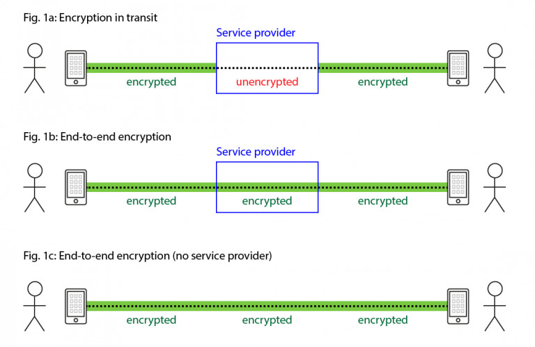
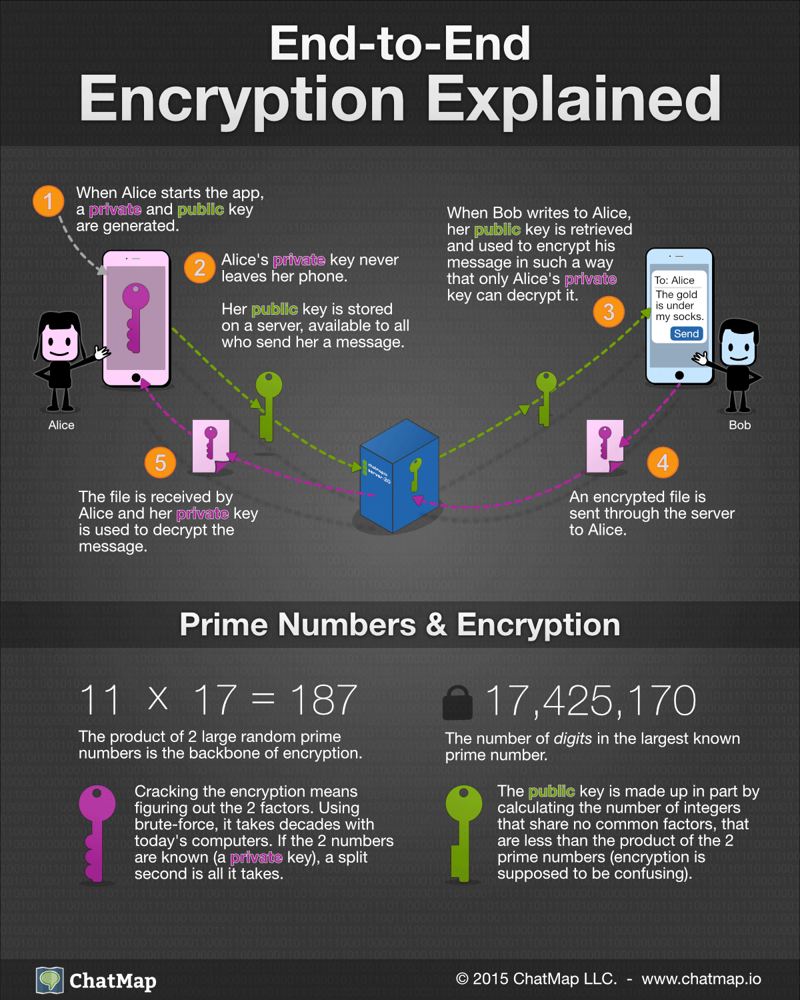

即时通讯软件使与世界各地的人交流和联系变得很容易，然而你的隐私安全可能会受到侵害。私人信息可能会被第三方、这些应用背后的组织以及收集公民信息的政府机构获取。像微信、QQ、Twitter、Instagra、Snapchat或Facebook Messenger、这样的流行通讯程序并未使用端到端加密，因此，您的对话和文件传输可能不完全安全，第三方随时可以在聊天服务器上获取到你的聊天消息等私人信息。另一方面，有许多提供即时通讯服务的聊天软件，通过使用端到端加密，提高了它们在安全和隐私方面的优势，比如著名的Signal。

# Signal

Signal App是由Open Whisper开发的一款加密聊天应用，其定位为最安全的即时聊天应用，使用群体包括普通用户，暴恐、情报人员等对数据保密性有严格要求的人群。它还提供了适用于 Linux、Windows 和 MacOS 的独立桌面应用，使用端对端加密协议来保护通信不被监视。

尽管现在很多热门应用都实现了端到端加密，但这也不一定能保证安全。安全专家们之所以强烈推荐Signal来作为安全通信的工具，是因为在DNC（美国民主党全国委员会）黑客事件后，这款号称“斯诺登核准”的应用，也成为相关职员的指定即时通信应用。约翰霍普金斯大学的密码学教授Matt Green，以及知名安全专家Bruce Schneier也是Signal的粉丝。

NSA的泄密者爱德华·斯诺登就曾表示说，他对Signal非常依赖，而很多专业人士，比如律师、记者以及机要人士甚至都将其作为主要的私人通讯工具：

.png)

Signal还获得了WhatsApp联合创始人Brian Acton的5,000万美元投资，用于支持非营利性组织Signal Foundation“使私人通讯变得无处不在”的使命。

# 为什么Signal安全

### 精简

对Signal的是取证比较困难的，因为Signal只会储存少量的用户事件和信息，比如在2016年的时候，Open Whisper Systems收到了FBI传票，要求其提供用户记录。因为FBI正在寻找两名嫌疑人的数据，他们使用了由Open Whisper制作的加密聊天应用Signal。 然而对于政府而言，不幸的是，Signal仅保留了最少的用户日志，因此绝大多数请求的信息都不可用，结果最后没有拿到任何重要信息。

FBI曾要求提供以下的数据：

- 用户名
- 支付信息
- 相关IP地址
- 电子邮件地址
- 历史日志
- 浏览器cookie
- 其他与电话号相关信息

Open Whisper Systems提供的所有信息，这些东西在调查中并没有起到什么作用：

### 使用端到端加密

使用端到端加密，使得数据只能由这些应用的用户读取，任何第三方都无法读取。

### 开源

Signal的服务端、客户端、加密引擎都是开源的(https://github.com/signalapp),这意味着有许多的人在检查他的安全性，并报告他的安全问题，安全问题也会得到及时的修复。

精简使得难以追踪用户，使用端到端加密保证了通信的安全性，而开源使减少了软件本身的漏洞。

精简+端到端加密+开源审查机制是它安全被认可的保障

# Signal 功能

Signal为了增强您的隐私安全，它的用户体验可能不是您见过的“最佳”体验。但是，从隐私/安全角度考虑，是一个不错的选择。

另请注意，目前，Signal 需要电话号码才能注册。如果你不想公开自己的私人电话号码，则可以使用 Google 语音或类似服务

除了具备普通的聊天软件功能：能直接发送语音，打电话，搭配端对端加密外，还具有以下功能。

### 显示正在输入

看到对方在线并正在输入

### 自动焚烧信息

可以任意设置保留信息的时间，到期后自动“焚烧”信息

### 锁定消息

如果你使用了锁（密码/指纹）来保护应用，那么即使你的设备已解锁，你也无法在通知中看到消息。

因此，当 Signal 处于锁定状态收到通知时，你会注意到通知的内容为 “Locked Message”，这对于注重隐私的用户来说是一个加分项。

# 端到端加密工作原理

按照端到端加密方法，当聊天会话开始时，每个用户所使用的应用都会生成两个加密密钥。此类密钥可以使用PGP（Pretty Good Privacy，是一个基于RSA公钥加密体系的邮件加密软件）加密应用加以生成。自1991年PGP首次发布以来，至今尚无证据显示其被破解过。

- 第一个密钥是公钥：端到端加密应用相互之间会交换这种密钥。
- 第二个密钥是私钥：私钥并不会从设备中发送出去。利用公钥，用户只能对消息进行加密。要想解密这种经过加密的消息，按照端到端加密方法，应使用对应的私钥。

公钥对数据进行加密，只有用对应的私钥才能解密。

如果第三方可以获得公钥也无妨，因为公钥只能用于端到端数据加密。正因为此，你大可以通过开放的通信信道来传送公钥。

每一个端到端加密应用生成了一对密钥且应用间相互交换了公钥后，就可以开始进行安全的通信了。诸如消息、视频和音频文件等数据需要先在发送端经过端到端加密过程，然后才会发送到服务器。数据会先存储在服务器上，一直存储到接收方的应用可以接收数据为止。接收方通知服务器收到数据后，这些数据就可以从服务器中删除或者在服务器上保留一段时间。

# 为什么端到端加密是安全的

在端到端加密应用之间传送的消息只能由这些应用的用户读取，任何第三方都无法读取。通过使用唯一密钥进行数据加密和解密，可以实现此类功能。只有终端用户可以生成和存储这些密钥。

由于服务器并不参与密钥生成过程，因此服务器所“看到”的只是在相互通信的用户间传送的加密消息。所以，即使在服务器端泄露了数据，也没有人能够读懂数据的具体内容，只有端点的人可以阅读明文信息。

# 参考资料

斯诺登力荐，号称史上最安全的即时通信应用Signal

https://www.freebuf.com/sectool/116009.html

安全星球—文件端到端加密网盘

https://www.rtinvent.com/?p=40982

简述实时音视频聊天中端到端加密（E2EE）的工作原理

http://yunxin.163.com/blog/zhuan-im4-8/

Signal：安全、开源的聊天应用

https://linux.cn/article-11764-1.html

The Best Encrypted Messaging Apps You Should Use Today [Updated 2019]

https://heimdalsecurity.com/blog/the-best-encrypted-messaging-apps/

Bad News FBI, Edward Snowden's Favorite Chat App Signal Just Got $50m in Funding

https://www.newsweek.com/bad-news-fbi-edward-snowdens-favorite-chat-app-signal-just-got-50m-funding-816035

Feds secretly subpoenaed the encrypted chat app Signal earlier this year

https://www.theverge.com/2016/10/4/13161026/signal-subpoena-court-order-encryption-police-open-whisper