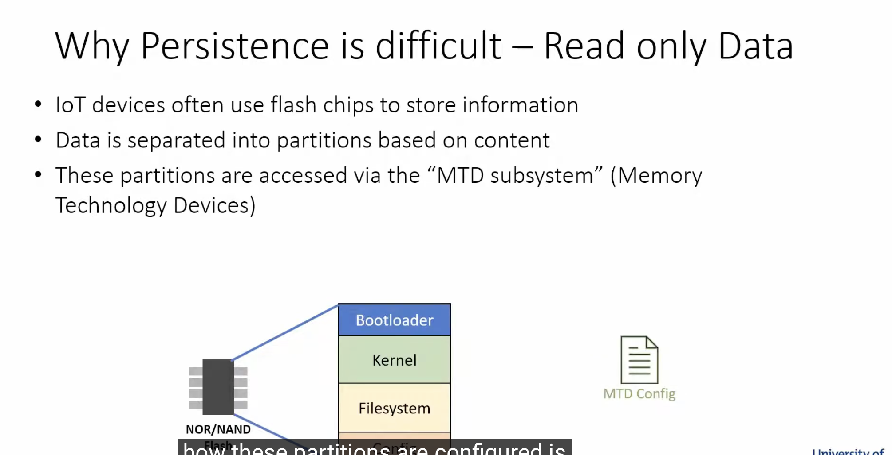
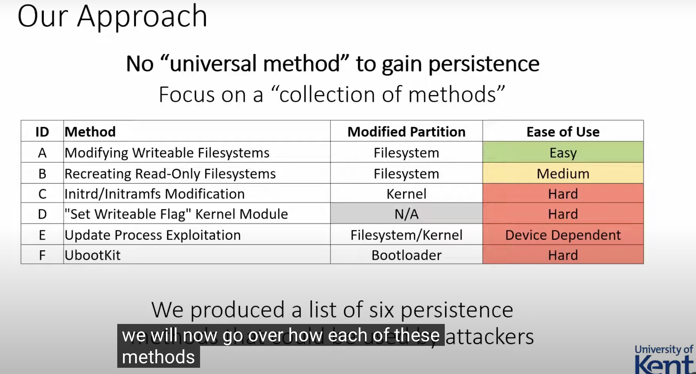
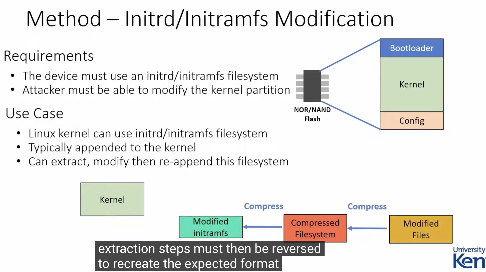
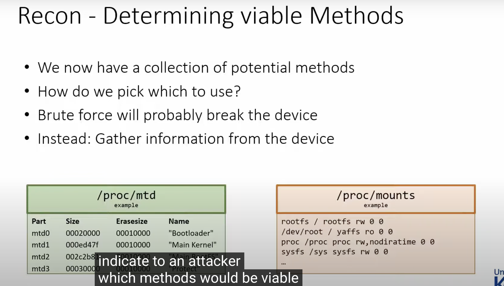
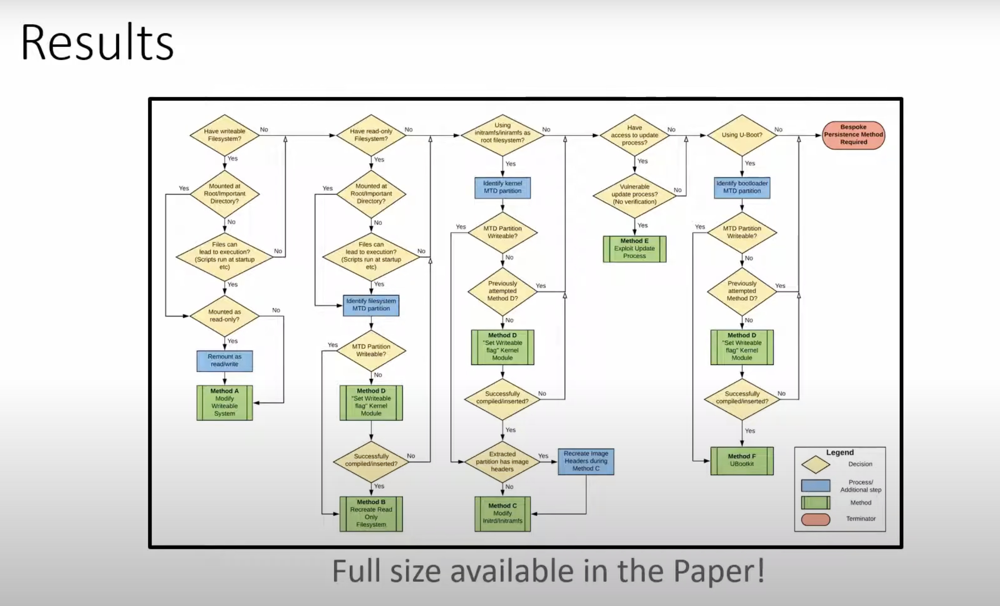

# Persistence in Linux-Based IoT Malware

# 资料

Persistence in Linux-Based IoT Malware

https://www.youtube.com/watch?v=tE19yWXKIw0

How is IoT botnets even a thing when the only write-able folder is /var or /tmp and both gets reset every Restart ?

https://www.reddit.com/r/hacking/comments/wuffpn/how_is_iot_botnets_even_a_thing_when_the_only/

The OpenWrt Flash Layout

https://openwrt.org/docs/techref/flash.layout