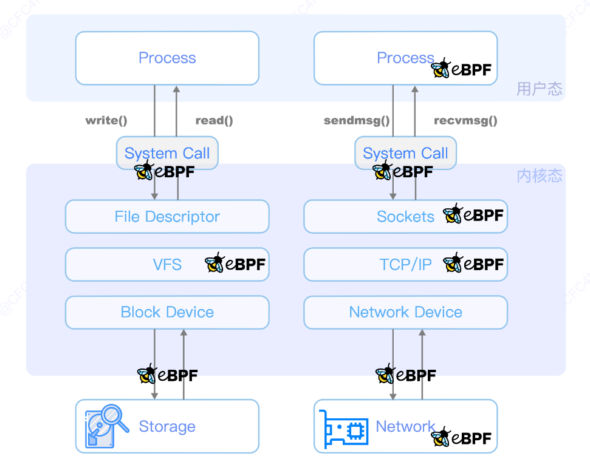
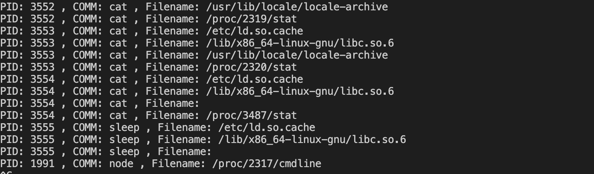
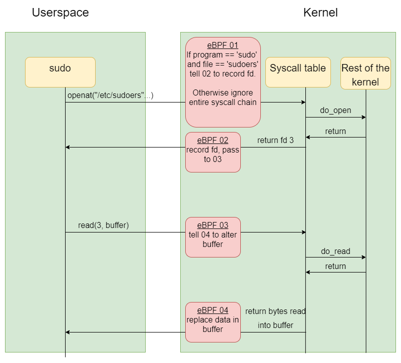

# 简单epbf程序

环境安装：

```sh
apt install clang gcc-multilib libbpf-dev m4 linux-headers-$(uname -r)
```


prog1.c:

```c
#include <linux/bpf.h>
#include <bpf/bpf_helpers.h>
#include <linux/ptrace.h>


#define __TARGET_ARCH_x86
#include <bpf/bpf_tracing.h>

struct event {
    int pid;
    char comm[64];
    char filename[256];
};

struct {
    __uint(type,BPF_MAP_TYPE_RINGBUF);
    __uint(max_entries,256*1024);
}ringbuf SEC(".maps");

SEC("kprobe/do_sys_openat2")
int kprobe_do_sys_open(struct pt_regs *ctx)
{
    __u32 pid = bpf_get_current_pid_tgid();
    struct event *evt = bpf_ringbuf_reserve(&ringbuf,sizeof(struct event),0);
    if(!evt){
        bpf_printk("bpf_ringbuf_reserve failed");
        return 1;
    }
    char *filename = (char *)PT_REGS_PARM2(ctx);//参数获取

    evt->pid = pid;
    bpf_get_current_comm(evt->comm,sizeof(evt->comm));
    bpf_probe_read_user(evt->filename, sizeof(evt->filename), filename);
    bpf_ringbuf_submit(evt,0);
    return 0;
}

char _licensep[] SEC("license") = "GPL";
```

loader.c:

```sh
#include <stdio.h>
#include <bpf/libbpf.h>
#include <unistd.h>
#include <fcntl.h>
#include <poll.h>

struct event {
    int pid;
    char comm[64];
    char filename[256];
};

static int event_logger(void *ctx,void *data,size_t len)
{
    struct event *evt = (struct event *)data;
    printf("PID: %d , COMM: %s , Filename: %s \n",evt->pid,evt->comm,evt->filename);
    return 0;
}

int main()
{
    const char *filename = "prog1.o";
    const char *progname = "kprobe_do_sys_open";
    const char *mapname  = "ringbuf";
    struct bpf_object *bpfObject = bpf_object__open(filename);

    if(!bpfObject){
        printf("Failed to open %s\n",filename);
        return 1;
    }

    int err = bpf_object__load(bpfObject);
    if(err){
        printf("Failed to load %s\n",filename);
        return 1;
    }

    struct bpf_program* bpfProg = bpf_object__find_program_by_name(bpfObject,progname);
    if(!bpfProg){
        printf("Failed to find %s\n",progname);
        return 1;
    }

    int rbFd = bpf_object__find_map_fd_by_name(bpfObject,mapname);
    struct ring_buffer *ringBuffer = ring_buffer__new(rbFd,event_logger,NULL,NULL);
    if(!ringBuffer){
        printf("Failed to create ring buffer\n");
        return 1;
    }

    bpf_program__attach(bpfProg);
    while(1){
        ring_buffer__consume(ringBuffer);
    }

    return 0;
}
```

makefile:

```makefile
all:
	clang -O2 -g -target bpf -c prog1.c -o prog1.o
	clang -O2 -g -Wall -I/usr/include -I/usr/include/bpf -lbpf -o loader loader.c
clean:
	rm -rf loader prog1.o
```


Output:




# ebpf有用的helper函数

```
bpf_get_current_comm （获取进程命 task_struct -> comm）
```

# ebpf rootkit 原理

ebpf没法修改系统调用的参数与返回值，也无法修改内核数据结构，但是他可以通过两个函数：

- `bpf_probe_read_user` 

- `bpf_probe_write_user`.

修改用户空间的数据。

结合起来，在用户空间和内核之间有选择地更改数据的能力是一种强大的攻击性原语，可以有广泛的可能用途。

# 修改文件



# 隐藏进程

通过隐瞒/proc/伪文件夹的内容来隐藏进程

# 劫持执行

当程序调用execve时更改可执行文件的文件路径，使其为恶意程序的路径，然后把原始execve的参数传递给恶意程序，然后恶意程序在启动原始程序，避免用户察觉。

# 假装系统调用

```c
// Attach to the 'write' syscall
SEC("fmod_ret/__x64_sys_write")
int BPF_PROG(fake_write, struct pt_regs *regs)
{
    // Get expected write amount
    u32 count = PT_REGS_PARM3(regs);

    // Overwrite return
    return count;
}
```

# 资料

Tracing System Calls Using eBPF - Part 1

https://falco.org/blog/tracing-syscalls-using-ebpf-part-1/

Linux中基于eBPF的恶意利用与检测机制

https://www.cnxct.com/evil-use-ebpf-and-how-to-detect-ebpf-rootkit-in-linux/

DEF CON 29: Bad BPF - Warping reality using eBPF

https://blog.tofile.dev/2021/08/01/bad-bpf.html

Abusing eBPF to build a rootkit

https://i.blackhat.com/USA21/Wednesday-Handouts/us-21-With-Friends-Like-EBPF-Who-Needs-Enemies.pdf

ebpf-slide

https://github.com/gojue/ebpf-slide

bpf.h

https://github.com/torvalds/linux/blob/0c0ddd6ae47c9238c18f475bcca675ca74c9dc31/include/uapi/linux/bpf.h

ebpfkit

https://github.com/Gui774ume/ebpfkit

TripleCross

https://github.com/h3xduck/TripleCross

bad-bpf

https://github.com/pathtofile/bad-bpf


