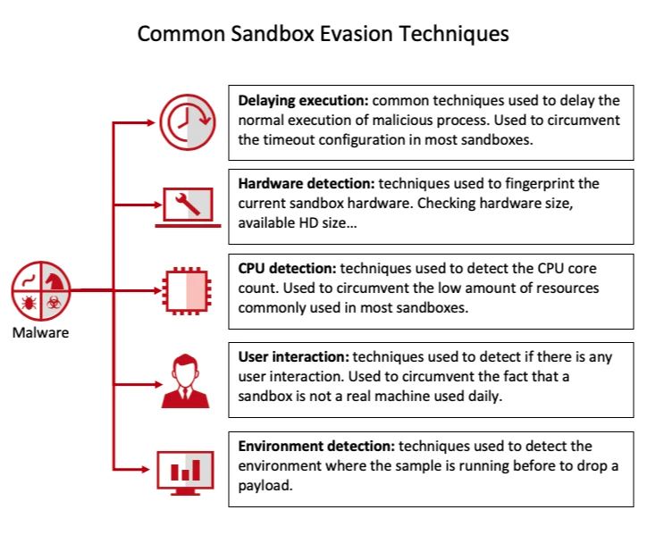

# 时间加速检测

```c
#include <x86intrin.h>

uint64_t rdtsc() 
{
    __asm__ __volatile__("":::"memory");
    uint64_t r = __rdtsc();
    __asm__ __volatile__("":::"memory");
    return r;
}
```

# 开机时长

如果当前操作系统没有超过三十分钟就退出；

Linux 系统时间 获取相关代码:

```c
#include <stdio.h>
#include <sys/sysinfo.h>

int main() {
    struct sysinfo info;

    if (sysinfo(&info) != 0) {
        perror("sysinfo");
        return 1;
    }

    // 获取系统启动时间（以秒为单位）
    long uptime = info.uptime;

    // 将秒转换为天、小时、分钟
    long days = uptime / (24 * 3600);
    uptime %= (24 * 3600);
    long hours = uptime / 3600;
    uptime %= 3600;
    long minutes = uptime / 60;

    // 输出系统启动时间
    printf("System uptime: %ld days, %ld hours, %ld minutes\n", days, hours, minutes);

    return 0;
}
```

# 检测⽤户输⼊

# 参考资料

Linux沙箱 ｜ 阿里云恶意文件检测平台开放Linux二进制文件检测

https://www.anquanke.com/post/id/276349

反虚拟机、反沙箱技术整理汇总

https://www.cnblogs.com/haidragon/p/16862814.html

linux进程、线程与cpu的亲和性（affinity）

https://www.cnblogs.com/wenqiang/p/6049978.html

Linux上采用rdtsc指令对C/C++程序进行性能测试

https://blog.csdn.net/ithiker/article/details/119981737

细说RDTSC的坑

http://www.wangkaixuan.tech/?p=901

怎样精确计算CPU频率

https://www.owalle.com/2021/08/31/cpu-performance/

攻防|反沙箱CobaltStrike木马加载器分析

https://www.wangan.com/p/11v711e4e4c61b70

Catching Sandbox-Evading Malware: Techniques, Principles & Solutions

https://www.apriorit.com/dev-blog/545-sandbox-evading-malware