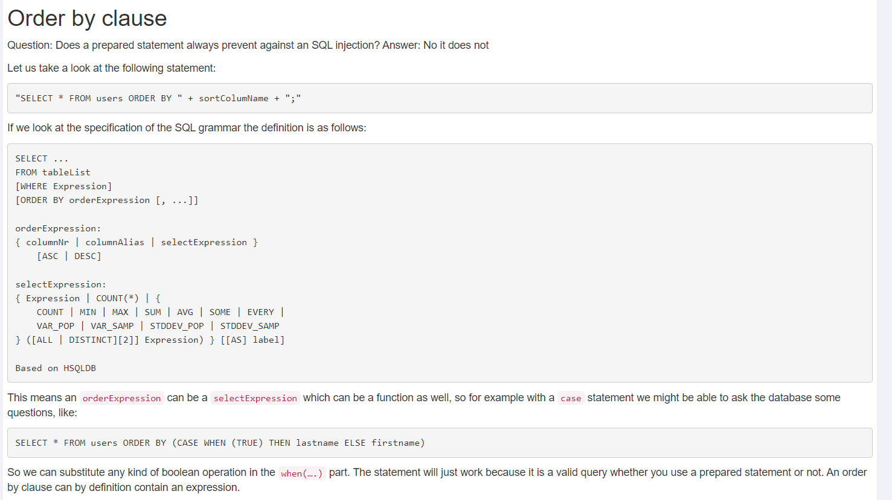
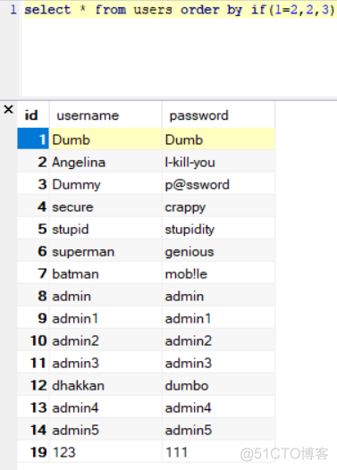

# case when

 ```sql
SELECT * FROM Person order by (CASE WHEN (1=1) THEN PersonID ELSE FirstName END);
```

==注入代码==

```sql

(case when (SELECT id from servers where id=1) = '1' then ip ELSE description END)

```

### 原理



# if

if语句返回的是==字符类型==，不是整型, 因此如果使用数字代替列名是不行的,如下图



这是在知道列名的前提下使用

```sql
?order=if(表达式,id,username)
```

- 表达式为true时,根据id排序
- 表达式为false时,根据username排序
- 
# 盲注

rand() 函数可以产生随机数介于0和1之间的一个数

当给rand() 一个参数的时候，会将该参数作为一个随机种子，生成一个介于0-1之间的一个数,

种子固定,则生成的数固定

order by rand:这个不是分组，只是排序，rand()只是生成一个随机数,每次检索的结果排序会不同

```
order by rand(表达式)

```

eg:

```sql
rand((select 5)=30)
```

==当表达式为true和false时，排序结果是不同的，所以就可以使用rand()函数进行盲注了。==

==hsqldb数据库貌似无法使用此方法，但是mysql可以使用==

# 总结

在知道数据库表的列名和表名的情况下，优先使用case when（基本大多数据库都支持，包括hsqldb），其次才是if函数