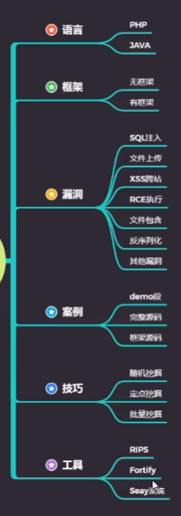
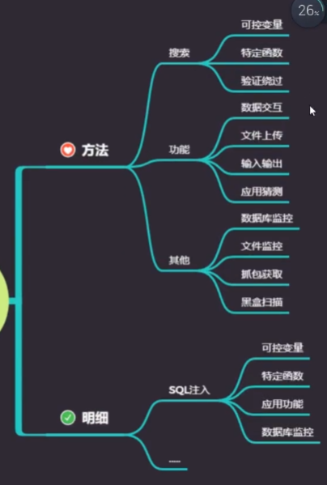

# PHP无框架项目SQL注入挖掘技巧




### MYSQL sql语句执行监听

###### 首先开启日志记录

```sql
SET GLOBAL log_output = 'TABLE'; SET GLOBAL general_log = 'ON'; 
```

###### 查看sql 运行日志

```sql
SELECT * from mysql.general_log order by event_time desc
```

###### 清空表

delete对于这个表，不允许使用，只能用truncate

```sql
truncate table mysql.general_log;
```

###### 关闭日志记录

```sql
SET GLOBAL log_output = 'TABLE'; SET GLOBAL general_log = 'OFF';  //日志关闭
```

ps:在查询到所需要的记录之后，应尽快关闭日志模式，占用磁盘空间比较大

# PHP 漏洞关键字

### SQL 注入：

---select insert update mysql_query mysqli 等

### 文件上传：

---$_FILES，type="file"，上传，move_uploaded_file()等

### XSS 跨站：

---print print_r echo sprintf die var_dump var_export 等

### 文件包含：

---include include_once require require_once 等

### 代码执行：

---eval assert preg_replace call_user_func call_user_func_array 等

### 命令执行：

---system exec shell_exec `` passthru pcntl_exec popen proc_open

### 变量覆盖：

---extract() parse_str() importrequestvariables() $$等

### 反序列化：

---serialize() unserialize() __construct __destruct 等

### 其他漏洞：

---unlink() file_get_contents() show_source() file() fopen()等
