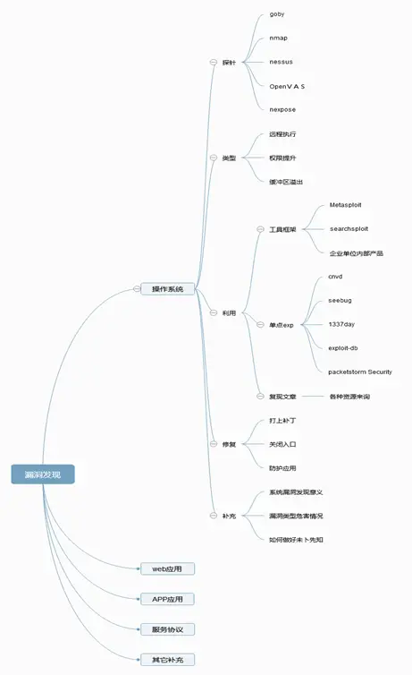
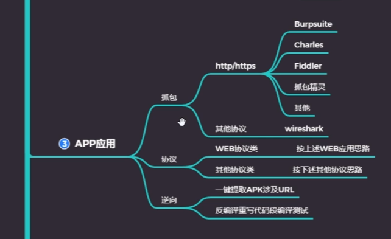

# 操作系统漏洞

# Web漏洞

- 已知 CMS：如常见的 dedecms.discuz,wordpress 等源码结构，这种一般采用非框架类开发，但也有少部分采用的是框架类开发，针对此类源码程序的安全检测，我们要利用公开的漏洞进行测试，如不存在可采用白盒代码审计自行挖掘。（1.在漏洞平台如seebug、cnvd搜索关键字2.使用工具框架如cmsscan、wpscan3.代码审计（函数，功能，框架三个方面）） 
- 开发框架：如常见的 thinkphp，spring,flask 等开发的源码程序，这种源码程序正常的安全测试思路：先获取对应的开发框架信息(名字，版本)，通过公开的框架类安全问题进行测试，如不存在可采用白盒代码审计自行挖掘。 
- 未知 CMS：如常见的企业或个人内部程序源码，也可以是某 CMS 二次开发的源码结构，针对此类的源码程序测试思路：能识别二次开发就按已知 CMS 思路进行，不能确定二次开发的话可以采用常规综合类扫描工具或脚本进行探针，也可以采用人工探针（功能点，参数，盲猜），同样在有源码的情况下也可以进行代码审计自行挖掘。
 
# APP应用

