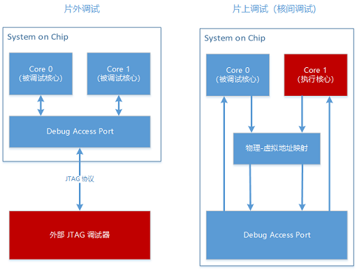
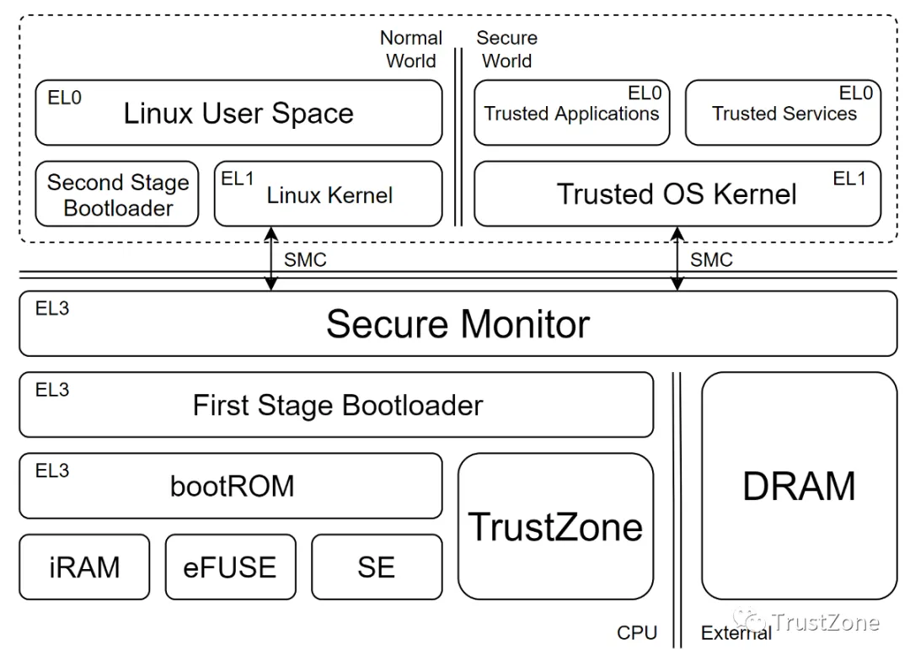
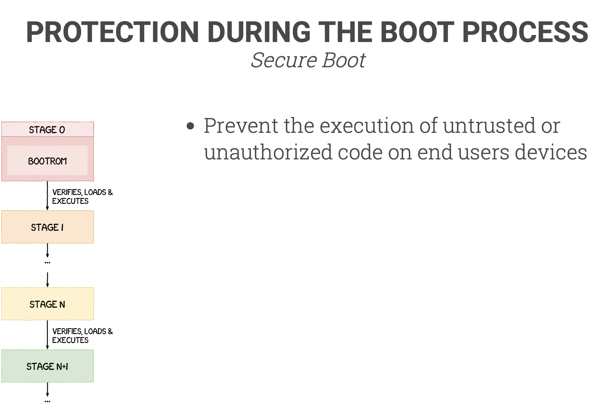

# 关于漏洞原理

在硬件上，ARM 为 ARMv8 AArch64 系统设计有多级软件执行权限，称之为异常等级（Exception Level）。各个 EL 等级所对应的软件功能不同，简单来说，软件执行时所处的硬件 EL 等级越高，软件代码的权限越大

- EL0 级的应用，为普通用户态的程序。

- EL1 级为 root 权限的内核态程序。

- EL 2 级为通常服务器上构建虚拟化实例的程序。

- EL3 级为 BootROM 中的基础加载程序，负责启动流程和关键异常的处理，在 ARM 架构中，通常称为 ARM Trusted Firmware（ATF）。

  

在 ARMv8-A 的处理器家族中，几乎所有的设计都以多核的方式成为最终产品，在多核产品中还可以通过核间调试的方式，通过 ARM 核心内的调试模块，用一个核心调试另一个核心中的程序。

如果让处理器核心 Core 0 处于调试状态，它执行程序时，硬件的异常等级该如何判定呢？

答案是：不判定。即代码执行时，不受硬件 EL 等级的限制。

由于处于调试状态的 Core 0 所执行的代码不受当前异常等级的限制，因此 Core 0 实际可以执行任意异常等级状态下的代码。结合核间调试的功能，我们就可以从 Core 1 通过调试接口发送高权限的执行代码给 Core 0，让 Core 0 执行完毕后通过调试接口将结果回复给 Core 1，这样我们就从处于 EL1 的程序执行了 EL3 程序才能执行的操作。

# 关于该漏洞是否可以用于后门持久化研究

### 关键文件替换

对于该漏洞的话，如果能达到利用，则我们处于el1，且我们能对该目标编译内核模块，和插入内核模块的，也就是说我们可以对该目标进行内核替换从而达到持久化的目地、或者替换系统中的程序、动态库的方式

### 修改bootROM

由于该漏洞，我们可以提到el3，那么是否可以修改bootROM呢 ？查阅资料发现：

所有支持 Secure Boot 的 CPU 都会有**一个写死在 CPU 中的 bootROM 程序。** CPU 在通电之后执行的第一条指令就在 bootROM 的入口。

bootROM 拥有最高的执行权限，也就是 EL3。

- 它将初始化 Secure Boot 安全机制；
- 加载 Secure Boot Key 等密钥；
- 从 eMMC 加载并验证 First Stage Bootloader（FSBL）；
- 最后跳转进 FSBL 中。

bootROM 是完全只读的，**这个在 CPU 出厂时就被写死了**，连 OEM 都无法更改。bootROM 通常会被映射到它专属的一块内存地址中，但是如果你尝试向这块地址写入内容，一般都会出错或者没有任何效果。

**有些芯片还会有一个专门的寄存器控制 bootROM 的可见性**，bootROM 可以通过这个寄存器禁止别的程序读取它的代码，**以阻止攻击者通过逆向 bootROM 寻找漏洞。**

### bootloader的替换

bootROM 到 Normal World 的 Kernel，到 Secure World 的 TA，每一步的加载**都是要经过数字签名认证的**，因此由于**信任链**的关系，由于bootROM会对bootloader进行验证，且bootROM我们也没法修改，此方法也无法达到持久化的目地。

# 参考资料

Nailgun Attack

https://fengweiz.github.io/paper/nailgun-sp19.pdf

Bottom Up - Glitching the Switch

https://media.ccc.de/v/c4.openchaos.2018.06.glitching-the-switch

Top Down - Breaking Samsung's ARM TrustZone 

https://i.blackhat.com/USA-19/Thursday/us-19-Peterlin-Breaking-Samsungs-ARM-TrustZone.pdf