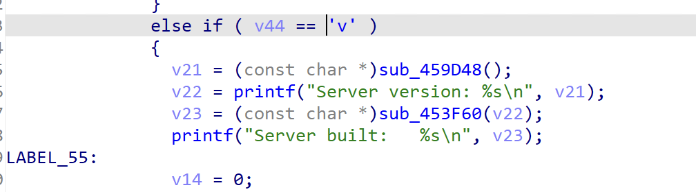
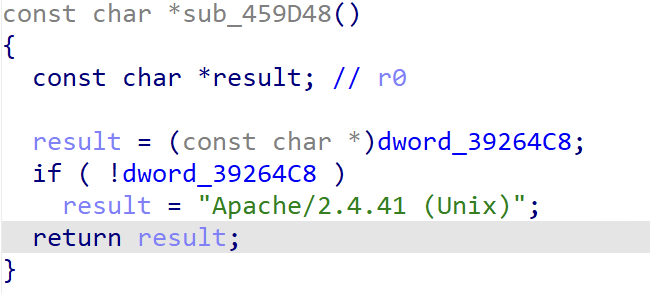
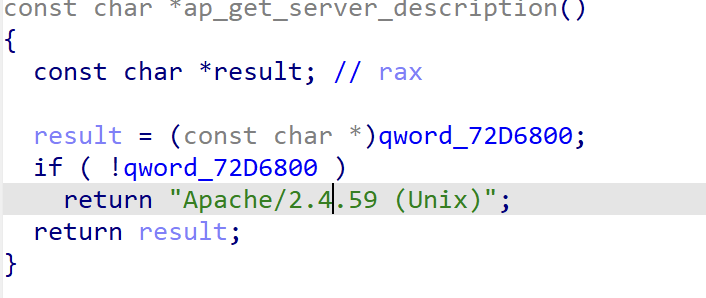

# 如何确定FGT使用的Apache版本

分析Apache httpd源码main.c:

```c
static void usage(process_rec *process)
{
......
    ap_log_error(APLOG_MARK, APLOG_STARTUP, 0, NULL,
                 "  -v                 : show version number");
......
}
```

```c
#ifdef HFND_FUZZING_ENTRY_FUNCTION
 HFND_FUZZING_ENTRY_FUNCTION(int argc, const char *const *argv)
#else
 int main(int argc, const char *const *argv)
#endif
{
    while ((rv = apr_getopt(opt, AP_SERVER_BASEARGS, &c, &opt_arg))
            == APR_SUCCESS) {
        const char **new;
                switch (c) {
......
       					case 'v':
                	printf("Server version: %s\n", ap_get_server_description());
                	printf("Server built:   %s\n", ap_get_server_built());
                	destroy_and_exit_process(process, 0);
......
    if (rv != APR_EOF || opt->ind < opt->argc) {
        usage(process);
    }
}
```

结合逆向(通过字符串"  -v                 : show version number"确定到usage函数，然后交叉引用到main函数)，就可以确定FGT使用的apache版本。

### FGT 6.4.6





### FGT 7.6.0



# FGT源码目录

### FGT 6.4.6

```
.rodata:01248B38	00000032	C	/code/FortiOS/fortinet/daemon/authd/authd_admin.c
.rodata:01262D58	0000003D	C	/code/FortiOS/fortinet/router/ZebOS-7.2/bgpd/bgp_advertise.c
.rodata:01262DA5	0000003A	C	/code/FortiOS/fortinet/router/ZebOS-7.2/bgpd/bgp_aspath.c
.rodata:01262EAA	00000038	C	/code/FortiOS/fortinet/router/ZebOS-7.2/bgpd/bgp_attr.c
.rodata:01268CBA	00000037	C	/code/FortiOS/fortinet/router/ZebOS-7.2/bgpd/bgp_cli.c
.rodata:01269C27	00000039	C	/code/FortiOS/fortinet/router/ZebOS-7.2/bgpd/bgp_clist.c
.rodata:01269C76	0000003D	C	/code/FortiOS/fortinet/router/ZebOS-7.2/bgpd/bgp_community.c
.rodata:01269CEC	00000038	C	/code/FortiOS/fortinet/router/ZebOS-7.2/bgpd/bgp_damp.c
.rodata:0126B4BA	0000003A	C	/code/FortiOS/fortinet/router/ZebOS-7.2/bgpd/bgp_decode.c
.rodata:0126CAF8	0000003E	C	/code/FortiOS/fortinet/router/ZebOS-7.2/bgpd/bgp_ecommunity.c
.rodata:0126CE86	0000003A	C	/code/FortiOS/fortinet/router/ZebOS-7.2/bgpd/bgp_filter.c
.rodata:0126D2A5	00000037	C	/code/FortiOS/fortinet/router/ZebOS-7.2/bgpd/bgp_fsm.c
.rodata:0126D335	00000037	C	/code/FortiOS/fortinet/router/ZebOS-7.2/bgpd/bgp_ipc.c
.rodata:0126DAE7	0000003B	C	/code/FortiOS/fortinet/router/ZebOS-7.2/bgpd/bgp_network.c
.rodata:0126DC29	0000003B	C	/code/FortiOS/fortinet/router/ZebOS-7.2/bgpd/bgp_nexthop.c
.rodata:0126DE16	00000037	C	/code/FortiOS/fortinet/router/ZebOS-7.2/bgpd/bgp_nsm.c
.rodata:0126DF3C	00000039	C	/code/FortiOS/fortinet/router/ZebOS-7.2/bgpd/bgp_regex.c
.rodata:0126DF84	00000039	C	/code/FortiOS/fortinet/router/ZebOS-7.2/bgpd/bgp_route.c
.rodata:0126E9CF	0000003C	C	/code/FortiOS/fortinet/router/ZebOS-7.2/bgpd/bgp_routemap.c
.rodata:0126F6F7	00000038	C	/code/FortiOS/fortinet/router/ZebOS-7.2/bgpd/bgp_show.c
.rodata:012730F3	00000039	C	/code/FortiOS/fortinet/router/ZebOS-7.2/bgpd/bgp_table.c
.rodata:0127315A	00000034	C	/code/FortiOS/fortinet/router/ZebOS-7.2/bgpd/bgpd.c
.rodata:012824FE	00000033	C	/code/FortiOS/fortinet/daemon/caputp/util/cuDtls.c
.rodata:012C48DE	0000002C	C	/code/FortiOS/fortinet/capwap/util/cwDtls.c
.rodata:0130AA20	00000035	C	/code/FortiOS/fortinet/daemon/dhcprelay/dhcp_proxy.c
.rodata:0130AF58	00000034	C	/code/FortiOS/fortinet/daemon/dhcprelay/dhcprelay.c
.rodata:01324563	00000037	C	/code/FortiOS/fortinet/daemon/extenderd/util/extDtls.c
.rodata:0132D487	00000031	C	/code/FortiOS/fortinet/daemon/fgfmsd/ssl_proto.c
.rodata:0132DC9C	00000033	C	/code/FortiOS/fortinet/daemon/fgfmsd/event/mpool.c
.rodata:013447B5	0000003A	C	/code/FortiOS/fortinet/migbase/include/ca_bundle_custom.h
.rodata:01344FAD	00000038	C	/code/FortiOS/fortinet/daemon/fnbamd/fnbamd_cert_auth.c
.rodata:01345A0B	00000032	C	/code/FortiOS/fortinet/daemon/fnbamd/fnbamd_cfg.c
.rodata:01347559	00000033	C	/code/FortiOS/fortinet/daemon/fnbamd/fnbamd_http.c
.rodata:0134812B	00000039	C	/code/FortiOS/fortinet/daemon/fnbamd/fnbamd_ldap_utils.c
.rodata:0136963F	0000002D	C	/code/FortiOS/fortinet/fortitest/init/init.c
.rodata:013ACCD8	00000037	C	/code/FortiOS/fortinet/fortiweb/modules/ApacheUpload.c
.rodata:013AD53F	00000038	C	/code/FortiOS/fortinet/fortiweb/modules/apache_module.c
.rodata:013AF333	00000033	C	/code/FortiOS/fortinet/fortiweb/modules/aps_util.c
.rodata:01420C96	0000002F	C	/code/FortiOS/fortinet/apache2/server/config.c
.rodata:014216F6	0000002D	C	/code/FortiOS/fortinet/apache2/server/core.c
.rodata:01424E0A	00000035	C	/code/FortiOS/fortinet/apache2/server/core_filters.c
.rodata:01424FD6	0000002F	C	/code/FortiOS/fortinet/apache2/server/listen.c
.rodata:014255E2	0000002C	C	/code/FortiOS/fortinet/apache2/server/log.c
.rodata:01425F0D	0000002D	C	/code/FortiOS/fortinet/apache2/server/main.c
.rodata:0142677A	00000033	C	/code/FortiOS/fortinet/apache2/server/mpm_common.c
.rodata:01426A06	00000031	C	/code/FortiOS/fortinet/apache2/server/mpm_unix.c
.rodata:01426EF9	00000030	C	/code/FortiOS/fortinet/apache2/server/prefork.c
.rodata:01427C59	00000031	C	/code/FortiOS/fortinet/apache2/server/protocol.c
.rodata:01428904	00000030	C	/code/FortiOS/fortinet/apache2/server/request.c
.rodata:01428F10	00000033	C	/code/FortiOS/fortinet/apache2/server/scoreboard.c
.rodata:014290F7	0000002E	C	/code/FortiOS/fortinet/apache2/server/unixd.c
.rodata:0142936E	0000002D	C	/code/FortiOS/fortinet/apache2/server/util.c
.rodata:0142972F	00000035	C	/code/FortiOS/fortinet/apache2/server/util_cookies.c
.rodata:0142994F	00000037	C	/code/FortiOS/fortinet/apache2/server/util_expr_eval.c
.rodata:0142A4A1	00000032	C	/code/FortiOS/fortinet/apache2/server/util_fcgi.c
.rodata:0142A512	00000034	C	/code/FortiOS/fortinet/apache2/server/util_filter.c
.rodata:0142A76A	00000033	C	/code/FortiOS/fortinet/apache2/server/util_mutex.c
.rodata:0142A94D	00000034	C	/code/FortiOS/fortinet/apache2/server/util_script.c
.rodata:0142ABA3	00000031	C	/code/FortiOS/fortinet/apache2/server/util_xml.c
.rodata:0142AD1E	0000002E	C	/code/FortiOS/fortinet/apache2/server/vhost.c
.rodata:0142B06E	0000003A	C	/code/FortiOS/fortinet/apache2/modules/byterange_filter.c
.rodata:0142B2CA	00000033	C	/code/FortiOS/fortinet/apache2/modules/http_core.c
.rodata:0142B318	00000036	C	/code/FortiOS/fortinet/apache2/modules/http_filters.c
.rodata:0142BCF8	00000037	C	/code/FortiOS/fortinet/apache2/modules/http_protocol.c
.rodata:0142CFA9	00000036	C	/code/FortiOS/fortinet/apache2/modules/http_request.c
.rodata:0142D1AE	00000035	C	/code/FortiOS/fortinet/apache2/modules/mod_headers.c
.rodata:0142D63C	00000032	C	/code/FortiOS/fortinet/apache2/modules/mod_mime.c
.rodata:0142E27A	00000033	C	/code/FortiOS/fortinet/apache2/modules/mod_proxy.c
.rodata:014302DD	0000003C	C	/code/FortiOS/fortinet/apache2/modules/mod_proxy_wstunnel.c
.rodata:014305B0	00000038	C	/code/FortiOS/fortinet/apache2/modules/mod_reqtimeout.c
.rodata:014307F7	00000035	C	/code/FortiOS/fortinet/apache2/modules/mod_rewrite.c
.rodata:01433A25	00000027	C	/code/FortiOS/fortinet/apache2/modules/
.rodata:01433C96	00000034	C	/code/FortiOS/fortinet/apache2/modules/proxy_util.c
.rodata:014358C2	0000003B	C	/code/FortiOS/fortinet/apache2/modules/ssl_engine_config.c
.rodata:01435C43	00000039	C	/code/FortiOS/fortinet/apache2/modules/ssl_engine_init.c
.rodata:01436E09	00000037	C	/code/FortiOS/fortinet/apache2/modules/ssl_engine_io.c
.rodata:01437864	0000003B	C	/code/FortiOS/fortinet/apache2/modules/ssl_engine_kernel.c
.rodata:014392B9	00000038	C	/code/FortiOS/fortinet/apache2/modules/ssl_engine_log.c
.rodata:01439406	0000003A	C	/code/FortiOS/fortinet/apache2/modules/ssl_engine_mutex.c
.rodata:014394F3	00000039	C	/code/FortiOS/fortinet/apache2/modules/ssl_engine_ocsp.c
.rodata:0143980B	0000003C	C	/code/FortiOS/fortinet/apache2/modules/ssl_engine_pphrase.c
.rodata:01439D9F	00000039	C	/code/FortiOS/fortinet/apache2/modules/ssl_engine_rand.c
.rodata:01439EBD	00000039	C	/code/FortiOS/fortinet/apache2/modules/ssl_engine_vars.c
.rodata:0143A0C6	00000034	C	/code/FortiOS/fortinet/apache2/modules/ssl_scache.c
.rodata:0143A2B3	00000037	C	/code/FortiOS/fortinet/apache2/modules/ssl_util_ocsp.c
.rodata:0143A740	00000036	C	/code/FortiOS/fortinet/apache2/modules/ssl_util_ssl.c
.rodata:0143A80F	0000003B	C	/code/FortiOS/fortinet/apache2/modules/ssl_util_stapling.c
.rodata:0143F07F	00000033	C	/code/FortiOS/fortinet/daemon/ike/crypto_openssl.c
.rodata:01450B2C	00000031	C	/code/FortiOS/fortinet/daemon/ike/fortios/diag.c
.rodata:0145AD42	00000039	C	/code/FortiOS/fortinet/router/ZebOS-7.2/imi/imi_config.c
.rodata:0145B945	00000038	C	/code/FortiOS/fortinet/router/ZebOS-7.2/imi/imi_imish.c
.rodata:0145B9E0	0000003C	C	/code/FortiOS/fortinet/router/ZebOS-7.2/imi/imi_interface.c
.rodata:0145BA6B	00000037	C	/code/FortiOS/fortinet/router/ZebOS-7.2/imi/imi_line.c
.rodata:0145BAA2	00000037	C	/code/FortiOS/fortinet/router/ZebOS-7.2/imi/imi_main.c
.rodata:0145BB4B	00000039	C	/code/FortiOS/fortinet/router/ZebOS-7.2/imi/imi_server.c
.rodata:0147520A	00000042	C	/code/FortiOS/fortinet/ips/ipsa/soc3dfa/cpl/soc3/dfa/dfa_vector.c
.rodata:01475C06	0000004D	C	/code/FortiOS/fortinet/ips/ipsa/soc3dfa/cpl/soc3/cor/../prm/../ipsa_others.h
.rodata:01487874	00000025	C	/code/FortiOS/fortinet/ips/ips_cmf.c
.rodata:0148EA8B	00000039	C	/code/FortiOS/fortinet/router/ZebOS-7.2/isisd/isis_api.c
.rodata:0148F1D5	00000039	C	/code/FortiOS/fortinet/router/ZebOS-7.2/isisd/isis_cli.c
.rodata:014914E0	0000003F	C	/code/FortiOS/fortinet/router/ZebOS-7.2/isisd/isis_interface.c
.rodata:01491649	0000003A	C	/code/FortiOS/fortinet/router/ZebOS-7.2/isisd/isis_ipv6.c
.rodata:01491939	00000039	C	/code/FortiOS/fortinet/router/ZebOS-7.2/isisd/isis_lsp.c
.rodata:01491CA0	0000003E	C	/code/FortiOS/fortinet/router/ZebOS-7.2/isisd/isis_neighbor.c
.rodata:014920AE	00000039	C	/code/FortiOS/fortinet/router/ZebOS-7.2/isisd/isis_nsm.c
.rodata:0149231A	0000003C	C	/code/FortiOS/fortinet/router/ZebOS-7.2/isisd/isis_packet.c
.rodata:01492531	0000003B	C	/code/FortiOS/fortinet/router/ZebOS-7.2/isisd/isis_reach.c
.rodata:0149256C	0000003D	C	/code/FortiOS/fortinet/router/ZebOS-7.2/isisd/isis_restart.c
.rodata:014927B2	0000003B	C	/code/FortiOS/fortinet/router/ZebOS-7.2/isisd/isis_route.c
.rodata:01492841	0000003E	C	/code/FortiOS/fortinet/router/ZebOS-7.2/isisd/isis_routemap.c
.rodata:0149287F	00000039	C	/code/FortiOS/fortinet/router/ZebOS-7.2/isisd/isis_spf.c
.rodata:01492C7D	00000039	C	/code/FortiOS/fortinet/router/ZebOS-7.2/isisd/isis_tlv.c
.rodata:01492CB6	0000003A	C	/code/FortiOS/fortinet/router/ZebOS-7.2/isisd/isis_util.c
.rodata:01492CF0	00000036	C	/code/FortiOS/fortinet/router/ZebOS-7.2/isisd/isisd.c
.rodata:014BC43F	00000036	C	/code/FortiOS/fortinet/router/ZebOS-7.2/nsm/nsm_api.c
.rodata:014BCCB7	00000036	C	/code/FortiOS/fortinet/router/ZebOS-7.2/nsm/nsm_cli.c
.rodata:014BCE7C	0000003C	C	/code/FortiOS/fortinet/router/ZebOS-7.2/nsm/nsm_interface.c
.rodata:014BD445	00000036	C	/code/FortiOS/fortinet/router/ZebOS-7.2/nsm/nsm_ipc.c
.rodata:014BD7D2	0000003A	C	/code/FortiOS/fortinet/router/ZebOS-7.2/nsm/nsm_nexthop.c
.rodata:014BD80C	00000036	C	/code/FortiOS/fortinet/router/ZebOS-7.2/nsm/nsm_rib.c
.rodata:014BD924	00000039	C	/code/FortiOS/fortinet/router/ZebOS-7.2/nsm/nsm_router.c
.rodata:014BD95D	00000039	C	/code/FortiOS/fortinet/router/ZebOS-7.2/nsm/nsm_server.c
.rodata:014BDF2A	00000037	C	/code/FortiOS/fortinet/router/ZebOS-7.2/nsm/nsm_show.c
.rodata:014BE5CC	00000038	C	/code/FortiOS/fortinet/router/ZebOS-7.2/nsm/nsm_table.c
.rodata:014BE604	00000035	C	/code/FortiOS/fortinet/router/ZebOS-7.2/nsm/nsm_vr.c
.rodata:014BE7BC	00000036	C	/code/FortiOS/fortinet/router/ZebOS-7.2/nsm/nsm_vrf.c
.rodata:014BE8BB	0000003E	C	/code/FortiOS/fortinet/router/ZebOS-7.2/nsm/mcast/nsm_mcast.c
.rodata:014BF1BB	00000045	C	/code/FortiOS/fortinet/router/ZebOS-7.2/nsm/mcast/nsm_mcast_fibmsg.c
.rodata:014BF5D4	00000043	C	/code/FortiOS/fortinet/router/ZebOS-7.2/nsm/mcast/nsm_mcast_igmp.c
.rodata:014BF617	00000042	C	/code/FortiOS/fortinet/router/ZebOS-7.2/nsm/mcast/nsm_mcast_rib.c
.rodata:014BFAEF	00000042	C	/code/FortiOS/fortinet/router/ZebOS-7.2/nsm/mcast/nsm_mcast_vif.c
.rodata:014C373C	0000002F	C	/code/FortiOS/fortinet/daemon/ocid/ocid_curl.c
.rodata:014C78FB	0000003B	C	/code/FortiOS/fortinet/router/ZebOS-7.2/ospf6d/ospf6_abr.c
.rodata:014C7936	0000003B	C	/code/FortiOS/fortinet/router/ZebOS-7.2/ospf6d/ospf6_api.c
.rodata:014C7971	0000003C	C	/code/FortiOS/fortinet/router/ZebOS-7.2/ospf6d/ospf6_area.c
.rodata:014C7A21	0000003C	C	/code/FortiOS/fortinet/router/ZebOS-7.2/ospf6d/ospf6_asbr.c
.rodata:014C9FCA	00000041	C	/code/FortiOS/fortinet/router/ZebOS-7.2/ospf6d/ospf6_interface.c
.rodata:014CA00B	0000003B	C	/code/FortiOS/fortinet/router/ZebOS-7.2/ospf6d/ospf6_ipc.c
.rodata:014CA374	0000003B	C	/code/FortiOS/fortinet/router/ZebOS-7.2/ospf6d/ospf6_lsa.c
.rodata:014CA4BA	0000003C	C	/code/FortiOS/fortinet/router/ZebOS-7.2/ospf6d/ospf6_lsdb.c
.rodata:014CA532	00000040	C	/code/FortiOS/fortinet/router/ZebOS-7.2/ospf6d/ospf6_neighbor.c
.rodata:014CA8CC	0000003B	C	/code/FortiOS/fortinet/router/ZebOS-7.2/ospf6d/ospf6_nsm.c
.rodata:014CA9FC	0000003E	C	/code/FortiOS/fortinet/router/ZebOS-7.2/ospf6d/ospf6_packet.c
.rodata:014CBC3E	0000003E	C	/code/FortiOS/fortinet/router/ZebOS-7.2/ospf6d/ospf6_prefix.c
.rodata:014CBC7C	0000003D	C	/code/FortiOS/fortinet/router/ZebOS-7.2/ospf6d/ospf6_route.c
.rodata:014CBDA7	00000040	C	/code/FortiOS/fortinet/router/ZebOS-7.2/ospf6d/ospf6_routemap.c
.rodata:014CD745	0000003B	C	/code/FortiOS/fortinet/router/ZebOS-7.2/ospf6d/ospf6_spf.c
.rodata:014CDAA0	0000003D	C	/code/FortiOS/fortinet/router/ZebOS-7.2/ospf6d/ospf6_vlink.c
.rodata:014CDD57	00000038	C	/code/FortiOS/fortinet/router/ZebOS-7.2/ospf6d/ospf6d.c
.rodata:014D0943	00000039	C	/code/FortiOS/fortinet/router/ZebOS-7.2/ospfd/ospf_abr.c
.rodata:014D09FE	00000039	C	/code/FortiOS/fortinet/router/ZebOS-7.2/ospfd/ospf_api.c
.rodata:014D0A7F	0000003A	C	/code/FortiOS/fortinet/router/ZebOS-7.2/ospfd/ospf_asbr.c
.rodata:014D2288	0000003B	C	/code/FortiOS/fortinet/router/ZebOS-7.2/ospfd/ospf_flood.c
.rodata:014D2611	0000003F	C	/code/FortiOS/fortinet/router/ZebOS-7.2/ospfd/ospf_interface.c
.rodata:014D26A2	00000039	C	/code/FortiOS/fortinet/router/ZebOS-7.2/ospfd/ospf_ipc.c
.rodata:014D27C2	00000039	C	/code/FortiOS/fortinet/router/ZebOS-7.2/ospfd/ospf_lsa.c
.rodata:014D2AB1	0000003A	C	/code/FortiOS/fortinet/router/ZebOS-7.2/ospfd/ospf_lsdb.c
.rodata:014D2B1E	0000003E	C	/code/FortiOS/fortinet/router/ZebOS-7.2/ospfd/ospf_neighbor.c
.rodata:014D2E9D	00000039	C	/code/FortiOS/fortinet/router/ZebOS-7.2/ospfd/ospf_nsm.c
.rodata:014D3130	0000003C	C	/code/FortiOS/fortinet/router/ZebOS-7.2/ospfd/ospf_packet.c
.rodata:014D4616	0000003D	C	/code/FortiOS/fortinet/router/ZebOS-7.2/ospfd/ospf_restart.c
.rodata:014D4771	0000003B	C	/code/FortiOS/fortinet/router/ZebOS-7.2/ospfd/ospf_route.c
.rodata:014D485A	0000003E	C	/code/FortiOS/fortinet/router/ZebOS-7.2/ospfd/ospf_routemap.c
.rodata:014D5B0A	0000003A	C	/code/FortiOS/fortinet/router/ZebOS-7.2/ospfd/ospf_show.c
.rodata:014D6391	00000039	C	/code/FortiOS/fortinet/router/ZebOS-7.2/ospfd/ospf_spf.c
.rodata:014D658F	0000003B	C	/code/FortiOS/fortinet/router/ZebOS-7.2/ospfd/ospf_vlink.c
.rodata:014D661F	00000039	C	/code/FortiOS/fortinet/router/ZebOS-7.2/ospfd/ospf_vrf.c
.rodata:014D66DF	00000036	C	/code/FortiOS/fortinet/router/ZebOS-7.2/ospfd/ospfd.c
.rodata:014D6E35	0000002F	C	/code/FortiOS/fortinet/daemon/ovrd/ovrd_main.c
.rodata:014DA8DF	00000037	C	/code/FortiOS/fortinet/router/ZebOS-7.2/pdmd/pdm_mrt.c
.rodata:014DB181	0000003B	C	/code/FortiOS/fortinet/router/ZebOS-7.2/pdmd/pdm_nexthop.c
.rodata:014DB790	00000037	C	/code/FortiOS/fortinet/router/ZebOS-7.2/pdmd/pdm_nsm.c
.rodata:014DC6C7	00000037	C	/code/FortiOS/fortinet/router/ZebOS-7.2/pdmd/pdm_vif.c
.rodata:014DCC3F	00000034	C	/code/FortiOS/fortinet/router/ZebOS-7.2/pdmd/pdmd.c
.rodata:014DF96E	00000034	C	/code/FortiOS/fortinet/router/ZebOS-7.2/pim6d/mld.c
.rodata:014E0619	00000038	C	/code/FortiOS/fortinet/router/ZebOS-7.2/pim6d/mld_api.c
.rodata:014E104F	0000003B	C	/code/FortiOS/fortinet/router/ZebOS-7.2/pim6d/mld_decode.c
.rodata:014E1B11	00000038	C	/code/FortiOS/fortinet/router/ZebOS-7.2/pim6d/mld_fsm.c
.rodata:014E32E5	00000039	C	/code/FortiOS/fortinet/router/ZebOS-7.2/pim6d/pim6_bsr.c
.rodata:014E5030	0000003F	C	/code/FortiOS/fortinet/router/ZebOS-7.2/pim6d/pim6_joinprune.c
.rodata:014E5F7E	00000039	C	/code/FortiOS/fortinet/router/ZebOS-7.2/pim6d/pim6_mld.c
.rodata:014E6198	00000039	C	/code/FortiOS/fortinet/router/ZebOS-7.2/pim6d/pim6_mrt.c
.rodata:014E69CD	0000003E	C	/code/FortiOS/fortinet/router/ZebOS-7.2/pim6d/pim6_neighbor.c
.rodata:014E6A43	0000003D	C	/code/FortiOS/fortinet/router/ZebOS-7.2/pim6d/pim6_nexthop.c
.rodata:014E6D7A	0000003C	C	/code/FortiOS/fortinet/router/ZebOS-7.2/pim6d/pim6_packet.c
.rodata:014E77D2	00000039	C	/code/FortiOS/fortinet/router/ZebOS-7.2/pim6d/pim6_reg.c
.rodata:014EAC65	00000038	C	/code/FortiOS/fortinet/router/ZebOS-7.2/pim6d/pim6_rp.c
.rodata:014EAC9D	00000039	C	/code/FortiOS/fortinet/router/ZebOS-7.2/pim6d/pim6_vif.c
.rodata:014EB2F0	00000036	C	/code/FortiOS/fortinet/router/ZebOS-7.2/pim6d/pim6d.c
.rodata:014EDC5B	00000037	C	/code/FortiOS/fortinet/router/ZebOS-7.2/pimd/pim_bsr.c
.rodata:014EED14	00000038	C	/code/FortiOS/fortinet/router/ZebOS-7.2/pimd/pim_igmp.c
.rodata:014EEF3D	0000003D	C	/code/FortiOS/fortinet/router/ZebOS-7.2/pimd/pim_joinprune.c
.rodata:014EFA6B	00000037	C	/code/FortiOS/fortinet/router/ZebOS-7.2/pimd/pim_mrt.c
.rodata:014F02D5	0000003C	C	/code/FortiOS/fortinet/router/ZebOS-7.2/pimd/pim_neighbor.c
.rodata:014F039B	0000003B	C	/code/FortiOS/fortinet/router/ZebOS-7.2/pimd/pim_nexthop.c
.rodata:014F075F	0000003A	C	/code/FortiOS/fortinet/router/ZebOS-7.2/pimd/pim_packet.c
.rodata:014F0C29	00000037	C	/code/FortiOS/fortinet/router/ZebOS-7.2/pimd/pim_reg.c
.rodata:014F2865	00000036	C	/code/FortiOS/fortinet/router/ZebOS-7.2/pimd/pim_rp.c
.rodata:014F289B	00000037	C	/code/FortiOS/fortinet/router/ZebOS-7.2/pimd/pim_vif.c
.rodata:014F28E6	00000034	C	/code/FortiOS/fortinet/router/ZebOS-7.2/pimd/pimd.c
.rodata:015011A6	00000031	C	/code/FortiOS/fortinet/proxy/proxy_ssl_cert_fg.c
.rodata:0151806F	00000030	C	/code/FortiOS/fortinet/router/radvd/interface.c
.rodata:015242D2	00000037	C	/code/FortiOS/fortinet/router/ZebOS-7.2/ripd/rip_api.c
.rodata:0152518C	0000003C	C	/code/FortiOS/fortinet/router/ZebOS-7.2/ripd/rip_distance.c
.rodata:01525231	0000003D	C	/code/FortiOS/fortinet/router/ZebOS-7.2/ripd/rip_interface.c
.rodata:01525313	0000003A	C	/code/FortiOS/fortinet/router/ZebOS-7.2/ripd/rip_offset.c
.rodata:0152534D	00000038	C	/code/FortiOS/fortinet/router/ZebOS-7.2/ripd/rip_peer.c
.rodata:0152539E	0000003C	C	/code/FortiOS/fortinet/router/ZebOS-7.2/ripd/rip_routemap.c
.rodata:01525403	00000034	C	/code/FortiOS/fortinet/router/ZebOS-7.2/ripd/ripd.c
.rodata:01526882	0000003B	C	/code/FortiOS/fortinet/router/ZebOS-7.2/ripngd/ripng_api.c
.rodata:01526EC8	00000040	C	/code/FortiOS/fortinet/router/ZebOS-7.2/ripngd/ripng_distance.c
.rodata:01526F73	00000041	C	/code/FortiOS/fortinet/router/ZebOS-7.2/ripngd/ripng_interface.c
.rodata:01527038	0000003E	C	/code/FortiOS/fortinet/router/ZebOS-7.2/ripngd/ripng_offset.c
.rodata:01527076	0000003D	C	/code/FortiOS/fortinet/router/ZebOS-7.2/ripngd/ripng_route.c
.rodata:015270B3	00000040	C	/code/FortiOS/fortinet/router/ZebOS-7.2/ripngd/ripng_routemap.c
.rodata:015270F3	00000038	C	/code/FortiOS/fortinet/router/ZebOS-7.2/ripngd/ripngd.c
.rodata:0155D793	0000002B	C	/code/FortiOS/fortinet/daemon/ssh/sshkey.c
.rodata:0157C0EE	00000038	C	/code/FortiOS/fortinet/daemon/sslvpnd/http/apache_ssl.c
.rodata:0157D788	0000002B	C	/code/FortiOS/fortinet/daemon/sslvpnd/http/
.rodata:0157FE40	00000036	C	/code/FortiOS/fortinet/daemon/sslvpnd/modules/error.c
.rodata:01581930	0000003D	C	/code/FortiOS/fortinet/daemon/sslvpnd/modules/logindisable.c
.rodata:01581B70	00000038	C	/code/FortiOS/fortinet/daemon/sslvpnd/modules/message.c
.rodata:01581BA8	00000038	C	/code/FortiOS/fortinet/daemon/sslvpnd/modules/mod_dir.c
.rodata:01581D9A	0000003A	C	/code/FortiOS/fortinet/daemon/sslvpnd/modules/mod_image.c
.rodata:01581DD4	00000039	C	/code/FortiOS/fortinet/daemon/sslvpnd/modules/mod_mime.c
.rodata:01581E8D	0000003A	C	/code/FortiOS/fortinet/daemon/sslvpnd/modules/mod_proxy.c
.rodata:01581EE6	00000040	C	/code/FortiOS/fortinet/daemon/sslvpnd/modules/mod_zip_archive.c
.rodata:01586B76	0000003A	C	/code/FortiOS/fortinet/daemon/sslvpnd/modules/rmt_login.c
.rodata:01591F04	0000003B	C	/code/FortiOS/fortinet/daemon/sslvpnd/modules/rmt_tunnel.c
.rodata:01591F70	0000003C	C	/code/FortiOS/fortinet/daemon/sslvpnd/modules/rmt_tunnel2.c
.rodata:01591FBF	0000003B	C	/code/FortiOS/fortinet/daemon/sslvpnd/modules/rmt_webcgi.c
.rodata:01593FE2	00000039	C	/code/FortiOS/fortinet/daemon/sslvpnd/proxy/proxy_html.c
.rodata:015987D6	00000039	C	/code/FortiOS/fortinet/daemon/sslvpnd/state/http_state.c
.rodata:0159B937	0000003C	C	/code/FortiOS/fortinet/daemon/sslvpnd/libtelnet/libtelnet.c
.rodata:015A4811	0000003F	C	/code/FortiOS/fortinet/daemon/urlfilter/ftgd_auth_cert_fnbam.c
.rodata:015A5341	00000033	C	/code/FortiOS/fortinet/daemon/urlfilter/ftgd_fts.c
.rodata:015A6E86	0000002F	C	/code/FortiOS/fortinet/daemon/urlfilter/main.c
.rodata:015A9470	00000035	C	/code/FortiOS/fortinet/daemon/urlfilter/wf_monitor.c
.rodata:015B6E45	00000034	C	/code/FortiOS/fortinet/daemon/voipd/ui/fg/voip_ui.c
.rodata:016223D6	0000002C	C	/code/FortiOS/fortinet/daemon/wad/wad_foh.c
.rodata:01624D98	00000033	C	/code/FortiOS/fortinet/daemon/wad/wad_ftp_wanopt.c
.rodata:0162D924	00000033	C	/code/FortiOS/fortinet/daemon/wad/wad_http_cache.c
.rodata:0165929E	00000031	C	/code/FortiOS/fortinet/daemon/wad/wad_ssl_cert.c
.rodata:01665269	00000035	C	/code/FortiOS/fortinet/daemon/wad/ui/fg/wad_ui_ssl.c
.rodata:0166625A	00000034	C	/code/FortiOS/fortinet/daemon/wad/ui/fg/wad_ui_vs.c
.rodata:016671C5	00000030	C	/code/FortiOS/fortinet/daemon/wad/uih/wad_uih.c
.rodata:0168A2C8	00000040	C	/code/FortiOS/fortinet/daemon/wiredapd/src/crypto/tls_openssl.c
.rodata:016A274B	0000003F	C	/code/FortiOS/fortinet/daemon/hostapd/src/crypto/tls_openssl.c
.rodata:016A68DF	00000032	C	/code/FortiOS/fortinet/router/ZebOS-7.2/lib/api.c
.rodata:016A69F9	00000035	C	/code/FortiOS/fortinet/router/ZebOS-7.2/lib/bitmap.c
.rodata:016A6A2E	00000035	C	/code/FortiOS/fortinet/router/ZebOS-7.2/lib/buffer.c
.rodata:016A6A6E	00000032	C	/code/FortiOS/fortinet/router/ZebOS-7.2/lib/cli.c
.rodata:016A717B	00000035	C	/code/FortiOS/fortinet/router/ZebOS-7.2/lib/cqueue.c
.rodata:016A721F	00000039	C	/code/FortiOS/fortinet/router/ZebOS-7.2/lib/distribute.c
.rodata:016A73BD	00000035	C	/code/FortiOS/fortinet/router/ZebOS-7.2/lib/filter.c
.rodata:016A7E57	00000033	C	/code/FortiOS/fortinet/router/ZebOS-7.2/lib/hash.c
.rodata:016A7E8A	00000033	C	/code/FortiOS/fortinet/router/ZebOS-7.2/lib/host.c
.rodata:016A86C6	00000031	C	/code/FortiOS/fortinet/router/ZebOS-7.2/lib/if.c
.rodata:016A8742	00000036	C	/code/FortiOS/fortinet/router/ZebOS-7.2/lib/if_rmap.c
.rodata:016A87C7	00000039	C	/code/FortiOS/fortinet/router/ZebOS-7.2/lib/imi_client.c
.rodata:016A8800	00000037	C	/code/FortiOS/fortinet/router/ZebOS-7.2/lib/keychain.c
.rodata:016A90E2	00000032	C	/code/FortiOS/fortinet/router/ZebOS-7.2/lib/lib.c
.rodata:016A919D	00000037	C	/code/FortiOS/fortinet/router/ZebOS-7.2/lib/linklist.c
.rodata:016A91F7	00000032	C	/code/FortiOS/fortinet/router/ZebOS-7.2/lib/log.c
.rodata:016A9572	00000038	C	/code/FortiOS/fortinet/router/ZebOS-7.2/lib/ls_prefix.c
.rodata:016A95AA	00000037	C	/code/FortiOS/fortinet/router/ZebOS-7.2/lib/ls_table.c
.rodata:016ABE1F	00000036	C	/code/FortiOS/fortinet/router/ZebOS-7.2/lib/message.c
.rodata:016ABEEE	00000039	C	/code/FortiOS/fortinet/router/ZebOS-7.2/lib/nsm_client.c
.rodata:016AD08B	0000003A	C	/code/FortiOS/fortinet/router/ZebOS-7.2/lib/nsm_message.c
.rodata:016AD621	00000034	C	/code/FortiOS/fortinet/router/ZebOS-7.2/lib/plist.c
.rodata:016AE498	00000035	C	/code/FortiOS/fortinet/router/ZebOS-7.2/lib/prefix.c
.rodata:016AE4CD	00000034	C	/code/FortiOS/fortinet/router/ZebOS-7.2/lib/ptree.c
.rodata:016AE501	00000037	C	/code/FortiOS/fortinet/router/ZebOS-7.2/lib/routemap.c
.rodata:016AFBBE	00000033	C	/code/FortiOS/fortinet/router/ZebOS-7.2/lib/show.c
.rodata:016AFDC7	00000036	C	/code/FortiOS/fortinet/router/ZebOS-7.2/lib/sock_cb.c
.rodata:016AFE11	00000038	C	/code/FortiOS/fortinet/router/ZebOS-7.2/lib/sockunion.c
.rodata:016AFF06	00000035	C	/code/FortiOS/fortinet/router/ZebOS-7.2/lib/stream.c
.rodata:016AFF3B	00000034	C	/code/FortiOS/fortinet/router/ZebOS-7.2/lib/table.c
.rodata:016AFF6F	00000035	C	/code/FortiOS/fortinet/router/ZebOS-7.2/lib/thread.c
.rodata:016B005F	00000035	C	/code/FortiOS/fortinet/router/ZebOS-7.2/lib/vector.c
.rodata:016B00E2	00000032	C	/code/FortiOS/fortinet/router/ZebOS-7.2/lib/vty.c
.rodata:016B0836	0000003A	C	/code/FortiOS/fortinet/router/ZebOS-7.2/lib/zebos_epoll.c
.rodata:016B0929	00000038	C	/code/FortiOS/fortinet/router/ZebOS-7.2/lib/igmp/igmp.c
.rodata:016B15E2	0000003C	C	/code/FortiOS/fortinet/router/ZebOS-7.2/lib/igmp/igmp_api.c
.rodata:016B1F6A	0000003F	C	/code/FortiOS/fortinet/router/ZebOS-7.2/lib/igmp/igmp_decode.c
.rodata:016B2A2E	0000003C	C	/code/FortiOS/fortinet/router/ZebOS-7.2/lib/igmp/igmp_fsm.c
.rodata:016B3AF7	0000003C	C	/code/FortiOS/fortinet/router/ZebOS-7.2/pal/linux/pal_log.c
.rodata:016B3B33	0000003D	C	/code/FortiOS/fortinet/router/ZebOS-7.2/pal/linux/pal_ping.c
.rodata:016B3BC6	00000041	C	/code/FortiOS/fortinet/router/ZebOS-7.2/pal/linux/pal_sock_raw.c
.rodata:016B3C07	00000043	C	/code/FortiOS/fortinet/router/ZebOS-7.2/pal/linux/pal_traceroute.c
.rodata:016B4198	00000044	C	/code/FortiOS/fortinet/router/ZebOS-7.2/pal/linux/plat_rt_netlink.c
.rodata:016B6D81	0000003D	C	/code/FortiOS/fortinet/migbase/sysapi/acs/alicloud_fc_auth.c
.rodata:016EFC7A	00000033	C	/code/FortiOS/fortinet/migbase/sysapi/base/sysha.c
.rodata:016F509E	0000003E	C	/code/FortiOS/fortinet/migbase/sysapi/base/ha/ha_sync_mcast.c
.rodata:016F5285	0000003E	C	/code/FortiOS/fortinet/migbase/sysapi/cert/ca_bundle_custom.c
.rodata:016F5EF1	00000032	C	/code/FortiOS/fortinet/migbase/sysapi/cert/cert.c
.rodata:016F95B8	00000032	C	/code/FortiOS/fortinet/migbase/sysapi/cert/scep.c
.rodata:0170FC24	00000035	C	/code/FortiOS/fortinet/cmf/cli/upgrade/upgrade_6_0.c
.rodata:017B0B2B	0000003B	C	/code/FortiOS/fortinet/cmf/plugin/diagnose/diag_hardware.c
.rodata:017F5003	00000034	C	/code/FortiOS/fortinet/cmf/plugin/execute/restore.c
.rodata:017FA649	00000035	C	/code/FortiOS/fortinet/cmf/plugin/execute/vpn_cert.c
.rodata:017FC0F5	00000045	C	/code/FortiOS/fortinet/cmf/plugin/execute/speedtest/speedtest_auth.c
.rodata:01904E3C	00000037	C	/code/FortiOS/fortinet/migbase/sysapi/fips/fips_kats.c
.rodata:019117DC	0000003C	C	/code/FortiOS/fortinet/migbase/sysapi/fts/fts_crypto_soft.c
.rodata:01911818	0000003A	C	/code/FortiOS/fortinet/migbase/sysapi/fts/fts_key_share.c
.rodata:01963815	00000037	C	/code/FortiOS/fortinet/migbase/sysapi/log/miglog_shm.c
.rodata:01997FDB	0000003E	C	/code/FortiOS/fortinet/migbase/openssl/fn_ext/fsv_bio_dgram.c
.rodata:0199803D	00000040	C	/code/FortiOS/fortinet/migbase/openssl/fn_ext/hw_fortiasic_cp.c
.rodata:019980D1	00000043	C	/code/FortiOS/fortinet/migbase/openssl/fn_ext/hw_fortiasic_pkce2.c
.rodata:01998359	00000039	C	/code/FortiOS/fortinet/migbase/openssl/fn_ext/ssl_asic.c
.rodata:019983BB	00000038	C	/code/FortiOS/fortinet/migbase/openssl/fn_ext/ssl_kxp.c
.rodata:0199D686	0000002B	C	/code/FortiOS/fortinet/migbase/ulib/proc.c
```

### FGT 7.2.8

```
.rodata:0000000002CC43B8	00000021	C	/code/daemon/authd/authd_admin.c
.rodata:0000000002CEAC58	0000002C	C	/code/router/ZebOS-7.2/bgpd/bgp_advertise.c
.rodata:0000000002CEAC88	00000029	C	/code/router/ZebOS-7.2/bgpd/bgp_aspath.c
.rodata:0000000002CEACB8	00000027	C	/code/router/ZebOS-7.2/bgpd/bgp_attr.c
.rodata:0000000002CF0DB0	00000026	C	/code/router/ZebOS-7.2/bgpd/bgp_cli.c
.rodata:0000000002CF2050	00000028	C	/code/router/ZebOS-7.2/bgpd/bgp_clist.c
.rodata:0000000002CF2078	0000002C	C	/code/router/ZebOS-7.2/bgpd/bgp_community.c
.rodata:0000000002CF20E8	00000027	C	/code/router/ZebOS-7.2/bgpd/bgp_damp.c
.rodata:0000000002CF2D70	00000029	C	/code/router/ZebOS-7.2/bgpd/bgp_decode.c
.rodata:0000000002CF49E0	0000002D	C	/code/router/ZebOS-7.2/bgpd/bgp_ecommunity.c
.rodata:0000000002CF4D58	00000029	C	/code/router/ZebOS-7.2/bgpd/bgp_filter.c
.rodata:0000000002CF4F30	00000026	C	/code/router/ZebOS-7.2/bgpd/bgp_fsm.c
.rodata:0000000002CF5150	00000026	C	/code/router/ZebOS-7.2/bgpd/bgp_ipc.c
.rodata:0000000002CF6000	0000002A	C	/code/router/ZebOS-7.2/bgpd/bgp_network.c
.rodata:0000000002CF6180	0000002A	C	/code/router/ZebOS-7.2/bgpd/bgp_nexthop.c
.rodata:0000000002CF62B8	00000026	C	/code/router/ZebOS-7.2/bgpd/bgp_nsm.c
.rodata:0000000002CF6330	00000028	C	/code/router/ZebOS-7.2/bgpd/bgp_regex.c
.rodata:0000000002CF6358	00000028	C	/code/router/ZebOS-7.2/bgpd/bgp_route.c
.rodata:0000000002CF7098	0000002B	C	/code/router/ZebOS-7.2/bgpd/bgp_routemap.c
.rodata:0000000002CF7708	00000027	C	/code/router/ZebOS-7.2/bgpd/bgp_show.c
.rodata:0000000002CFA3C0	00000028	C	/code/router/ZebOS-7.2/bgpd/bgp_table.c
.rodata:0000000002CFA3E8	00000026	C	/code/router/ZebOS-7.2/bgpd/bgp_vrf.c
.rodata:0000000002CFA638	00000023	C	/code/router/ZebOS-7.2/bgpd/bgpd.c
.rodata:0000000002D12450	00000022	C	/code/daemon/caputp/util/cuDtls.c
.rodata:0000000002D45064	0000001B	C	/code/capwap/util/cwDtls.c
.rodata:0000000002DE80E8	00000024	C	/code/daemon/dhcprelay/dhcp_proxy.c
.rodata:0000000002DE8368	00000023	C	/code/daemon/dhcprelay/dhcprelay.c
.rodata:0000000002DF8A10	00000026	C	/code/daemon/dnsproxy/dns_tcp_proxy.c
.rodata:0000000002E095E8	0000003A	C	/code/daemon/eap_supp/../hostapd/src/crypto/tls_openssl.c
.rodata:0000000002E25380	00000026	C	/code/daemon/extenderd/util/extDtls.c
.rodata:0000000002E42CA8	00000029	C	/code/migbase/include/ca_bundle_custom.h
.rodata:0000000002E42F30	00000020	C	/code/daemon/fgfmsd/ssl_proto.c
.rodata:0000000002E43628	00000022	C	/code/daemon/fgfmsd/event/mpool.c
.rodata:0000000002E7F9C0	00000027	C	/code/daemon/fnbamd/fnbamd_cert_auth.c
.rodata:0000000002E7FEA8	00000028	C	/code/daemon/fnbamd/fnbamd_cert_utils.c
.rodata:0000000002E801E0	00000021	C	/code/daemon/fnbamd/fnbamd_cfg.c
.rodata:0000000002E80998	00000025	C	/code/daemon/fnbamd/fnbamd_ext_idp.c
.rodata:0000000002E80E68	0000002B	C	/code/daemon/fnbamd/fnbamd_ext_idp_utils.c
.rodata:0000000002E81C30	00000022	C	/code/daemon/fnbamd/fnbamd_http.c
.rodata:0000000002E82070	00000028	C	/code/daemon/fnbamd/fnbamd_ldap_utils.c
.rodata:0000000002FA51D8	00000026	C	/code/fortiweb/modules/ApacheUpload.c
.rodata:0000000002FA5748	00000027	C	/code/fortiweb/modules/apache_module.c
.rodata:0000000002FA5E20	00000022	C	/code/fortiweb/modules/aps_util.c
.rodata:000000000300C35D	0000001E	C	/code/apache2/server/config.c
.rodata:000000000300C6FF	0000001C	C	/code/apache2/server/core.c
.rodata:000000000300D1F6	0000001E	C	/code/apache2/server/listen.c
.rodata:000000000300D2E5	0000001B	C	/code/apache2/server/log.c
.rodata:000000000300D576	0000001C	C	/code/apache2/server/main.c
.rodata:000000000300DDCA	0000001B	C	/code/apache2/server/ssl.c
.rodata:000000000300DEC5	0000001D	C	/code/apache2/server/unixd.c
.rodata:000000000300E03F	0000001C	C	/code/apache2/server/util.c
.rodata:000000000300E8C7	0000001D	C	/code/apache2/server/vhost.c
.rodata:00000000030114E0	00000022	C	/code/apache2/server/connection.c
.rodata:0000000003014678	00000024	C	/code/apache2/server/core_filters.c
.rodata:0000000003015C40	00000022	C	/code/apache2/server/mpm_common.c
.rodata:0000000003015E08	00000020	C	/code/apache2/server/mpm_unix.c
.rodata:0000000003016220	0000001F	C	/code/apache2/server/prefork.c
.rodata:0000000003016E50	00000020	C	/code/apache2/server/protocol.c
.rodata:0000000003017AD0	0000001F	C	/code/apache2/server/request.c
.rodata:0000000003018098	00000022	C	/code/apache2/server/scoreboard.c
.rodata:0000000003018730	00000024	C	/code/apache2/server/util_cookies.c
.rodata:0000000003018918	00000026	C	/code/apache2/server/util_expr_eval.c
.rodata:0000000003018EF0	00000021	C	/code/apache2/server/util_fcgi.c
.rodata:0000000003018F58	00000023	C	/code/apache2/server/util_filter.c
.rodata:0000000003019208	00000022	C	/code/apache2/server/util_mutex.c
.rodata:0000000003019358	00000023	C	/code/apache2/server/util_script.c
.rodata:00000000030195C8	00000020	C	/code/apache2/server/util_xml.c
.rodata:0000000003019958	00000029	C	/code/apache2/modules/byterange_filter.c
.rodata:0000000003019AE8	00000022	C	/code/apache2/modules/http_core.c
.rodata:0000000003019B10	00000022	C	/code/apache2/modules/http_etag.c
.rodata:0000000003019C28	00000025	C	/code/apache2/modules/http_filters.c
.rodata:000000000301A150	00000026	C	/code/apache2/modules/http_protocol.c
.rodata:000000000301B3A8	00000025	C	/code/apache2/modules/http_request.c
.rodata:000000000301B550	00000024	C	/code/apache2/modules/mod_headers.c
.rodata:000000000301B970	00000021	C	/code/apache2/modules/mod_mime.c
.rodata:000000000301BFC8	00000027	C	/code/apache2/modules/mod_reqtimeout.c
.rodata:000000000301C180	00000024	C	/code/apache2/modules/mod_rewrite.c
.rodata:000000000301D598	0000001F	C	/code/apache2/modules/mod_so.c
.rodata:000000000301ED78	00000020	C	/code/apache2/modules/mod_ssl.c
.rodata:000000000301F2A8	0000002A	C	/code/apache2/modules/ssl_engine_config.c
.rodata:000000000301F598	00000028	C	/code/apache2/modules/ssl_engine_init.c
.rodata:0000000003020828	00000026	C	/code/apache2/modules/ssl_engine_io.c
.rodata:00000000030213B0	0000002A	C	/code/apache2/modules/ssl_engine_kernel.c
.rodata:0000000003022B00	00000027	C	/code/apache2/modules/ssl_engine_log.c
.rodata:0000000003022BF0	00000029	C	/code/apache2/modules/ssl_engine_mutex.c
.rodata:0000000003022CE0	00000028	C	/code/apache2/modules/ssl_engine_ocsp.c
.rodata:0000000003023018	0000002B	C	/code/apache2/modules/ssl_engine_pphrase.c
.rodata:00000000030238C8	00000028	C	/code/apache2/modules/ssl_engine_rand.c
.rodata:0000000003023950	00000028	C	/code/apache2/modules/ssl_engine_vars.c
.rodata:00000000030239E8	00000023	C	/code/apache2/modules/ssl_scache.c
.rodata:0000000003023BE8	00000026	C	/code/apache2/modules/ssl_util_ocsp.c
.rodata:0000000003024048	00000025	C	/code/apache2/modules/ssl_util_ssl.c
.rodata:00000000030240E0	0000002A	C	/code/apache2/modules/ssl_util_stapling.c
.rodata:00000000030377E8	00000022	C	/code/daemon/ike/crypto_openssl.c
.rodata:0000000003049DD0	00000020	C	/code/daemon/ike/fortios/diag.c
.rodata:000000000305B298	00000028	C	/code/router/ZebOS-7.2/imi/imi_config.c
.rodata:000000000305BA68	00000027	C	/code/router/ZebOS-7.2/imi/imi_imish.c
.rodata:000000000305BA90	0000002B	C	/code/router/ZebOS-7.2/imi/imi_interface.c
.rodata:000000000305BAC0	00000026	C	/code/router/ZebOS-7.2/imi/imi_line.c
.rodata:000000000305BAE8	00000026	C	/code/router/ZebOS-7.2/imi/imi_main.c
.rodata:000000000305BB58	00000028	C	/code/router/ZebOS-7.2/imi/imi_server.c
.rodata:00000000030A7D76	00000014	C	/code/ips/ips_cmf.c
.rodata:00000000030B4380	00000028	C	/code/router/ZebOS-7.2/isisd/isis_api.c
.rodata:00000000030B4848	00000028	C	/code/router/ZebOS-7.2/isisd/isis_cli.c
.rodata:00000000030B6250	0000002E	C	/code/router/ZebOS-7.2/isisd/isis_interface.c
.rodata:00000000030B6380	00000029	C	/code/router/ZebOS-7.2/isisd/isis_ipv6.c
.rodata:00000000030B65A0	00000028	C	/code/router/ZebOS-7.2/isisd/isis_lsp.c
.rodata:00000000030B68C8	0000002D	C	/code/router/ZebOS-7.2/isisd/isis_neighbor.c
.rodata:00000000030B6BF8	00000028	C	/code/router/ZebOS-7.2/isisd/isis_nsm.c
.rodata:00000000030B6D58	0000002B	C	/code/router/ZebOS-7.2/isisd/isis_packet.c
.rodata:00000000030B6F60	0000002A	C	/code/router/ZebOS-7.2/isisd/isis_reach.c
.rodata:00000000030B6F90	0000002C	C	/code/router/ZebOS-7.2/isisd/isis_restart.c
.rodata:00000000030B71B0	0000002A	C	/code/router/ZebOS-7.2/isisd/isis_route.c
.rodata:00000000030B7210	0000002D	C	/code/router/ZebOS-7.2/isisd/isis_routemap.c
.rodata:00000000030B7240	00000028	C	/code/router/ZebOS-7.2/isisd/isis_spf.c
.rodata:00000000030B7668	00000028	C	/code/router/ZebOS-7.2/isisd/isis_tlv.c
.rodata:00000000030B7690	00000029	C	/code/router/ZebOS-7.2/isisd/isis_util.c
.rodata:00000000030B76C0	00000025	C	/code/router/ZebOS-7.2/isisd/isisd.c
.rodata:0000000003110598	00000025	C	/code/router/ZebOS-7.2/nsm/nsm_api.c
.rodata:0000000003110A10	00000025	C	/code/router/ZebOS-7.2/nsm/nsm_cli.c
.rodata:0000000003110AA8	0000002B	C	/code/router/ZebOS-7.2/nsm/nsm_interface.c
.rodata:0000000003110E38	00000025	C	/code/router/ZebOS-7.2/nsm/nsm_ipc.c
.rodata:0000000003111050	00000029	C	/code/router/ZebOS-7.2/nsm/nsm_linkmon.c
.rodata:0000000003111178	00000029	C	/code/router/ZebOS-7.2/nsm/nsm_nexthop.c
.rodata:00000000031111A8	00000025	C	/code/router/ZebOS-7.2/nsm/nsm_rib.c
.rodata:0000000003111220	00000028	C	/code/router/ZebOS-7.2/nsm/nsm_router.c
.rodata:0000000003111248	00000028	C	/code/router/ZebOS-7.2/nsm/nsm_server.c
.rodata:00000000031116A0	00000026	C	/code/router/ZebOS-7.2/nsm/nsm_show.c
.rodata:0000000003111AB0	00000027	C	/code/router/ZebOS-7.2/nsm/nsm_table.c
.rodata:0000000003111AD8	00000024	C	/code/router/ZebOS-7.2/nsm/nsm_vr.c
.rodata:0000000003111BC8	00000025	C	/code/router/ZebOS-7.2/nsm/nsm_vrf.c
.rodata:0000000003111D40	0000002D	C	/code/router/ZebOS-7.2/nsm/mcast/nsm_mcast.c
.rodata:0000000003112340	00000034	C	/code/router/ZebOS-7.2/nsm/mcast/nsm_mcast_fibmsg.c
.rodata:0000000003112650	00000032	C	/code/router/ZebOS-7.2/nsm/mcast/nsm_mcast_igmp.c
.rodata:0000000003112688	00000031	C	/code/router/ZebOS-7.2/nsm/mcast/nsm_mcast_rib.c
.rodata:0000000003112AA8	00000031	C	/code/router/ZebOS-7.2/nsm/mcast/nsm_mcast_vif.c
.rodata:00000000031151A8	0000001E	C	/code/daemon/ocid/ocid_curl.c
.rodata:000000000311D5C0	0000002A	C	/code/router/ZebOS-7.2/ospf6d/ospf6_abr.c
.rodata:000000000311D5F0	0000002A	C	/code/router/ZebOS-7.2/ospf6d/ospf6_api.c
.rodata:000000000311D620	0000002B	C	/code/router/ZebOS-7.2/ospf6d/ospf6_area.c
.rodata:000000000311D6B0	0000002B	C	/code/router/ZebOS-7.2/ospf6d/ospf6_asbr.c
.rodata:000000000311F780	00000030	C	/code/router/ZebOS-7.2/ospf6d/ospf6_interface.c
.rodata:000000000311F7B0	0000002A	C	/code/router/ZebOS-7.2/ospf6d/ospf6_ipc.c
.rodata:000000000311FB20	0000002A	C	/code/router/ZebOS-7.2/ospf6d/ospf6_lsa.c
.rodata:000000000311FC70	0000002B	C	/code/router/ZebOS-7.2/ospf6d/ospf6_lsdb.c
.rodata:000000000311FCC8	0000002F	C	/code/router/ZebOS-7.2/ospf6d/ospf6_neighbor.c
.rodata:0000000003120098	0000002A	C	/code/router/ZebOS-7.2/ospf6d/ospf6_nsm.c
.rodata:0000000003120168	0000002D	C	/code/router/ZebOS-7.2/ospf6d/ospf6_packet.c
.rodata:00000000031214C8	0000002D	C	/code/router/ZebOS-7.2/ospf6d/ospf6_prefix.c
.rodata:0000000003121818	0000002E	C	/code/router/ZebOS-7.2/ospf6d/ospf6_restart.c
.rodata:00000000031218E0	0000002C	C	/code/router/ZebOS-7.2/ospf6d/ospf6_route.c
.rodata:00000000031219F8	0000002F	C	/code/router/ZebOS-7.2/ospf6d/ospf6_routemap.c
.rodata:0000000003122E88	0000002A	C	/code/router/ZebOS-7.2/ospf6d/ospf6_spf.c
.rodata:00000000031231E0	0000002C	C	/code/router/ZebOS-7.2/ospf6d/ospf6_vlink.c
.rodata:0000000003123498	0000002A	C	/code/router/ZebOS-7.2/ospf6d/ospf6_vrf.c
.rodata:00000000031234F0	00000027	C	/code/router/ZebOS-7.2/ospf6d/ospf6d.c
.rodata:0000000003129A28	00000028	C	/code/router/ZebOS-7.2/ospfd/ospf_abr.c
.rodata:0000000003129A98	00000028	C	/code/router/ZebOS-7.2/ospfd/ospf_api.c
.rodata:0000000003129B10	00000029	C	/code/router/ZebOS-7.2/ospfd/ospf_asbr.c
.rodata:000000000312AE50	0000002A	C	/code/router/ZebOS-7.2/ospfd/ospf_flood.c
.rodata:000000000312B218	0000002E	C	/code/router/ZebOS-7.2/ospfd/ospf_interface.c
.rodata:000000000312B2A0	00000028	C	/code/router/ZebOS-7.2/ospfd/ospf_ipc.c
.rodata:000000000312B3A8	00000028	C	/code/router/ZebOS-7.2/ospfd/ospf_lsa.c
.rodata:000000000312B630	00000029	C	/code/router/ZebOS-7.2/ospfd/ospf_lsdb.c
.rodata:000000000312B680	0000002D	C	/code/router/ZebOS-7.2/ospfd/ospf_neighbor.c
.rodata:000000000312B9B8	00000028	C	/code/router/ZebOS-7.2/ospfd/ospf_nsm.c
.rodata:000000000312BC28	0000002B	C	/code/router/ZebOS-7.2/ospfd/ospf_packet.c
.rodata:000000000312CFF8	0000002C	C	/code/router/ZebOS-7.2/ospfd/ospf_restart.c
.rodata:000000000312D0E0	0000002A	C	/code/router/ZebOS-7.2/ospfd/ospf_route.c
.rodata:000000000312D1C8	0000002D	C	/code/router/ZebOS-7.2/ospfd/ospf_routemap.c
.rodata:000000000312DF08	00000029	C	/code/router/ZebOS-7.2/ospfd/ospf_show.c
.rodata:000000000312E708	00000028	C	/code/router/ZebOS-7.2/ospfd/ospf_spf.c
.rodata:000000000312E890	0000002A	C	/code/router/ZebOS-7.2/ospfd/ospf_vlink.c
.rodata:000000000312E900	00000028	C	/code/router/ZebOS-7.2/ospfd/ospf_vrf.c
.rodata:000000000312E958	00000025	C	/code/router/ZebOS-7.2/ospfd/ospfd.c
.rodata:000000000312ECDA	0000001E	C	/code/daemon/ovrd/ovrd_main.c
.rodata:0000000003133698	00000026	C	/code/router/ZebOS-7.2/pdmd/pdm_mrt.c
.rodata:0000000003133CA0	0000002A	C	/code/router/ZebOS-7.2/pdmd/pdm_nexthop.c
.rodata:0000000003134100	00000026	C	/code/router/ZebOS-7.2/pdmd/pdm_nsm.c
.rodata:0000000003134AD8	00000026	C	/code/router/ZebOS-7.2/pdmd/pdm_vif.c
.rodata:0000000003134E88	00000023	C	/code/router/ZebOS-7.2/pdmd/pdmd.c
.rodata:000000000313B2F0	00000023	C	/code/router/ZebOS-7.2/pim6d/mld.c
.rodata:000000000313BDB0	00000027	C	/code/router/ZebOS-7.2/pim6d/mld_api.c
.rodata:000000000313C408	0000002A	C	/code/router/ZebOS-7.2/pim6d/mld_decode.c
.rodata:000000000313CDA0	00000027	C	/code/router/ZebOS-7.2/pim6d/mld_fsm.c
.rodata:000000000313E388	00000028	C	/code/router/ZebOS-7.2/pim6d/pim6_bsr.c
.rodata:000000000313F848	0000002E	C	/code/router/ZebOS-7.2/pim6d/pim6_joinprune.c
.rodata:0000000003140700	00000028	C	/code/router/ZebOS-7.2/pim6d/pim6_mld.c
.rodata:00000000031408B0	00000028	C	/code/router/ZebOS-7.2/pim6d/pim6_mrt.c
.rodata:00000000031410E0	0000002D	C	/code/router/ZebOS-7.2/pim6d/pim6_neighbor.c
.rodata:00000000031411A0	0000002C	C	/code/router/ZebOS-7.2/pim6d/pim6_nexthop.c
.rodata:00000000031414A8	0000002B	C	/code/router/ZebOS-7.2/pim6d/pim6_packet.c
.rodata:0000000003141CF8	00000028	C	/code/router/ZebOS-7.2/pim6d/pim6_reg.c
.rodata:0000000003145130	00000027	C	/code/router/ZebOS-7.2/pim6d/pim6_rp.c
.rodata:0000000003145158	00000028	C	/code/router/ZebOS-7.2/pim6d/pim6_vif.c
.rodata:0000000003145738	00000025	C	/code/router/ZebOS-7.2/pim6d/pim6d.c
.rodata:000000000314AB30	00000026	C	/code/router/ZebOS-7.2/pimd/pim_bsr.c
.rodata:000000000314B688	00000027	C	/code/router/ZebOS-7.2/pimd/pim_igmp.c
.rodata:000000000314B818	0000002C	C	/code/router/ZebOS-7.2/pimd/pim_joinprune.c
.rodata:000000000314C438	00000026	C	/code/router/ZebOS-7.2/pimd/pim_mrt.c
.rodata:000000000314CCE0	0000002B	C	/code/router/ZebOS-7.2/pimd/pim_neighbor.c
.rodata:000000000314CE20	0000002A	C	/code/router/ZebOS-7.2/pimd/pim_nexthop.c
.rodata:000000000314D188	00000029	C	/code/router/ZebOS-7.2/pimd/pim_packet.c
.rodata:000000000314D608	00000026	C	/code/router/ZebOS-7.2/pimd/pim_reg.c
.rodata:000000000314F308	00000025	C	/code/router/ZebOS-7.2/pimd/pim_rp.c
.rodata:000000000314F330	00000026	C	/code/router/ZebOS-7.2/pimd/pim_vif.c
.rodata:000000000314F358	00000023	C	/code/router/ZebOS-7.2/pimd/pimd.c
.rodata:0000000003185400	00000020	C	/code/proxy/proxy_ssl_cert_fg.c
.rodata:00000000031A2718	0000001F	C	/code/router/radvd/interface.c
.rodata:00000000031ADE98	00000026	C	/code/router/ZebOS-7.2/ripd/rip_api.c
.rodata:00000000031AE700	0000002B	C	/code/router/ZebOS-7.2/ripd/rip_distance.c
.rodata:00000000031AE788	0000002C	C	/code/router/ZebOS-7.2/ripd/rip_interface.c
.rodata:00000000031AE7E0	00000029	C	/code/router/ZebOS-7.2/ripd/rip_offset.c
.rodata:00000000031AE810	00000027	C	/code/router/ZebOS-7.2/ripd/rip_peer.c
.rodata:00000000031AE838	0000002B	C	/code/router/ZebOS-7.2/ripd/rip_routemap.c
.rodata:00000000031AE868	00000023	C	/code/router/ZebOS-7.2/ripd/ripd.c
.rodata:00000000031B05A0	0000002A	C	/code/router/ZebOS-7.2/ripngd/ripng_api.c
.rodata:00000000031B0A38	0000002F	C	/code/router/ZebOS-7.2/ripngd/ripng_distance.c
.rodata:00000000031B0AB8	00000030	C	/code/router/ZebOS-7.2/ripngd/ripng_interface.c
.rodata:00000000031B0B28	0000002D	C	/code/router/ZebOS-7.2/ripngd/ripng_offset.c
.rodata:00000000031B0B58	0000002C	C	/code/router/ZebOS-7.2/ripngd/ripng_route.c
.rodata:00000000031B0B88	0000002F	C	/code/router/ZebOS-7.2/ripngd/ripng_routemap.c
.rodata:00000000031B0BB8	00000027	C	/code/router/ZebOS-7.2/ripngd/ripngd.c
.rodata:00000000031DB1E8	00000030	C	/code/migbase/sysapi/speedtest/speedtest_auth.c
.rodata:0000000003201153	0000001A	C	/code/daemon/ssh/sshkey.c
.rodata:000000000326CFC0	00000027	C	/code/daemon/sslvpnd/http/apache_ssl.c
.rodata:000000000326DEF0	00000026	C	/code/daemon/sslvpnd/http/http_core.c
.rodata:0000000003270640	00000025	C	/code/daemon/sslvpnd/modules/error.c
.rodata:0000000003272820	0000002C	C	/code/daemon/sslvpnd/modules/logindisable.c
.rodata:0000000003272938	00000027	C	/code/daemon/sslvpnd/modules/message.c
.rodata:0000000003272960	00000027	C	/code/daemon/sslvpnd/modules/mod_dir.c
.rodata:0000000003272A18	00000029	C	/code/daemon/sslvpnd/modules/mod_image.c
.rodata:0000000003272A48	00000028	C	/code/daemon/sslvpnd/modules/mod_mime.c
.rodata:0000000003272D38	00000029	C	/code/daemon/sslvpnd/modules/mod_proxy.c
.rodata:0000000003272D68	0000002F	C	/code/daemon/sslvpnd/modules/mod_zip_archive.c
.rodata:0000000003277B58	00000029	C	/code/daemon/sslvpnd/modules/rmt_login.c
.rodata:0000000003282318	0000002A	C	/code/daemon/sslvpnd/modules/rmt_tunnel.c
.rodata:0000000003282418	0000002B	C	/code/daemon/sslvpnd/modules/rmt_tunnel2.c
.rodata:0000000003282448	0000002A	C	/code/daemon/sslvpnd/modules/rmt_webcgi.c
.rodata:0000000003283AE0	00000028	C	/code/daemon/sslvpnd/proxy/proxy_html.c
.rodata:0000000003287320	00000028	C	/code/daemon/sslvpnd/state/http_state.c
.rodata:0000000003289CA8	0000002B	C	/code/daemon/sslvpnd/libtelnet/libtelnet.c
.rodata:00000000032A046E	0000001E	C	/code/daemon/urlfilter/main.c
.rodata:00000000032A1070	0000002E	C	/code/daemon/urlfilter/ftgd_auth_cert_fnbam.c
.rodata:00000000032A1BA0	00000022	C	/code/daemon/urlfilter/ftgd_fts.c
.rodata:00000000032A57C8	00000024	C	/code/daemon/urlfilter/wf_monitor.c
.rodata:00000000032B8650	00000023	C	/code/daemon/voipd/ui/fg/voip_ui.c
.rodata:0000000003361E67	0000001C	C	/code/daemon/wad/wad_acsm.c
.rodata:0000000003362B20	0000001C	C	/code/daemon/wad/wad_buff.c
.rodata:0000000003362B3C	0000001D	C	/code/daemon/wad/wad_buff2.c
.rodata:00000000033632D4	0000001D	C	/code/daemon/wad/wad_chunk.c
.rodata:00000000033641D7	0000001E	C	/code/daemon/wad/wad_config.c
.rodata:00000000033642D8	0000001E	C	/code/daemon/wad/wad_cookie.c
.rodata:000000000336465B	0000001A	C	/code/daemon/wad/wad_db.c
.rodata:000000000336480D	0000001D	C	/code/daemon/wad/wad_debug.c
.rodata:0000000003364EFD	0000001B	C	/code/daemon/wad/wad_dot.c
.rodata:0000000003364F97	0000001D	C	/code/daemon/wad/wad_dport.c
.rodata:000000000336504C	0000001A	C	/code/daemon/wad/wad_ed.c
.rodata:0000000003365366	0000001E	C	/code/daemon/wad/wad_fctapi.c
.rodata:0000000003365866	0000001C	C	/code/daemon/wad/wad_fmem.c
.rodata:00000000033659A6	0000001B	C	/code/daemon/wad/wad_foh.c
.rodata:0000000003365A26	0000001C	C	/code/daemon/wad/wad_fqdn.c
.rodata:0000000003365A78	0000001C	C	/code/daemon/wad/wad_fsae.c
.rodata:0000000003365EDD	0000001B	C	/code/daemon/wad/wad_ftp.c
.rodata:0000000003365FB1	0000001E	C	/code/daemon/wad/wad_ftp_tp.c
.rodata:00000000033667D1	0000001A	C	/code/daemon/wad/wad_ha.c
.rodata:000000000336904F	0000001C	C	/code/daemon/wad/wad_buff.h
.rodata:00000000033691F7	0000001B	C	/code/daemon/wad/wad_icb.c
.rodata:00000000033698EF	0000001E	C	/code/daemon/wad/wad_io_buf.c
.rodata:0000000003369941	0000001B	C	/code/daemon/wad/wad_ipc.c
.rodata:0000000003369A72	0000001B	C	/code/daemon/wad/wad_krb.c
.rodata:0000000003369D8A	0000001C	C	/code/daemon/wad/wad_line.c
.rodata:0000000003369E37	0000001B	C	/code/daemon/wad/wad_log.c
.rodata:0000000003369EEE	0000001C	C	/code/daemon/wad/wad_mapi.c
.rodata:000000000336ADAF	0000001A	C	/code/daemon/wad/wad_mc.c
.rodata:000000000336C8FA	0000001C	C	/code/daemon/wad/wad_peer.c
.rodata:000000000336EE5A	0000001C	C	/code/daemon/wad/wad_rsso.c
.rodata:000000000336EE8A	0000001C	C	/code/daemon/wad/wad_saas.c
.rodata:000000000336EEF3	0000001C	C	/code/daemon/wad/wad_saml.c
.rodata:000000000336EF0F	0000001C	C	/code/daemon/wad/wad_scan.c
.rodata:000000000336F122	0000001D	C	/code/daemon/wad/wad_socks.c
.rodata:000000000336F13F	0000001E	C	/code/daemon/wad/wad_spnego.c
.rodata:000000000336F887	0000001C	C	/code/daemon/wad/wad_sstr.c
.rodata:000000000336F8A3	0000001D	C	/code/daemon/wad/wad_stats.c
.rodata:0000000003372565	0000001B	C	/code/daemon/wad/wad_str.c
.rodata:0000000003372A88	0000001E	C	/code/daemon/wad/wad_tunnel.c
.rodata:0000000003374942	0000001E	C	/code/daemon/wad/wad_vcache.c
.rodata:0000000003374B6B	0000001A	C	/code/daemon/wad/wad_vs.c
.rodata:0000000003374C2C	0000001B	C	/code/daemon/wad/wad_waf.c
.rodata:0000000003375205	0000001C	C	/code/daemon/wad/wad_wisp.c
.rodata:00000000033752DD	0000001B	C	/code/daemon/wad/wad_zip.c
.rodata:00000000033752F8	0000001E	C	/code/daemon/wad/ssh/cipher.c
.rodata:0000000003375316	0000001C	C	/code/daemon/wad/ssh/hmac.c
.rodata:000000000337539E	0000001B	C	/code/daemon/wad/ssh/kex.c
.rodata:00000000033753B9	0000001E	C	/code/daemon/wad/ssh/kexdhc.c
.rodata:00000000033753D7	0000001E	C	/code/daemon/wad/ssh/kexdhs.c
.rodata:0000000003375433	0000001E	C	/code/daemon/wad/ssh/packet.c
.rodata:0000000003375459	0000001E	C	/code/daemon/wad/ssh/sshkey.c
.rodata:0000000003375477	0000001C	C	/code/daemon/wad/ssh/umac.c
.rodata:0000000003376310	0000002D	C	/code/daemon/wad/auth_ad/wad_anti_phishing.c
.rodata:00000000033772F8	00000025	C	/code/daemon/wad/cifs/wad_app_cifs.c
.rodata:0000000003377FE8	0000001F	C	/code/daemon/wad/wad_app_eng.c
.rodata:00000000033784D8	00000020	C	/code/daemon/wad/wad_app_http.c
.rodata:0000000003378640	00000020	C	/code/daemon/wad/wad_app_mapi.c
.rodata:00000000033789D8	0000001F	C	/code/daemon/wad/wad_app_mgr.c
.rodata:00000000033789F8	00000023	C	/code/daemon/wad/wad_async_queue.c
.rodata:0000000003378A60	0000002C	C	/code/daemon/wad/auth_ad/wad_auth_ad_conn.c
.rodata:00000000033798D0	00000033	C	/code/daemon/wad/auth_ad/wad_auth_ad_credentials.c
.rodata:000000000337A9A0	00000039	C	/code/daemon/wad/auth_ad/wad_auth_ad_domain_controller.c
.rodata:000000000337AA40	00000025	C	/code/daemon/wad/wad_auth_blackout.c
.rodata:000000000337ADA0	0000002F	C	/code/daemon/wad/auth_ad/wad_auth_cred_cache.c
.rodata:000000000337B140	00000030	C	/code/daemon/wad/auth_ad/wad_auth_credentials.c
.rodata:000000000337DB98	0000001F	C	/code/daemon/wad/wad_auth_fw.c
.rodata:000000000337DF10	00000035	C	/code/daemon/wad/auth_ad/wad_auth_ldap_credentials.c
.rodata:000000000337E3A8	00000021	C	/code/daemon/wad/wad_auth_rule.c
.rodata:000000000337EA08	0000002A	C	/code/daemon/wad/wad_authenticated_user.c
.rodata:000000000337ED60	00000023	C	/code/daemon/wad/cache/wad_cache.c
.rodata:000000000337F5E8	0000002F	C	/code/daemon/wad/cache/wad_cache_byte_wanopt.c
.rodata:000000000337F718	00000039	C	/code/daemon/wad/cache/wad_cache_byte_wanopt_mem_cache.c
.rodata:000000000337FB08	00000024	C	/code/daemon/wad/wad_cache_exempt.c
.rodata:00000000033838C8	0000002F	C	/code/daemon/wad/cache/wad_cache_object_http.c
.rodata:0000000003383E00	00000031	C	/code/daemon/wad/cache/wad_cache_service_agent.c
.rodata:0000000003384098	0000003A	C	/code/daemon/wad/cache/wad_cache_service_agent_receiver.c
.rodata:00000000033847A0	00000033	C	/code/daemon/wad/cache/wad_cache_service_cluster.c
.rodata:0000000003384A00	00000030	C	/code/daemon/wad/cache/wad_cache_service_impl.c
.rodata:0000000003384C98	00000030	C	/code/daemon/wad/cache/wad_cache_service_peer.c
.rodata:00000000033851C8	00000032	C	/code/daemon/wad/cache/wad_cache_service_stream.c
.rodata:00000000033853E0	0000003B	C	/code/daemon/wad/cache/wad_cache_service_stream_conn_ipc.c
.rodata:0000000003385810	0000003B	C	/code/daemon/wad/cache/wad_cache_service_stream_conn_rpc.c
.rodata:00000000033860B0	0000002E	C	/code/daemon/wad/cache/wad_cache_storage_cs.c
.rodata:0000000003386318	0000002E	C	/code/daemon/wad/cache/wad_cache_storage_db.c
.rodata:0000000003387540	00000023	C	/code/daemon/wad/wad_cache_store.c
.rodata:0000000003387928	00000028	C	/code/daemon/wad/wad_cache_store_csvc.c
.rodata:0000000003389400	00000025	C	/code/daemon/wad/cifs/wad_cifs_app.c
.rodata:000000000338A528	00000026	C	/code/daemon/wad/cifs/wad_cifs_file.c
.rodata:000000000338A678	0000002C	C	/code/daemon/wad/cifs/wad_cifs_file_cache.c
.rodata:000000000338A6A8	0000002C	C	/code/daemon/wad/cifs/wad_cifs_file_range.c
.rodata:000000000338AA38	00000028	C	/code/daemon/wad/cifs/wad_cifs_keytab.c
.rodata:000000000338AEC8	00000026	C	/code/daemon/wad/cifs/wad_cifs_scan.c
.rodata:000000000338B0B0	00000025	C	/code/daemon/wad/cifs/wad_cifs_smb.c
.rodata:000000000338C338	0000002B	C	/code/daemon/wad/cifs/wad_cifs_smb2_auth.c
.rodata:0000000003390B20	0000002E	C	/code/daemon/wad/cifs/wad_cifs_smb2_parsing.c
.rodata:0000000003391000	00000028	C	/code/daemon/wad/icap/wad_config_icap.c
.rodata:00000000033910A8	00000024	C	/code/daemon/wad/wad_config_learn.c
.rodata:0000000003391508	00000031	C	/code/daemon/wad/redirect/fortifilter/wad_conn.c
.rodata:0000000003391ED0	0000002B	C	/code/daemon/wad/conn_pool/wad_conn_pool.c
.rodata:0000000003392EE0	00000025	C	/code/daemon/wad/wad_crash_handler.c
.rodata:00000000033944E0	00000028	C	/code/daemon/wad/cache/wad_cs_connect.c
.rodata:0000000003394910	0000002D	C	/code/daemon/wad/cache/wad_csvc_peer_agent.c
.rodata:00000000033953C8	00000028	C	/code/daemon/wad/cache/wad_db_connect.c
.rodata:0000000003395608	00000020	C	/code/daemon/wad/wad_dev_vuln.c
.rodata:0000000003395E90	00000027	C	/code/daemon/wad/wad_dev_vuln_client.c
.rodata:0000000003396328	00000025	C	/code/daemon/wad/wad_dev_vuln_conn.c
.rodata:0000000003396A18	00000027	C	/code/daemon/wad/wad_dev_vuln_server.c
.rodata:0000000003396AC0	00000022	C	/code/daemon/wad/wad_disclaimer.c
.rodata:0000000003397970	00000022	C	/code/daemon/wad/wad_dispatcher.c
.rodata:0000000003398080	00000030	C	/code/daemon/wad/redirect/fortifilter/wad_dns.c
.rodata:0000000003398348	00000021	C	/code/daemon/wad/wad_dns_proxy.c
.rodata:0000000003398740	00000025	C	/code/daemon/wad/wad_dnsproxy_conn.c
.rodata:00000000033989C8	00000020	C	/code/daemon/wad/wad_doh_conn.c
.rodata:0000000003398BC0	00000020	C	/code/daemon/wad/wad_dot_conn.c
.rodata:0000000003398DF0	0000001F	C	/code/daemon/wad/wad_dp_diag.c
.rodata:0000000003399770	00000027	C	/code/daemon/wad/wad_ebpf_dispatcher.c
.rodata:000000000339A580	00000025	C	/code/daemon/wad/wad_fast_matching.c
.rodata:000000000339A768	00000023	C	/code/daemon/wad/wad_file_filter.c
.rodata:000000000339AAE0	00000022	C	/code/daemon/wad/wad_file_iscan.c
.rodata:000000000339AE00	00000022	C	/code/daemon/wad/wad_file_lscan.c
.rodata:000000000339B730	0000002A	C	/code/daemon/wad/cifs/wad_file_pipeline.c
.rodata:000000000339B760	00000027	C	/code/daemon/wad/wad_file_replacemsg.c
.rodata:000000000339B848	00000021	C	/code/daemon/wad/wad_file_scan.c
.rodata:000000000339B870	00000026	C	/code/daemon/wad/wad_file_sres_scan.c
.rodata:000000000339CF48	00000022	C	/code/daemon/wad/wad_file_sscan.c
.rodata:000000000339E170	00000020	C	/code/daemon/wad/wad_foh_conn.c
.rodata:000000000339E1F8	00000020	C	/code/daemon/wad/wad_foh_port.c
.rodata:000000000339E5D8	00000021	C	/code/daemon/wad/wad_http_auth.h
.rodata:000000000339EC88	00000022	C	/code/daemon/wad/wad_ftgd_agent.c
.rodata:000000000339EF58	00000028	C	/code/daemon/wad/wad_ftgd_product_api.c
.rodata:00000000033A0848	00000022	C	/code/daemon/wad/wad_ftp_policy.c
.rodata:00000000033A0CC8	00000021	C	/code/daemon/wad/wad_ftp_proxy.c
.rodata:00000000033A1070	00000022	C	/code/daemon/wad/wad_ftp_wanopt.c
.rodata:00000000033A12D0	0000001F	C	/code/daemon/wad/wad_fts_mem.c
.rodata:00000000033A1958	00000022	C	/code/daemon/wad/wad_fw_address.c
.rodata:00000000033A2490	00000021	C	/code/daemon/wad/wad_fw_policy.c
.rodata:00000000033A2700	00000022	C	/code/daemon/wad/wad_fwdsvr_grp.c
.rodata:00000000033A2EE0	00000029	C	/code/daemon/wad/http2/wad_h2_http_ses.c
.rodata:00000000033A3178	00000024	C	/code/daemon/wad/http2/wad_h2_msg.c
.rodata:00000000033A3250	00000026	C	/code/daemon/wad/http2/wad_h2_table.c
.rodata:00000000033A32C8	00000020	C	/code/daemon/wad/wad_hash_map.c
.rodata:00000000033A3C20	00000023	C	/code/daemon/wad/wad_hauth_basic.c
.rodata:00000000033A3DF8	00000022	C	/code/daemon/wad/wad_hauth_cert.c
.rodata:00000000033A40C0	00000024	C	/code/daemon/wad/wad_hauth_cookie.c
.rodata:00000000033A4428	00000024	C	/code/daemon/wad/wad_hauth_digest.c
.rodata:00000000033A44E8	00000022	C	/code/daemon/wad/wad_hauth_fsae.c
.rodata:00000000033A45F8	00000021	C	/code/daemon/wad/wad_hauth_krb.c
.rodata:00000000033A4620	00000021	C	/code/daemon/wad/wad_hauth_mix.c
.rodata:00000000033A4840	00000022	C	/code/daemon/wad/wad_hauth_ntlm.c
.rodata:00000000033A4928	00000022	C	/code/daemon/wad/wad_hauth_pkey.c
.rodata:00000000033A49B0	00000022	C	/code/daemon/wad/wad_hauth_rsso.c
.rodata:00000000033A61E8	00000022	C	/code/daemon/wad/wad_hauth_saml.c
.rodata:00000000033A63B0	00000023	C	/code/daemon/wad/wad_hauth_trace.c
.rodata:00000000033A6410	00000028	C	/code/daemon/wad/wad_hauth_user_query.c
.rodata:00000000033A6610	00000023	C	/code/daemon/wad/http2/wad_hpack.c
.rodata:00000000033A7EF0	00000023	C	/code/daemon/wad/http2/wad_http2.c
.rodata:00000000033A8CD8	00000021	C	/code/daemon/wad/wad_http_auth.c
.rodata:00000000033AA1E8	00000023	C	/code/daemon/wad/wad_http_avscan.c
.rodata:00000000033ADB78	00000022	C	/code/daemon/wad/wad_http_cache.c
.rodata:00000000033ADEF8	0000001F	C	/code/daemon/wad/wad_http_ce.c
.rodata:00000000033AE070	0000002A	C	/code/daemon/wad/http/wad_http_doh_proc.c
.rodata:00000000033B2DF8	00000028	C	/code/daemon/wad/http/wad_http_engine.c
.rodata:00000000033B3028	0000002A	C	/code/daemon/wad/http/wad_http_explicit.c
.rodata:00000000033B3688	00000026	C	/code/daemon/wad/http/wad_http_icap.c
.rodata:00000000033B3910	00000020	C	/code/daemon/wad/wad_http_icb.c
.rodata:00000000033B3C60	00000024	C	/code/daemon/wad/wad_http_ipsscan.c
.rodata:00000000033B4138	00000026	C	/code/daemon/wad/http/wad_http_line.c
.rodata:00000000033B4760	00000025	C	/code/daemon/wad/http/wad_http_msg.c
.rodata:00000000033B4D38	00000023	C	/code/daemon/wad/wad_http_parser.c
.rodata:00000000033B4E70	0000002A	C	/code/daemon/wad/wad_http_pattern_match.c
.rodata:00000000033B5158	00000023	C	/code/daemon/wad/wad_http_policy.c
.rodata:00000000033B54C8	00000022	C	/code/daemon/wad/wad_http_proto.c
.rodata:00000000033B5760	00000027	C	/code/daemon/wad/wad_http_replacemsg.c
.rodata:00000000033B6528	00000026	C	/code/daemon/wad/http/wad_http_resp.c
.rodata:00000000033B6F98	0000002B	C	/code/daemon/wad/http/wad_http_scan_proc.c
.rodata:00000000033B7478	0000002E	C	/code/daemon/wad/http/wad_http_srv_selector.c
.rodata:00000000033B7C00	00000028	C	/code/daemon/wad/http/wad_http_stream.c
.rodata:00000000033B7D60	00000020	C	/code/daemon/wad/wad_http_tun.c
.rodata:00000000033B8120	0000002B	C	/code/daemon/wad/http/wad_http_urlfilter.c
.rodata:00000000033B8288	0000002E	C	/code/daemon/wad/http/wad_http_video_filter.c
.rodata:00000000033B86E8	00000028	C	/code/daemon/wad/icap/client/wad_icap.c
.rodata:00000000033B93E8	0000002C	C	/code/daemon/wad/icap/client/wad_icap_msg.c
.rodata:00000000033B96E0	00000036	C	/code/daemon/wad/icap/parser/wad_icap_parser_common.c
.rodata:00000000033BA298	00000021	C	/code/daemon/wad/wad_info_attr.c
.rodata:00000000033BBFB8	00000026	C	/code/daemon/wad/wad_info_inventory.c
.rodata:00000000033BC1A0	00000021	C	/code/daemon/wad/wad_info_node.c
.rodata:00000000033BD0F8	00000024	C	/code/daemon/wad/wad_info_trigger.c
.rodata:00000000033BE0B0	00000025	C	/code/daemon/wad/wad_informer_ztna.c
.rodata:00000000033BE0D8	00000022	C	/code/daemon/wad/wad_input_buff.c
.rodata:00000000033BE198	00000028	C	/code/daemon/wad/wad_internet_service.c
.rodata:00000000033BE238	00000022	C	/code/daemon/wad/ui/fg/wad_intf.c
.rodata:00000000033BE630	00000026	C	/code/daemon/wad/wad_iot_cache_core.c
.rodata:00000000033BE658	0000001F	C	/code/daemon/wad/wad_iov_ctx.c
.rodata:00000000033BEBD0	00000021	C	/code/daemon/wad/wad_ips_redir.c
.rodata:00000000033BEBF8	00000023	C	/code/daemon/wad/wad_json_parser.c
.rodata:00000000033BED78	00000021	C	/code/daemon/wad/wad_key_share.c
.rodata:00000000033BFB70	00000021	C	/code/daemon/wad/user/wad_ldap.c
.rodata:00000000033BFFD0	00000026	C	/code/daemon/wad/user/wad_ldap_conn.c
.rodata:00000000033C0250	00000028	C	/code/daemon/wad/user/wad_ldap_parser.c
.rodata:00000000033C0300	00000025	C	/code/daemon/wad/user/wad_ldap_sid.c
.rodata:00000000033C0680	00000025	C	/code/daemon/wad/wad_load_balancer.c
.rodata:00000000033C49C0	00000022	C	/code/daemon/wad/wad_mapi_proxy.c
.rodata:00000000033C52B0	0000001F	C	/code/daemon/wad/wad_mem_buf.c
.rodata:00000000033C5E20	00000021	C	/code/daemon/wad/wad_mem_cache.c
.rodata:00000000033C6338	00000023	C	/code/daemon/wad/wad_mem_monitor.c
.rodata:00000000033C7B30	00000020	C	/code/daemon/wad/wad_moh_port.c
.rodata:00000000033C7D38	0000001F	C	/code/daemon/wad/wad_monitor.c
.rodata:00000000033C7D58	00000021	C	/code/daemon/wad/wad_null_port.c
.rodata:00000000033C7DA8	00000023	C	/code/daemon/wad/wad_output_buff.c
.rodata:00000000033C8160	00000020	C	/code/daemon/wad/wad_override.c
.rodata:00000000033C87B0	00000024	C	/code/daemon/wad/wad_p2s_http_ses.c
.rodata:00000000033C8B78	00000025	C	/code/daemon/wad/wad_pattern_match.c
.rodata:00000000033C9068	00000021	C	/code/daemon/wad/wad_peer_auth.c
.rodata:00000000033C9358	0000002D	C	/code/daemon/wad/policy/wad_policy_profile.c
.rodata:00000000033CA630	00000023	C	/code/daemon/wad/wad_proc_config.c
.rodata:00000000033CABD8	00000022	C	/code/daemon/wad/wad_proc_debug.c
.rodata:00000000033CBDB0	00000025	C	/code/daemon/wad/wad_proc_informer.c
.rodata:00000000033CE440	00000023	C	/code/daemon/wad/wad_proc_worker.c
.rodata:00000000033CF338	0000001F	C	/code/daemon/wad/wad_procmgr.c
.rodata:00000000033CFB88	00000023	C	/code/daemon/wad/wad_proxy_redir.c
.rodata:00000000033D1458	00000020	C	/code/daemon/wad/wad_roh_port.c
.rodata:00000000033D15A8	00000023	C	/code/daemon/wad/wad_route_cache.c
.rodata:00000000033D2390	0000001F	C	/code/daemon/wad/rpc/wad_rpc.c
.rodata:00000000033D39A0	00000023	C	/code/daemon/wad/rpc/wad_rpc_dce.c
.rodata:00000000033D5470	00000023	C	/code/daemon/wad/rpc/wad_rpc_drs.c
.rodata:00000000033D64D8	00000027	C	/code/daemon/wad/rpc/wad_rpc_drs_ndr.c
.rodata:00000000033DE730	00000024	C	/code/daemon/wad/rpc/wad_rpc_port.c
.rodata:00000000033E2DF8	00000023	C	/code/daemon/wad/rpc/wad_rpc_rts.c
.rodata:00000000033E4418	00000022	C	/code/daemon/wad/wad_samba_auth.c
.rodata:00000000033E51A8	00000023	C	/code/daemon/wad/wad_scan_buffer.c
.rodata:00000000033E51D0	0000002D	C	/code/daemon/wad/scheduler/epoll/wad_sched.c
.rodata:00000000033E58B8	00000023	C	/code/daemon/wad/wad_sec_profile.c
.rodata:00000000033E6470	0000001F	C	/code/daemon/wad/wad_ses_exp.c
.rodata:00000000033E7258	00000022	C	/code/daemon/wad/wad_sres_cache.c
.rodata:00000000033E7280	00000024	C	/code/daemon/wad/wad_sscan_report.c
.rodata:00000000033E7D10	00000020	C	/code/daemon/wad/wad_ssl_cert.c
.rodata:00000000033E7E70	00000025	C	/code/daemon/wad/wad_ssl_cert_auth.c
.rodata:00000000033E8B98	00000026	C	/code/daemon/wad/wad_ssl_cic_client.c
.rodata:00000000033E8C40	00000024	C	/code/daemon/wad/wad_ssl_cic_conn.c
.rodata:00000000033E8F30	00000024	C	/code/daemon/wad/wad_ssl_cic_core.c
.rodata:00000000033E9410	00000026	C	/code/daemon/wad/wad_ssl_cic_server.c
.rodata:00000000033E9438	00000023	C	/code/daemon/wad/wad_ssl_ciphers.c
.rodata:00000000033EE098	00000020	C	/code/daemon/wad/wad_ssl_port.c
.rodata:00000000033F1330	00000021	C	/code/daemon/wad/wad_ssl_redir.c
.rodata:00000000033F1448	0000001F	C	/code/daemon/wad/wad_ssl_svr.c
.rodata:00000000033F1860	00000023	C	/code/daemon/wad/wad_sslvpn_conn.c
.rodata:00000000033F1A78	00000022	C	/code/daemon/wad/wad_str_writer.c
.rodata:00000000033F2048	00000023	C	/code/daemon/wad/wad_stream_port.c
.rodata:00000000033F2148	00000023	C	/code/daemon/wad/wad_stream_scan.c
.rodata:00000000033F3460	00000020	C	/code/daemon/wad/wad_tcp_port.c
.rodata:00000000033F35A8	00000022	C	/code/daemon/wad/wad_timer_list.c
.rodata:00000000033F35D0	00000030	C	/code/daemon/wad/tls_fingerprint/wad_tls_fgpt.c
.rodata:00000000033F3DC0	00000035	C	/code/daemon/wad/tls_fingerprint/wad_tls_fgpt_core.c
.rodata:00000000033F45B0	0000003B	C	/code/daemon/wad/tls_fingerprint/wad_tls_fgpt_service_cp.c
.rodata:00000000033F4A88	00000026	C	/code/daemon/wad/wad_tun_compressor.c
.rodata:00000000033F62F8	00000022	C	/code/daemon/wad/wad_tunnel_msg.c
.rodata:00000000033F7850	00000027	C	/code/daemon/wad/ui/fg/wad_ui_config.c
.rodata:00000000033F7E80	00000025	C	/code/daemon/wad/ui/fg/wad_ui_diag.c
.rodata:00000000033F7F90	00000024	C	/code/daemon/wad/ui/fg/wad_ui_ssh.c
.rodata:00000000033F8048	00000024	C	/code/daemon/wad/ui/fg/wad_ui_ssl.c
.rodata:00000000033F9468	00000023	C	/code/daemon/wad/ui/fg/wad_ui_vs.c
.rodata:00000000033FA4B0	0000001F	C	/code/daemon/wad/uih/wad_uih.c
.rodata:00000000033FACD0	00000029	C	/code/daemon/wad/uih/wad_uih_diag_util.c
.rodata:00000000033FADC0	00000031	C	/code/daemon/wad/uih/wad_uih_mem_entry_manager.c
.rodata:00000000033FB8F8	00000022	C	/code/daemon/wad/wad_unix_dgram.c
.rodata:00000000033FBEE0	00000023	C	/code/daemon/wad/wad_unix_stream.c
.rodata:00000000033FCD78	00000022	C	/code/daemon/wad/wad_url_filter.c
.rodata:00000000033FD840	00000028	C	/code/daemon/wad/wad_url_filter_local.c
.rodata:00000000033FDA80	00000023	C	/code/daemon/wad/wad_url_keyword.c
.rodata:00000000033FDB98	00000021	C	/code/daemon/wad/wad_url_match.c
.rodata:00000000033FE538	00000027	C	/code/daemon/wad/user/wad_user_count.c
.rodata:00000000033FF2F8	00000026	C	/code/daemon/wad/user/wad_user_info.c
.rodata:00000000033FF500	00000027	C	/code/daemon/wad/user/wad_user_stats.c
.rodata:0000000003400918	00000020	C	/code/daemon/wad/ui/fg/wad_vd.c
.rodata:0000000003401FE0	00000024	C	/code/daemon/wad/wad_video_filter.c
.rodata:0000000003402370	00000031	C	/code/daemon/wad/wad_video_filter_cache_client.c
.rodata:0000000003402400	0000002F	C	/code/daemon/wad/wad_video_filter_cache_conn.c
.rodata:0000000003402630	0000002F	C	/code/daemon/wad/wad_video_filter_cache_core.c
.rodata:0000000003402870	00000031	C	/code/daemon/wad/wad_video_filter_cache_server.c
.rodata:00000000034076A8	00000023	C	/code/daemon/wad/wad_waf_profile.c
.rodata:0000000003407AA8	0000001F	C	/code/daemon/wad/wad_waf_sig.c
.rodata:0000000003407BA0	00000026	C	/code/daemon/wad/wad_wanopt_profile.c
.rodata:0000000003407ED8	00000020	C	/code/daemon/wad/wad_webcache.c
.rodata:0000000003408740	00000023	C	/code/daemon/wad/wad_youtube_api.c
.rodata:0000000003408828	00000026	C	/code/daemon/wad/wad_youtube_keygrp.c
.rodata:0000000003408898	00000020	C	/code/daemon/wad/ssh/authfile.c
.rodata:00000000034093D0	00000026	C	/code/daemon/wad/ssh/digest-openssl.c
.rodata:0000000003409840	00000021	C	/code/daemon/wad/ssh/kexc25519.c
.rodata:00000000034098A0	00000022	C	/code/daemon/wad/ssh/kexc25519c.c
.rodata:0000000003409A18	00000020	C	/code/daemon/wad/ssh/kexecdhc.c
.rodata:0000000003409A78	00000020	C	/code/daemon/wad/ssh/kexecdhs.c
.rodata:0000000003409B88	0000001F	C	/code/daemon/wad/ssh/kexgexc.c
.rodata:0000000003409CE8	0000001F	C	/code/daemon/wad/ssh/kexgexs.c
.rodata:000000000340A270	00000021	C	/code/daemon/wad/ssh/ssh-ecdsa.c
.rodata:000000000340A298	00000023	C	/code/daemon/wad/ssh/ssh-ed25519.c
.rodata:000000000340A2C0	0000001F	C	/code/daemon/wad/ssh/ssh-dss.c
.rodata:000000000340A2E0	0000001F	C	/code/daemon/wad/ssh/ssh-rsa.c
.rodata:000000000340A300	0000002B	C	/code/daemon/wad/ssh/sshbuf-getput-basic.c
.rodata:000000000340A330	00000023	C	/code/daemon/wad/ssh/sshbuf-misc.c
.rodata:000000000340A3E0	0000001F	C	/code/daemon/wad/ssh/umac128.c
.rodata:000000000340AAD0	00000028	C	/code/daemon/wad/ssh/wad_kex_proposal.c
.rodata:000000000340B060	0000001F	C	/code/daemon/wad/ssh/wad_scp.c
.rodata:000000000340C658	00000020	C	/code/daemon/wad/ssh/wad_sftp.c
.rodata:000000000340CD00	0000001F	C	/code/daemon/wad/ssh/wad_ssh.c
.rodata:000000000340D238	00000024	C	/code/daemon/wad/ssh/wad_ssh_auth.c
.rodata:000000000340D7C8	0000002A	C	/code/daemon/wad/ssh/wad_ssh_auth_proxy.c
.rodata:000000000340D940	00000029	C	/code/daemon/wad/ssh/wad_ssh_auth_ztna.c
.rodata:000000000340E080	00000024	C	/code/daemon/wad/ssh/wad_ssh_chan.c
.rodata:000000000340E0A8	00000024	C	/code/daemon/wad/ssh/wad_ssh_cert.c
.rodata:000000000340E0D0	0000002A	C	/code/daemon/wad/ssh/wad_ssh_cert_cache.c
.rodata:000000000340E100	0000002B	C	/code/daemon/wad/ssh/wad_ssh_cert_signer.c
.rodata:000000000340E1C0	0000002C	C	/code/daemon/wad/ssh/wad_ssh_delayed_task.c
.rodata:000000000340EAA8	00000023	C	/code/daemon/wad/ssh/wad_ssh_msg.c
.rodata:000000000340EAD0	00000023	C	/code/daemon/wad/ssh/wad_ssh_pkt.c
.rodata:000000000340EAF8	0000002B	C	/code/daemon/wad/ssh/wad_ssh_vs_hostkeys.c
.rodata:000000000340ECA8	00000025	C	/code/daemon/wad/ssh/wad_ssh_shell.c
.rodata:0000000003446688	0000002E	C	/code/daemon/hostapd/src/crypto/tls_openssl.c
.rodata:00000000034466B8	00000031	C	/code/daemon/hostapd/src/crypto/crypto_openssl.c
.rodata:00000000034529A0	00000021	C	/code/router/ZebOS-7.2/lib/api.c
.rodata:00000000034529F0	00000024	C	/code/router/ZebOS-7.2/lib/bitmap.c
.rodata:0000000003452A18	00000024	C	/code/router/ZebOS-7.2/lib/buffer.c
.rodata:0000000003452A40	00000021	C	/code/router/ZebOS-7.2/lib/cli.c
.rodata:0000000003452DF8	00000024	C	/code/router/ZebOS-7.2/lib/cqueue.c
.rodata:0000000003452E80	00000028	C	/code/router/ZebOS-7.2/lib/distribute.c
.rodata:0000000003452FE8	00000024	C	/code/router/ZebOS-7.2/lib/filter.c
.rodata:0000000003453D50	00000022	C	/code/router/ZebOS-7.2/lib/hash.c
.rodata:0000000003453D78	00000022	C	/code/router/ZebOS-7.2/lib/host.c
.rodata:0000000003454240	00000020	C	/code/router/ZebOS-7.2/lib/if.c
.rodata:00000000034542A8	00000025	C	/code/router/ZebOS-7.2/lib/if_rmap.c
.rodata:00000000034542D0	00000028	C	/code/router/ZebOS-7.2/lib/imi_client.c
.rodata:0000000003454320	00000026	C	/code/router/ZebOS-7.2/lib/keychain.c
.rodata:0000000003454A88	00000021	C	/code/router/ZebOS-7.2/lib/lib.c
.rodata:0000000003454AB0	00000026	C	/code/router/ZebOS-7.2/lib/linklist.c
.rodata:0000000003454AD8	00000021	C	/code/router/ZebOS-7.2/lib/log.c
.rodata:0000000003454C68	00000027	C	/code/router/ZebOS-7.2/lib/ls_prefix.c
.rodata:0000000003454C90	00000026	C	/code/router/ZebOS-7.2/lib/ls_table.c
.rodata:0000000003455038	00000025	C	/code/router/ZebOS-7.2/lib/message.c
.rodata:0000000003455088	00000028	C	/code/router/ZebOS-7.2/lib/nsm_client.c
.rodata:00000000034553B0	00000029	C	/code/router/ZebOS-7.2/lib/nsm_message.c
.rodata:00000000034553E0	00000023	C	/code/router/ZebOS-7.2/lib/plist.c
.rodata:0000000003456680	00000024	C	/code/router/ZebOS-7.2/lib/prefix.c
.rodata:00000000034566A8	00000023	C	/code/router/ZebOS-7.2/lib/ptree.c
.rodata:00000000034566D0	00000026	C	/code/router/ZebOS-7.2/lib/routemap.c
.rodata:0000000003457888	00000022	C	/code/router/ZebOS-7.2/lib/show.c
.rodata:0000000003457938	00000025	C	/code/router/ZebOS-7.2/lib/sock_cb.c
.rodata:0000000003457960	00000027	C	/code/router/ZebOS-7.2/lib/sockunion.c
.rodata:0000000003457A10	00000024	C	/code/router/ZebOS-7.2/lib/stream.c
.rodata:0000000003457A38	00000023	C	/code/router/ZebOS-7.2/lib/table.c
.rodata:0000000003457A60	00000024	C	/code/router/ZebOS-7.2/lib/thread.c
.rodata:0000000003457AB0	00000024	C	/code/router/ZebOS-7.2/lib/vector.c
.rodata:0000000003457AD8	00000021	C	/code/router/ZebOS-7.2/lib/vty.c
.rodata:0000000003457E98	00000025	C	/code/router/ZebOS-7.2/lib/xavl_db.c
.rodata:0000000003457F48	00000029	C	/code/router/ZebOS-7.2/lib/zebos_epoll.c
.rodata:0000000003457F78	00000027	C	/code/router/ZebOS-7.2/lib/igmp/igmp.c
.rodata:0000000003458B80	0000002B	C	/code/router/ZebOS-7.2/lib/igmp/igmp_api.c
.rodata:0000000003459298	0000002E	C	/code/router/ZebOS-7.2/lib/igmp/igmp_decode.c
.rodata:0000000003459CE8	0000002B	C	/code/router/ZebOS-7.2/lib/igmp/igmp_fsm.c
.rodata:000000000345BF68	0000002B	C	/code/router/ZebOS-7.2/pal/linux/pal_log.c
.rodata:000000000345BF98	0000002C	C	/code/router/ZebOS-7.2/pal/linux/pal_ping.c
.rodata:000000000345BFC8	00000030	C	/code/router/ZebOS-7.2/pal/linux/pal_sock_raw.c
.rodata:000000000345BFF8	00000032	C	/code/router/ZebOS-7.2/pal/linux/pal_traceroute.c
.rodata:000000000345C2B8	00000033	C	/code/router/ZebOS-7.2/pal/linux/plat_rt_netlink.c
.rodata:000000000345EF78	0000002C	C	/code/migbase/sysapi/acs/alicloud_fc_auth.c
.rodata:000000000346F8B0	00000020	C	/code/migbase/sysapi/base/gtp.c
.rodata:000000000347C3E0	00000026	C	/code/migbase/sysapi/base/ssl_utils.c
.rodata:0000000003480868	00000022	C	/code/migbase/sysapi/base/sysha.c
.rodata:0000000003480A98	00000027	C	/code/migbase/sysapi/base/tcps_utils.c
.rodata:0000000003489A48	0000002D	C	/code/migbase/sysapi/base/ha/ha_sync_mcast.c
.rodata:00000000034B2DF0	0000002D	C	/code/migbase/sysapi/cert/ca_bundle_custom.c
.rodata:00000000034B32E0	00000021	C	/code/migbase/sysapi/cert/cert.c
.rodata:00000000034B47A0	00000021	C	/code/migbase/sysapi/cert/scep.c
.rodata:0000000003645D40	00000024	C	/code/cmf/cli/upgrade/upgrade_7_0.c
.rodata:00000000037493B8	00000022	C	/code/cmf/plugin/capwap/cw_wlan.c
.rodata:00000000037A10F8	00000023	C	/code/cmf/plugin/execute/restore.c
.rodata:00000000037A6630	00000024	C	/code/cmf/plugin/execute/vpn_cert.c
.rodata:00000000038BC0F8	00000026	C	/code/migbase/sysapi/fips/fips_kats.c
.rodata:00000000038CD3D8	0000002B	C	/code/migbase/sysapi/fts/fts_crypto_soft.c
.rodata:00000000038CD408	0000002E	C	/code/migbase/sysapi/fts/fts_key_share_soft.c
.rodata:000000000392B718	00000028	C	/code/migbase/sysapi/log/daemon_token.c
.rodata:0000000003937AF8	00000026	C	/code/migbase/sysapi/log/miglog_shm.c
.rodata:000000000394A9E8	00000020	C	/code/migbase/migapi/ncfg_sys.c
.rodata:000000000395C569	0000001A	C	/code/migbase/osapi/rnd.c
.rodata:0000000003984890	0000002D	C	/code/migbase/openssl/fn_ext/fsv_bio_dgram.c
.rodata:000000000398A2BC	0000001A	C	/code/migbase/ulib/proc.c
.rodata:000000000398E088	0000002A	C	/code/migbase/sysapi/webfilter/url_list.c
```

# 参考资料

Apache HTTPD架构分析

https://blog.betamao.me/posts/2021/apache-httpd-analyze/