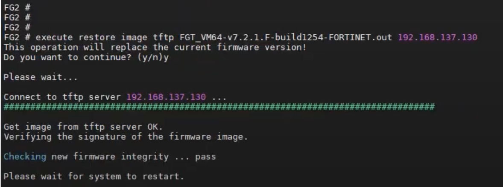

# 0x00 固件提取

以下代码、内容均来自https://bishopfox.com/blog/breaking-fortinet-firmware-encryption

### 固件解密逻辑

```python
def decrypt(ciphertext, key):
    ptr = 0
    num_bytes = len(ciphertext)
    cleartext = bytearray()

    while True:
        key_offset = 0
        block_offset = 0
        previous_ciphertext_byte = 0xFF  # IV is always 0xFF

        # Decrypt one 512-byte block at a time
        while block_offset != 0x200:
            offs = ptr + block_offset
            if offs >= num_bytes:
                return bytes(cleartext)

            # For each byte in the block, bitwise XOR the current byte with the
            # previous byte (both ciphertext) and the corresponding key byte
            ciphertext_byte = ciphertext[offs]
            xor = (
                previous_ciphertext_byte ^ ciphertext_byte ^ key[key_offset]
            ) - key_offset  # subtract the key offset to undo obfuscation
            xor = (xor + 256) & 0xFF  # mod 256 to loop negatives
            cleartext.append(xor)

            # Proceed to next byte
            block_offset += 1
            key_offset = (
                key_offset + 1  # increment key offset
            ) & 0x1F  # mod 32 to loop around the key
            previous_ciphertext_byte = ciphertext_byte

            if block_offset == 0x200:
                # Reached end of block
                break

            if ptr + block_offset > num_bytes:
                # Reached end of file
                return bytes(cleartext)

        # Proceed to next block
        ptr = ptr + 0x200
        if ptr >= num_bytes:
            # Reached end of file
            return bytes(cleartext)
```

### 固件加密逻辑

```python
def encrypt(cleartext, key):
    ptr = 0
    num_bytes = len(cleartext)
    ciphertext = bytearray()

    while True:
        block_offset = 0
        previous_ciphertext_byte = 0xFF
        key_offset = 0

        while block_offset != 0x200:
            offs = ptr + block_offset
            if offs >= num_bytes:
                return bytes(ciphertext)

            cleartext_byte = cleartext[offs] + key_offset
            xor = previous_ciphertext_byte ^ cleartext_byte ^ key[key_offset]
            xor = (xor + 256) & 0xFF
            ciphertext.append(xor)

            previous_ciphertext_byte = xor
            key_offset = (key_offset + 1) & 0x1F
            block_offset += 1

            if block_offset == 0x200:
                break

            if ptr + block_offset > num_bytes:
                return bytes(ciphertext)

        ptr = ptr + 0x200
        if ptr >= num_bytes:
            return bytes(ciphertext)
```

### 固件完整提取代码：

We returned to our earlier comparison of the file headers of two firmware images:

```
❯ file FGT_*

FGT_100D-v6-build9451-FORTINET:    data

FGT_30E-v6-build0076-FORTINET:     DOS/MBR boot sector; partition 1 : ID=0x83, active, start-CHS (0x7,230,32), end-CHS (0xa,50,40), startsector 126976, 36864 sectors; partition 2 : ID=0x83, start-CHS (0xa,50,41), end-CHS (0xc,125,49), startsector 163840, 36864 sectors; partition 3 : ID=0x83, start-CHS (0xc,125,50), end-CHS (0x10,81,1), startsector 200704, 61440 sectors

❯ xxd -l 80 FGT_100D-v6-build9451-FORTINET.out
00000000: 90d0 b0f1 bcda 8be8 85bb f79a f6bc 4c40  ..............L@
00000010: 7f6e 474e 3d2f 0001 2a10 3036 675c 4796  .nGN=/..*.06g\G.
00000020: 8ca7 ab8e f2af d78e ded2 a9f4 acd5 a3f7  ................
00000030: 8ed6 aef7 d48a f0ab deb4 c095 bae8 a6e9  ................
00000040: 86c6 a6e7 aacc 8eed 80be f29f f4be f89f  ................

❯ xxd -l 80 FGT_30E-v6-build0076-FORTINET
00000000: 0000 0000 0000 1100 0000 0000 ff00 aa55  ...............U
00000010: 4647 5433 3045 2d36 2e30 302d 4657 2d62  FGT30E-6.00-FW-b
00000020: 7569 6c64 3030 3736 2d31 3830 3332 392d  uild0076-180329-
00000030: 0000 0000 0000 0000 0000 0000 0000 0000  ................
00000040: 0000 0000 0000 0000 0000 0000 0000 0000  ................
```

As we anticipated, patterns were evident even within the first 80 bytes. The cleartext image began with a series of six null bytes, followed by a single byte value, five more null bytes, then four “magic bytes” that seemed to serve the purpose of a file signature. The next 32 bytes comprised part of the image name (with at least 30 printable characters) and were followed by 32 null bytes.

We compared the headers of several cleartext images and found this pattern to be remarkably consistent. We were able to confirm that the magic bytes were always present and immediately followed by the letters “FG” (if the product was FortiGate). The rest of the image name was not always formatted consistently, but always contained the word “build.” Null bytes from offsets 48 to 79 were consistent as well.

One important thing we noted, however, was that this “file header” did not always appear at the beginning of the file. Several firmware images had one or more blocks with other content (often just null bytes) preceding it, but this header always appeared at a 512-byte block boundary somewhere in the file.

Thus, our strategy became apparent:

- Read 32 bytes from the first 512-byte block of ciphertext, starting at offset 48.
- Encrypt each of these bytes with its corresponding known plaintext (in each case, a null byte) to produce a key.
- Use the key to decrypt the first 80 bytes of the block and validate that the content matches the standard file header:
-- 4 “magic bytes” at offset 12
-- 30 printable characters at offset 16
-- The word “build” somewhere in that 30-character string
- Repeat the above for each 512-byte block in the file until a valid key is found.
- Use the valid key to decrypt the entire firmware image.

代码：

```python
#!/usr/bin/env python3
#
# FortiCrack by Bishop Fox Team X
#
# Derive encryption keys from Fortinet firmware images
# using a known plaintext attack, then decrypt them

import sys
import os
import re
import subprocess
import multiprocessing
import functools

# Standard block size for Fortinet firmware images
BLOCK_SIZE = 512


# Load a firmware image into memory (decompressing if necessary)
def load_image_data(image_file):
    try:
        if not os.path.isfile(image_file):
            raise ValueError("file not found")

        # Use gunzip because the Python gzip library won't ignore file signature data
        result = subprocess.run(
            [
                f"gunzip",
                "--to-stdout",  # decompress to stdout and leave the file intact
                "--force",  # allow uncompressed data to pass through
                image_file,
            ],
            check=False,  # ignore trailing garbage warning
            capture_output=True,
        )
        if result.stdout:
            print("[+] Loaded image data")
            return result.stdout
        else:
            raise ValueError("empty file")

    except Exception as err:
        print(f"[-] Failed to load image data: {err}")
        return None


# Validate a derived key by checking against known key values
def validate_key(key):
    # Length must be 32 bytes
    if len(key) != 32:
        return False

    # Key must be an ASCII string
    try:
        string = key.decode("ascii")
    except:
        return False

    # Key bytes only include characters 0-9, A-Z, and a-z
    for char in string:
        valid = re.match(r"[0-9A-Za-z]", char)
        if not valid:
            return False

    # Valid key
    return True


# Derive one byte of the key from two consecutive bytes of ciphertext,
#   one byte of known plaintext, and the key offset
# This is the same XOR operation used in Fortinet's encryption function,
#   but the plaintext and key are swapped
def derive_key_byte(
    key_offset, ciphertext_byte, previous_ciphertext_byte, known_plaintext
):
    key_byte = (
        previous_ciphertext_byte ^ (known_plaintext + key_offset) ^ ciphertext_byte
    )
    key_byte = (key_byte + 256) & 0xFF  # mod 256 to loop negatives
    return key_byte


# Use a known plaintext attack to derive a key from the first 80 bytes of a 512-byte
#   ciphertext block, then decrypt the block header and validate the content
# Known plaintext is 32 null bytes starting from block offset 48
# Only return a key if the decrypted content is valid
def derive_block_key(ciphertext):
    key = bytearray()
    known_plaintext = 0x00

    # Derive the key for this block
    # You will note that we reversed the first and second halves of the key after recovery – this is because of the position of the known plaintext we chose. Offset 48 from the start of the ciphertext block corresponds to offset 16 from the start of the key, so we actually recover the last half of the key before the first half.
    for i in range(32):
        key_offset = (i + 16) % 32  # mod 32 to wrap around key
        plaintext_offset = i + 48
        ciphertext_byte = ciphertext[plaintext_offset]
        previous_ciphertext_byte = ciphertext[plaintext_offset - 1]
        key.append(
            derive_key_byte(
                key_offset, ciphertext_byte, previous_ciphertext_byte, known_plaintext
            )
        )
    key = key[16:] + key[:16]  # swap the first/second halves of the key

    # Validate the key
    if validate_key(key):
        # Decrypt the header and validate contents
        cleartext = decrypt(ciphertext, key)
        if validate_decryption(cleartext):
            print(f"[+] Found key: {key.decode('utf-8')}")
            print(f"[+] Validated: {cleartext[16:46].decode('utf-8')}")
            return bytes(key)

    # Key was invalid
    return None


# Use multiprocessing to attempt key derivation on all 512-byte blocks in parallel
def derive_key(ciphertext):
    # Determine the number of blocks to read
    num_blocks = (len(ciphertext) + BLOCK_SIZE - 1) // BLOCK_SIZE
    block_header_size = 80

    # Create a pool of worker processes
    with multiprocessing.Pool(processes=multiprocessing.cpu_count()) as pool:
        # Start the workers
        results = [
            pool.apply_async(
                derive_block_key,
                (  # Each worker attacks the 80-byte header of a 512-byte block
                   # As we discovered during our analysis, the “file header” did not always appear at the start of every file, so it was necessary to split the encrypted image into 512-byte blocks and attempt to derive a key from each block. Fortunately, the weak block cipher did not prevent us from processing the blocks in parallel.
                    ciphertext[
                        block_num * BLOCK_SIZE : block_num * BLOCK_SIZE
                        + block_header_size
                    ],
                ),
            )
            for block_num in range(num_blocks)
        ]
        # Look for a successful result
        for result in results:
            key = result.get()
            if key:
                # Kill the workers as soon as we find a valid key
                pool.terminate()
                pool.join()
                return key
    return None


# Validate decryption by checking for known header data
# NOTE: this header isn't always in the first 512-byte block
def validate_decryption(cleartext):
    if (
        # Length must be at least 80 chars
        len(cleartext) >= 80
        # Validate the file signature "magic bytes"
        and cleartext[12:16] == b"\xff\x00\xaa\x55"
    ):
        # Make sure the image name is readable
        try:
            image_name = cleartext[16:46].decode("utf-8", errors="strict")
        except:
            return False
        # Make sure the word "build" is in the image name
        if "build" in image_name.lower():
            # Valid Fortinet image
            return True
    # Unknown format
    return False


# Decrypt data
def decrypt(ciphertext, key, num_bytes=None):
    if num_bytes is None or num_bytes > len(ciphertext):
        num_bytes = len(ciphertext)
    if num_bytes > BLOCK_SIZE:
        num_bytes = BLOCK_SIZE

    key_offset = 0
    block_offset = 0
    cleartext = bytearray()
    previous_ciphertext_byte = 0xFF  # IV is always FF

    while block_offset < num_bytes:
        # If we're testing a partial key, return partial cleartext
        if key_offset >= len(key):
            return bytes(cleartext)

        # For each byte in the block, bitwise XOR the current byte with the
        # previous byte (both ciphertext) and the corresponding key byte
        ciphertext_byte = ciphertext[block_offset]
        xor = (
            previous_ciphertext_byte ^ ciphertext_byte ^ key[key_offset]
        ) - key_offset  # subtract the key offset to undo obfuscation
        xor = (xor + 256) & 0xFF  # mod 256 to loop negatives
        cleartext.append(xor)

        # Proceed to next byte
        block_offset += 1
        key_offset = (
            key_offset + 1  # increment key offset
        ) & 0x1F  # mod 32 to loop around the key
        previous_ciphertext_byte = ciphertext_byte

    # Reached end of block
    return bytes(cleartext)


# Use multiprocessing to decrypt all 512-byte blocks in parallel
def decrypt_file(ciphertext, key, output_file):
    # Determine the number of blocks to read
    num_blocks = (len(ciphertext) + BLOCK_SIZE - 1) // BLOCK_SIZE

    # Create a pool of worker processes
    with multiprocessing.Pool(processes=multiprocessing.cpu_count()) as pool:
        worker = functools.partial(decrypt, key=key)
        worker_map = pool.map_async(
            worker,
            [  # Each worker gets a 512-byte block of ciphertext to decrypt
                ciphertext[block_num * BLOCK_SIZE : block_num * BLOCK_SIZE + BLOCK_SIZE]
                for block_num in range(num_blocks)
            ],
        )
        worker_map.wait()
        results = worker_map.get()
    if not results:
        return False

    # Write the ordered results to the output file
    cleartext = b"".join(results)
    with open(output_file, "wb") as outfile:
        outfile.write(cleartext)
    return True


def main():
    # Parse input
    if len(sys.argv) < 2 or sys.argv[1] in ["-h", "--help"]:
        print("Usage: python3 forticrack.py <FILENAME>")
        sys.exit(0)
    encrypted_file = sys.argv[1]
    decrypted_file = f"{os.path.splitext(encrypted_file)[0]}.decrypted"

    # Print banner
    print(
        " ___  __   __  ___    __   __        __       \n|__  /  \ |__)  |  | /  ` |__)  /\  /  ` |__/ \n|    \__/ |  \  |  | \__, |  \ /~~\ \__, |  \ \n"
    )
    print(f"[+] Decrypting {encrypted_file}")

    # Decompress the input file
    ciphertext = load_image_data(encrypted_file)
    if not ciphertext:
        sys.exit(1)

    # Make sure it's encrypted
    for block_offset in range(0, len(ciphertext), BLOCK_SIZE):
        if validate_decryption(ciphertext[block_offset : block_offset + 80]):
            print("[!] Image is already cleartext")
            sys.exit(0)

    # Identify the key using a known plaintext attack
    key = derive_key(ciphertext)
    if key:
        # Decrypt the file
        if decrypt_file(ciphertext, key, decrypted_file):
            print(f"[+] Decrypted: {decrypted_file}")
        else:
            print("[-] Decryption failed")
            sys.exit(1)
    else:
        print("[-] No valid key found")
        sys.exit(1)


if __name__ == "__main__":
    main()
```

Some other interesting trends emerged at this stage. From the approximately 29k images we decrypted across 28 product lines, **there were only 25 unique encryption keys, indicating rampant key reuse**. Furthermore, we discovered that valid keys used only alphanumeric characters, so we added an additional key validation step (prior to decryption and content validation) to speed up the key recovery process.

In the end, we found that many of the keys were, in fact, hard coded within Fortinet firmware images, but we were unable to recognize them as keys before we put in the effort to determine their characteristics. Nevertheless, our work provided us with a reliable way to recover the keys whether or not they were hard coded.

### 提取固件文件

```
mkdir firmwarefs
sudo mount -o ro,loop,offset=512 FGT_100D-v6-build9451-FORTINET.decrypted firmwarefs
```

# 机制研究

通过 console 安装固件的输出：

```
Please connect TFTP server to Ethernet port "MGMT".

Initiating firmware TFTP Transfer...

MAC:         XX:XX:XX:XX:XX:XX
#########################################################
Total 60131371 bytes data downloaded.
Verifying the integrity of the firmware image.

Total 262144kB unzipped.
Save as Default firmware/Backup firmware/Run image without saving:[D/B/R]?D
Programming the boot device now.
................................................................................................................................................................................................................................................................
Reading boot image 2720359 bytes.
Initializing firewall...
System is starting...
Resizing shared data partition...done
Formatting shared data partition ... done!
Starting system maintenance...
Scanning /dev/sdb1... (100%)  
Scanning /dev/sdb3... (100%)   


FortiGate-100D login: 
```

通过cli更新固件的输出

```
FortiGate # execute restore secondary-image tftp Image.out 192.168.158.10
This operation will store the firmware to backup partition.
Do you want to continue? (y/n)y
Please wait...
Connect to tftp server 192.168.158.10 ...
####################################################################################################
Get image from tftp server OK.
Verifying the signature of the firmware image.
Warning: Upgrading to an image with Mature maturity notation.
Restore to backup partition.
FortiGate #
Firmware upgrade in progress ...
Mount point is not allowed: dev: /dev/sda1, path: /data_secondary, type: ext2, flags: 32782, proc: smit (3661)
Mount point is not allowed: dev: /dev/sda1, path: /data_secondary, type: reiserfs, flags: 14, proc: smit (3661)
Done.
```



### FGT 7.2.0

用/etc/subcacert2.pem 对firmware 进行完整性检查

firmware格式解析：

- 最后256字节为signature

用/etc/subcacert2.pem 对 firmware 进行签名（不包括最后的256字节），然后与最后的256字节进行对比，从而完成完整性检查


通过字符串：“.rodata:0000000002B72BAA	00000014	C	Check image error.\n”


可以找到对image格式检查的函数。

大致的C代码如下：

```c
#include <stdio.h>
#include <string.h>
#include <errno.h>
#include <unistd.h>
#include <stdint.h>
int main(void)
{
	char *file_name = "FGT_100D-v6-build1319-FORTINET.out";
	FILE *fp = fopen(file_name,"rb");
	char header_buf[256] = {0};
	char model[7] = {0};
	char major_version_number[2] = {0};
	char minor_version_number[3] = {0};
	char *build_str_pointer = NULL;
	char build_version[6] = {0};
	char *tmp_ptr = NULL;
	char patch_version[3] = {0};

	if(fp == NULL){
		printf("fopen %s error ( %s )\n",file_name,strerror(errno));
		return -1;
	}
	
	if(fread(header_buf,1,0x100,fp)!=0x100)
	{
		printf("fread header error (%s)\n",strerror(errno));
		return -1;
	}
	
	strncpy(model,header_buf+10,6);
	printf("model:%s\n",model);
	
	strncpy(major_version_number,header_buf+0x11,1);
	printf("major version number: %s\n",major_version_number);
	
	strncpy(minor_version_number,header_buf+0x13,2);
	printf("minor version number: %s\n",minor_version_number);
	
	build_str_pointer = strstr(header_buf+10,"build");
	if(build_str_pointer == NULL){
		printf("not found build str\n");
		return -1;
	}
	
	tmp_ptr = strchr(build_str_pointer,'-');
	if(tmp_ptr == NULL){
		printf("not found '-' str\n");
		return -1;
	}
	
	int len = tmp_ptr - (build_str_pointer+5);
	
	strncpy(build_version,build_str_pointer+5,len);
	printf("build version: %s\n",build_version);

	tmp_ptr = strstr(header_buf+10,"patch");
	strncpy(patch_version,tmp_ptr+5,2);
	printf("patch version: %s\n",patch_version);

	return 0;
}
```

output:

```
model:FG100D
major version number: 6
minor version number: 02
build version: 1319
patch version: 12
```


# 资料

Breaking Fortinet Firmware Encryption

https://bishopfox.com/blog/breaking-fortinet-firmware-encryption

Enhance BIOS-level signature and file integrity checking

https://docs.fortinet.com/document/fortigate/7.4.0/new-features/249947/enhance-bios-level-signature-and-file-integrity-checking

forticrack

https://github.com/BishopFox/forticrack

FortiOS image signing and verification

https://docs.fortinet.com/document/fortigate/6.4.0/new-features/530511/fortios-image-signing-and-verification

Upgrading the firmware

https://docs.fortinet.com/document/fortigate/6.2.16/cookbook/596131/upgrading-the-firmware

Technical Tip: How to upload FortiOS image to the Non-Active partition

https://community.fortinet.com/t5/FortiGate/Technical-Tip-How-to-upload-FortiOS-image-to-the-Non-Active/ta-p/347586

Troubleshooting Tip: Unable to boot the firewall or load firmware image

https://community.fortinet.com/t5/FortiGate/Troubleshooting-Tip-Unable-to-boot-the-firewall-or-load-firmware/ta-p/267570