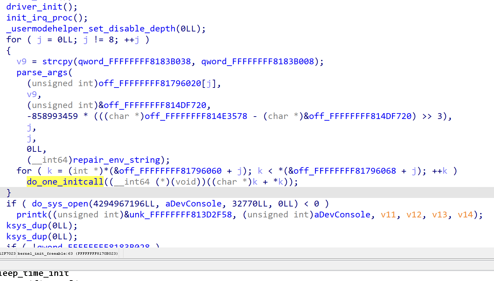
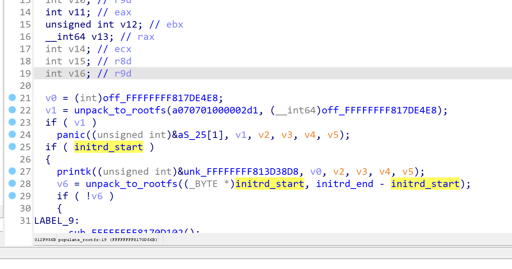
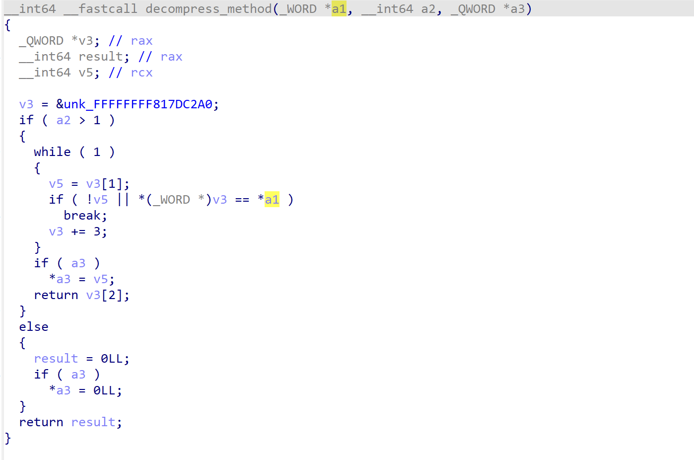

# 虚拟机下载

地址：https://support.fortinet.com/Download/VMImages.aspx

Select Platform 我们选择 KVM

解压FGT_VM:

```sh
unzip FGT_VM64_KVM-v7.6.0.F-build3401-FORTINET.out.kvm.zip
```

创建log 磁盘：

```sh
qemu-img create -f qcow2 data.qcow2 30G
```

生成uuid：

```
sysirq@sysirq-machine:~/Work/Fortinet/FortiGate$ cat /proc/sys/kernel/random/uuid
e2d8d9d7-a25d-44be-93b5-97ffb52a51b0
```

虚拟机启动命令：

```bash
#/bin/bash

qemu-system-x86_64              -machine pc-i440fx-2.8 \
                                --accel kvm \
                                -m 2G \
                                -netdev tap,id=nc0,ifname=tap4fun,script=no,downscript=no \
                                -device virtio-net,netdev=nc0,mac=E0:35:0E:EE:A0:C0 \
                                -blockdev driver=file,node-name=hdafile,filename=fortios.qcow2 \
                                -blockdev driver=qcow2,file=hdafile,node-name=hda   \
                                -device virtio-blk,drive=hda  \
                                -blockdev driver=file,node-name=hdbfile,filename=data.qcow2 \
                                -blockdev driver=qcow2,file=hdbfile,node-name=hdb   \
                                -device virtio-blk,drive=hdb  \
                                -uuid e2d8d9d7-a25d-44be-93b5-97ffb52a51b0 \
                                -vnc 10.4.21.2:0

```

**Select Network to configure or add more network interfaces. The Device type must be Virtio.**

默认用户名：admin ， 密码为空

首次登录会要求你设置登录密码（方便期间，我设置为1234）

# 帮组信息获取

输入? , 可以获取命令提示。

输入特定命令后，在输入？，获取特定命令的帮助，eg: execute ?

# 网络配置

获取网卡信息：

```
get hardware nic port1
```

CLI 配置网络：

### 配置静态IP地址

```
config system interface
edit port1
set mode static
set ip 192.168.182.188 255.255.255.0
set allowaccess ping http https ssh
end
```

查看interfaces:

```
show system interface port1
```

### 配置默认路由

```
config router static
edit 1
set gateway 192.168.182.1
set device port1
end
```

查看路由配置：

```
show router static
```

### 配置DNS服务器

```
config system dns
set primary 8.8.8.8
set secondary 8.8.4.4
end
```

查看DNS配置

```
show system dns
```

之后，可以通过：192.168.182.188 访问Web管理页面，也可以通过ssh对其进行管理。

# 虚拟机永久试用许可证

版本：7.6.0

新部署的FortiGate-VM不再具有有效的评估许可证，即使该实例只有1个CPU和2 GB内存。执行命令get sys stat，输出结果如下:

```
Version: FortiGate-VM64-KVM v7.6.0,build3401,240724 (GA.F)
...
Serial-Number: FGVMEVNXFLTGKOBC
License Status: Invalid
VM Resources: 1 CPU/1 allowed, 2007 MB RAM/2048 MB allowed
```

从FortiCare获取虚拟机永久试用license:

```
execute vm-license-options account-id xxxx@fortinet.com
execute vm-license-options account-password xxxxxxx
execute vm-license
This VM is using the evaluation license. This license does not expire.
Limitations of the Evaluation VM license include:
  1.Support for low encryption operation only
  2.Maximum of 1 CPU and 2GiB of memory
  3.Maximum of three interfaces, firewall policies, and routes each
  4.No FortiCare Support
This operation will reboot the system !
Do you want to continue? (y/n)y

Connection to 192.168.182.188 closed.
```

激活后，可以通过https://support.fortinet.com/asset/#/dashboard 进行管理

# 命令行

- 输入**tree**显示整个FortiOS CLI命令树
- tree execute
- 可以使用grep提取特定信息，eg 提取网卡驱动：get hardware nic port1 | grep Driver 


### 排错命令

- diagnose hardware sysinfo vm full : 显示激活状态以及UUID
- get sys stat :   显示整体状态
  


# VM 通过 FortiGate VM上网

网络配置：

```sh
ip link add br4fgt type bridge
ip tuntap add dev tap4fgt_in mode tap
ip tuntap add dev tap4fgt_out mode tap
ip link set tap4fgt_in master br4fgt
ip link set tap4fgt_out master br4fgt
ip link set br4fgt up
ip link set tap4fgt_in up
ip link set tap4fgt_out up
```

VM启动脚本：

```sh
#/bin/bash

nohup qemu-system-x86_64 --accel kvm \
                    -m 8G \
                    -smp 4 \
                    -blockdev driver=file,filename=hd.qcow2,node-name=myfile \
                    -blockdev driver=qcow2,file=myfile,node-name=hd \
                    -device virtio-blk,drive=hd \
                    -netdev tap,id=nc0,ifname=tap4fgt_out,script=no,downscript=no \
                    -device virtio-net,netdev=nc0,mac=40:35:2E:EE:A0:C0 \
                    -device virtio-vga \
                    -device virtio-mouse \
                    -device virtio-keyboard \
                    -usbdevice  tablet \
                    -vnc 10.4.21.2:4 > qemu.log 2>&1 &
```

FortiGate VM 启动命令:

```sh
#/bin/bash

nohup qemu-system-x86_64 		-machine pc-i440fx-2.8 \
				--accel kvm \
				-m 2G \
				-netdev tap,id=nc0,ifname=tap4fun,script=no,downscript=no \
				-device virtio-net,netdev=nc0,mac=E0:35:0E:EE:A0:C0 \
				-netdev tap,id=nc1,ifname=tap4fgt_in,script=no,downscript=no \
				-device virtio-net,netdev=nc1,mac=E0:32:0E:EE:A0:C0 \
				-blockdev driver=file,node-name=hdafile,filename=fortios.qcow2 \
				-blockdev driver=qcow2,file=hdafile,node-name=hda   \
				-device virtio-blk,drive=hda  \
				-blockdev driver=file,node-name=hdbfile,filename=data.qcow2 \
				-blockdev driver=qcow2,file=hdbfile,node-name=hdb   \
				-device virtio-blk,drive=hdb  \
				-uuid e2d8d9d7-a25d-44be-93b5-97ffb52a51b0 \
				-vnc 10.4.21.2:0 > qemu.log 2>&1 &
```


FortiGate 配置，参考资料中的：虚拟 PC 通过 FortiGate VM 上网


# 挂载QCOW2文件

FGT KVM版本：7.6.0

```
sudo modprobe nbd max_part=8
sudo qemu-nbd --connect=/dev/nbd0 path_to_your.qcow2
sudo fdisk -l /dev/nbd0
sudo mount -o ro /dev/nbd0p1 /mnt/

sudo umount /mnt
sudo qemu-nbd --disconnect /dev/nbd0
```

# 内核解压

下载 vmlinux-to-elf ( https://github.com/marin-m/vmlinux-to-elf )，

```
sysirq@sysirq-machine:~/Work/Fortinet/Tmp/data$ file flatkc
flatkc: Linux kernel x86 boot executable bzImage, version 4.19.13 (root@build) #1 SMP Wed Jul 24 17:24:03 UTC 2024, RO-rootFS, swap_dev 0X7, Normal VGA
```

```
vmlinux-to-elf flatkc flatkc.elf
```

# rootfs解压

查看extlinux.conf

```
sysirq@sysirq-machine:~/Work/Fortinet/Tmp/data$ cat extlinux.conf
DISPLAY boot.msg
TIMEOUT 10
TOTALTIMEOUT 9000
DEFAULT flatkc ro panic=5 endbase=0xA0000 console=ttyS0, root=/dev/ram0 ramdisk_size=65536 initrd=/rootfs.gz
```

可以看到rootfs.gz作为initrd临时根文件系统。在内核中的对其进行处理的函数为：/init/initramfs.c:populate_rootfs函数

populate_rootfs 函数是 Linux 内核启动过程中的一个关键函数，用于设置和填充初始的根文件系统。它主要负责处理 initramfs 和 initrd，并确保它们被正确地挂载和初始化。

```c
rootfs_initcall(populate_rootfs);

#define rootfs_initcall(fn)		__define_initcall(fn, rootfs)

#define __define_initcall(fn, id) \
	static initcall_t __initcall_##fn##id __used \
	__attribute__((__section__(".initcall" #id ".init"))) = fn;
```

/include/asm-generic/vmlinux.lds.h：

```c
#define INIT_CALLS							\
		VMLINUX_SYMBOL(__initcall_start) = .;			\
		KEEP(*(.initcallearly.init))				\
		INIT_CALLS_LEVEL(0)					\
		INIT_CALLS_LEVEL(1)					\
		INIT_CALLS_LEVEL(2)					\
		INIT_CALLS_LEVEL(3)					\
		INIT_CALLS_LEVEL(4)					\
		INIT_CALLS_LEVEL(5)					\
		INIT_CALLS_LEVEL(rootfs)				\
		INIT_CALLS_LEVEL(6)					\
		INIT_CALLS_LEVEL(7)					\
		VMLINUX_SYMBOL(__initcall_end) = .;
```

populate_rootfs的调用流程为: start_kernel --> rest_init--> kernel_init --> kernel_init_freeable --> do_basic_setup --> do_initcalls  --> populate_rootfs

通过逆向分析，发现调用do_initcalls的地方：



通过IDC脚本：

```c
static main(){
    auto j;
    auto k;
    auto initcall_start = 0xFFFFFFFF81796060;
    auto initcall_end   = 0xFFFFFFFF81796068;
    auto initcall_addr;
    auto offset32;
    auto offset64;
    
    for(j = 0;j!=8;j++){
        for(k=qword(initcall_start+j*8);k<qword(initcall_end+j*8);k=k+4){
            offset32 = dword(k);
            if(offset32 & 0x80000000){
                offset64 = offset32 | 0xFFFFFFFF00000000;
            }else{
                offset64 = offset32 & 0xFFFFFFFF;
            }
            initcall_addr = k + offset64;
            msg("initcall_addr:%lx func_name:%s\n",initcall_addr,get_func_name(initcall_addr));
        }
    }
    
    msg("miaomiaomiao\n");
}
```

以及populate_rootfs函数引用的字符串

```
.rodata:FFFFFFFF813D38D9	00000030	C	6Trying to unpack rootfs image as initramfs...\n
```

我们可以定位populate_rootfs的函数为：

```
initcall_addr:ffffffff8170c2b0 func_name:sub_FFFFFFFF8170C2B0（通过后面的分析，我们发现这玩意会对initrd做解密操作，然后才给populate_rootfs（比populate_rootfs先执行））
initcall_addr:ffffffff8170d56b func_name:sub_FFFFFFFF8170D56B(这个是真正的populate_rootfs)
```

发现，fortigate将此函数的符号去掉了的。。。。。

我们也可以自己编译一个这个版本的内核，通过IDC脚本对比，找到被去掉符号的populate_rootfs函数。

通过对比源代码以及，我们可以恢复一些符号：



initrd  decompress_method 获取：populate_rootfs --> unpack_to_rootfs --> decompress_method((char*)initrd_start,initrd_end - initrd_start,&compress_name)



```c
/lib/decompress.c

struct compress_format {
	unsigned char magic[2];
	const char *name;
	decompress_fn decompressor;
};

static const struct compress_format compressed_formats[] __initconst = {
	{ {0x1f, 0x8b}, "gzip", gunzip },
	{ {0x1f, 0x9e}, "gzip", gunzip },
	{ {0x42, 0x5a}, "bzip2", bunzip2 },
	{ {0x5d, 0x00}, "lzma", unlzma },
	{ {0xfd, 0x37}, "xz", unxz },
	{ {0x89, 0x4c}, "lzo", unlzo },
	{ {0x02, 0x21}, "lz4", unlz4 },
	{ {0, 0}, NULL, NULL }
};

decompress_fn __init decompress_method(const unsigned char *inbuf, long len,
				const char **name)
{
	const struct compress_format *cf;

	if (len < 2) {
		if (name)
			*name = NULL;
		return NULL;	/* Need at least this much... */
	}

	pr_debug("Compressed data magic: %#.2x %#.2x\n", inbuf[0], inbuf[1]);

	for (cf = compressed_formats; cf->name; cf++) {
		if (!memcmp(inbuf, cf->magic, 2))
			break;

	}
	if (name)
		*name = cf->name;
	return cf->decompressor;
}
```

通过分析，发现是对比initrd的前两个字节来定位decompress method。

通过IDC脚本，解析该结构：

```c
static main(){
    auto compressed_formats_addr = 0xFFFFFFFF817DC2A0;
    auto magic;
    auto name;
    auto decompressor;
    auto i;
    auto ch;
    while(1){
        magic = compressed_formats_addr;
        name = qword(compressed_formats_addr+8);
        decompressor = qword(compressed_formats_addr+16);
        if(name == 0) break;
        
        msg("magic:0x%.2x 0x%.2x\n",byte(magic),byte(magic+1));
        
        msg("name:");
        i = 0;
        ch = byte(name+i);
        while(ch != 0){
            msg("%c",ch);
            i = i+1;
            ch = byte(name+i);
        }
        msg("\n");
        
        msg("func addr: 0x%lx , func name:%s\n",decompressor,get_func_name(decompressor));

        compressed_formats_addr = compressed_formats_addr + 3*8;
    }
    msg("miaomiaomiao\n");
}
```

output:

```
magic:0x1f 0x8b
name:gzip
func addr: 0xffffffff817528bc , func name:gunzip
magic:0x1f 0x9e
name:gzip
func addr: 0xffffffff817528bc , func name:gunzip
magic:0x42 0x5a
name:bzip2
func addr: 0x0 , func name:
magic:0x5d 0x00
name:lzma
func addr: 0x0 , func name:
magic:0xfd 0x37
name:xz
func addr: 0x0 , func name:
magic:0x89 0x4c
name:lzo
func addr: 0x0 , func name:
magic:0x02 0x21
name:lz4
func addr: 0x0 , func name:
miaomiaomiao
```

查看rootfs.gz的开头两个字节:

```
sysirq@sysirq-machine:~/Work/Fortinet/Tmp/data$ hexdump -n 2 rootfs.gz
0000000 cb36                                   
0000002
```

发现不对劲，fortigate应该先对rootfs.gz做了解密然后再丢给populate_rootfs函数处理。并不是直接在populate_rootfs函数中完成骚操作。

对initrd_start做交叉引用：发现了sub_FFFFFFFF8170C2B0函数。通过那个提取initcall的idc脚本，我们发现他先于populate_rootfs执行，猜测是这里对initrd进行了一遍处理，我们将该函数命名为fgt_decompress。

```c
__int64 fgt_decompress()
{
  int v0; // ebx
  unsigned int v1; // r12d
  __int64 *v2; // rdi
  __int64 i; // rcx
  __int64 v4; // rcx
  __int64 *v5; // rdi
  __int64 v6; // r14
  __int64 *v7; // rdi
  __int64 v8; // rcx
  char *v9; // rsi
  __int64 v10; // r15
  __int64 v11; // rbx
  __int64 v12; // rax
  __int64 v13; // r14
  __int64 v14; // rax
  __int64 v15; // r9
  int buffer; // eax
  int v17; // r12d
  int v18; // eax
  _BYTE *v19; // rcx
  _DWORD *v20; // rsi
  __int64 v21; // rcx
  char *v22; // rdi
  __int64 v23; // rdx
  __int64 j; // rax
  __int64 v25; // r14
  unsigned int v26; // ebx
  char *v27; // rdx
  unsigned __int8 v28; // al
  unsigned int v29; // r15d
  __int64 v30; // rcx
  __int64 v31; // rax
  __int64 v32; // rax
  __int64 v34; // [rsp+8h] [rbp-3B0h]
  __int64 v35; // [rsp+8h] [rbp-3B0h]
  __int64 v36; // [rsp+10h] [rbp-3A8h]
  int v37; // [rsp+10h] [rbp-3A8h]
  __int64 v38; // [rsp+18h] [rbp-3A0h] BYREF
  __int64 raw_data; // [rsp+20h] [rbp-398h]
  __int64 v40; // [rsp+28h] [rbp-390h]
  __int64 v41; // [rsp+30h] [rbp-388h]
  __int64 v42; // [rsp+38h] [rbp-380h]
  __int64 v43[16]; // [rsp+40h] [rbp-378h] BYREF
  __int64 v44; // [rsp+C0h] [rbp-2F8h] BYREF
  __int64 v45; // [rsp+C8h] [rbp-2F0h]
  char v46[104]; // [rsp+E8h] [rbp-2D0h] BYREF
  char v47[488]; // [rsp+150h] [rbp-268h] BYREF
  __int64 v48; // [rsp+338h] [rbp-80h] BYREF
  __int64 v49; // [rsp+340h] [rbp-78h]
  char v50[32]; // [rsp+348h] [rbp-70h] BYREF
  char v51[32]; // [rsp+368h] [rbp-50h] BYREF
  unsigned __int64 v52; // [rsp+388h] [rbp-30h]

  v52 = __readgsqword(0x28u);
  v0 = initrd_end - initrd_start;
  v1 = -1;
  if ( (unsigned __int64)(initrd_end - initrd_start) <= 0x100 )
    goto LABEL_35;
  v2 = v43;
  for ( i = 32LL; i; --i )
  {
    *(_DWORD *)v2 = 0;
    v2 = (__int64 *)((char *)v2 + 4);
  }
  v4 = 10LL;
  v5 = &v38;
  while ( v4 )
  {
    *(_DWORD *)v5 = 0;
    v5 = (__int64 *)((char *)v5 + 4);
    --v4;
  }
  v6 = kmem_cache_alloc(qword_FFFFFFFF814A07A8, 0x6000C0LL);
  if ( !v6 )
    goto LABEL_35;
  sha256_init(v47);
  sha256_update_0(v47, &unk_FFFFFFFF817972C6, 26LL);
  sha256_update_0(v47, &unk_FFFFFFFF817972C0, 6LL);
  sha256_final_0(v47, v50);
  sha256_init(v47);
  sha256_update_0(v47, &unk_FFFFFFFF817972C3, 29LL);
  sha256_update_0(v47, &unk_FFFFFFFF817972C0, 3LL);
  sha256_final_0(v47, v51);
  v7 = &v44;
  v8 = 8LL;
  v9 = v50;
  while ( v8 )
  {
    *(_DWORD *)v7 = *(_DWORD *)v9;
    v9 += 4;
    v7 = (__int64 *)((char *)v7 + 4);
    --v8;
  }
  crypto_chacha20_init(v46, &v44, v51);
  chacha20_docrypt(v46, v6, &unk_FFFFFFFF817971A0, 270LL);
  if ( (unsigned int)rsa_parse_pub_key(v43, v6, 270LL)
    || (raw_data = mpi_read_raw_data(v43[1], v43[9])) == 0
    || (v38 = mpi_read_raw_data(v43[0], v43[8])) == 0
    || (v40 = kmem_cache_alloc(qword_FFFFFFFF814A07C0, 6291648LL)) == 0
    || (v42 = kmem_cache_alloc(qword_FFFFFFFF814A0788, 6291648LL)) == 0 )
  {
    kfree(v6);
    mpi_free(raw_data);
    mpi_free(v38);
    kfree(v40);
    kfree(v42);
    v1 = -1;
LABEL_35:
    machine_halt();
    goto LABEL_36;
  }
  kfree(v6);
  sha256_init(v46);
  sha256_update_0(v46, initrd_start, (unsigned int)(v0 - 256));
  sha256_final_0(v46, v42);
  v10 = initrd_end;
  v11 = initrd_end - 256;
  v41 = initrd_end - 256;
  v36 = v42;
  v12 = mpi_read_raw_data(initrd_end - 256, 256LL);
  v13 = v12;
  v1 = -12;
  if ( v12 )
  {
    if ( (int)mpi_cmp_ui(v12, 0LL) < 0 || (int)mpi_cmp(v13, v38) >= 0 )
    {
      v1 = -22;
    }
    else
    {
      v14 = mpi_alloc(0LL);
      v1 = -12;
      if ( v14 )
      {
        v34 = v14;
        v1 = mpi_powm(v14, v13, raw_data, v38);
        v15 = v34;
        if ( !v1 )
        {
          buffer = mpi_read_buffer(v34, v41, 256LL, v43, 0LL);
          v17 = v43[0];
          LOBYTE(v17) = ~LOBYTE(v43[0]);
          v18 = *(_BYTE *)(v10 - 256) ^ 1 | v17 | buffer;
          v19 = (_BYTE *)(v10 - 255);
          v15 = v34;
          do
            v18 |= (unsigned __int8)~*v19++;
          while ( (_BYTE *)(v10 - 82) != v19 );
          v1 = v18 | *(unsigned __int8 *)(v11 + 174);
          v20 = (_DWORD *)(v11 + 223);
          v21 = 8LL;
          v22 = v51;
          while ( v21 )
          {
            *(_DWORD *)v22 = *v20++;
            v22 += 4;
            --v21;
          }
          v23 = *(_QWORD *)(v11 + 215);
          v48 = *(_QWORD *)(v11 + 207);
          v49 = v23;
          for ( j = 0LL; j != 32; ++j )
            v1 |= (unsigned __int8)(*(_BYTE *)(v36 + j) ^ *(_BYTE *)(v10 + j - 81));
        }
        mpi_free(v15);
      }
    }
    mpi_free(v13);
  }
  mpi_free(raw_data);
  mpi_free(v38);
  kfree(v40);
  kfree(v42);
  if ( v1 )
    goto LABEL_35;
LABEL_36:
  initrd_end -= 256LL;
  v25 = initrd_start;
  v26 = initrd_end - initrd_start;
  v37 = ((_BYTE)initrd_end - (_BYTE)initrd_start) & 0xF;
  crypto_aes_expand_key(v47, v51, 32LL);
  v27 = (char *)&v48;
  v28 = 0;
  do
  {
    v28 ^= *v27 & 0xF ^ ((unsigned __int8)*v27 >> 4);
    ++v27;
  }
  while ( v50 != v27 );
  if ( !v28 )
    v28 = 1;
  v44 = v48;
  v45 = v49;
  v29 = 0;
  v30 = v28;
  do
  {
    v35 = v30;
    crypto_aes_encrypt_x86(v47, v50, &v44);
    v31 = 0LL;
    v30 = v35;
    do
    {
      *(_BYTE *)(v25 + v29 + (unsigned int)v31) ^= v50[v31];
      ++v31;
    }
    while ( v31 != 16 );
    v45 += v35;
    v29 += 16;
  }
  while ( v26 >= v29 );
  if ( v37 )
  {
    crypto_aes_encrypt_x86(v47, v50, &v44);
    v32 = 0LL;
    do
    {
      *(_BYTE *)(v25 + v29 + (unsigned int)v32) ^= v50[v32];
      ++v32;
    }
    while ( v37 != (_DWORD)v32 );
  }
  return v1;
}
```

一些内核函数原型：

```c
extern int sha256_init(struct sha256_state *sctx);
extern int sha256_update(struct sha256_state *sctx, const u8 *input,unsigned int length);
extern int sha256_final(struct sha256_state *sctx, u8 *hash);
void crypto_chacha20_init(u32 *state, struct chacha20_ctx *ctx, u8 *iv);
static void chacha20_docrypt(u32 *state, u8 *dst, const u8 *src,unsigned int bytes);
int rsa_parse_pub_key(struct rsa_key *rsa_key, const void *key,unsigned int key_len);
void crypto_aes_encrypt_x86(struct crypto_aes_ctx *ctx, u8 *dst,const u8 *src);
int crypto_aes_expand_key(struct crypto_aes_ctx *ctx, const u8 *in_key,unsigned int key_len);
```

通过分析fgt_decompress函数，我们可以通过 IDA Python脚本 获取公钥信息:

```python
import hashlib
import os
import idc
import idaapi
import idautils
from Crypto.Cipher import ChaCha20
from Crypto.PublicKey import RSA
from Crypto.Util.asn1 import DerSequence

# 读取BER编码的RSA公钥
def read_rsa_public_key(public_key_der):        
    # 解析DER编码的公钥
    public_key = RSA.import_key(public_key_der)
    
    # 打印公钥信息
    print("Public Key:")
    print(public_key.export_key().decode())

#获取key
"""
  sha256_init(v47);
  sha256_update_0(v47, &unk_FFFFFFFF817972C6, 26LL);
  sha256_update_0(v47, &unk_FFFFFFFF817972C0, 6LL);
  sha256_final_0(v47, v50);
"""
data1 = idaapi.get_bytes(0xFFFFFFFF817972C6, 26)
data2 = idaapi.get_bytes(0xFFFFFFFF817972C0, 6)
data = data1+data2
key = hashlib.sha256(data).digest()
print("key:",key.hex())

#获取iv
"""
  sha256_update_0(v47, &unk_FFFFFFFF817972C3, 29LL);
  sha256_update_0(v47, &unk_FFFFFFFF817972C0, 3LL);
  sha256_final_0(v47, v51);
"""
data1 = idaapi.get_bytes(0xFFFFFFFF817972C3, 29)
data2 = idaapi.get_bytes(0xFFFFFFFF817972C0, 3)
data = data1+data2
iv = hashlib.sha256(data).digest()[:16]

print("iv :",iv.hex())

#解密公钥
"""
  crypto_chacha20_init(v46, &v44, v51);
  chacha20_docrypt(v46, v6, &unk_FFFFFFFF817971A0, 270LL);
"""
chacha=ChaCha20.new(key=key, nonce=iv[4:])
counter=int.from_bytes(iv[:4],'little')
chacha.seek(counter*64)

rsa_pub_key_ber = idaapi.get_bytes(0xFFFFFFFF817971A0, 270)
rsa_pub_key_ber = chacha.decrypt(rsa_pub_key_ber)

print(rsa_pub_key_ber.hex())
read_rsa_public_key(rsa_pub_key_ber)
```

Output:

```
key: 9e54c0ef7f7cd1f19fffa880a38c71f28d9c805c753dbcab9dd18dd1dda91077
iv : ef8c8f0c2a81343b9118e50ea6430520
3082010a0282010100b7307a76d36d3105cce385ca1feb8ff7d4e02cfb1eefa09b1ba21dfed14c65376d875a34cde3f3e138019fa116f4fc0f11a0ace51e6ef5882f02fd04bb7909d02af690108d2d9bfdaafd1a1f704d800ff31775e369d03b73dc0d56c557e5ffc559b5c20bc3250db434c0b62ea4bdb069c2ee5be0d4d0d19a58567c0473873e8110a2afad50aac224867482f4a1b06bca1b2fbc335b065879a3456f0638b3e5ac1371582fbf2a4e557f0d3801581cbc4dd052fb6fa142b908728572a2ad365724fe1f4100042c6b33d47c03996376c4658c4b3a59494b62cca4ae3ae988f6bbc3b3dc1e3ec6aae8f5f069b2ba6c194948c82e8c3ab462c84275337f403d7d03730203010001
Public Key:
-----BEGIN PUBLIC KEY-----
MIIBIjANBgkqhkiG9w0BAQEFAAOCAQ8AMIIBCgKCAQEAtzB6dtNtMQXM44XKH+uP
99TgLPse76CbG6Id/tFMZTdth1o0zePz4TgBn6EW9PwPEaCs5R5u9YgvAv0Eu3kJ
0Cr2kBCNLZv9qv0aH3BNgA/zF3XjadA7c9wNVsVX5f/FWbXCC8MlDbQ0wLYupL2w
acLuW+DU0NGaWFZ8BHOHPoEQoq+tUKrCJIZ0gvShsGvKGy+8M1sGWHmjRW8GOLPl
rBNxWC+/Kk5Vfw04AVgcvE3QUvtvoUK5CHKFcqKtNlck/h9BAAQsazPUfAOZY3bE
ZYxLOllJS2LMpK466Yj2u8Oz3B4+xqro9fBpsrpsGUlIyC6MOrRiyEJ1M39APX0D
cwIDAQAB
-----END PUBLIC KEY-----
```

继续分析fgt_decompress函数，我们可以发现其会对initrd的sha256做校验。

首先计算 initrd_start 到 initrd_end - 256 的 sha256，然后用公钥匙对initrd的最后256字节解密，得到实际的sha256，在对比，判断是否相等。

用公钥对最后initrd最后的256字节解密后，会得到256字节的解密数据，其中：

- [175:172+32] 是 实际的sha256值

- [223:] 是 aes key

- [207:207 + 16] 是用于解密initrd的数据

initrd的解密代码为：

```python
#!/usr/bin/python3
import hashlib
import os
import rsa
import sys
import binascii
import hashlib
import struct
from rsa import transform, core
from Crypto.Cipher import AES
from Crypto import Random
from Crypto.Util.Padding import pad, unpad

pem_public_key ="""-----BEGIN PUBLIC KEY-----
MIIBIjANBgkqhkiG9w0BAQEFAAOCAQ8AMIIBCgKCAQEAtzB6dtNtMQXM44XKH+uP
99TgLPse76CbG6Id/tFMZTdth1o0zePz4TgBn6EW9PwPEaCs5R5u9YgvAv0Eu3kJ
0Cr2kBCNLZv9qv0aH3BNgA/zF3XjadA7c9wNVsVX5f/FWbXCC8MlDbQ0wLYupL2w
acLuW+DU0NGaWFZ8BHOHPoEQoq+tUKrCJIZ0gvShsGvKGy+8M1sGWHmjRW8GOLPl
rBNxWC+/Kk5Vfw04AVgcvE3QUvtvoUK5CHKFcqKtNlck/h9BAAQsazPUfAOZY3bE
ZYxLOllJS2LMpK466Yj2u8Oz3B4+xqro9fBpsrpsGUlIyC6MOrRiyEJ1M39APX0D
cwIDAQAB
-----END PUBLIC KEY-----"""

def aes_ecb_encrypt(enc,key):
    cipher = AES.new( key, AES.MODE_ECB)
    encrypted_text = cipher.encrypt(enc)
    return encrypted_text
def rsa_decrypt(encrypt_text):
    key = rsa.PublicKey.load_pkcs1_openssl_pem(pem_public_key)

    d = key.e
    n = key.n
    encrypt_text = binascii.a2b_hex(encrypt_text)
    num = transform.bytes2int(encrypt_text)
    decrypto = core.decrypt_int(num, d, n)
    out = transform.int2bytes(decrypto)
    return out

initrd_name="rootfs.gz"
output_initrd_name="rootfs.gz.out"

file_size = os.path.getsize(initrd_name)
file_content = open(initrd_name,'rb').read(file_size - 256)

print("file total size:",file_size)
print("start offset:",0)
print("end   offset:",file_size - 256)

#sha256 of initrd_start ----- initrd_end - 256
sha256 = hashlib.sha256()
sha256.update(file_content)
checksum = sha256.digest()
print("calc sha256:",checksum.hex())

#real sha256 from RSA pub key decrypt
file = open(initrd_name,'rb')
file.seek(-256,2)
file_content = file.read(256)
rsa_decrypt_out = rsa_decrypt(file_content.hex())
print("real sha256:",rsa_decrypt_out[175:175+32].hex())

#aes key and data
aes_key = rsa_decrypt_out[223:]
aes_data=rsa_decrypt_out[207:207+16]

print("ase key len:",len(aes_key))
print("aes key:",aes_key.hex())
print("ase data len:",len(aes_data))
print("ase data:",aes_data.hex())

#use aes data calc addend
"""
  v28 = 0;
  do
  {
    v28 ^= *v27 & 0xF ^ ((unsigned __int8)*v27 >> 4);
    ++v27;
  }
  while ( v50 != v27 );
  if ( !v28 )
    v28 = 1;
"""
addend = 0
for b in aes_data:
    addend ^= (b&0xF)^(b>>4)
if addend == 0:
    addend = 1

print("addend: ",addend)

# decrypt initrd
"""
  do
  {
    v35 = v30;
    crypto_aes_encrypt_x86(v47, v50, &v44);
    v31 = 0LL;
    v30 = v35;
    do
    {
      *(_BYTE *)(v25 + v29 + (unsigned int)v31) ^= v50[v31];
      ++v31;
    }
    while ( v31 != 16 );
    v45 += v35;
    v29 += 16;
  }
  while ( v26 >= v29 );
  if ( v37 )
  {
    crypto_aes_encrypt_x86(v47, v50, &v44);
    v32 = 0LL;
    do
    {
      *(_BYTE *)(v25 + v29 + (unsigned int)v32) ^= v50[v32];
      ++v32;
    }
    while ( v37 != (_DWORD)v32 );
  }
"""
initrd_file_total_size = os.path.getsize(initrd_name)
initrd_file_total_size -= 256
initrd_file_content = open(initrd_name,'rb').read(initrd_file_total_size)
initrd_file_content = bytearray(initrd_file_content)
initrd_file_offset = 0
remain_bytes_count = initrd_file_total_size & 0xF

while initrd_file_offset < (initrd_file_total_size&(~0xF)):
    aes_encrypt_data = aes_ecb_encrypt(aes_data,aes_key)
    for i in range(16):
        initrd_file_content[initrd_file_offset + i] ^= aes_encrypt_data[i]
    initrd_file_offset += 16
    
    qword_bytes = aes_data[8:16]
    qword_value = struct.unpack('<Q', qword_bytes)[0]
    qword_value += addend
    new_qword_bytes = struct.pack('<Q', qword_value)
    aes_data = aes_data[:8] + new_qword_bytes

if remain_bytes_count != 0:
    aes_encrypt_data = aes_ecb_encrypt(aes_data,aes_key)
    for i in range(remain_bytes_count):
        initrd_file_content[initrd_file_offset + i] ^= aes_encrypt_data[i]
        
initrd_file_content = bytes(initrd_file_content)

open(output_initrd_name,'wb').write(initrd_file_content)
```

output:

```
file total size: 76294509
start offset: 0
end   offset: 76294253
calc sha256: e5e7b84f59d6014cdeadfd7b5edd79609a58d8df52347e4a85ed401f6b26012f
real sha256: e5e7b84f59d6014cdeadfd7b5edd79609a58d8df52347e4a85ed401f6b26012f
ase key len: 32
aes key: b36294c5330a159d5e90a12f590549f249be690f3294ba54a0bd9ec896bfc4ca
ase data len: 16
ase data: 310e91cb89ce4e14d7bb9bf0ee547f6f
addend:  8

```

会在工作目录生成解密后的initrd，名称为：rootfs.gz.out

```
sysirq@sysirq-machine:~/Work/Fortinet/Tmp/data$ file rootfs.gz.out 
rootfs.gz.out: gzip compressed data, last modified: Wed Jul 24 17:50:45 2024, from Unix, original size modulo 2^32 127456996
```

移动rootfs.gz.out到另外一个目录，完成解压：

```
cp ../rootfs.gz.out .
mv rootfs.gz.out rootfs.gz
gzip -d rootfs.gz
cpio -id < rootfs
```

# init 分析


通过rootfs我们发现，基本上所有的命令都指向了/bin/init 

```
sysirq@sysirq-machine:~/Work/Fortinet/Tmp/data/rootfs/bin$ ls -hl
total 119M
lrwxrwxrwx 1 sysirq sysirq    9 Jul 24 08:00 acd -> /bin/init
lrwxrwxrwx 1 sysirq sysirq    9 Jul 24 08:00 acs-sdn-change -> /bin/init
lrwxrwxrwx 1 sysirq sysirq    9 Jul 24 08:00 acs-sdn-status -> /bin/init
lrwxrwxrwx 1 sysirq sysirq    9 Jul 24 08:00 acs-sdn-update -> /bin/init
lrwxrwxrwx 1 sysirq sysirq    9 Jul 24 08:00 alarmd -> /bin/init
lrwxrwxrwx 1 sysirq sysirq    9 Jul 24 08:00 alertmail -> /bin/init
lrwxrwxrwx 1 sysirq sysirq    9 Jul 24 08:00 authd -> /bin/init
lrwxrwxrwx 1 sysirq sysirq    9 Jul 24 08:00 autod -> /bin/init
```

```
sysirq@sysirq-machine:~/Work/Fortinet/Tmp/data/rootfs/bin$ ls -hla init
-r-xr--r-- 1 sysirq sysirq 78M Jul 24 08:00 init
sysirq@sysirq-machine:~/Work/Fortinet/Tmp/data/rootfs/bin$ file init
init: ELF 64-bit LSB pie executable, x86-64, version 1 (SYSV), dynamically linked, interpreter /fortidev/lib64/ld-linux-x86-64.so.2, BuildID[sha1]=ac5b1a0493c51f0a8cf57b8c54cdcd491375610a, for GNU/Linux 3.2.0, stripped
sysirq@sysirq-machine:~/Work/Fortinet/Tmp/data/rootfs/bin$ ldd init
```

# 完整性检查

### init中的完整性检查

##### 分析发现存在完整性检查1：

```c
__int64 __fastcall sub_2FEC80(__int64 a1, int a2)
{
  int v2; // eax
  int v3; // edx
  int v4; // ecx
  int v5; // r8d
  int v6; // r9d
  __pid_t v7; // r12d
  int v9; // eax

  v2 = fork();
  if ( v2 < 0 )
  {
    print((__int64)"fork() failed\n");
    return 0LL;
  }
  else
  {
    if ( !v2 )
    {
      v9 = sub_2E77E30(1, a2);
      exit(v9);
    }
    v7 = sub_2FD650(v2);
    if ( v7 <= 0 )
      message((unsigned int)"System file integrity init check failed!\n", a2, v3, v4, v5, v6);
    return (unsigned int)v7;
  }
}
```

sub_2FEC80 --> sub_2E77E30-->sub_2E77D70

```
__int64 __fastcall sub_2E77D70(unsigned int a1)
{
  int v1; // r12d

  v1 = sub_2E77CA0();
  if ( v1 >= 0 && (int)sub_2E77BC0("/data/.db", a1) <= 0 )
    return (unsigned int)-1;
  return (unsigned int)v1;
}
```

此函数会读取/data/.db 与 /data/.db.x , 会用/data/.db.x验证/data/.db 的完整性

```json
sysirq@sysirq-machine:~/Work/Fortinet/Tmp/data$ cat .db
{
"version": 1,
"files": [
{
"path": "/flatkc",
"time": "/2024-07-24 17:50:52.528863685 +0000",
"size": 7446624,
"digests": [
{
"algorithm": "SHA512",
"digest": "0904abc4f1fe1e654c3821a1abc2640b183d142ea55406d88960ae9e7465a2cb377c4ee8c062bef4d5fa071f7d543e016439e8ee1f86a28161510067cda3cdfd"
}
]
},
{
"path": "/rootfs.gz",
"time": "/2024-07-24 17:50:53.356884054 +0000",
"size": 76294509,
"digests": [
{
"algorithm": "SHA512",
"digest": "013fc19536bb7ce89909d69d5641bbc7798868fd6e9ab66e692d21af6f052a27f6814a43e7c4d14d365f20755310c34dafc0165978caf5f403dedabd284be51d"
}
]
},
{
"path": "/datafs.tar.gz",
"time": "/2024-07-24 17:50:52.248856797 +0000",
"size": 17643908,
"digests": [
{
"algorithm": "SHA512",
"digest": "63e02ba05a4585a0f2bf64e5b5ba7984c1fc18ebafa3eb93ab1c78db2f6a131c220aa0fd31a956a49836580f16cc1c347e9ff6ac320caa48fc3d13e908ddbfec"
}
]
},
{
"path": "/hash_bin.sha256",
"time": "/2024-07-24 17:50:53.584889663 +0000",
"size": 20886,
"digests": [
{
"algorithm": "SHA512",
"digest": "b4f48f4823812f86bb4d82969362d6faec328d8f265f51f26a74e26689c5b25afa85d2e4ac3312267152cc2bf001bef78e7f5dd4d96b057d4f3784903825352d"
}
]
}
]
}

```

```sh
sysirq@sysirq-machine:~/Work/Fortinet/Tmp/data$ openssl cms -in .db.x -inform DER -noout -cmsout -print
CMS_ContentInfo: 
  contentType: pkcs7-signedData (1.2.840.113549.1.7.2)
  d.signedData: 
    version: 1
    digestAlgorithms:
        algorithm: sha512 (2.16.840.1.101.3.4.2.3)
        parameter: <ABSENT>
    encapContentInfo: 
      eContentType: pkcs7-data (1.2.840.113549.1.7.1)
      eContent: <ABSENT>
    certificates:
      d.certificate: 
        cert_info: 
          version: 2
          serialNumber: 8194
          signature: 
            algorithm: sha256WithRSAEncryption (1.2.840.113549.1.1.11)
            parameter: NULL
          issuer: C=US, ST=California, L=Sunnyvale, O=Fortinet, OU=Certificate Authority, CN=fortinet-ca2/emailAddress=support@fortinet.com
          validity: 
            notBefore: Feb  4 18:51:49 2022 GMT
            notAfter: May 26 00:00:00 2056 GMT
          subject: C=US, ST=California, L=Sunnyvale, O=Fortinet, OU=Certificate Authority, CN=fortinet-subca2002
          key:           X509_PUBKEY: 
            algor: 
              algorithm: rsaEncryption (1.2.840.113549.1.1.1)
............................................................................................................
```

验证/data/.db 时，使用到的证书：

```
rootfs/lib/cert/DigicertCA.ca
rootfs/lib/cert/cacert2.pem 
rootfs/lib/cert/DigicertTSA.ca
```

然后用/data/.db 对指定的文件进行签名检查

##### 分析发现存在完整性检查2：

```c
__pid_t sub_2FEBC0()
{
  int v0; // eax
  __int64 v1; // rax
  int v3; // eax

  v0 = fork();
  if ( v0 < 0 )
  {
    print((__int64)"fork() failed\n");
    return 0;
  }
  else
  {
    if ( !v0 )
    {
      v1 = sub_2D0EC90("Firmware integrity");
      if ( !v1 )
        exit(0);
      v3 = (*(__int64 (__fastcall **)(_QWORD))(v1 + 16))(0LL);
      exit(v3 == 0);
    }
    return sub_2FD650(v0);
  }
}
```

```asm
.data:0000000004D1E7A0                 dq offset aFirmwareIntegr ; "Firmware integrity"
.data:0000000004D1E7A8                 dq 1
.data:0000000004D1E7B0                 dq offset sub_2D097A0
```

```c
BOOL8 __fastcall sub_2D097A0(unsigned int a1)
{
  __int64 v1; // rax
  __int64 v2; // r12
  char *v4; // [rsp+8h] [rbp-138h] BYREF
  char v5[268]; // [rsp+10h] [rbp-130h] BYREF
  __int16 v6; // [rsp+11Ch] [rbp-24h]
  char v7; // [rsp+11Eh] [rbp-22h]
  unsigned __int64 v8; // [rsp+128h] [rbp-18h]

  v8 = __readfsqword(0x28u);
  qmemcpy(v5, &unk_3D14AD0, sizeof(v5));
  v6 = 256;
  v7 = 0;
  v4 = v5;
  v1 = d2i_RSAPublicKey(0LL, &v4, 270LL);
  if ( v1 && (v2 = v1, !(unsigned int)sub_2CC8490("/data/rootfs.gz", "/data/rootfs.gz.chk", a1, v1)) )
    return (unsigned int)sub_2CC8490("/data/flatkc", "/data/flatkc.chk", a1, v2) == 0;
  else
    return 0LL;
}
```

从unk_3D14AD0提取公钥的 IDA Python脚本：

```c
import idc
import idaapi
import idautils
from Crypto.Cipher import ChaCha20
from Crypto.PublicKey import RSA
from Crypto.Util.asn1 import DerSequence

def read_rsa_public_key(public_key_der):        
    # 解析DER编码的公钥
    public_key = RSA.import_key(public_key_der)
    
    # 打印公钥信息
    print("Public Key:")
    print(public_key.export_key().decode())

rsa_publickey = idaapi.get_bytes(0x3D14AD0, 270)
read_rsa_public_key(rsa_publickey)
```

output：

```
-----BEGIN PUBLIC KEY-----
MIIBIjANBgkqhkiG9w0BAQEFAAOCAQ8AMIIBCgKCAQEAwJH6VWV5pG6+j7N4FGJv
YiR+sXGQGWqwgAE2Kdc5eSnm1vyQKRFb2PDOLiIoMPQ3KimL6c37m5+JFfIgUTtr
Ivrwn7DVMuaikRUTYuh/G6qZh1R/75xx1uhrRKh4NkWKTYlMWNBqAuWf1nibhyGy
0aUYY5ICTxSwBJNG44jJRhXSciArgISnNuRrZTPA9vrN4mM3OxFLc24gCwT0lsuS
QenoibE9juOE99+sWZbYFvPzg+THKFLA7bSKDPQXuTEgxGg6XOczAV0hjrVDQV43
7D77jvRgFgWlfmk1M+IH73LBHfoEAa6KAHeyquO9fkTngDoOwvXJDmzNZJRk/zHR
EQIDAQAB
-----END PUBLIC KEY-----
```

验证逻辑：

```python
#!/usr/bin/python3
import hashlib
import os
import rsa
import sys
import binascii
import hashlib
import struct
from rsa import transform, core
from Crypto.Cipher import AES
from Crypto import Random
from Crypto.Util.Padding import pad, unpad

pem_public_key = """-----BEGIN PUBLIC KEY-----
MIIBIjANBgkqhkiG9w0BAQEFAAOCAQ8AMIIBCgKCAQEAwJH6VWV5pG6+j7N4FGJv
YiR+sXGQGWqwgAE2Kdc5eSnm1vyQKRFb2PDOLiIoMPQ3KimL6c37m5+JFfIgUTtr
Ivrwn7DVMuaikRUTYuh/G6qZh1R/75xx1uhrRKh4NkWKTYlMWNBqAuWf1nibhyGy
0aUYY5ICTxSwBJNG44jJRhXSciArgISnNuRrZTPA9vrN4mM3OxFLc24gCwT0lsuS
QenoibE9juOE99+sWZbYFvPzg+THKFLA7bSKDPQXuTEgxGg6XOczAV0hjrVDQV43
7D77jvRgFgWlfmk1M+IH73LBHfoEAa6KAHeyquO9fkTngDoOwvXJDmzNZJRk/zHR
EQIDAQAB
-----END PUBLIC KEY-----"""

def rsa_decrypt(encrypt_text):
    key = rsa.PublicKey.load_pkcs1_openssl_pem(pem_public_key)

    d = key.e
    n = key.n
    encrypt_text = binascii.a2b_hex(encrypt_text)
    num = transform.bytes2int(encrypt_text)
    decrypto = core.decrypt_int(num, d, n)
    out = transform.int2bytes(decrypto)
    return out

file_content = open("rootfs.gz",'rb').read()

#sha256 of initrd
sha256 = hashlib.sha256()
sha256.update(file_content)
checksum = sha256.digest()
print("calc sha256:",checksum.hex())


file_content = open("rootfs.gz.chk",'rb').read()
rsa_decrypt_out = rsa_decrypt(file_content.hex())
print("real sha256:",rsa_decrypt_out[223:].hex())
```

Output:

```
calc sha256: 6ea5efddabca282e4b64c40007af2d282dcd7b0aa6df75b353e58f793c8e618b
real sha256: 6ea5efddabca282e4b64c40007af2d282dcd7b0aa6df75b353e58f793c8e618b
```

基本上与内核那个验证流程一致，用公钥解密/data/rootfs.gz.chk，然后sha256 /data/rootfs.gz 文件，最后做对比。

### 内核中的完整性检查

start_kernel --> rest_init--> kernel_init --> kernel_init_freeable --> init_fos_ima 存在完整性检查

# 资料

Configuring Network Settings using the CLI

https://help.fortinet.com/fdb/5-0-0/html/source/tasks/t_network_configuration_cli.html

Administration Guide

https://docs.fortinet.com/document/fortigate/7.4.4/administration-guide/498634/using-the-cli

Permanent trial mode for FortiGate-VM

https://docs.fortinet.com/document/fortigate/7.4.4/administration-guide/441460

KVM Administration Guide

https://docs.fortinet.com/document/fortigate-private-cloud/7.4.0/kvm-administration-guide/706376/about-fortigate-vm-on-kvm

Error downloading license: Invalid serial number

https://community.fortinet.com/t5/Support-Forum/Error-downloading-license-Invalid-serial-number/m-p/251838

Technical Note: VM License activation

https://community.fortinet.com/t5/FortiGate/Technical-Note-VM-License-activation/ta-p/190534

VM license

https://docs.fortinet.com/document/fortigate/7.4.4/administration-guide/416169

虚拟 PC 通过 FortiGate VM 上网

https://blog.csdn.net/meigang2012/article/details/105269399

FORTIGATE FIRMWARE ANALYSIS

https://www.optistream.io/blogs/tech/fortigate-firmware-analysis

Further Adventures in Fortinet Decryption

https://bishopfox.com/blog/further-adventures-in-fortinet-decryption

chacha20 算法流程

https://blog.csdn.net/choumin/article/details/132804784

Decrypting a Chacha20-Poly1305 string without using tag\mac

https://stackoverflow.com/questions/77353466/decrypting-a-chacha20-poly1305-string-without-using-tag-mac