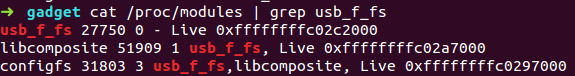

#CVE-2016-7912
## 背景介绍
在内核USB驱动中,进行异步读取或写入时，调用ki_complete()，会提前释放kiocb结构体，从而造成UAF漏洞，但经过分析，发现无法利用此漏洞进行攻击。

## 漏洞影响
1.影响版本链接: https://www.securityfocus.com/bid/94197

## 漏洞详情
以4.5.2版本内核为例进行分析

相关结构体如下:
```c
struct aio_kiocb {
	struct kiocb		common;

	struct kioctx		*ki_ctx;
	kiocb_cancel_fn		*ki_cancel;

	struct iocb __user	*ki_user_iocb;	/* user's aiocb */
	__u64			ki_user_data;	/* user's data for completion */

	struct list_head	ki_list;	/* the aio core uses this
						 * for cancellation */

	/*
	 * If the aio_resfd field of the userspace iocb is not zero,
	 * this is the underlying eventfd context to deliver events to.
	 */
	struct eventfd_ctx	*ki_eventfd;
};

struct kiocb {
	struct file		*ki_filp;
	loff_t			ki_pos;
	void (*ki_complete)(struct kiocb *iocb, long ret, long ret2);
	void			*private;
	int			ki_flags;
};

```
漏洞代码如下:
```c
/* /drivers/usb/gadget/function/f_fs.c/ */
static void ffs_user_copy_worker(struct work_struct *work)
{
	struct ffs_io_data *io_data = container_of(work, struct ffs_io_data,
						   work);
	int ret = io_data->req->status ? io_data->req->status :
					 io_data->req->actual;

	if (io_data->read && ret > 0) {
		use_mm(io_data->mm);
		ret = copy_to_iter(io_data->buf, ret, &io_data->data);
		if (iov_iter_count(&io_data->data))
			ret = -EFAULT;
		unuse_mm(io_data->mm);
	}

	io_data->kiocb->ki_complete(io_data->kiocb, ret, ret);//		(1)

	if (io_data->ffs->ffs_eventfd &&
	    !(io_data->kiocb->ki_flags & IOCB_EVENTFD))
		eventfd_signal(io_data->ffs->ffs_eventfd, 1);

	usb_ep_free_request(io_data->ep, io_data->req);

	io_data->kiocb->private = NULL;//					 (2)
	if (io_data->read)
		kfree(io_data->to_free);
	kfree(io_data->buf);
	kfree(io_data);
}
```

其中在（1）处调用函数为:static void aio_complete(struct kiocb *kiocb, long res, long res2)，其实现大体如下（忽略掉无关代码）：
```c
static void aio_complete(struct kiocb *kiocb, long res, long res2)
{
	struct aio_kiocb *iocb = container_of(kiocb, struct aio_kiocb, common);//(3)
	//无关代码省略
	kiocb_free(iocb);//(4)
	//无关代码省略
}

```
可以看出，在(4)处，释放掉了kiocb结构,而在（2）处，又对其进行写操作.造成UAF漏洞.

但是我们不能通过提前布局释放掉的kiocb结构，进行利用。因为在这之后，不能通过其更改CPU的执行路径，进而发起攻击。也无法通过其进行任意内存读写。所以无法进行漏洞利用。但是可以利用条件竞争，破坏下一个申请该内存的结构，造成DOS

## 调试环境搭建
环境搭建参考:http://blog.nsfocus.net/gdb-kgdb-debug-application

目标机上通过: modprobe usb_f_fs,加载相应模块.然后通过VMware虚拟机的USB功能，插入USB设备.
此时通过 cat /proc/modules | grep usb_f_fs 获得对应模块地址

获得地址后，可以通过客户机下断点。

然后在目标机上编写usb 异步写程序，使目标机进入ffs_user_copy_worker函数，进行跟踪与调试

## 修复建议
建议所有受影响用户，及时进行安全更新，可选方式如下：

1、相关Linux发行版已经提供了安全更新，请通过 yum 或 apt-get 的形式进行安全更新。

2、自定义内核的用户，请自行下载对应源码补丁进行安全更新。 补丁链接：
   建议所有受影响用户，及时进行安全更新，可选方式如下：

1、相关Linux发行版已经提供了安全更新，请通过 yum 或 apt-get 的形式进行安全更新。

2、自定义内核的用户，请自行下载对应源码补丁进行安全更新。 补丁链接：

https://git.kernel.org/pub/scm/linux/kernel/git/torvalds/linux.git/commit/?id=38740a5b87d53ceb89eb2c970150f6e94e00373a

## 参考文档

1. https://git.kernel.org/pub/scm/linux/kernel/git/stable/linux-stable.git/commit/?id=38740a5b87d53ceb89eb2c970150f6e94e00373a
2. http://appscan.360.cn/blog/?p=171
3. https://bugzilla.redhat.com/show_bug.cgi?id=CVE-2016-7912