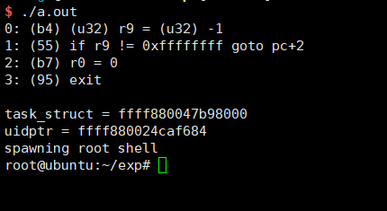
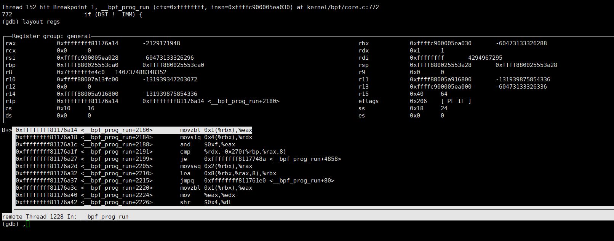
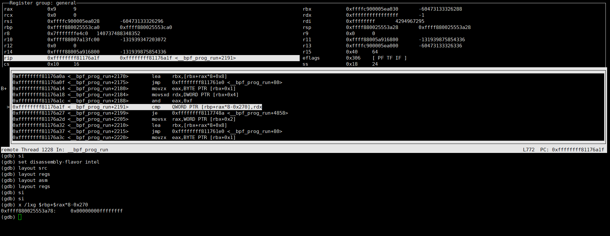

# 漏洞背景
要说eBPF就先说，BPF。BPF 的全称是 Berkeley Packet Filter，顾名思义，这是一个用于过滤(filter)网络报文(packet)的架构,其中著名的tcpdump,wireshark都使用到了它（详细资料参考参考资料中的条目2）。其中eBPF就是BPF的一种扩展。然而在Linux内核实现中，存在一种绕过操作导致提权。

# 环境
内核版本: 4.4.98

# 漏洞介绍

造成该漏洞的根本原因是：验证时模拟执行的结果与BPF虚拟机执行时的不一致造成的

该漏洞其实是个符号扩展漏洞,给个简单的代码描述该漏洞成因:
```c
#include <stdio.h>
#include <stdint.h>
int main(void){
    int imm = -1;   
    uint64_t dst = 0xffffffff;

    if(dst != imm){
        printf("360 cert\n");
    }   

    return 0;
}

```
在比较时，会将 imm 进行扩展 导致 imm 为 0xffff`ffff`ffff`ffff 所以会导致输出 360 cert

要利用该漏洞，还是比较有意识有趣的

用户通过bpf函数，设置命名参数为BPF_PROG_LOAD,向内核提交bpf程序。内核在用户提交程序的时候，会进行验证操作，验证bpf程序的合法性。但是只在提交时进行验证，运行时并不会验证，所以我们可以想办法让我们的恶意代码饶过验证，在执行的时候执行我们的恶意代码

验证过程如下

    1.kernel/bpf/syscall.c:bpf_prog_load
    2.kernel/bpf/verifier.c:bpf_check
    3.kernel/bpf/verifier.c:do_check
    
在第3个函数中，会对每一条bpf指令进行验证,我们可以分析该函数.发现该函数会使用类似分支预测的特性.对不会执行的分支根本不会去验证（重点：我们可以让我们的恶意代码位于“不会”跳过去的分支中）

其中对条件转移指令的解析位于:
    
    1.kernel/bpf/verifier.c: check_cond_jmp_op

分析该函数可以发现：

```c

if (BPF_SRC(insn->code) == BPF_K &&
(opcode == BPF_JEQ || opcode == BPF_JNE) &&
regs[insn->dst_reg].type == CONST_IMM &&
regs[insn->dst_reg].imm == insn->imm) {
	if (opcode == BPF_JEQ) {
		/* if (imm == imm) goto pc+off;
		* only follow the goto, ignore
		fall-through
		*/
		*insn_idx += insn->off;
		return 0;
	} else {
		/* if (imm != imm) goto pc+off;
		* only follow fall-through branch,
		since
		* that's where the program will go
		*/
		return 0;
	}
}
	
```
寄存器与立即数进行 “不等于” 条件判断时，进行了静态分析工作，分析到底执不验证该分支（需结合kernel/bpf/verifier.c:do_check）。而在进行 立即数与 寄存器比较时，立即数的类型与寄存器的类型为:
```c
struct reg_state {
	enum bpf_reg_type type;
	union {
		/* valid when type == CONST_IMM | PTR_TO_STACK */
		int imm;

		/* valid when type == CONST_PTR_TO_MAP | PTR_TO_MAP_VALUE |
		 *   PTR_TO_MAP_VALUE_OR_NULL
		 */
		struct bpf_map *map_ptr;
	};
};

struct bpf_insn {
	__u8	code;		/* opcode */
	__u8	dst_reg:4;	/* dest register */
	__u8	src_reg:4;	/* source register */
	__s16	off;		/* signed offset */
	__s32	imm;		/* signed immediate constant */
};
```
都为有符号，该比较不会发生什么问题。

现在转移到bpf虚拟机执行bpf指令的函数:
/kernel/bpf/core.c: __bpf_prog_run

分析该函数，发现
``` c
u64 regs[MAX_BPF_REG];
```
其中用 uint64_t 表示寄存器,而立即数继续为:
struct bpf_insn 中的imm字段

查看其解析“不等于比较指令”的代码

```c
#define DST	regs[insn->dst_reg]
#define IMM	insn->imm

........
JMP_JEQ_K:
	if (DST == IMM) {
		insn += insn->off;
		CONT_JMP;
	}
	CONT;
```

进行了32位有符号与64位无符号的比较.

那么我们可以这样绕过恶意代码检查:
```
(u32)r9 = (u32)-1
if r9 != 0xffff`ffff goto bad_code
ro,0
exit

bad_code:
.........
```
在提交代码进行验证时，对 jne 分析，发现不跳，会略过bad_code的检查。
但是真正运行时，会导致跳转为真，执行我们的恶意代码。

# 漏洞分析

从参考资料3中，下载exp。我们可以在用户向内核提交bpf代码前,将 union bpf_attr 结构中的 log_level 字段 设置为 1，log其他字段合理填写。在调用提交代码之后，输出log。我们就可以发现我们的那些指令经过了验证。验证结果如下:



可以发现只验证了4 条，但是该exp 有30多条指令(提权)......

我们查看造成漏洞的代码（64位无符号与32位有符号的比较操作）,





发现其成功跳过了退出指令
# 参考资料


1.漏洞修复：https://github.com/torvalds/linux/commit/95a762e2c8c942780948091f8f2a4f32fce1ac6f

2.eBPF简史：https://www.ibm.com/developerworks/cn/linux/l-lo-eBPF-history/index.html

3.exp:
http://cyseclabs.com/exploits/upstream44.c

4.ubuntu调试:
https://sysprogs.com/VisualKernel/tutorials/setup/ubuntu/

5.bpf反编译：
https://github.com/mrmacete/r2scripts/blob/master/bpf/README.md

6.poc:
https://bugs.chromium.org/p/project-zero/issues/detail?id=1454&desc=3

7.eBPF指令:
https://github.com/iovisor/bpf-docs/blob/master/eBPF.md