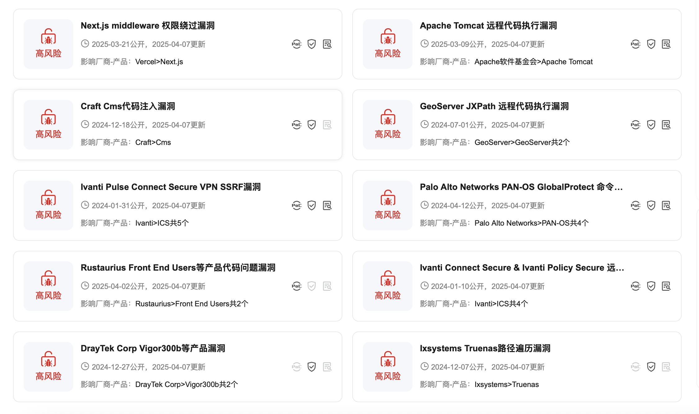

# 漏洞分类

- 远程
- 本地
- 认证前、认证后
- ......

# 界面

### 总体的一个界面展示

### 单个漏洞的描述界面

- 基本信息：漏洞的描述信息，特别是Exp作者需要与Exp编写者绑定，方便那种利用比较复杂的漏洞，找到实际的Exp编写者完成利用
- 影响范围：漏洞的影响范围
- 漏洞利用前置条件：漏洞利用前置条件
- 漏洞分析：markdown格式，完成实际的漏洞分析
- 漏洞Exp：实际的漏洞exp，代码，程序等下载，对于向二进制那种漏洞，同一个CVE编号，不同的版本，那么每个版本对应特定适配的Exp进行下载
- 漏洞Exp使用教程：markdown格式，详细介绍exp的使用
- 漏洞Exp利用记录：红队提供的目标利用请求，用该漏洞Exp实际的利用效果，以及利用失败的原因

### 参考资料

https://x.threatbook.com/v5/vul/XVE-2019-19324

# 情景分析

红队成员需要使用一个漏洞获取目标。

### 漏洞利用流程

- 红队确定目标存在漏洞
- 红队将漏洞利用请求提交到漏洞管理平台
- 由漏洞exp作者完成实际的利用(实际红队那边的漏洞利用稍微有点复杂，需要人员手动完成利用)，对于漏洞管理平台没有的漏洞，需要去完成漏洞利用编写，然后上传到平台
- 红队确定漏洞利用效果

### 添加红队需要关注的产品漏洞信息

对于红队在搞目标的使用，可能会发现一些系统使用的软件啥的，这时候由红队将该软件版本提交到漏洞管理平台，由漏洞利用人员完成实际的漏洞利用编写或关注该软件版本新暴露的漏洞