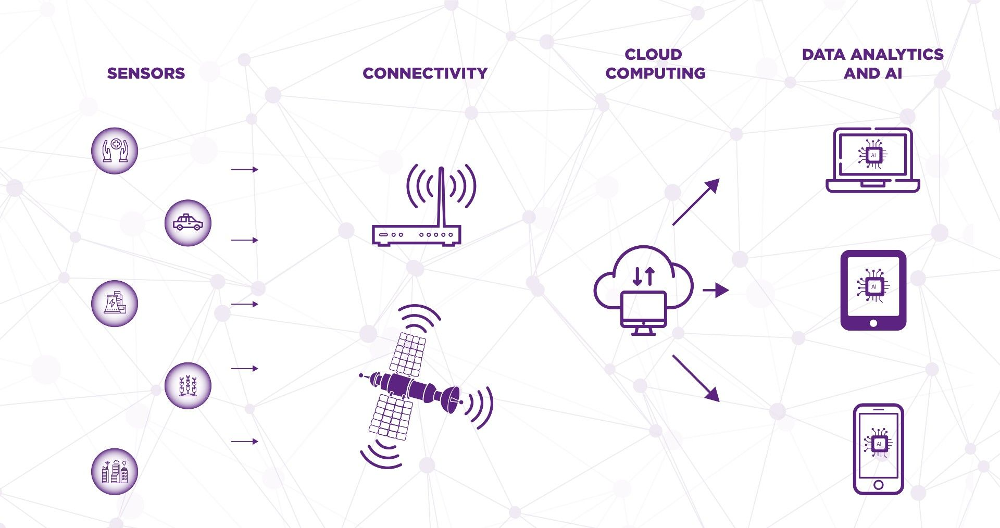

# LoRa

### LoRa 终端定义

**LoRa 终端（LoRa Terminal）**通常指基于 **LoRa（Long Range）无线通信技术**的终端设备，用于低功耗、远距离的无**线数据传输**。它广泛应用于物联网（IoT）场景，如远程监控、智能农业、智慧城市等。

### LoRa网关

# 资料

What is a LoRaWAN Gateway?

https://wyldnetworks.com/blog/what-is-a-lorawan-gateway

An introduction to LoRa gateways

https://akenza.io/blog/lora-gateway-intro