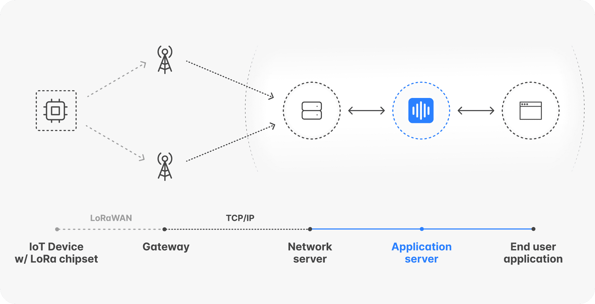

# LoRa

### LoRa 终端定义

- 定义：LoRa 终端是连接 LoRa 网络的设备，通常用于采集和传输数据。
- 功能：
  - 通过 LoRa 无线通信发送数据给 LoRa 网关。
  - 运行低功耗模式，以延长电池寿命（适用于物联网应用）。
  - 可能带有传感器，如温湿度传感器、GPS 模块等。
- 应用：
  - 远程抄表（水、电、气表）。
  - 环境监测（温湿度、气体浓度）。
  - 智能农业（土壤湿度、气象数据）。
  - 产跟踪（GPS 设备）。

### LoRa网关

- 定义：LoRa网关负责接收多个 LoRa 终端发送的数据，并通过互联网或局域网转发到服务器，LoRa网关本身通过如WiFi、以太网或蜂窝网络等宽带网络连接到LoRaWAN网络服务器，以提供LoRa终端节点与应用服务器之间的端到端连接。
- 功能：
  - 充当 LoRa 终端与云端服务器的中继站。
  - 接收多个 LoRa 终端的上行数据，并将其转发至云端。
  - 处理来自服务器的下行控制指令，并转发给 LoRa 终端。
- 应用：
  - 智慧城市（智能停车、路灯监控）。
  - 远程抄表数据汇聚站。
  - 农业物联网网关（汇总多个传感器数据）。
  - 工业物联网（设备远程监测）。

# 资料

What is a LoRaWAN Gateway?

https://wyldnetworks.com/blog/what-is-a-lorawan-gateway

An introduction to LoRa gateways

https://akenza.io/blog/lora-gateway-intro