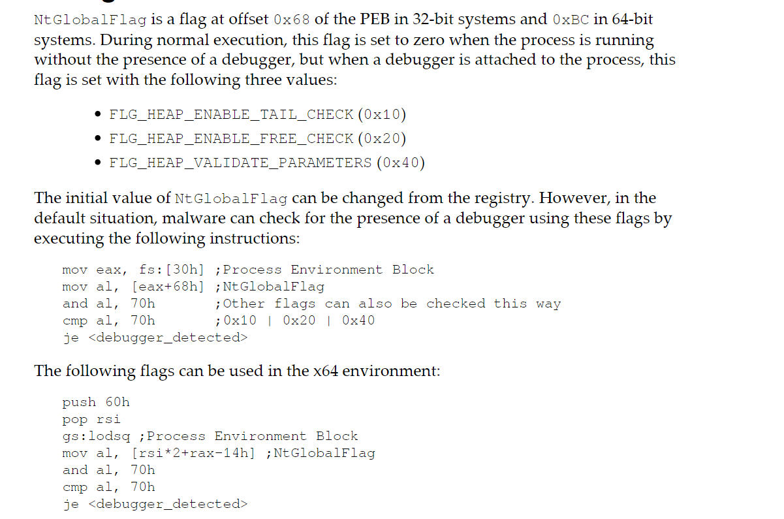

# 调试器检查

API：

- IsDebuggerPresent
- CheckRemoteDebuggerPresent
- NtQueryInformationProcess


通过PEB：

```
mov     eax, dword ptr fs:[30h]   ; PEB
cmp     byte ptr [eax+2], 1 ; PEB.BeingDebugged
jz      <debugger_detected>
```

