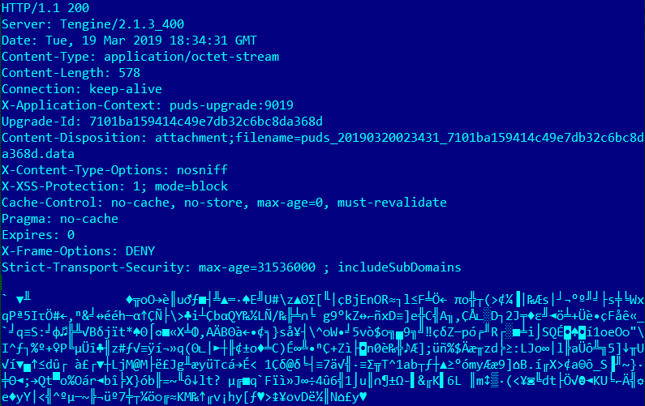
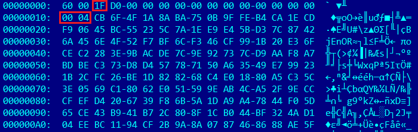
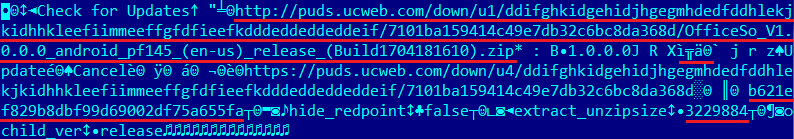

针对Android的UC浏览器被发现有一个隐藏的更新功能，可以绕过Google Play服务器，下载和启动新的软件组件。 此功能违反了Google的政策并存在潜在威胁。如果黑客获得针对浏览器C&C服务器的控制权，则可以通过内置更新功能分发可执行文件（包括恶意程序）。此外，安全研究人员在UC浏览器中发现一个漏洞，也可以通过中间人攻击，让浏览器执行任意可执行文件。该漏洞已在UC浏览器版本11.1.5.890及更高版本以及UC Browser Mini版本11.0.2及更高版本中找到。

下面介绍12.10.8.1172版本。

# 浏览器结构

 UC Browser具有复杂的模块化架构。它由几个具有不同数量和用途的软件组件（插件）组成，具体取决于浏览器版本。请参阅下面的当前应用程序模块列表。
 
 
 .dex和.jar文件形式的插件
 
- \assets\dexes\imagecodec_java.jar
- \assets\dexes\pictureviewer_java.jar
- \assets\moduleDexes\barcode.dex
- \assets\moduleDexes\ucmusic.dex
- \lib\armeabi-v7a\libcore_jar_kj_uc.so (a .jar module with a renamed extension)
- \lib\armeabi-v7a\libsdk_shell_jar_kj_uc.so (a .jar module with a renamed extension)
- \lib\armeabi-v7a\libsgmain.so (a .jar module with a renamed extension)

Linux .SO 形式的插件:

- /lib/armeabi-v7a/libBrowserShell_UC.so
- /lib/armeabi-v7a/libbtm.so
- /lib/armeabi-v7a/libchromaprint-jni.so
- /lib/armeabi-v7a/libcrashsdk.so
- /lib/armeabi-v7a/libdaemon_manager.so
- /lib/armeabi-v7a/libdalvikhack.so
- /lib/armeabi-v7a/libhelp.so
- /lib/armeabi-v7a/libhomodisabler.so
- /lib/armeabi-v7a/libicui18n_uc.so
- /lib/armeabi-v7a/libicuuc_uc.so
- /lib/armeabi-v7a/libimagecodec.so
- /lib/armeabi-v7a/libimagehelper.so
- /lib/armeabi-v7a/libjpeg_private.so
- /lib/armeabi-v7a/libLFGlJni.so
- /lib/armeabi-v7a/libmarsulog.so
- /lib/armeabi-v7a/libmissile.so
- /lib/armeabi-v7a/libpng_private.so
- /lib/armeabi-v7a/libresm.so
- /lib/armeabi-v7a/librism.so
- /lib/armeabi-v7a/libstlport_shared.so
- /lib/armeabi-v7a/libtnet-3.1.14.so
- /lib/armeabi-v7a/libuccrypto.so
- /lib/armeabi-v7a/libucinflator.so
- /lib/armeabi-v7a/libunet.so
- /lib/armeabi-v7a/libv8uc.so
- /lib/armeabi-v7a/libwebp_private.so
- /lib/armeabi-v7a/libwebviewuc.so
- /lib/armeabi-v7a/libzstd.so
- /lib/armeabi-v7a/libzxingjni.so

其中一些组件在应用程序启动时加载，而其他组件在浏览器需要时加载。

# 隐藏的更新功能

该浏览器包含com.uc.aerie.updater包，该包使用Tinker库安装更新而无需重新安装程序。com.uc.deployment.UpgradeDeployService服务负责接收更新。

当我们测试应用程序时，向服务器 http://puds.ucweb.com/upgrade/index.xhtml?dataver=pb 发出更新请求后，随后下载了本地库libpicsel.so,位于:

```
http://gjxz2.ucweb.com/files/OfficeSo/en-us/352/OfficeSo_V1.0.0.0_android_pf145_(Build1704181610).zip?auth_key=1543835590-0-0-3643380ec3205b86d14d33a6f4cfc4cd&vh=fc244462e5aad8ac98fc1111a2512cfa&sf=2172301&SESSID=6ef76125863cf36e2410804ae2090430
```

该库由com.picsel.tgv.lib包使用。它不是恶意的，旨在处理MS Office文档和PDF文件。最初，浏览器并不包含该库。因此，该浏览器可以通过网络下载模块，来扩展自己的功能。

下载后，libpicsel.so被保存到浏览器的/files目录中，并在com.uc.browser.office.sdk.c类中启动:

```java
 if(this.tgv == null) {
    Context context = ContextHolder.mContext;
    StringBuilder sb = new StringBuilder();
    sb.append(com.uc.browser.core.download.d.e.filesdir);
    sb.append("libpicsel.so");
    this.tgv = new TGVCore(context, sb.toString());
}
```

com.picsel.tgv.lib.TGVCore类将库加载到内存中并从中调用方法：
 
```java
public TGVCore(Object context, String path) {
        super();
        this.initCore(context, true, path);
    }
    private void initCore(Object context, boolean absolute, String path) {
        if(absolute) {
            System.load(path);
        }
        else {
            System.loadLibrary(path);
        }
        TGVCore.initStaticData();
        this.initNative(context);
    }
    private native void initNative(Object arg1) {
    }
    private static native void initStaticData() {
    }
}
```

# 中间人攻击导致任意代码执行

C&C服务器发送经过加密的下载新插件的命令。然而，UC浏览器通过不受保护的HTTP通道与远程主机通信。因此，黑客可以执行MITM（中间人攻击）攻击。

下面分析浏览器与C&C服务器之间的通信算法。

浏览器访问 http://puds.ucweb.com/upgrade/index.xhtml?dataver=pb 时的服务器响应：



服务器响应包含带有下载插件所需参数的加密命令。命令在CBC（Cipher block Chaining）模式下进行AES加密; 加密算法用偏移量2表示。加密密钥号用偏移量0x10表示

加密命令的示例，请参见下图：



使用libsgmainso-6.4.36.so本机库解密命令( (SHA1 — 8b998ab3cc6c9c4f877043b5113851035625c19b))

解密后的命令如下所示：



解密后，UC浏览器使用命令中指定的链接下载带有新插件的ZIP存档，然后检查MD5校验和与LEB128编码的存档大小，以及存档中的文件大小。它并没有验证文件的数字签名。

因此，要执行MITM攻击，黑客只需劫持 http://puds.ucweb.com/upgrade/index.xhtml?dataver=pb 的服务器响应，替换可下载插件的链接和要验证的属性值，即归档的MD5、大小和插件大小。然后，浏览器将访问恶意服务器，下载并启动恶意模块。

# 参考资料

https://vms.drweb.com/search/?q=UC%20Browser