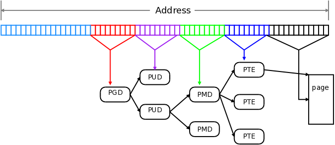

# 四级页表结构

现在的64位Linux系统中，并没有使用全部的64位地址空间，而是使用其低48位，高16位并没有使用.

其中

39至47这9位用于索引PGD(page global directory),其中读取的值是PUD(page upper directory)的地址

30至38这9位用于索引PUD以获取PMD(page middle directory）的地址

21至29这9位用于索引PMD以获取PTE(the lowest level page table)的地址

12至20这9位用于索引PTE以获数据所在物理page frame的地址

最后的12位是page frame 的偏移，用于定位具体的数据所在地址

图形表示如图:



#### 注：

原来的三级页表为:PGD-->PMD-->PTE

二级页表为:PGD(PGD)-->PTE

# 获取系统的page size

$ getconf PAGE_SIZE

# 获取当前内核使用多少级的页表结构

通过编译内核的config文件，搜索CONFIG_PGTABLE_LEVELS，既可以知道使用的是多少级的页表结构

# 内核地址空间中物理地址与虚拟地址的转换

```c
#include <asm/io.h>

static inline void *phys_to_virt(phys_addr_t address);//__pa

static inline phys_addr_t virt_to_phys(volatile void *address)__va

```

# 读取任意程序内存实现

```c
#include <linux/init.h>
#include <linux/kernel.h>
#include <linux/module.h>
#include <linux/moduleparam.h>
#include <linux/sched.h>
#include <linux/sched/signal.h>
#include <linux/mm_types.h>
#include <asm/pgtable.h>

static ulong data_addr = 0;
static int data_len = 0;
static int target_pid = 0;

module_param(data_addr,ulong,S_IRUGO);
module_param(data_len,int,S_IRUGO);
module_param(target_pid,int,S_IRUGO);

static int __init main_init(void)
{
	struct task_struct *task;
	char *vaddr;
	int retval = 0;
	int i = 0;
	pgd_t *pgd = NULL;
	pud_t *pud = NULL;
	pmd_t *pmd = NULL;
	pte_t *pte = NULL;
	unsigned long paddr = 0;
	unsigned long page_addr = 0;
	unsigned long page_offset = 0;
	
	if(data_addr == 0 || data_len == 0 || target_pid == 0){
		printk("insmod main <data_addr=?> <data len=?> <target_pid=?>\n");
		return 0;
	}

	printk("data_addr:0x%lX, data_len:%d, target_pid:%d\n",data_addr,data_len,target_pid);

	for_each_process(task){
		if(task->pid == target_pid)
		{
			printk("find task:%s\n",task->comm);
			retval = 1;
			break;
		}
	}
	
	if(retval == 0){
		printk("not find task\n");
		return -1;
	}
	
	pgd = pgd_offset(task->mm,data_addr);
	if(pgd_none(*pgd)){
		printk("not mapped in pgd\n");
		return -1;
	}
	
	pud = pud_offset((p4d_t*)pgd,data_addr);
	if(pud_none(*pud)){
		printk("not mapped in pud\n");
		return -1;
	}

	pmd = pmd_offset(pud,data_addr);
	if(pmd_none(*pmd)){
		printk("not mapped in pmd\n");
		return -1;
	}

	pte = pte_offset_kernel(pmd,data_addr);
	if(pte_none(*pte)){
		printk("not mapped in pte\n");
		return -1;
	}
	
	page_addr = pte_val(*pte) & PTE_PFN_MASK;
	page_offset = (data_addr) & (0xFFF);
	paddr = page_addr | page_offset;
	
	vaddr = __va(paddr);
	
	for(i = 0;i<data_len;i++){
		printk("0x%X('%c')\n",vaddr[i],vaddr[i]);
	}

	return 0;
}

static void __exit main_exit(void)
{
}

module_init(main_init);
module_exit(main_exit);
MODULE_LICENSE("GPL");
```

makefile:

```makefile
obj-m := main.o

all:
	make -C /usr/src/linux-headers-$(shell uname -r) M=$(shell pwd) modules
clean:
	make -C /usr/src/linux-headers-$(shell uname -r) M=$(shell pwd) clean
```

# 参考资料

How The Kernel Manages Your Memory:

https://manybutfinite.com/post/how-the-kernel-manages-your-memory/

Five-level page tables:

https://lwn.net/Articles/717293/

Page Table Management：

https://www.kernel.org/doc/gorman/html/understand/understand006.html

Page table

https://github.com/lorenzo-stoakes/linux-vm-notes/blob/master/sections/page-tables.md

Virtual memory map

https://www.kernel.org/doc/Documentation/x86/x86_64/mm.txt

Linux 内存管理分析

https://www.jianshu.com/p/fc719d1cfbc2

Linux中的虚拟地址转换物理地址实现

http://lzz5235.github.io/2014/12/10/linux.html