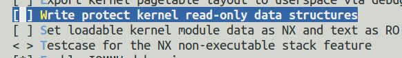

参考质料：

https://www.kernel.org/pub/linux/kernel/people/jwessel/kdb/

虚拟机:VMware

系统:ubuntu-14.04-5   64 内核版本 4.4.0-31-generic.

make menuconfig 失败的情况下 需要:

sudo apt-get install libncurses5-dev libncursesw5-dev

编译需要被调试的内核时的选项:

然后打开.config确保红框中的两项是注释状态，如果不是注释状态可以直接在这里修改将他们的值改成N。这样基本上就完成了内核参数的配置。

如果你在vmware下重新编译内核，硬盘用的是scsi的，以下选项必选：(或者使用IDE的硬盘)

Device Drivers  --->;

SCSI device support  --->;

<*>;   SCSI disk support

Device Drivers  --->;

SCSI device support  --->;

SCSI low-level drivers  --->; 

<*>; BusLogic SCSI support

2) Device Drivers  --->; 

Fusion MPT device support  --->;

; Fusion MPT (base + ScsiHost) drivers

; Fusion MPT misc device (ioctl) driver（这个要不要，不确定）

内核编译命令:

make

make bzImage

make modules

make modules_install

make install

update-grub

如果是给本机编译 可以用 make localmodconfig.

- 配置双机通信：

使用串口连接两台机器，其中一台做为客户机，另一台做为目标机.配置如下：

验证串口通信：

客户机上：

目标机上：

配置串口调试：

客户机设置:

然后记得更新grub配置文件(update-grub)

目标机设置与客户机设置一样:

双机调试

客户机上用gdb加载对应内核的符号调试文件.gdb vmlinux,然后在gdb命令模式中 设置串口调试:

set remotebaud 115200 （新版本为set serial baud 115200）

target remote /dev/ttyS0

目标机上：

echo g > /proc/sysrq-trigger

即可以进行调试

补充：

加载内核模块(gdb命令模式下):

add-symbol-file /home/drv xxxxx 地址

地址可以通过在目标机上

cat /proc/modules | grep XXX

获取

资料

解决ubuntu18.04.1开机不显示grub问题：https://martinchanning.com/%E8%A7%A3%E5%86%B3ubuntu18-04-1%E5%BC%80%E6%9C%BA%E4%B8%8D%E6%98%BE%E7%A4%BAgrub%E9%97%AE%E9%A2%98/

