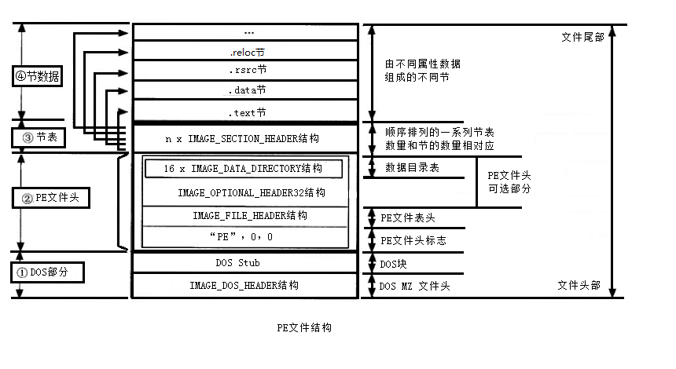
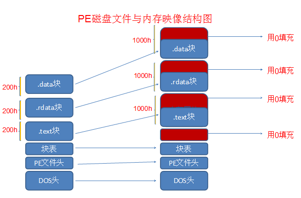
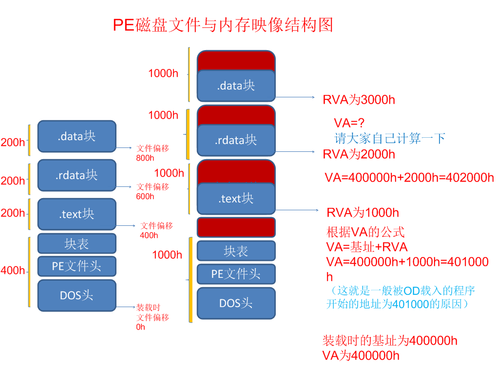

# 地址

PE中涉及的地址有四类，他们分别是：

*   虚拟内存地址(Virtual Addresses)
*   相对虚拟地址(Relative Virtual Addresses)
*   文件偏移地址(File Offset Address)，某个位置距离文件头的偏移

# 对齐

*   内存对齐(SectionAligment)
*   文件对齐(FileAligment)

# PE文件结构

PE文件结构被划分为四大部分：DOS部分、PE头、节表和节数据

在应用程序中最常出现的段（节）有以下6种：

*   代码段:.text
*   数据段:.data
*   资源段:.rsrc
*   导出表:.edata
*   导入表:.idata
*   调试信息段:.debug

PE 文件一个特点是磁盘上的数据结构和加载到内存种的数据结构是相同的。

# 资料

windows PE文件结构及其加载机制

<https://blog.csdn.net/liuyez123/article/details/51281905>

\[PE结构分析] 8.输入表结构和输入地址表（IAT）

<https://www.cnblogs.com/night-ride-depart/p/5776107.html>
