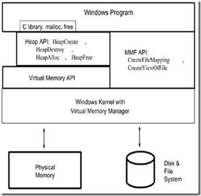

# Windows 内存管理API体系结构



### 调用关系

第一层：Win32 API作为系统的接口，提供了一组操作虚拟内存的接口

第二层：Heap作为虚拟内存的一部分，Win32 API又提供了一组操作Heap内存的接口，但是这些接口都是建立在虚拟内存接口基础上

第三层：Windows平台下的C Run-Time Library 又利用Heap API来实现malloc和free

由此我们可以看出，这些动态内存操作方式之间存有单一的层次关系，位于这个层次的最底层是Virtual Memory API，可以说这些方式都是建立在Virtual Memory API的基础上。

调用关系如下表所示为 : new -> malloc -> HeapAlloc -> VirtualAlloc -> 驱动程序的_PageAlloc.

# Virtual Memory API

作为Windows系统提供的最核心的对虚拟内存操作的接口，也作为其他几种方式的基础，Virtual Memory API应该在几种方式中最通用，也是功能最强大的一种方式

### 分配

```c
LPVOID VirtualAlloc(
    LPVOID lpAddress, // 要分配的内存区域的地址
    DWORD dwSize, // 分配的大小
    DWORD flAllocationType, // 分配的类型
    DWORD flProtect // 该内存的初始保护属性
);
```

- LPVOID lpAddress, 分配内存区域的地址。当你使用VirtualAlloc来提交一块以前保留的内存块的时候，lpAddress参数可以用来识别以前保留的内存块。如果这个参数是NULL，系统将会决定分配内存区域的位置，并且按64-KB向上取整(roundup)。
- SIZE_T dwSize, 要分配或者保留的区域的大小。这个参数以字节为单位，而不是页，系统会根据这个大小一直分配到下页的边界DWORD
- flAllocationType, 分配类型 ,你可以指定或者合并以下标志：MEM_COMMIT，MEM_RESERVE和MEM_TOP_DOWN。
- DWORD flProtect 指定了被分配区域的访问保护方式：PAGE_READONLY、PAGE_EXECUTE、PAGE_EXECUTE_READ、PAGE_READWRITE、PAGE_EXECUTE_READWRITE、PAGE_NOCACHE、PAGE_NOACCESS


返回值：如果调用成功返回分配的首地址调用失败,返回NULL 你可以通过GetLastError函数来获取错误信息

使用方法是先保留在提交，或者直接提交内存，就可以使用分配的内存了


### 释放

```c
BOOL VirtualFree(
    LPVOID lpAddress, // 区域地址
    SIZE_T dwSize, // 区域大小，字节
    DWORD dwFreeType // 类型);
);
```

MEM_DECOMMIT 取消VirtualAlloc提交的页

MEM_RELEASE 释放指定页,如果指定了这个类型,则dwSize应设置为0, 否则函数会调用失败

### 修改属性

```c
BOOL VirtualProtect(
  LPVOID lpAddress,
  SIZE_T dwSize,
  DWORD  flNewProtect,
  PDWORD lpflOldProtect
);
```