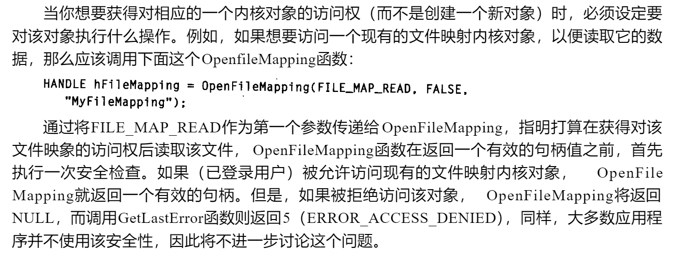
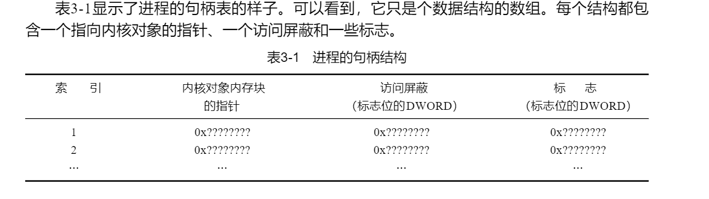
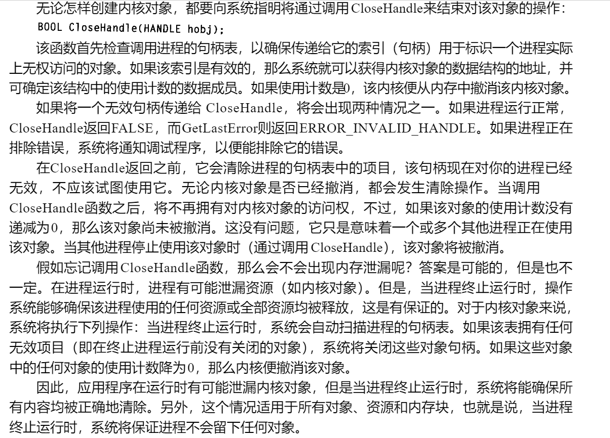
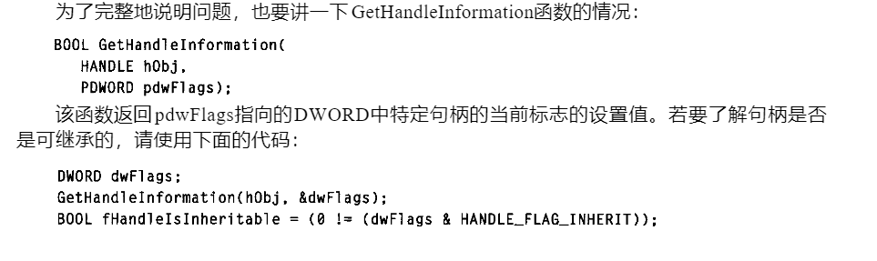
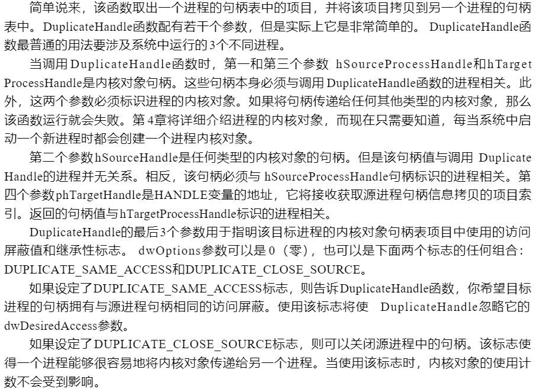

# 什么是内核对象

每个内核对象只是内核分配的一个内存块，并且只能由该内核访问。该内存块是一种数据结构，它的成员负责维护对象的各种信息。有些数据成员在所有对象类型种是相同的，但大多数数据成员属于特定的对象类型。例如，进程对象有一个进程ID、一个基本优先级和一个退出代码，而文件对象则拥有一个字节位移、一个共享模式和一个打开模式。

### 内核对象的使用计数

内核对象由内核所拥有，而不是由进程所拥有

相当于引用计数

### 安全性

用于创建内核对象的函数几乎都有一个指向SECURITY_ATTRIBUTES结构的指针作为其参数，用于设置内核对象的安全属性，下面显示了CreateFileMapping函数的指针:

```c
HANDLE CreateFileMapping(
    HANDLE hFile,
    PSECURITY_ATTRIBUTES psa,
    DWORD flProtect,
    DWORD dwMaximumSizeHigh,
    .............
);
```



# 进程的内核对象句柄表

当一个进程被初始化时，系统要为它分配一个句柄表。该句柄表只用于内核对象，不用于用户对象或GDI对象。



### 创建内核对象

当进程初次被初始化时，它的句柄表是空的。然后，当进程中的线程调用创建内核对象的函数时，比如CreateFileMapping，内核就为该对象分配一个内存块，并对它初始化。这时，内核对进程的句柄表进行扫描，找出一个空项。该指针成员被设置为内核对象的数据结构的内存地址，访问屏蔽设置为全部访问权限，同时，各个标志也作了设置。

用于创建内核对象的所有函数均返回与进程相关的句柄，这些句柄可以被相同进程中运行的任何或所有线程成功地加以使用。该句柄值实际上是放入进程的句柄表中的索引，它用于标识内核对象的信息存放的位置。

### 关闭内核对象



# 跨越进程边界共享内核对象

由于内核对象句柄与进程相关，因此这些任务的执行情况是不同的。

### 对象句柄的继承属性

通过创建子进程，共享内核对象，方法如下：

- 设置create*函数的SECURITY_ATTRIBUTES函数的bInheritHandle为true
- 调用CreateProcess函数，并设置bInheritHandles为true

这样内核创建子进程时，会将父进程中的句柄表中具有继承属性的句柄，按照相同位置复制到对应子进程的句柄表中。然后就可以访问相同的内核对象了。

### 改变句柄的标志

改变内核对象句柄的继承标志（用于父进程控制那个子进程继承内核对象的句柄），可以调用

```c
BOOL SetHandleInformation(
    HANDLE hObject,
    DWORD dwMask,
    DWORD dwFlags
);
```

第一个参数用于标识一个有效的句柄。第二个参数dwMask告诉该函数想要改变那个或那几个标志。目前有两个标志与每个句柄相关联：

```c
#define HANDLE_FLAG_INHERIT 0x00000001
#define HANDLE_FLAG_PROTECT_FROM_CLOSE 0x0000002
```

第三个标志指明想将该标志设置成什么值。

```c
SetHandleInformation(hobj,HANDLE_FLAG_INHERIT,HANDLE_FLAG_INHERIT);//打开继承标志
```



### 复制对象句柄

DuplicateHandle函数

```c
BOOL DuplicateHandle(
    HANDLE hSourceProcessHandle,
    HANDLE hSourceHandle,
    HANDLE hTargetProcessHandle,
    PHANDLE phTargetHandle,
    DWORD dwDesiredAccess,
    BOOL bInheritHandle,
    DWORD dwOptions
);
```

该函数取出一个进程句柄表中的项目，并将该项目拷贝到另一个进程的句柄表中。

第一个和第三个参数为进程内核对象句柄。每当系统中启动一个新进程时都会创建一个进程内核对象。

