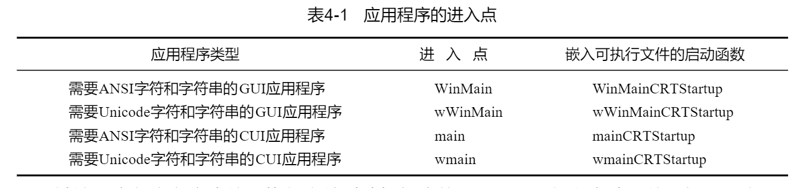

Windows应用程序必须拥有一个在应用程序启动运行时调用的进入点函数。可以使用的进入点函数有4个：

```c
int WINAPI WinMain(
    HINSTANCE hInstExe,
    HINSTANCE ,
    PSTR pszCmdLine,
    int nCmdShow
);

int WINAPI wWinMain(
    HINSTANCE hInstExe,
    HINSTANCE ,
    PSTR pszCmdLine,
    int nCmdShow
);

int __cdecl main(
    int argc,
    char *argv,
    char *envp[]);
    
int __cdecl wmain(
    int argc,
    wchar_t *argv,
    wchar_t *envp[]);

```

操作系统实际上并不调用你编写的进入点函数。它调用的是C/C++运行期启动函数。该函数负责对C/C++运行期库进行初始化，这样，就可以调用malloc和free之类的函数。它还能够确保已经声明的任何全局对象和静态C++对象能够在代码执行以前正确地创建。



所有的C/C++运行期启动函数的作用基本上都是相同的，他们在对C运行期库进行初始化后他们调用那个进入点函数。

# 进程的实列句柄

加载到进程地址空间的每个可执行文件或DLL文件均被赋予一个独一无二的实列句柄。可执行文件的实列作为WinMain的第一个参数hinstExe来传递。

WinMain的hinstExe参数的实际值是系统将可执行文件的映像加载到进程的地址空间时使用的基本地址空间。例如，如果系统打开了可执行文件并且将他的内容加载到地址0x00400000,那么WinMain的hinstExe参数的值就是0x00400000.

HMODULE与HINSTANCE是完全相同的对象。

GetModuleHandle函数返回可执行文件或DLL文件加载到进程的地址空间时所用的句柄/基地址：

```c
HMODULE GetModuleHandle(PCSTR pszModule);
```

# 进程的命令行

通过GetCommandLine可以获得进程的完整命令行指针

```c
PTSTR GetCommandLine();
```

# 进程工作目录

查询进程当前工作目录：

```c
DWORD GetCurrentDirectory(
    DWORD cchCurDir,
    PTSTR pszCurDir);
```

更改进程当前工作目录

```c
BOOL SetCurrentDirectory(PCTSTR pszCurDir);
```

# 系统版本

```c
BOOL GetVersionEx(POSVERSIONINFO pVersionInformation);
```