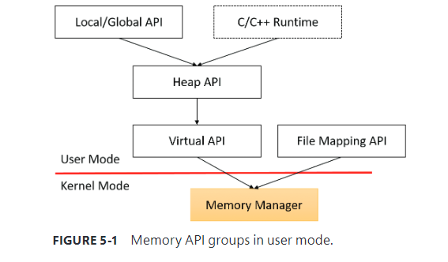

The memory manager is part of the Windows executive and therefore exists in the file Ntoskrnl.exe

# Memory manager components

*   The balance set manager (KeBalanceSetManager, priority 17)
*   The process/stack swapper (KeSwapProcessOrStack, priority 23)
*   The modified page writer (MiModifiedPageWriter, priority 18)
*   The mapped page writer (MiMappedPageWriter, priority 18)
*   The segment dereference thread (MiDereferenceSegmentThread, priority 19)
*   The zero page thread (MiZeroPageThread, priority 0)

# Four groups of functions for managing memory in applications

### Virtual API

This is the lowest-level API for general memory allocations and deallocations. It always works on page granularity. It is also the most powerful, supporting the full capabilities of the memory manager. Functions include VirtualAlloc, VirtualFree, VirtualProtect, VirtualLock, and others

### Heap API

This provides functions for small allocations (typically less than a page). It uses the Virtual API internally, but adds management on top of it. Heap manager functions include HeapAlloc, HeapFree, HeapCreate, HeapReAlloc and others. The heap manager is discussed in the section “Heap manager” later in this chapter.

### Local/Global APIs

These are leftovers from 16-bit Windows and are now implemented using the Heap API

### Memory-mapped files

These functions allow mapping files as memory and/or sharing memory between cooperating processes. Memory-mapped file functions include CreateFileMapping, OpenFileMapping, MapViewOfFile, and others

